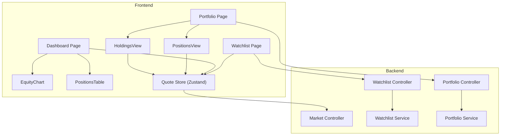
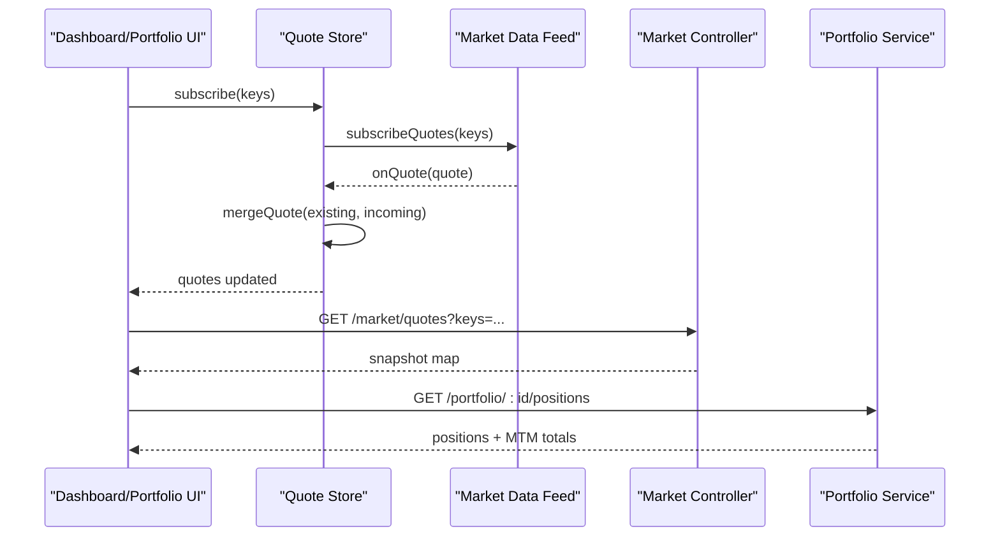
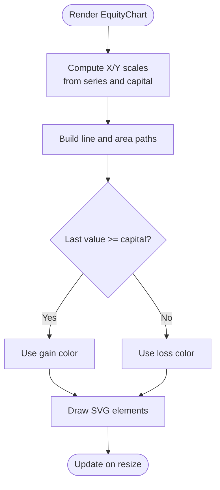
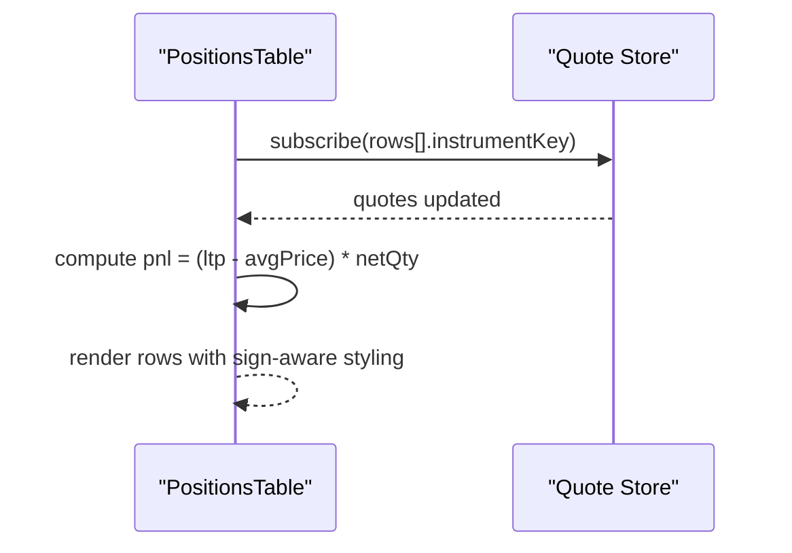
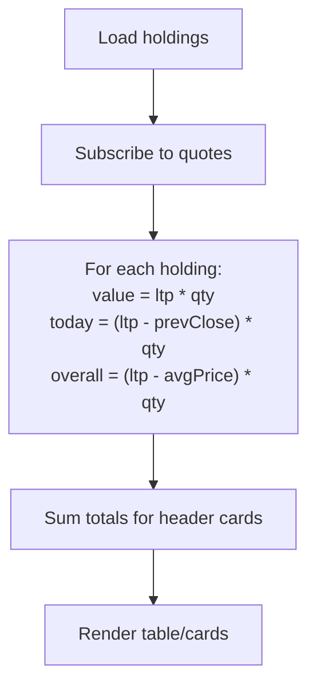
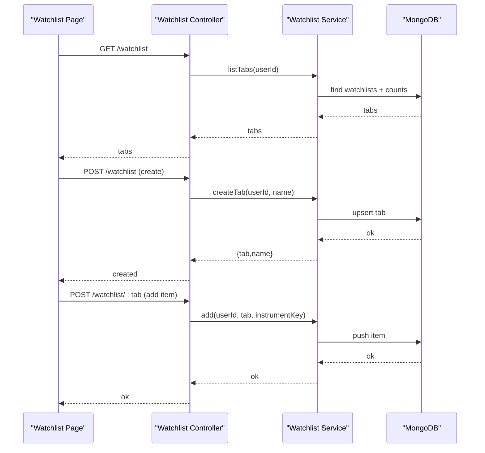
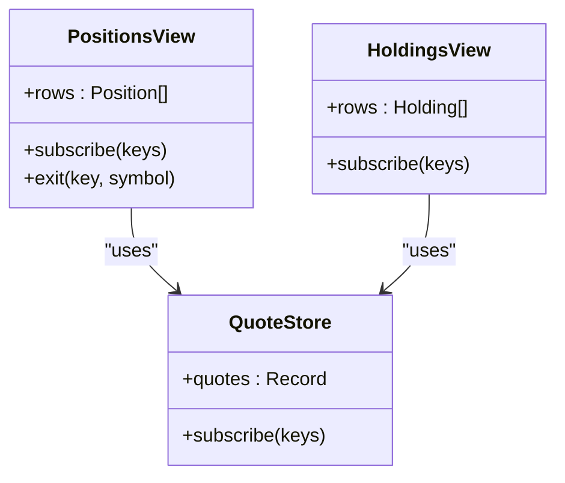
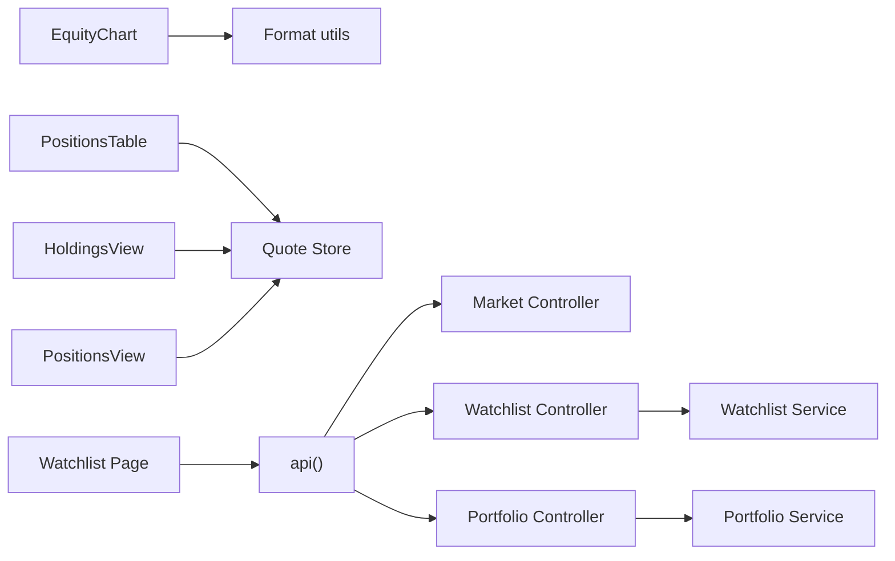

# Dashboard & Portfolio Components

<cite>
**Referenced Files in This Document**
- [dashboard/page.tsx](file://frontend/trader/src/app/dashboard/page.tsx)
- [portfolio/page.tsx](file://frontend/trader/src/app/portfolio/page.tsx)
- [positions/page.tsx](file://frontend/trader/src/app/positions/page.tsx)
- [holdings/page.tsx](file://frontend/trader/src/app/holdings/page.tsx)
- [watchlist/page.tsx](file://frontend/trader/src/app/watchlist/page.tsx)
- [EquityChart.tsx](file://frontend/trader/src/components/dashboard/EquityChart.tsx)
- [PositionsTable.tsx](file://frontend/trader/src/components/dashboard/PositionsTable.tsx)
- [HoldingsView.tsx](file://frontend/trader/src/components/portfolio/HoldingsView.tsx)
- [PositionsView.tsx](file://frontend/trader/src/components/portfolio/PositionsView.tsx)
- [quote-store.ts](file://frontend/trader/src/lib/quote-store.ts)
- [market.controller.ts](file://backend/apps/api/src/modules/market/presentation/market.controller.ts)
- [watchlist.controller.ts](file://backend/apps/api/src/modules/market/presentation/watchlist.controller.ts)
- [watchlist.service.ts](file://backend/apps/api/src/modules/market/application/watchlist.service.ts)
- [portfolio.controller.ts](file://backend/apps/api/src/modules/trading/presentation/portfolio.controller.ts)
- [portfolio.service.ts](file://backend/apps/api/src/modules/trading/application/portfolio.service.ts)
</cite>

## Table of Contents
1. Introduction
2. Project Structure
3. Core Components
4. Architecture Overview
5. Detailed Component Analysis
6. Dependency Analysis
7. Performance Considerations
8. Troubleshooting Guide
9. Conclusion

## Introduction
This document explains the dashboard and portfolio management components, focusing on:
- Equity curve visualization
- Positions table with real-time updates
- Holdings view with P&L calculations
- Watchlist management (create, add/remove, browse catalog)
It also covers data binding patterns, state synchronization across components, performance optimization for large portfolios, responsive design, sorting/filtering, export considerations, integration with market data feeds and portfolio calculation engines, and user preference persistence.

## Project Structure
The frontend is a Next.js client application that composes pages and reusable components. The backend exposes REST endpoints for market data, watchlists, and portfolio views. Real-time quotes are delivered via a WebSocket feed managed by a client-side store.

**Diagram sources**
- [dashboard/page.tsx:31-102](file://frontend/trader/src/app/dashboard/page.tsx#L31-L102)
- [portfolio/page.tsx:19-62](file://frontend/trader/src/app/portfolio/page.tsx#L19-L62)
- [watchlist/page.tsx:82-115](file://frontend/trader/src/app/watchlist/page.tsx#L82-L115)
- [EquityChart.tsx:8-81](file://frontend/trader/src/components/dashboard/EquityChart.tsx#L8-L81)
- [PositionsTable.tsx:9-70](file://frontend/trader/src/components/dashboard/PositionsTable.tsx#L9-L70)
- [HoldingsView.tsx:16-156](file://frontend/trader/src/components/portfolio/HoldingsView.tsx#L16-L156)
- [PositionsView.tsx:13-163](file://frontend/trader/src/components/portfolio/PositionsView.tsx#L13-L163)
- [quote-store.ts:96-150](file://frontend/trader/src/lib/quote-store.ts#L96-L150)
- [market.controller.ts:21-75](file://backend/apps/api/src/modules/market/presentation/market.controller.ts#L21-L75)
- [watchlist.controller.ts:32-75](file://backend/apps/api/src/modules/market/presentation/watchlist.controller.ts#L32-L75)
- [portfolio.controller.ts:5-24](file://backend/apps/api/src/modules/trading/presentation/portfolio.controller.ts#L5-L24)

**Section sources**
- [dashboard/page.tsx:31-102](file://frontend/trader/src/app/dashboard/page.tsx#L31-L102)
- [portfolio/page.tsx:19-62](file://frontend/trader/src/app/portfolio/page.tsx#L19-L62)
- [watchlist/page.tsx:82-115](file://frontend/trader/src/app/watchlist/page.tsx#L82-L115)
- [market.controller.ts:21-75](file://backend/apps/api/src/modules/market/presentation/market.controller.ts#L21-L75)
- [watchlist.controller.ts:32-75](file://backend/apps/api/src/modules/market/presentation/watchlist.controller.ts#L32-L75)
- [portfolio.controller.ts:5-24](file://backend/apps/api/src/modules/trading/presentation/portfolio.controller.ts#L5-L24)

## Core Components
- Dashboard page aggregates KPIs, an equity curve chart, challenge progress, and a positions table. It subscribes to quotes for demo instruments and positions to enable live updates.
- Portfolio page provides tabbed navigation between Positions and Holdings, persisting active tab in URL query parameters.
- Watchlist page supports personal lists and catalog browsing, search, add/remove, and detail view with chart or option chain.
- Quote store centralizes subscription to live quotes via WebSocket and REST snapshot fallback, merging incoming ticks with existing quotes and handling market open/closed states.

Key responsibilities:
- Data binding: Components subscribe to quote store; tables compute P&L from LTP and average price.
- State synchronization: URL-driven tabs for portfolio; local storage fallback for watchlists when API unavailable.
- Performance: Debounced search, pagination for catalog, minimal re-renders via selective subscriptions.

**Section sources**
- [dashboard/page.tsx:31-102](file://frontend/trader/src/app/dashboard/page.tsx#L31-L102)
- [portfolio/page.tsx:19-62](file://frontend/trader/src/app/portfolio/page.tsx#L19-L62)
- [watchlist/page.tsx:206-246](file://frontend/trader/src/app/watchlist/page.tsx#L206-L246)
- [quote-store.ts:96-150](file://frontend/trader/src/lib/quote-store.ts#L96-L150)

## Architecture Overview
The system uses a hybrid approach:
- Real-time quotes via WebSocket feed integrated into a Zustand store.
- REST endpoints for snapshots, instrument catalogs, watchlists, and portfolio views.
- Server-side calculations for MTM and P&L using Redis-cached quotes and domain math.

**Diagram sources**
- [quote-store.ts:102-150](file://frontend/trader/src/lib/quote-store.ts#L102-L150)
- [market.controller.ts:55-59](file://backend/apps/api/src/modules/market/presentation/market.controller.ts#L55-L59)
- [portfolio.controller.ts:10-17](file://backend/apps/api/src/modules/trading/presentation/portfolio.controller.ts#L10-L17)
- [portfolio.service.ts:44-84](file://backend/apps/api/src/modules/trading/application/portfolio.service.ts#L44-L84)

## Detailed Component Analysis

### Equity Curve Visualization
- Renders a lightweight SVG area chart without external libraries.
- Computes min/max based on starting capital and series values, draws area and line paths, and highlights gain/loss color.
- Uses ResizeObserver to adapt width dynamically.

**Diagram sources**
- [EquityChart.tsx:8-81](file://frontend/trader/src/components/dashboard/EquityChart.tsx#L8-L81)

**Section sources**
- [EquityChart.tsx:8-81](file://frontend/trader/src/components/dashboard/EquityChart.tsx#L8-L81)

### Positions Table with Real-Time Updates
- Subscribes to quotes for each row’s instrument key.
- Computes per-row P&L and percentage change using LTP vs average price.
- Provides a link to the full positions view.

**Diagram sources**
- [PositionsTable.tsx:9-70](file://frontend/trader/src/components/dashboard/PositionsTable.tsx#L9-L70)
- [quote-store.ts:102-150](file://frontend/trader/src/lib/quote-store.ts#L102-L150)

**Section sources**
- [PositionsTable.tsx:9-70](file://frontend/trader/src/components/dashboard/PositionsTable.tsx#L9-L70)

### Holdings View with P&L Calculations
- Displays total value, today’s P&L, and overall P&L.
- For each holding, computes current value and P&L using LTP and average price.
- Responsive layout switches between table and card grid on small screens.

**Diagram sources**
- [HoldingsView.tsx:16-156](file://frontend/trader/src/components/portfolio/HoldingsView.tsx#L16-L156)

**Section sources**
- [HoldingsView.tsx:16-156](file://frontend/trader/src/components/portfolio/HoldingsView.tsx#L16-L156)

### Watchlist Management
- Supports personal watchlists and catalog tabs (Stocks, Indices, Options, Currency).
- Search with debouncing, paginated catalog browsing, add/remove to list, and creation of new lists.
- Falls back to local storage if API is unavailable.

**Diagram sources**
- [watchlist.page.tsx:206-246](file://frontend/trader/src/app/watchlist/page.tsx#L206-L246)
- [watchlist.controller.ts:37-64](file://backend/apps/api/src/modules/market/presentation/watchlist.controller.ts#L37-L64)
- [watchlist.service.ts:33-126](file://backend/apps/api/src/modules/market/application/watchlist.service.ts#L33-L126)

**Section sources**
- [watchlist/page.tsx:206-246](file://frontend/trader/src/app/watchlist/page.tsx#L206-L246)
- [watchlist/controller.ts:37-64](file://backend/apps/api/src/modules/market/presentation/watchlist.controller.ts#L37-L64)
- [watchlist/service.ts:33-126](file://backend/apps/api/src/modules/market/application/watchlist.service.ts#L33-L126)

### Portfolio Views (Positions and Holdings)
- Positions view shows MTM summary and per-position metrics; includes exit action.
- Holdings view shows delivery holdings with value and P&L cards.
- Both views subscribe to quotes for live LTP updates.

**Diagram sources**
- [PositionsView.tsx:13-163](file://frontend/trader/src/components/portfolio/PositionsView.tsx#L13-L163)
- [HoldingsView.tsx:16-156](file://frontend/trader/src/components/portfolio/HoldingsView.tsx#L16-L156)
- [quote-store.ts:96-150](file://frontend/trader/src/lib/quote-store.ts#L96-L150)

**Section sources**
- [PositionsView.tsx:13-163](file://frontend/trader/src/components/portfolio/PositionsView.tsx#L13-L163)
- [HoldingsView.tsx:16-156](file://frontend/trader/src/components/portfolio/HoldingsView.tsx#L16-L156)

## Dependency Analysis
- Frontend components depend on the quote store for live data and on API modules for static data and mutations.
- Backend controllers delegate to services which interact with MongoDB and Redis for caching quotes.
- Market controller exposes endpoints for search, segment listing, status, quotes, candles, and option chain.

**Diagram sources**
- [EquityChart.tsx:8-81](file://frontend/trader/src/components/dashboard/EquityChart.tsx#L8-L81)
- [PositionsTable.tsx:9-70](file://frontend/trader/src/components/dashboard/PositionsTable.tsx#L9-L70)
- [HoldingsView.tsx:16-156](file://frontend/trader/src/components/portfolio/HoldingsView.tsx#L16-L156)
- [PositionsView.tsx:13-163](file://frontend/trader/src/components/portfolio/PositionsView.tsx#L13-L163)
- [watchlist/page.tsx:206-246](file://frontend/trader/src/app/watchlist/page.tsx#L206-L246)
- [market.controller.ts:21-75](file://backend/apps/api/src/modules/market/presentation/market.controller.ts#L21-L75)
- [watchlist.controller.ts:32-75](file://backend/apps/api/src/modules/market/presentation/watchlist.controller.ts#L32-L75)
- [portfolio.controller.ts:5-24](file://backend/apps/api/src/modules/trading/presentation/portfolio.controller.ts#L5-L24)

**Section sources**
- [market.controller.ts:21-75](file://backend/apps/api/src/modules/market/presentation/market.controller.ts#L21-L75)
- [watchlist.controller.ts:32-75](file://backend/apps/api/src/modules/market/presentation/watchlist.controller.ts#L32-L75)
- [portfolio.controller.ts:5-24](file://backend/apps/api/src/modules/trading/presentation/portfolio.controller.ts#L5-L24)

## Performance Considerations
- Real-time updates:
  - Quote store merges incoming ticks efficiently and avoids redundant updates by comparing timestamps and market-open state.
  - Snapshot polling frequency adapts based on market open/closed to reduce load.
- Large portfolios:
  - Pagination for catalog browsing reduces initial payload size.
  - Debounced search minimizes network calls during typing.
  - Selective subscriptions ensure only visible instruments trigger updates.
- Rendering:
  - Lightweight SVG chart avoids heavy charting libraries.
  - Responsive layouts switch between tables and cards to optimize mobile rendering.

[No sources needed since this section provides general guidance]

## Troubleshooting Guide
- No quotes updating:
  - Verify WebSocket connection and market status; check error state in quote store.
  - Ensure instruments are subscribed before expecting updates.
- Watchlist API failures:
  - Page falls back to local storage; verify localStorage entries and retry API later.
- Portfolio data not loading:
  - Confirm challenge ID and authentication; check server logs for portfolio endpoints.

**Section sources**
- [quote-store.ts:102-150](file://frontend/trader/src/lib/quote-store.ts#L102-L150)
- [watchlist/page.tsx:206-246](file://frontend/trader/src/app/watchlist/page.tsx#L206-L246)

## Conclusion
The dashboard and portfolio components provide a cohesive trading experience with real-time updates, robust data binding, and responsive design. The architecture separates concerns between UI, state management, and backend services, enabling scalability and maintainability. Future enhancements can include advanced sorting/filtering, export functionality, and deeper integration with portfolio calculation engines for richer analytics.

[No sources needed since this section summarizes without analyzing specific files]