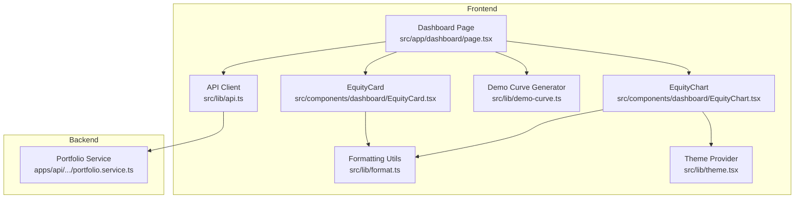
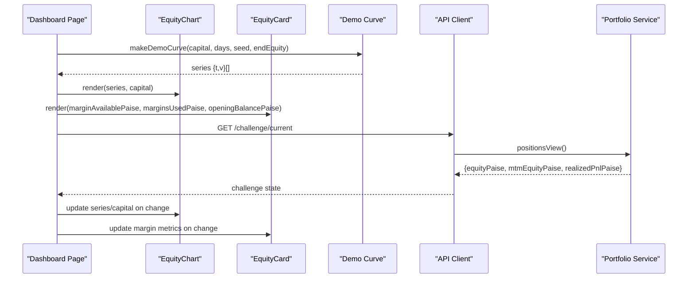
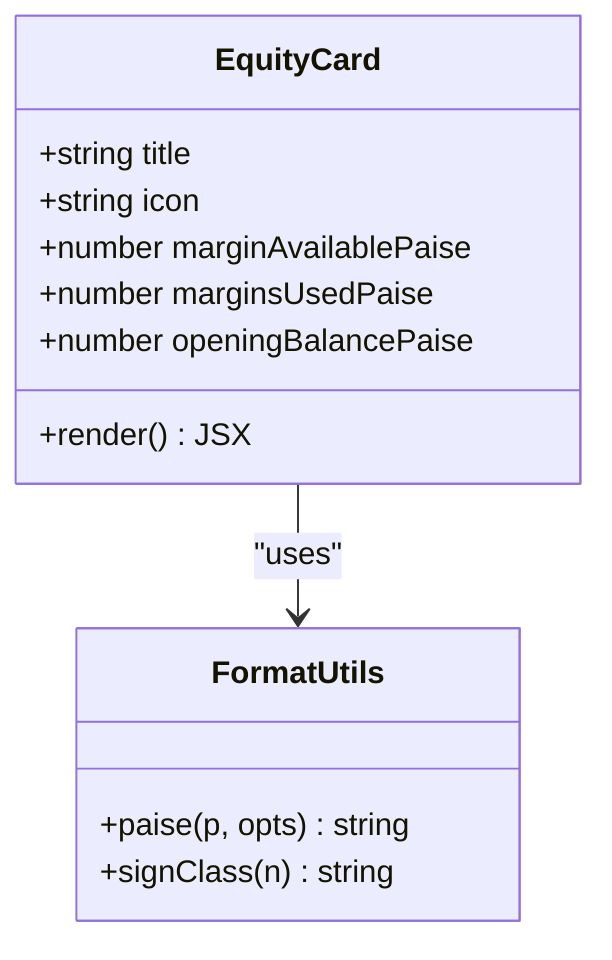
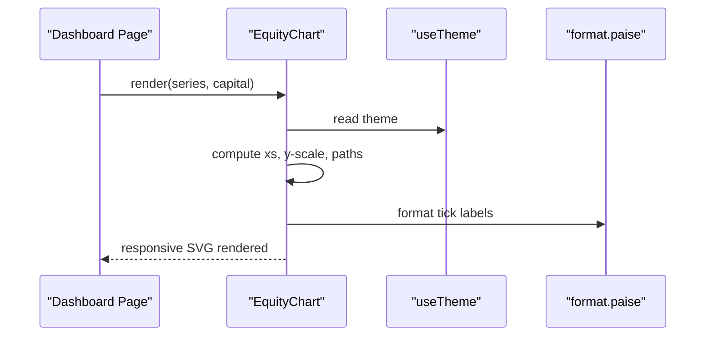
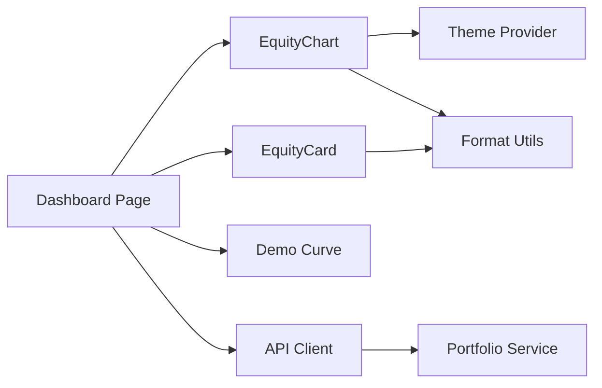

# Equity Visualization Components

<cite>
**Referenced Files in This Document**
- [EquityCard.tsx](file://frontend/trader/src/components/dashboard/EquityCard.tsx)
- [EquityChart.tsx](file://frontend/trader/src/components/dashboard/EquityChart.tsx)
- [format.ts](file://frontend/trader/src/lib/format.ts)
- [theme.tsx](file://frontend/trader/src/lib/theme.tsx)
- [page.tsx](file://frontend/trader/src/app/dashboard/page.tsx)
- [demo-curve.ts](file://frontend/trader/src/lib/demo-curve.ts)
- [portfolio.service.ts](file://backend/apps/api/src/modules/trading/application/portfolio.service.ts)
- [api.ts](file://frontend/trader/src/lib/api.ts)
</cite>

## Table of Contents
1. [Introduction](#introduction)
2. [Project Structure](#project-structure)
3. [Core Components](#core-components)
4. [Architecture Overview](#architecture-overview)
5. [Detailed Component Analysis](#detailed-component-analysis)
6. [Dependency Analysis](#dependency-analysis)
7. [Performance Considerations](#performance-considerations)
8. [Troubleshooting Guide](#troubleshooting-guide)
9. [Conclusion](#conclusion)
10. [Appendices](#appendices)

## Introduction
This document provides detailed documentation for the equity visualization components used in the trading dashboard:
- EquityCard: displays margin available, margins used, and opening balance with conditional styling for gains and losses.
- EquityChart: renders an equity curve using a lightweight SVG area chart, supports responsive sizing, and integrates with theme-aware colors.

It also covers data binding patterns, performance considerations for large datasets, integration points with portfolio calculation engines, customization options, time period handling, and interactive features such as zooming and crosshairs.

## Project Structure
The equity visualization components live in the frontend trader application under the dashboard feature. The dashboard page composes these components and supplies data from both demo utilities and API calls.

**Diagram sources**
- [page.tsx:31-98](file://frontend/trader/src/app/dashboard/page.tsx#L31-L98)
- [EquityChart.tsx:1-82](file://frontend/trader/src/components/dashboard/EquityChart.tsx#L1-L82)
- [EquityCard.tsx:1-47](file://frontend/trader/src/components/dashboard/EquityCard.tsx#L1-L47)
- [format.ts:1-43](file://frontend/trader/src/lib/format.ts#L1-L43)
- [theme.tsx:1-55](file://frontend/trader/src/lib/theme.tsx#L1-L55)
- [demo-curve.ts:1-38](file://frontend/trader/src/lib/demo-curve.ts#L1-L38)
- [portfolio.service.ts:1-90](file://backend/apps/api/src/modules/trading/application/portfolio.service.ts#L1-L90)
- [api.ts:1-148](file://frontend/trader/src/lib/api.ts#L1-L148)

**Section sources**
- [page.tsx:31-98](file://frontend/trader/src/app/dashboard/page.tsx#L31-L98)
- [EquityChart.tsx:1-82](file://frontend/trader/src/components/dashboard/EquityChart.tsx#L1-L82)
- [EquityCard.tsx:1-47](file://frontend/trader/src/components/dashboard/EquityCard.tsx#L1-L47)

## Core Components
- EquityCard: A compact card that shows:
  - Margin available (primary value), styled conditionally based on gain or loss.
  - Margins used and opening balance (secondary values).
  - Uses consistent currency formatting and sign classes for visual feedback.
- EquityChart: A lightweight SVG area chart that:
  - Renders an equity curve over a series of daily points.
  - Adapts to container width via ResizeObserver.
  - Applies theme-aware colors and gradient fills.
  - Displays a starting capital reference line and tick marks.

Key behaviors:
- Conditional styling: positive vs negative changes are reflected through CSS classes derived from numeric comparisons.
- Responsive design: chart width is computed dynamically; SVG scales via viewBox and percentage width.
- Currency formatting: uses a custom formatter to ensure consistent Indian numbering and avoid hydration mismatches.

**Section sources**
- [EquityCard.tsx:4-24](file://frontend/trader/src/components/dashboard/EquityCard.tsx#L4-L24)
- [EquityChart.tsx:8-31](file://frontend/trader/src/components/dashboard/EquityChart.tsx#L8-L31)
- [format.ts:26-42](file://frontend/trader/src/lib/format.ts#L26-L42)

## Architecture Overview
The dashboard page fetches challenge state and constructs a deterministic demo equity curve. It passes this data to EquityChart and computes margin-related metrics for cards. The backend portfolio service exposes MTM equity and realized/unrealized P&L which can be consumed by the frontend to power real-time updates.

**Diagram sources**
- [page.tsx:31-98](file://frontend/trader/src/app/dashboard/page.tsx#L31-L98)
- [demo-curve.ts:18-36](file://frontend/trader/src/lib/demo-curve.ts#L18-L36)
- [EquityChart.tsx:8-31](file://frontend/trader/src/components/dashboard/EquityChart.tsx#L8-L31)
- [EquityCard.tsx:4-24](file://frontend/trader/src/components/dashboard/EquityCard.tsx#L4-L24)
- [api.ts:91-129](file://frontend/trader/src/lib/api.ts#L91-L129)
- [portfolio.service.ts:43-67](file://backend/apps/api/src/modules/trading/application/portfolio.service.ts#L43-L67)

## Detailed Component Analysis

### EquityCard
Responsibilities:
- Display primary metric “Margin available” with conditional styling for gains/losses.
- Show secondary metrics “Margins used” and “Opening balance”.
- Provide a link placeholder to view statements.

Data binding:
- Props include marginAvailablePaise, marginsUsedPaise, openingBalancePaise.
- Formatting uses a shared utility to convert paise to rupees with proper grouping and optional sign.

Conditional styling:
- Primary value class is set based on marginAvailablePaise sign.
- Opening balance applies a loss class when negative.

Accessibility and UX:
- Clear labels and hierarchy.
- Consistent typography and spacing.

Customization hooks:
- Title and icon props allow reuse across equity/commodity contexts.

**Section sources**
- [EquityCard.tsx:4-24](file://frontend/trader/src/components/dashboard/EquityCard.tsx#L4-L24)
- [EquityCard.tsx:26-41](file://frontend/trader/src/components/dashboard/EquityCard.tsx#L26-L41)
- [format.ts:26-42](file://frontend/trader/src/lib/format.ts#L26-L42)

#### Class Diagram

**Diagram sources**
- [EquityCard.tsx:4-24](file://frontend/trader/src/components/dashboard/EquityCard.tsx#L4-L24)
- [format.ts:26-42](file://frontend/trader/src/lib/format.ts#L26-L42)

### EquityChart
Responsibilities:
- Render an equity curve as an SVG area chart.
- Compute Y-axis ticks and scale based on capital and series values.
- Apply theme-aware stroke and gradient fill.
- Observe container size to keep the chart responsive.

Rendering logic:
- X coordinates are evenly spaced across the series length.
- Y mapping normalizes values between min/max bounds, with bounds anchored around starting capital.
- Area path closes at the bottom to create a filled region.
- Starting capital reference line is drawn for context.

Responsive behavior:
- Uses ResizeObserver to track container width and sets a CSS variable for layout calculations.
- SVG scales via viewBox and percentage width.

Theming:
- Reads current theme to generate unique gradient IDs.
- Stroke color switches based on last value relative to starting capital.

Data binding:
- Accepts series of {t, v} and capital number.
- Dashboard composes series using a deterministic generator to ensure SSR/hydration consistency.

**Section sources**
- [EquityChart.tsx:8-31](file://frontend/trader/src/components/dashboard/EquityChart.tsx#L8-L31)
- [EquityChart.tsx:36-67](file://frontend/trader/src/components/dashboard/EquityChart.tsx#L36-L67)
- [theme.tsx:11-36](file://frontend/trader/src/lib/theme.tsx#L11-L36)
- [demo-curve.ts:18-36](file://frontend/trader/src/lib/demo-curve.ts#L18-L36)

#### Sequence Diagram: Rendering Flow

**Diagram sources**
- [EquityChart.tsx:8-31](file://frontend/trader/src/components/dashboard/EquityChart.tsx#L8-L31)
- [EquityChart.tsx:36-67](file://frontend/trader/src/components/dashboard/EquityChart.tsx#L36-L67)
- [theme.tsx:11-36](file://frontend/trader/src/lib/theme.tsx#L11-L36)
- [format.ts:26-42](file://frontend/trader/src/lib/format.ts#L26-L42)

### Data Binding Patterns
- Series generation:
  - Deterministic generator ensures identical output across server and client to prevent hydration mismatches.
  - End value can be overridden to reflect latest MTM equity.
- Dashboard composition:
  - Computes margin available from MTM equity minus a fixed usage amount.
  - Passes series and starting capital to the chart.
- Backend integration:
  - Portfolio service returns MTM equity and realized/unrealized P&L, enabling real-time updates when connected to live data.

**Section sources**
- [demo-curve.ts:18-36](file://frontend/trader/src/lib/demo-curve.ts#L18-L36)
- [page.tsx:49-55](file://frontend/trader/src/app/dashboard/page.tsx#L49-L55)
- [page.tsx:95-97](file://frontend/trader/src/app/dashboard/page.tsx#L95-L97)
- [portfolio.service.ts:43-67](file://backend/apps/api/src/modules/trading/application/portfolio.service.ts#L43-L67)

## Dependency Analysis

**Diagram sources**
- [page.tsx:31-98](file://frontend/trader/src/app/dashboard/page.tsx#L31-L98)
- [EquityChart.tsx:1-82](file://frontend/trader/src/components/dashboard/EquityChart.tsx#L1-L82)
- [EquityCard.tsx:1-47](file://frontend/trader/src/components/dashboard/EquityCard.tsx#L1-L47)
- [demo-curve.ts:1-38](file://frontend/trader/src/lib/demo-curve.ts#L1-L38)
- [api.ts:1-148](file://frontend/trader/src/lib/api.ts#L1-L148)
- [portfolio.service.ts:1-90](file://backend/apps/api/src/modules/trading/application/portfolio.service.ts#L1-L90)

**Section sources**
- [page.tsx:31-98](file://frontend/trader/src/app/dashboard/page.tsx#L31-L98)
- [EquityChart.tsx:1-82](file://frontend/trader/src/components/dashboard/EquityChart.tsx#L1-L82)
- [EquityCard.tsx:1-47](file://frontend/trader/src/components/dashboard/EquityCard.tsx#L1-L47)
- [api.ts:1-148](file://frontend/trader/src/lib/api.ts#L1-L148)
- [portfolio.service.ts:1-90](file://backend/apps/api/src/modules/trading/application/portfolio.service.ts#L1-L90)

## Performance Considerations
- Lightweight rendering:
  - EquityChart uses pure SVG without heavy chart libraries, minimizing bundle size and runtime overhead.
  - Path computation is O(n) over series length; acceptable for typical daily series.
- Responsiveness:
  - ResizeObserver avoids unnecessary reflows; only updates CSS variable for width.
- Deterministic data:
  - Demo curve generator produces stable outputs to prevent hydration mismatches and reduce diffing cost.
- Large datasets:
  - For very long series, consider downsampling or virtualizing visible segments.
  - Memoize series computation with useMemo to avoid recomputation on unrelated state changes.
- Theming:
  - Gradient ID includes theme to prevent collisions; ensure unique keys if multiple charts exist per page.

[No sources needed since this section provides general guidance]

## Troubleshooting Guide
Common issues and resolutions:
- Hydration mismatch:
  - Ensure series generation is deterministic and does not rely on runtime randomness or timestamps that differ between server and client.
- Missing or stale data:
  - Verify API calls succeed and handle errors gracefully; redirect on authentication failures.
- Incorrect styling:
  - Confirm sign classes are applied consistently for gains/losses and that theme variables resolve correctly.
- Chart not resizing:
  - Check that the container has a defined height and that ResizeObserver is attached to the correct element.

**Section sources**
- [api.ts:91-148](file://frontend/trader/src/lib/api.ts#L91-L148)
- [EquityChart.tsx:13-18](file://frontend/trader/src/components/dashboard/EquityChart.tsx#L13-L18)
- [EquityCard.tsx:8-24](file://frontend/trader/src/components/dashboard/EquityCard.tsx#L8-L24)

## Conclusion
The equity visualization components provide a clear, performant, and theme-aware representation of portfolio equity:
- EquityCard communicates key margin metrics with intuitive conditional styling.
- EquityChart delivers a responsive, lightweight equity curve suitable for dashboards.
Together, they integrate cleanly with backend portfolio services and support future enhancements such as interactivity and advanced time-window controls.

[No sources needed since this section summarizes without analyzing specific files]

## Appendices

### Customizing Chart Appearance
- Colors:
  - Stroke and gradient use theme variables; adjust via theme provider or CSS variables.
- Ticks and labels:
  - Y-axis ticks are computed from min/max bounds; customize scaling or label formatting via the formatting utility.
- Reference lines:
  - Starting capital line is always shown; additional benchmarks can be added similarly.

**Section sources**
- [EquityChart.tsx:34-67](file://frontend/trader/src/components/dashboard/EquityChart.tsx#L34-L67)
- [format.ts:26-42](file://frontend/trader/src/lib/format.ts#L26-L42)
- [theme.tsx:11-36](file://frontend/trader/src/lib/theme.tsx#L11-L36)

### Handling Different Time Periods
- Current implementation targets “Last 30 days” via the demo curve generator.
- To support other periods:
  - Adjust the generator parameters (days, seed) or switch to a time-series endpoint.
  - Update labels and axis ticks accordingly.

**Section sources**
- [demo-curve.ts:18-36](file://frontend/trader/src/lib/demo-curve.ts#L18-L36)
- [EquityChart.tsx:38-46](file://frontend/trader/src/components/dashboard/EquityChart.tsx#L38-L46)

### Implementing Interactive Features (Zooming and Crosshairs)
- Zooming:
  - Add mouse wheel or pinch gestures to pan/zoom the x-axis; maintain aspect ratio and recompute visible range.
- Crosshairs:
  - Track pointer position within the SVG; draw vertical/horizontal guides and highlight nearest point.
- Tooltip:
  - On hover, show date and value using the series index and formatting utility.

[No sources needed since this section proposes enhancements beyond current implementation]