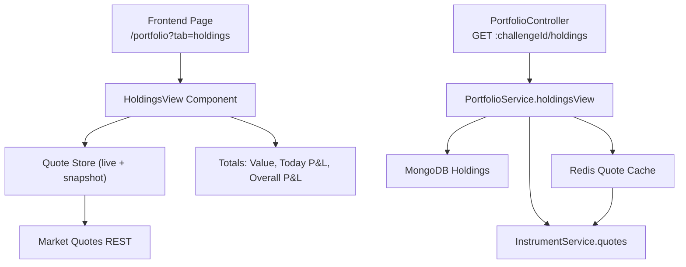
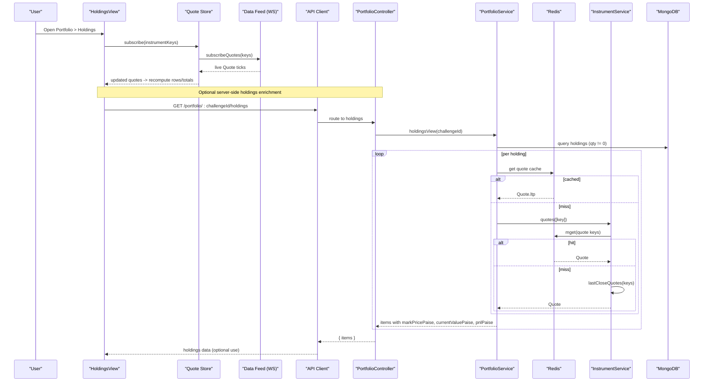
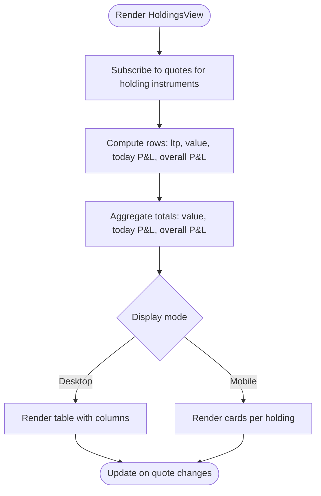
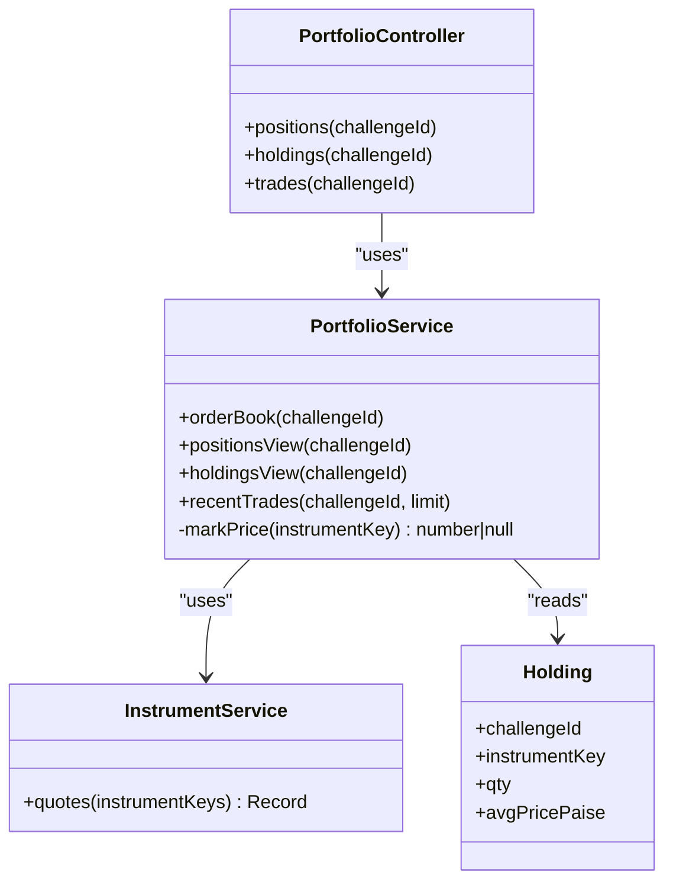
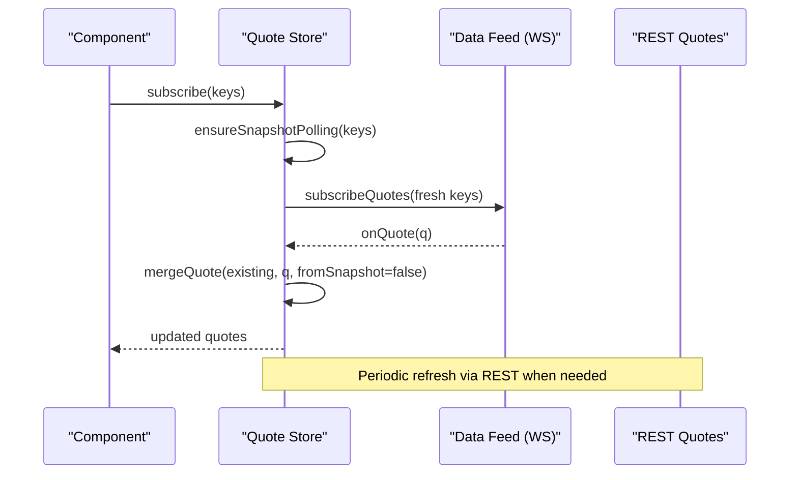
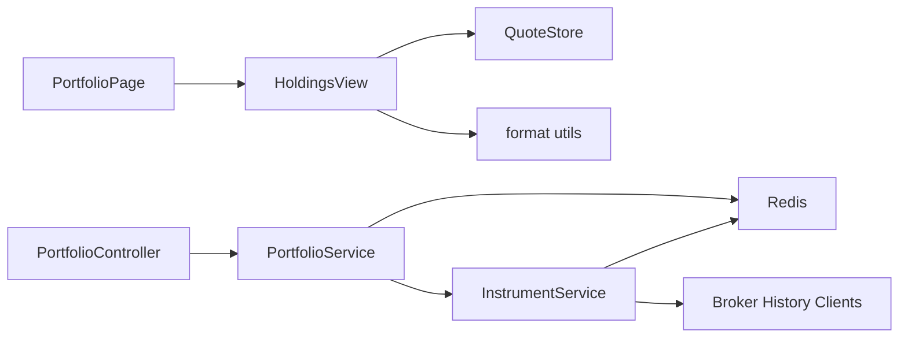

# Holdings View Component

<cite>
**Referenced Files in This Document**
- [page.tsx](file://frontend/trader/src/app/holdings/page.tsx)
- [page.tsx](file://frontend/trader/src/app/portfolio/page.tsx)
- [HoldingsView.tsx](file://frontend/trader/src/components/portfolio/HoldingsView.tsx)
- [api.ts](file://frontend/trader/src/lib/api.ts)
- [quote-store.ts](file://frontend/trader/src/lib/quote-store.ts)
- [portfolio.controller.ts](file://backend/apps/api/src/modules/trading/presentation/portfolio.controller.ts)
- [portfolio.service.ts](file://backend/apps/api/src/modules/trading/application/portfolio.service.ts)
- [instrument.service.ts](file://backend/apps/api/src/modules/market/application/instrument.service.ts)
- [holding.schema.ts](file://backend/apps/api/src/modules/trading/infrastructure/schemas/holding.schema.ts)
</cite>

## Table of Contents
1. [Introduction](#introduction)
2. [Project Structure](#project-structure)
3. [Core Components](#core-components)
4. [Architecture Overview](#architecture-overview)
5. [Detailed Component Analysis](#detailed-component-analysis)
6. [Dependency Analysis](#dependency-analysis)
7. [Performance Considerations](#performance-considerations)
8. [Troubleshooting Guide](#troubleshooting-guide)
9. [Conclusion](#conclusion)

## Introduction
This document describes the holdings view component that displays a user’s current delivery portfolio. It explains how quantities, current values, unrealized P&L, and percentage changes are computed and presented. It also covers data fetching from backend APIs, caching for performance, real-time updates via quotes, sorting/filtering considerations, grouping by asset type, integration with order placement workflows, responsive design, accessibility features, and export capabilities.

## Project Structure
The holdings feature spans both frontend and backend:
- Frontend routing redirects legacy /holdings to /portfolio?tab=holdings and renders the HoldingsView component within a tabbed Portfolio page.
- The HoldingsView component uses a live quote store to compute per-holding metrics and aggregates totals.
- Backend exposes a protected portfolio API endpoint to fetch holdings and enrich them with mark prices via Redis-cached quotes or instrument service fallbacks.

**Diagram sources**
- [page.tsx:1-85](file://frontend/trader/src/app/portfolio/page.tsx#L1-L85)
- [HoldingsView.tsx:1-157](file://frontend/trader/src/components/portfolio/HoldingsView.tsx#L1-L157)
- [quote-store.ts:1-151](file://frontend/trader/src/lib/quote-store.ts#L1-L151)
- [portfolio.controller.ts:1-25](file://backend/apps/api/src/modules/trading/presentation/portfolio.controller.ts#L1-L25)
- [portfolio.service.ts:1-90](file://backend/apps/api/src/modules/trading/application/portfolio.service.ts#L1-L90)
- [instrument.service.ts:151-183](file://backend/apps/api/src/modules/market/application/instrument.service.ts#L151-L183)

**Section sources**
- [page.tsx:1-7](file://frontend/trader/src/app/holdings/page.tsx#L1-L7)
- [page.tsx:1-85](file://frontend/trader/src/app/portfolio/page.tsx#L1-L85)
- [HoldingsView.tsx:1-157](file://frontend/trader/src/components/portfolio/HoldingsView.tsx#L1-L157)
- [portfolio.controller.ts:1-25](file://backend/apps/api/src/modules/trading/presentation/portfolio.controller.ts#L1-L25)
- [portfolio.service.ts:1-90](file://backend/apps/api/src/modules/trading/application/portfolio.service.ts#L1-L90)
- [instrument.service.ts:151-183](file://backend/apps/api/src/modules/market/application/instrument.service.ts#L151-L183)

## Core Components
- HoldingsView (client component): Renders a table and cards showing each holding’s symbol, quantity, average price, current LTP, value, today’s P&L, overall P&L, and percentage change. Aggregates total value, today’s P&L, and overall P&L at the top. Uses a demo dataset and subscribes to live quotes for those instruments.
- Portfolio page: Provides tabs for Positions and Holdings; routes to HoldingsView when tab=holdings.
- PortfolioController: Exposes GET :challengeId/holdings to return holdings with mark prices.
- PortfolioService: Queries MongoDB holdings, enriches with mark prices using Redis cache or InstrumentService, computes invested/current/P&L.
- InstrumentService: Batch quotes with Redis cache and last-close fallbacks.
- Quote Store: Manages live quotes via WebSocket feed and REST snapshots; maintains market open status and merges incoming quotes safely.

Key responsibilities:
- Display quantities, current values, unrealized P&L, and percentage changes.
- Compute totals across all holdings.
- Subscribe to live quotes to update values in real time.
- Provide responsive layout (table on desktop, cards on mobile).
- Include basic accessibility attributes (aria-labels, roles).

**Section sources**
- [HoldingsView.tsx:1-157](file://frontend/trader/src/components/portfolio/HoldingsView.tsx#L1-L157)
- [page.tsx:1-85](file://frontend/trader/src/app/portfolio/page.tsx#L1-L85)
- [portfolio.controller.ts:1-25](file://backend/apps/api/src/modules/trading/presentation/portfolio.controller.ts#L1-L25)
- [portfolio.service.ts:69-84](file://backend/apps/api/src/modules/trading/application/portfolio.service.ts#L69-L84)
- [instrument.service.ts:151-183](file://backend/apps/api/src/modules/market/application/instrument.service.ts#L151-L183)
- [quote-store.ts:1-151](file://frontend/trader/src/lib/quote-store.ts#L1-L151)

## Architecture Overview
The holdings view combines client-side real-time updates with server-side enriched data:
- Client subscribes to quotes for holding instruments and computes per-row metrics locally.
- Server provides a holdings endpoint that returns holdings with mark prices derived from Redis cache or instrument service fallbacks.
- Caching strategy:
  - Redis stores recent quotes for fast retrieval.
  - When Redis misses, InstrumentService falls back to last close quotes or historical candles.
- Real-time updates:
  - WebSocket feed pushes live quotes into the quote store.
  - REST snapshots periodically refresh quotes when market is closed or as a fallback.

**Diagram sources**
- [HoldingsView.tsx:1-157](file://frontend/trader/src/components/portfolio/HoldingsView.tsx#L1-L157)
- [quote-store.ts:1-151](file://frontend/trader/src/lib/quote-store.ts#L1-L151)
- [portfolio.controller.ts:1-25](file://backend/apps/api/src/modules/trading/presentation/portfolio.controller.ts#L1-L25)
- [portfolio.service.ts:26-84](file://backend/apps/api/src/modules/trading/application/portfolio.service.ts#L26-L84)
- [instrument.service.ts:151-183](file://backend/apps/api/src/modules/market/application/instrument.service.ts#L151-L183)

## Detailed Component Analysis

### HoldingsView Component
- Displays per-holding metrics:
  - Quantity, average price, current LTP, value, today’s P&L, overall P&L, and percentage change.
- Aggregates totals:
  - Total value, today’s P&L, overall P&L shown in summary cards.
- Data source:
  - Demo dataset used for initial rows; subscribes to quotes for those instruments to update LTP dynamically.
- Responsive UI:
  - Desktop shows a table; mobile switches to card layout under a breakpoint.
- Accessibility:
  - Uses aria-label on container and role/tablist/tab semantics in the parent portfolio page.

**Diagram sources**
- [HoldingsView.tsx:16-157](file://frontend/trader/src/components/portfolio/HoldingsView.tsx#L16-L157)

**Section sources**
- [HoldingsView.tsx:1-157](file://frontend/trader/src/components/portfolio/HoldingsView.tsx#L1-L157)

### Portfolio Page (Tabs)
- Provides tab navigation between Positions and Holdings.
- URL-based state via query parameter ?tab=holdings.
- Accessible tablist and tabpanel roles.

**Section sources**
- [page.tsx:1-85](file://frontend/trader/src/app/portfolio/page.tsx#L1-L85)

### Backend Holdings Endpoint
- Controller exposes GET :challengeId/holdings guarded by JWT auth.
- Service queries holdings where qty != 0, enriches with mark price via Redis or InstrumentService, and computes invested/current/P&L.

**Diagram sources**
- [portfolio.controller.ts:1-25](file://backend/apps/api/src/modules/trading/presentation/portfolio.controller.ts#L1-L25)
- [portfolio.service.ts:1-90](file://backend/apps/api/src/modules/trading/application/portfolio.service.ts#L1-L90)
- [instrument.service.ts:151-183](file://backend/apps/api/src/modules/market/application/instrument.service.ts#L151-L183)
- [holding.schema.ts:1-23](file://backend/apps/api/src/modules/trading/infrastructure/schemas/holding.schema.ts#L1-L23)

**Section sources**
- [portfolio.controller.ts:1-25](file://backend/apps/api/src/modules/trading/presentation/portfolio.controller.ts#L1-L25)
- [portfolio.service.ts:26-84](file://backend/apps/api/src/modules/trading/application/portfolio.service.ts#L26-L84)
- [holding.schema.ts:1-23](file://backend/apps/api/src/modules/trading/infrastructure/schemas/holding.schema.ts#L1-L23)

### Quote Store and Real-Time Updates
- Maintains a global map of instrument quotes and subscription set.
- On subscribe:
  - Checks market status.
  - Starts periodic REST snapshot polling (faster when market closed).
  - Attaches WebSocket listener once to receive live ticks.
- Merges incoming quotes carefully to avoid regressions and prefers snapshots when market is closed.

**Diagram sources**
- [quote-store.ts:1-151](file://frontend/trader/src/lib/quote-store.ts#L1-L151)

**Section sources**
- [quote-store.ts:1-151](file://frontend/trader/src/lib/quote-store.ts#L1-L151)

## Dependency Analysis
- Frontend dependencies:
  - HoldingsView depends on quote-store for live quotes and format utilities for display.
  - Portfolio page composes HoldingsView and manages tab state.
- Backend dependencies:
  - PortfolioController depends on PortfolioService and JWT guard.
  - PortfolioService depends on MongoDB models (Order, Position, Holding, Trade), Redis client, and InstrumentService for quotes.
  - InstrumentService depends on Redis and broker history clients for quotes and candles.

**Diagram sources**
- [HoldingsView.tsx:1-157](file://frontend/trader/src/components/portfolio/HoldingsView.tsx#L1-L157)
- [quote-store.ts:1-151](file://frontend/trader/src/lib/quote-store.ts#L1-L151)
- [portfolio.controller.ts:1-25](file://backend/apps/api/src/modules/trading/presentation/portfolio.controller.ts#L1-L25)
- [portfolio.service.ts:1-90](file://backend/apps/api/src/modules/trading/application/portfolio.service.ts#L1-L90)
- [instrument.service.ts:151-183](file://backend/apps/api/src/modules/market/application/instrument.service.ts#L151-L183)

**Section sources**
- [HoldingsView.tsx:1-157](file://frontend/trader/src/components/portfolio/HoldingsView.tsx#L1-L157)
- [quote-store.ts:1-151](file://frontend/trader/src/lib/quote-store.ts#L1-L151)
- [portfolio.controller.ts:1-25](file://backend/apps/api/src/modules/trading/presentation/portfolio.controller.ts#L1-L25)
- [portfolio.service.ts:1-90](file://backend/apps/api/src/modules/trading/application/portfolio.service.ts#L1-L90)
- [instrument.service.ts:151-183](file://backend/apps/api/src/modules/market/application/instrument.service.ts#L151-L183)

## Performance Considerations
- Real-time efficiency:
  - Quote store deduplicates subscriptions and merges quotes to minimize re-renders.
  - Snapshot polling frequency adapts based on market open/closed state.
- Backend caching:
  - Redis-backed quote cache reduces database and broker calls.
  - InstrumentService batched quotes and last-close fallbacks improve resilience.
- Rendering:
  - Local computation of per-row metrics avoids frequent server round-trips for updates.
  - Responsive layout reduces DOM complexity on mobile by switching to cards.

[No sources needed since this section provides general guidance]

## Troubleshooting Guide
- Authentication errors:
  - If the API returns 401, the frontend client clears session and redirects to login. Ensure valid bearer token is attached.
- Network timeouts:
  - Requests have default timeouts; long-running endpoints may use extended timeouts. Handle timeout errors gracefully.
- Quote freshness:
  - If quotes appear stale, verify WebSocket connection and snapshot polling. Check market status endpoint and Redis availability.
- Missing holdings:
  - Backend only returns holdings with qty != 0. Verify MongoDB holdings collection and indexes.

**Section sources**
- [api.ts:67-148](file://frontend/trader/src/lib/api.ts#L67-L148)
- [quote-store.ts:38-90](file://frontend/trader/src/lib/quote-store.ts#L38-L90)
- [portfolio.service.ts:69-84](file://backend/apps/api/src/modules/trading/application/portfolio.service.ts#L69-L84)

## Conclusion
The holdings view delivers a responsive, accessible, and real-time portfolio experience. It leverages local quote-driven updates for immediate feedback and a robust backend caching strategy for accurate valuations. While the current implementation focuses on core metrics and presentation, future enhancements can include server-side sorting/filtering, grouping by asset type, and export functionality for reports.

[No sources needed since this section summarizes without analyzing specific files]

## Appendices

### Sorting and Filtering Capabilities
- Current implementation does not implement explicit sorting or filtering controls in the holdings view.
- Potential extension points:
  - Add client-side sort by symbol, value, P&L, or percentage change.
  - Add filters by segment (e.g., EQ, INDEX) if instrument metadata is available.

[No sources needed since this section proposes extensions without analyzing specific files]

### Grouping by Asset Type
- Not currently implemented in the holdings view.
- Could be added by grouping rows/cards by instrument segment (EQ/INDEX) if such metadata is provided by the instrument catalog or holdings enrichment.

[No sources needed since this section proposes extensions without analyzing specific files]

### Integration with Order Placement Workflows
- The holdings view is read-only for delivery positions. Order placement flows are separate and typically interact with orders/positions endpoints.
- To integrate, link actions (e.g., “Trade”) to existing order modal components and pass instrument key and current LTP from the quote store.

[No sources needed since this section proposes integrations without analyzing specific files]

### Export Functionality for Holdings Reports
- Not currently implemented in the holdings view.
- A practical approach:
  - Build a CSV export from the rendered rows (symbol, qty, avg price, LTP, value, today P&L, overall P&L, % change).
  - Trigger download via browser Blob/URL.createObjectURL.
  - Optionally add date range and grouping options.

[No sources needed since this section proposes features without analyzing specific files]