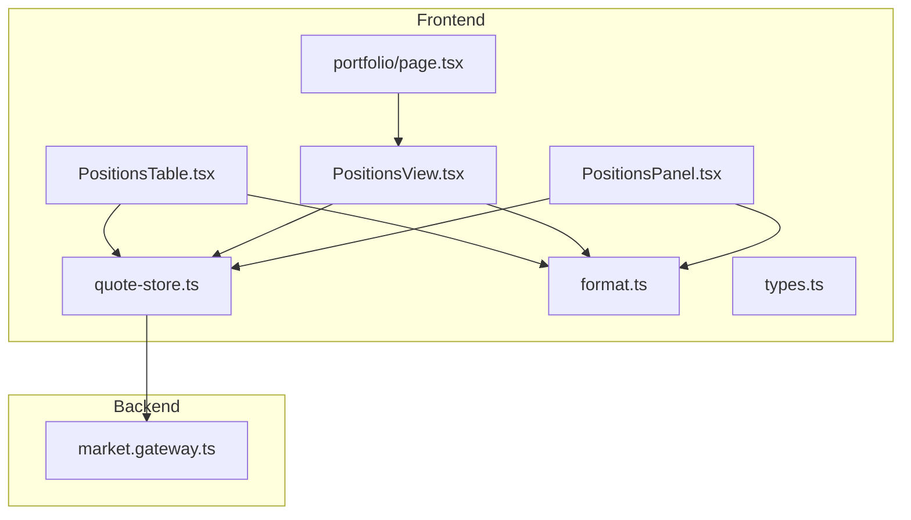
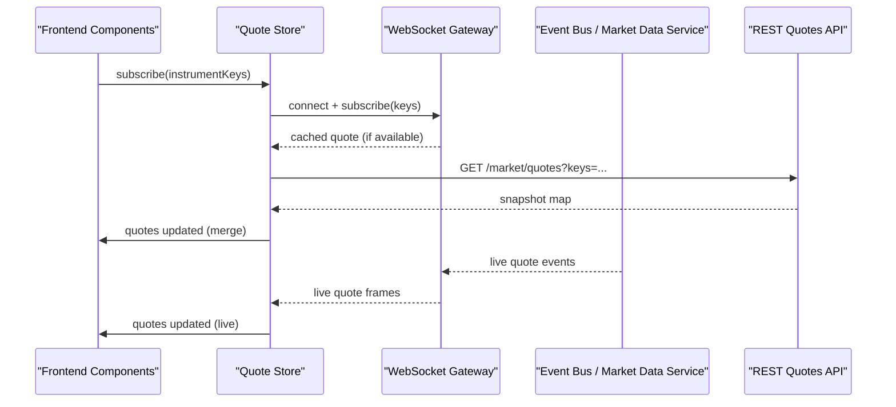
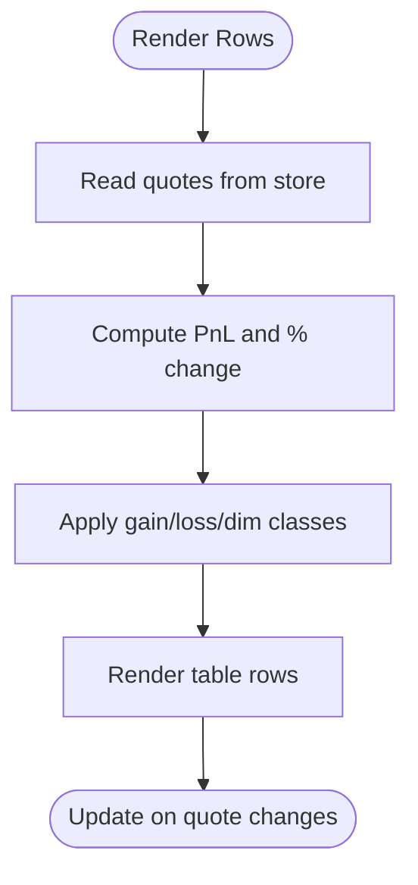
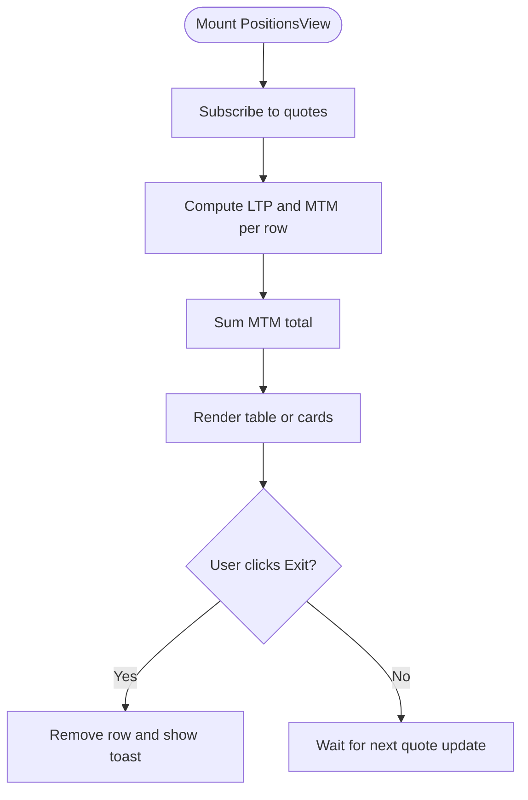
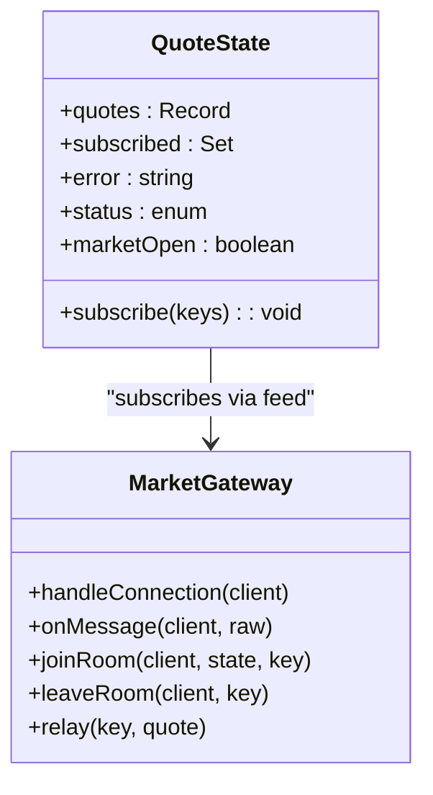
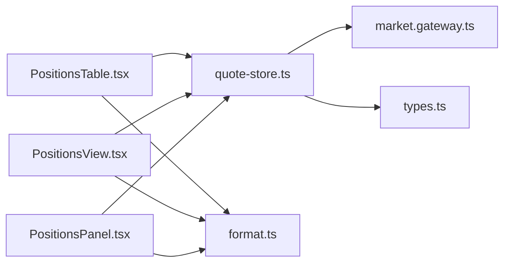

# Positions Management Table

<cite>
**Referenced Files in This Document**
- [PositionsTable.tsx](file://frontend/trader/src/components/dashboard/PositionsTable.tsx)
- [PositionsView.tsx](file://frontend/trader/src/components/portfolio/PositionsView.tsx)
- [PositionsPanel.tsx](file://frontend/trader/src/components/PositionsPanel.tsx)
- [quote-store.ts](file://frontend/trader/src/lib/quote-store.ts)
- [types.ts](file://frontend/trader/src/lib/types.ts)
- [format.ts](file://frontend/trader/src/lib/format.ts)
- [market.gateway.ts](file://backend/apps/api/src/modules/market/presentation/market.gateway.ts)
- [portfolio/page.tsx](file://frontend/trader/src/app/portfolio/page.tsx)
- [positions/page.tsx](file://frontend/trader/src/app/positions/page.tsx)
</cite>

## Table of Contents
1. [Introduction](#introduction)
2. [Project Structure](#project-structure)
3. [Core Components](#core-components)
4. [Architecture Overview](#architecture-overview)
5. [Detailed Component Analysis](#detailed-component-analysis)
6. [Dependency Analysis](#dependency-analysis)
7. [Performance Considerations](#performance-considerations)
8. [Troubleshooting Guide](#troubleshooting-guide)
9. [Conclusion](#conclusion)

## Introduction
This document explains the positions management components that render live open positions with real-time price updates, P&L calculations, and dynamic row highlighting. It covers how market data feeds integrate with the UI, how positions are refreshed, and how to optimize performance for large position lists. It also outlines current capabilities and provides guidance on extending sorting, filtering, bulk operations, export, column customization, and responsive behavior.

## Project Structure
The positions feature spans a few key areas:
- Dashboard snippet table for quick overview
- Full portfolio view with MTM summary and mobile-friendly cards
- Sidebar panel for compact display
- Real-time quote store that subscribes to WebSocket quotes and REST snapshots
- Backend WebSocket gateway that fans out quotes per instrument

**Diagram sources**
- [PositionsTable.tsx:1-71](file://frontend/trader/src/components/dashboard/PositionsTable.tsx#L1-L71)
- [PositionsView.tsx:1-164](file://frontend/trader/src/components/portfolio/PositionsView.tsx#L1-L164)
- [PositionsPanel.tsx:1-52](file://frontend/trader/src/components/PositionsPanel.tsx#L1-L52)
- [quote-store.ts:1-151](file://frontend/trader/src/lib/quote-store.ts#L1-L151)
- [format.ts:1-43](file://frontend/trader/src/lib/format.ts#L1-L43)
- [types.ts:1-23](file://frontend/trader/src/lib/types.ts#L1-L23)
- [market.gateway.ts:1-134](file://backend/apps/api/src/modules/market/presentation/market.gateway.ts#L1-L134)
- [portfolio/page.tsx:1-85](file://frontend/trader/src/app/portfolio/page.tsx#L1-L85)

**Section sources**
- [PositionsTable.tsx:1-71](file://frontend/trader/src/components/dashboard/PositionsTable.tsx#L1-L71)
- [PositionsView.tsx:1-164](file://frontend/trader/src/components/portfolio/PositionsView.tsx#L1-L164)
- [PositionsPanel.tsx:1-52](file://frontend/trader/src/components/PositionsPanel.tsx#L1-L52)
- [quote-store.ts:1-151](file://frontend/trader/src/lib/quote-store.ts#L1-L151)
- [market.gateway.ts:1-134](file://backend/apps/api/src/modules/market/presentation/market.gateway.ts#L1-L134)
- [portfolio/page.tsx:1-85](file://frontend/trader/src/app/portfolio/page.tsx#L1-L85)

## Core Components
- PositionsTable: Compact dashboard table showing symbol, quantity, average price, LTP, change, and P&L. Subscribes to quotes via the quote store and highlights rows based on profit/loss using sign classes.
- PositionsView: Full portfolio page with MTM total, table, and mobile card layout. Computes MTM per position and totals, supports exit actions, and uses responsive CSS to switch between table and cards.
- PositionsPanel: Compact sidebar panel rendering positions with similar fields and styling.
- Quote Store: Centralized state for quotes, subscriptions, status, and snapshot polling; integrates with WebSocket feed and REST fallback.
- Format Utilities: Helpers for Indian number formatting, currency (paise), percentage, and sign-based CSS classes.

Key behaviors:
- Real-time updates: subscribe() triggers WebSocket subscription and initial REST snapshot; quotes merge into local state and trigger re-renders.
- P&L calculation: computed from LTP vs average price and net quantity; displayed with sign-aware formatting and color classes.
- Dynamic highlighting: positive/negative values use gain/loss/dim classes derived from signClass.

**Section sources**
- [PositionsTable.tsx:9-57](file://frontend/trader/src/components/dashboard/PositionsTable.tsx#L9-L57)
- [PositionsView.tsx:13-75](file://frontend/trader/src/components/portfolio/PositionsView.tsx#L13-L75)
- [PositionsPanel.tsx:8-49](file://frontend/trader/src/components/PositionsPanel.tsx#L8-L49)
- [quote-store.ts:96-150](file://frontend/trader/src/lib/quote-store.ts#L96-L150)
- [format.ts:26-42](file://frontend/trader/src/lib/format.ts#L26-L42)

## Architecture Overview
End-to-end flow from backend market data to frontend positions tables:

**Diagram sources**
- [quote-store.ts:102-149](file://frontend/trader/src/lib/quote-store.ts#L102-L149)
- [market.gateway.ts:91-132](file://backend/apps/api/src/modules/market/presentation/market.gateway.ts#L91-L132)

## Detailed Component Analysis

### PositionsTable
- Responsibilities:
  - Render a concise table of open positions with Instrument, Qty, Avg, LTP, Change, P&L.
  - Subscribe to quotes for each row’s instrumentKey.
  - Compute P&L and percent change from LTP vs average price.
  - Highlight rows using sign-based CSS classes.
- Real-time integration:
  - Uses quote store subscribe to ensure quotes are fetched and kept up to date.
- Rendering details:
  - Empty state when no positions.
  - Product badge shows MIS or CNC based on product type.
- Sorting, Filtering, Bulk Operations, Export, Column Customization:
  - Not implemented in this component. These can be added by introducing controlled state for sort/filter and passing derived rows to the table.

**Diagram sources**
- [PositionsTable.tsx:13-57](file://frontend/trader/src/components/dashboard/PositionsTable.tsx#L13-L57)
- [format.ts:26-42](file://frontend/trader/src/lib/format.ts#L26-L42)

**Section sources**
- [PositionsTable.tsx:1-71](file://frontend/trader/src/components/dashboard/PositionsTable.tsx#L1-L71)

### PositionsView
- Responsibilities:
  - Display MTM total and per-position MTM/P&L.
  - Provide an “Exit” action per position (local demo behavior).
  - Responsive layout: table on desktop, cards on mobile.
- Real-time integration:
  - Subscribes to quotes for demo instruments and computes LTP and MTM.
- Mobile responsiveness:
  - Uses media queries to hide the table and show card grid on small screens.
- Sorting, Filtering, Bulk Operations, Export, Column Customization:
  - Not implemented in this component. Can be extended similarly to PositionsTable.

**Diagram sources**
- [PositionsView.tsx:13-75](file://frontend/trader/src/components/portfolio/PositionsView.tsx#L13-L75)
- [PositionsView.tsx:120-160](file://frontend/trader/src/components/portfolio/PositionsView.tsx#L120-L160)

**Section sources**
- [PositionsView.tsx:1-164](file://frontend/trader/src/components/portfolio/PositionsView.tsx#L1-L164)

### PositionsPanel
- Responsibilities:
  - Compact sidebar table with Symbol, Qty, Avg, LTP, Change, P&L.
  - Reads quotes from the same store and applies sign-based styling.
- Real-time integration:
  - Relies on quote store for live updates without explicit subscribe call in this file.
- Sorting, Filtering, Bulk Operations, Export, Column Customization:
  - Not implemented.

**Section sources**
- [PositionsPanel.tsx:1-52](file://frontend/trader/src/components/PositionsPanel.tsx#L1-L52)

### Quote Store and Market Data Integration
- Responsibilities:
  - Maintain quotes, subscribed keys, error/status, and marketOpen flag.
  - Manage WebSocket connection lifecycle and per-instrument subscriptions.
  - Merge incoming quotes with existing ones, preferring snapshots when market is closed.
  - Poll REST /market/quotes periodically for snapshots when needed.
- Backend integration:
  - WebSocket gateway authenticates clients, manages rooms per instrument, relays quotes, and bumps interest with MarketDataService.

**Diagram sources**
- [quote-store.ts:9-16](file://frontend/trader/src/lib/quote-store.ts#L9-L16)
- [quote-store.ts:96-150](file://frontend/trader/src/lib/quote-store.ts#L96-L150)
- [market.gateway.ts:27-132](file://backend/apps/api/src/modules/market/presentation/market.gateway.ts#L27-L132)

**Section sources**
- [quote-store.ts:1-151](file://frontend/trader/src/lib/quote-store.ts#L1-L151)
- [market.gateway.ts:1-134](file://backend/apps/api/src/modules/market/presentation/market.gateway.ts#L1-L134)

### Portfolio Page Routing
- The portfolio page hosts tabs for positions and holdings, rendering PositionsView under the positions tab.
- Legacy route redirects to the new portfolio path.

**Section sources**
- [portfolio/page.tsx:1-85](file://frontend/trader/src/app/portfolio/page.tsx#L1-L85)
- [positions/page.tsx:1-7](file://frontend/trader/src/app/positions/page.tsx#L1-L7)

## Dependency Analysis
- Components depend on:
  - quote-store for live quotes and subscription management
  - format utilities for consistent number/currency/percentage rendering and sign-based classes
  - types for Quote and Instrument definitions
- Backend depends on:
  - Redis for caching last quotes
  - Event bus to relay quotes from upstream market data service
  - TokenService for WebSocket authentication

**Diagram sources**
- [PositionsTable.tsx:1-71](file://frontend/trader/src/components/dashboard/PositionsTable.tsx#L1-L71)
- [PositionsView.tsx:1-164](file://frontend/trader/src/components/portfolio/PositionsView.tsx#L1-L164)
- [PositionsPanel.tsx:1-52](file://frontend/trader/src/components/PositionsPanel.tsx#L1-L52)
- [quote-store.ts:1-151](file://frontend/trader/src/lib/quote-store.ts#L1-L151)
- [market.gateway.ts:1-134](file://backend/apps/api/src/modules/market/presentation/market.gateway.ts#L1-L134)
- [format.ts:1-43](file://frontend/trader/src/lib/format.ts#L1-L43)
- [types.ts:1-23](file://frontend/trader/src/lib/types.ts#L1-L23)

**Section sources**
- [quote-store.ts:1-151](file://frontend/trader/src/lib/quote-store.ts#L1-L151)
- [market.gateway.ts:1-134](file://backend/apps/api/src/modules/market/presentation/market.gateway.ts#L1-L134)

## Performance Considerations
- Minimize re-renders:
  - Keep position lists stable; avoid frequent insertions/removals during market hours.
  - Use memoization for derived computations (e.g., sorted/filtered views) if you add sorting/filtering.
- Efficient subscriptions:
  - Batch subscribe calls to quote-store to reduce WebSocket overhead.
  - Avoid subscribing to unused instruments; unsubscribe when leaving pages.
- Snapshot strategy:
  - The store polls REST snapshots at intervals; tune frequency based on market open/closed state.
- Large datasets:
  - Virtualize or paginate if position counts grow significantly.
  - Consider server-side sorting/filtering endpoints before adding client-side complexity.
- Formatting costs:
  - Reuse format helpers; avoid heavy computations inside render loops.

[No sources needed since this section provides general guidance]

## Troubleshooting Guide
- No quotes updating:
  - Verify WebSocket connection status and errors in the quote store.
  - Check that subscribe was called with valid instrument keys.
  - Ensure backend gateway is reachable and authenticated.
- Stale quotes after market close:
  - Snapshots are preferred when market is closed; confirm REST polling is active.
- High CPU usage:
  - Reduce number of subscribed instruments.
  - Debounce user interactions that trigger re-renders.
- Authentication failures:
  - Confirm token is passed to WebSocket URL; gateway rejects connections without tokens.

**Section sources**
- [quote-store.ts:102-149](file://frontend/trader/src/lib/quote-store.ts#L102-L149)
- [market.gateway.ts:48-60](file://backend/apps/api/src/modules/market/presentation/market.gateway.ts#L48-L60)

## Conclusion
The positions management components provide a solid foundation for displaying live positions with real-time updates, accurate P&L calculations, and clear visual signals for profit/loss. The quote store abstracts WebSocket and REST integration, ensuring robust updates across devices. While sorting, filtering, bulk operations, export, and column customization are not currently implemented, the modular design makes it straightforward to extend these features while maintaining performance and responsiveness.

[No sources needed since this section summarizes without analyzing specific files]