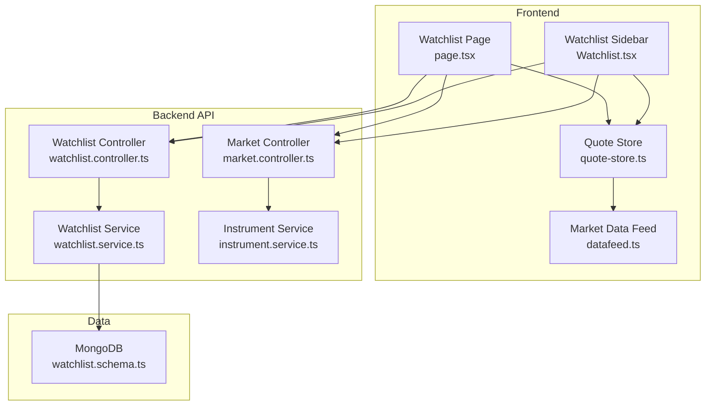
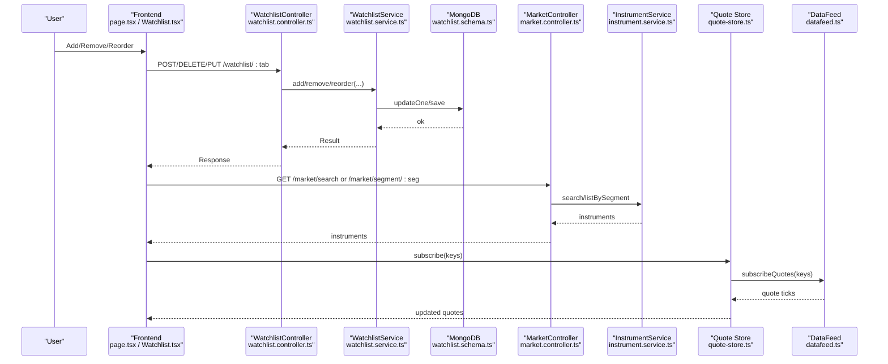
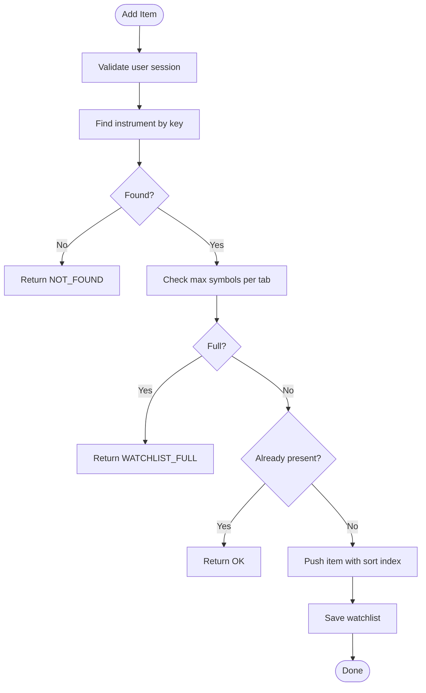
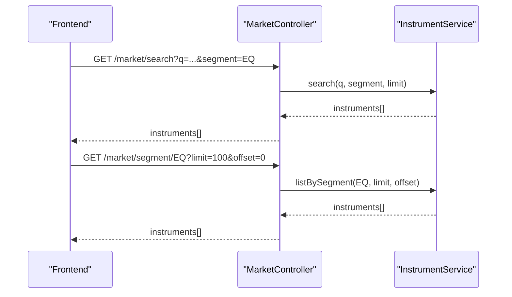
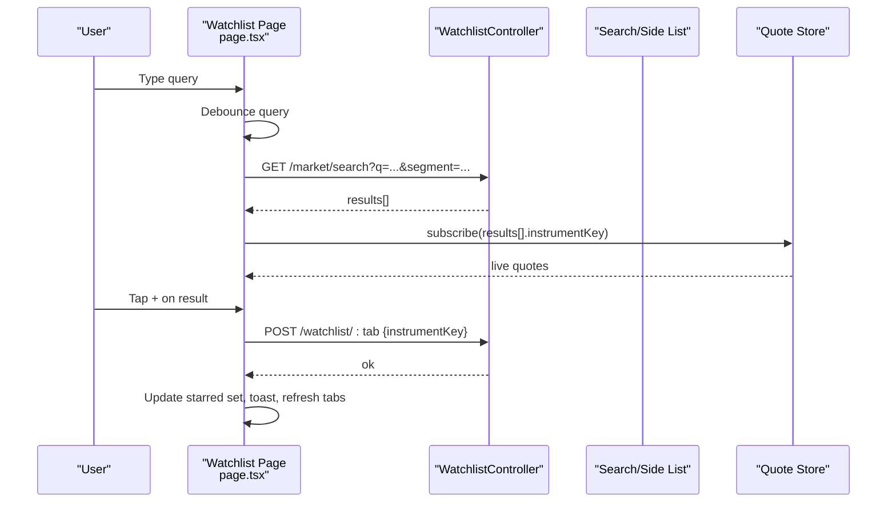
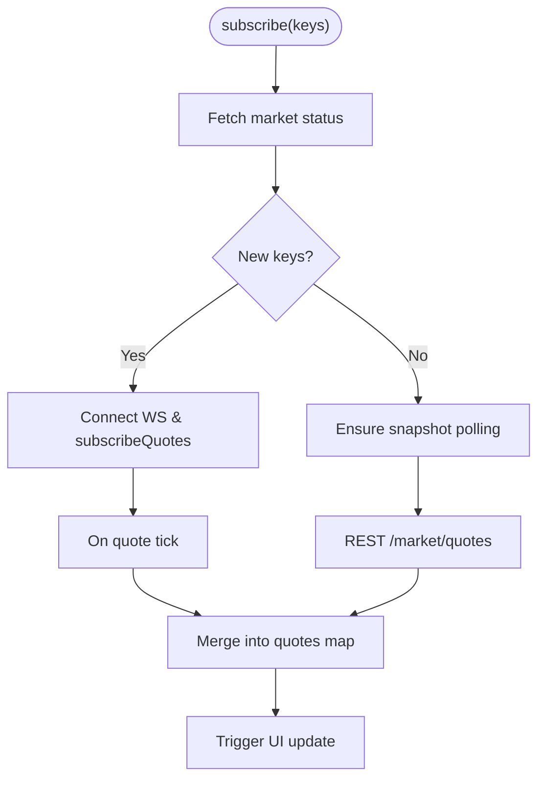
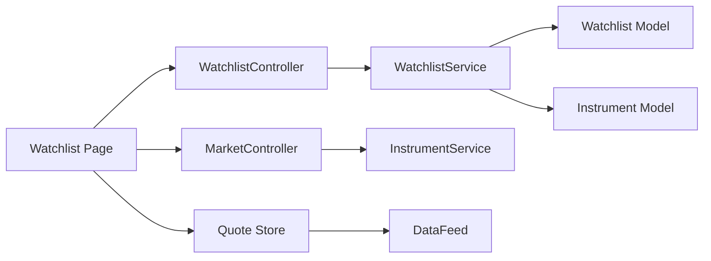

# Watchlist Management

<cite>
**Referenced Files in This Document**
- [watchlist.service.ts](file://backend/apps/api/src/modules/market/application/watchlist.service.ts)
- [watchlist.controller.ts](file://backend/apps/api/src/modules/market/presentation/watchlist.controller.ts)
- [market.dtos.ts](file://backend/apps/api/src/modules/market/presentation/dto/market.dtos.ts)
- [watchlist.schema.ts](file://backend/apps/api/src/modules/market/infrastructure/schemas/watchlist.schema.ts)
- [instrument.service.ts](file://backend/apps/api/src/modules/market/application/instrument.service.ts)
- [market.controller.ts](file://backend/apps/api/src/modules/market/presentation/market.controller.ts)
- [Watchlist.tsx](file://frontend/trader/src/components/Watchlist.tsx)
- [page.tsx](file://frontend/trader/src/app/watchlist/page.tsx)
- [quote-store.ts](file://frontend/trader/src/lib/quote-store.ts)
- [datafeed.ts](file://frontend/trader/src/lib/market/datafeed.ts)
</cite>

## Table of Contents
1. Introduction
2. Project Structure
3. Core Components
4. Architecture Overview
5. Detailed Component Analysis
6. Dependency Analysis
7. Performance Considerations
8. Troubleshooting Guide
9. Conclusion
10. Appendices

## Introduction
This document explains the watchlist management functionality across the backend and frontend. It covers adding, removing, organizing, and persisting instruments; real-time price updates; search and filter capabilities; integration with market data feeds; persistence and synchronization across sessions; drag-and-drop reordering; bulk operations; import/export considerations; order placement workflow integration; performance for large watchlists; and mobile responsiveness.

## Project Structure
The watchlist feature spans:
- Backend API endpoints for listing tabs, creating/rename lists, adding/removing items, and reordering.
- A MongoDB schema to store per-user watchlist tabs and ordered items.
- Instrument catalog services for search, segment browsing, and quotes.
- Frontend components that render tabs, lists, search results, and detail views, plus a quote store for live updates.

**Diagram sources**
- [watchlist.controller.ts:32-75](file://backend/apps/api/src/modules/market/presentation/watchlist.controller.ts#L32-L75)
- [watchlist.service.ts:24-148](file://backend/apps/api/src/modules/market/application/watchlist.service.ts#L24-L148)
- [market.controller.ts:21-75](file://backend/apps/api/src/modules/market/presentation/market.controller.ts#L21-L75)
- [instrument.service.ts:40-122](file://backend/apps/api/src/modules/market/application/instrument.service.ts#L40-L122)
- [watchlist.schema.ts:11-31](file://backend/apps/api/src/modules/market/infrastructure/schemas/watchlist.schema.ts#L11-L31)
- [page.tsx:82-710](file://frontend/trader/src/app/watchlist/page.tsx#L82-L710)
- [Watchlist.tsx:28-246](file://frontend/trader/src/components/Watchlist.tsx#L28-L246)
- [quote-store.ts:92-151](file://frontend/trader/src/lib/quote-store.ts#L92-L151)
- [datafeed.ts:55-64](file://frontend/trader/src/lib/market/datafeed.ts#L55-L64)

**Section sources**
- [watchlist.controller.ts:32-75](file://backend/apps/api/src/modules/market/presentation/watchlist.controller.ts#L32-L75)
- [watchlist.service.ts:24-148](file://backend/apps/api/src/modules/market/application/watchlist.service.ts#L24-L148)
- [market.controller.ts:21-75](file://backend/apps/api/src/modules/market/presentation/market.controller.ts#L21-L75)
- [instrument.service.ts:40-122](file://backend/apps/api/src/modules/market/application/instrument.service.ts#L40-L122)
- [watchlist.schema.ts:11-31](file://backend/apps/api/src/modules/market/infrastructure/schemas/watchlist.schema.ts#L11-L31)
- [page.tsx:82-710](file://frontend/trader/src/app/watchlist/page.tsx#L82-L710)
- [Watchlist.tsx:28-246](file://frontend/trader/src/components/Watchlist.tsx#L28-L246)
- [quote-store.ts:92-151](file://frontend/trader/src/lib/quote-store.ts#L92-L151)
- [datafeed.ts:55-64](file://frontend/trader/src/lib/market/datafeed.ts#L55-L64)

## Core Components
- Watchlist controller exposes REST endpoints for tab CRUD, item add/remove, and reorder.
- Watchlist service enforces business rules (limits, duplicates), persists to MongoDB, and enriches items with instrument details.
- Market controller provides search, segment browse, quotes, candles, and option chain endpoints used by the UI.
- Instrument service implements search, deduplication, and aggregation over the instrument catalog.
- Frontend watchlist page renders tabs, search/browse, adds/removes items, integrates with charts and option chains, and handles mobile view switching.
- Quote store manages live quotes via WebSocket feed and REST snapshots, merging updates efficiently.

**Section sources**
- [watchlist.controller.ts:32-75](file://backend/apps/api/src/modules/market/presentation/watchlist.controller.ts#L32-L75)
- [watchlist.service.ts:24-148](file://backend/apps/api/src/modules/market/application/watchlist.service.ts#L24-L148)
- [market.controller.ts:21-75](file://backend/apps/api/src/modules/market/presentation/market.controller.ts#L21-L75)
- [instrument.service.ts:40-122](file://backend/apps/api/src/modules/market/application/instrument.service.ts#L40-L122)
- [page.tsx:82-710](file://frontend/trader/src/app/watchlist/page.tsx#L82-L710)
- [quote-store.ts:92-151](file://frontend/trader/src/lib/quote-store.ts#L92-L151)

## Architecture Overview
The watchlist flow combines user actions on the frontend with backend APIs and persistent storage, while real-time prices are delivered through a WebSocket-based market data feed with REST snapshot fallback.

**Diagram sources**
- [watchlist.controller.ts:32-75](file://backend/apps/api/src/modules/market/presentation/watchlist.controller.ts#L32-L75)
- [watchlist.service.ts:104-148](file://backend/apps/api/src/modules/market/application/watchlist.service.ts#L104-L148)
- [watchlist.schema.ts:11-31](file://backend/apps/api/src/modules/market/infrastructure/schemas/watchlist.schema.ts#L11-L31)
- [market.controller.ts:29-59](file://backend/apps/api/src/modules/market/presentation/market.controller.ts#L29-L59)
- [instrument.service.ts:57-122](file://backend/apps/api/src/modules/market/application/instrument.service.ts#L57-L122)
- [quote-store.ts:102-151](file://frontend/trader/src/lib/quote-store.ts#L102-L151)
- [datafeed.ts:371-413](file://frontend/trader/src/lib/market/datafeed.ts#L371-L413)

## Detailed Component Analysis

### Backend: Watchlist Endpoints and Business Logic
- Tabs listing returns built-in segments and custom lists with counts.
- Create tab assigns WL1…WL20 IDs up to a limit and initializes an empty list.
- Rename tab disallows renaming built-in tabs and validates input length.
- Get tab returns ordered items enriched with instrument metadata.
- Add item checks instrument existence, enforces per-tab symbol limits, prevents duplicates, and appends with sort index.
- Remove item deletes the instrument key from the list.
- Reorder recalculates sort indices based on provided order.

**Diagram sources**
- [watchlist.service.ts:104-126](file://backend/apps/api/src/modules/market/application/watchlist.service.ts#L104-L126)

**Section sources**
- [watchlist.service.ts:33-148](file://backend/apps/api/src/modules/market/application/watchlist.service.ts#L33-L148)
- [watchlist.controller.ts:32-75](file://backend/apps/api/src/modules/market/presentation/watchlist.controller.ts#L32-L75)
- [market.dtos.ts:42-56](file://backend/apps/api/src/modules/market/presentation/dto/market.dtos.ts#L42-L56)
- [watchlist.schema.ts:11-31](file://backend/apps/api/src/modules/market/infrastructure/schemas/watchlist.schema.ts#L11-L31)

### Backend: Search and Segment Browse
- Search supports prefix matching and full-text fallback, with optional segment and exchange filters and a capped limit.
- Segment browse returns paginated instruments for EQ, INDEX, FO, CUR.
- Quotes endpoint accepts comma-separated keys and returns last known quotes.

**Diagram sources**
- [market.controller.ts:29-45](file://backend/apps/api/src/modules/market/presentation/market.controller.ts#L29-L45)
- [instrument.service.ts:57-122](file://backend/apps/api/src/modules/market/application/instrument.service.ts#L57-L122)

**Section sources**
- [market.controller.ts:29-59](file://backend/apps/api/src/modules/market/presentation/market.controller.ts#L29-L59)
- [instrument.service.ts:57-122](file://backend/apps/api/src/modules/market/application/instrument.service.ts#L57-L122)

### Frontend: Watchlist Page and Sidebar
- The main page supports personal tabs (e.g., MY) and catalog tabs (STOCKS, INDICES, OPTIONS, CURRENCY).
- It loads tabs from the API, creates a default personal list if missing, and falls back to local storage when the API is unavailable.
- Search queries the market search endpoint with debounce; segment browsing uses pagination.
- Adding/removing toggles star state and calls the watchlist API; on success it refreshes tabs and current list.
- Mobile view switches between list and detail (chart or option chain) using URL parameters and responsive logic.

**Diagram sources**
- [page.tsx:330-350](file://frontend/trader/src/app/watchlist/page.tsx#L330-L350)
- [page.tsx:388-446](file://frontend/trader/src/app/watchlist/page.tsx#L388-L446)
- [quote-store.ts:102-151](file://frontend/trader/src/lib/quote-store.ts#L102-L151)

**Section sources**
- [page.tsx:82-710](file://frontend/trader/src/app/watchlist/page.tsx#L82-L710)
- [Watchlist.tsx:28-246](file://frontend/trader/src/components/Watchlist.tsx#L28-L246)

### Real-Time Price Updates
- The quote store subscribes to a WebSocket-based data feed and merges incoming quotes with existing ones.
- When the market is closed, REST snapshots are preferred; during open hours, live ticks update the UI.
- Snapshot polling runs at intervals to keep quotes fresh and to check market status.

**Diagram sources**
- [quote-store.ts:92-151](file://frontend/trader/src/lib/quote-store.ts#L92-L151)
- [datafeed.ts:371-413](file://frontend/trader/src/lib/market/datafeed.ts#L371-L413)

**Section sources**
- [quote-store.ts:92-151](file://frontend/trader/src/lib/quote-store.ts#L92-L151)
- [datafeed.ts:371-413](file://frontend/trader/src/lib/market/datafeed.ts#L371-L413)

### Customizable Columns and Display
- The sidebar component displays symbol, exchange/segment, change, percentage change, and last traded price.
- The main page shows LTP and change/percentage in row headers and in the detail header.
- These columns reflect live quotes from the quote store.

**Section sources**
- [Watchlist.tsx:151-192](file://frontend/trader/src/components/Watchlist.tsx#L151-L192)
- [page.tsx:529-651](file://frontend/trader/src/app/watchlist/page.tsx#L529-L651)

### Search and Filter Capabilities
- Debounced search queries the market search endpoint with optional segment filtering.
- Segment browsing loads paginated instruments and auto-selects the first item when available.
- Results are subscribed to the quote store for live updates.

**Section sources**
- [page.tsx:330-350](file://frontend/trader/src/app/watchlist/page.tsx#L330-L350)
- [page.tsx:287-317](file://frontend/trader/src/app/watchlist/page.tsx#L287-L317)
- [market.controller.ts:29-45](file://backend/apps/api/src/modules/market/presentation/market.controller.ts#L29-L45)
- [instrument.service.ts:57-122](file://backend/apps/api/src/modules/market/application/instrument.service.ts#L57-L122)

### Persistence and Session Synchronization
- Personal watchlists are persisted server-side under unique tabs (e.g., MY, WL1…WL20).
- If the API is unavailable, the page falls back to localStorage for local lists and syncs counts/tabs when possible.
- Tabs are ordered to prioritize personal lists before catalog tabs.

**Section sources**
- [page.tsx:206-246](file://frontend/trader/src/app/watchlist/page.tsx#L206-L246)
- [page.tsx:73-80](file://frontend/trader/src/app/watchlist/page.tsx#L73-L80)
- [watchlist.service.ts:53-87](file://backend/apps/api/src/modules/market/application/watchlist.service.ts#L53-L87)
- [watchlist.schema.ts:11-31](file://backend/apps/api/src/modules/market/infrastructure/schemas/watchlist.schema.ts#L11-L31)

### Drag-and-Drop Reordering
- The backend supports reordering via PUT /watchlist/:tab/reorder with an ordered array of instrument keys.
- The service recalculates sort indices and saves the new order.
- The frontend currently does not implement drag-and-drop UI for reordering; the capability exists on the API layer for future use.

**Section sources**
- [watchlist.controller.ts:71-74](file://backend/apps/api/src/modules/market/presentation/watchlist.controller.ts#L71-L74)
- [watchlist.service.ts:138-148](file://backend/apps/api/src/modules/market/application/watchlist.service.ts#L138-L148)
- [market.dtos.ts:54-56](file://backend/apps/api/src/modules/market/presentation/dto/market.dtos.ts#L54-L56)

### Bulk Operations, Import/Export
- There are no explicit bulk add/remove or import/export endpoints implemented in the referenced files.
- Users can add/remove items one-by-one via the UI. For bulk operations, extend the controller/service to accept arrays and process them in batches.

**Section sources**
- [watchlist.controller.ts:61-74](file://backend/apps/api/src/modules/market/presentation/watchlist.controller.ts#L61-L74)
- [watchlist.service.ts:104-148](file://backend/apps/api/src/modules/market/application/watchlist.service.ts#L104-L148)

### Integration with Order Placement Workflows
- The watchlist page opens an order modal with preselected instrument and side (BUY/SELL) from list actions.
- Trades trigger toasts and integrate with the trading module’s order modal.

**Section sources**
- [page.tsx:352-366](file://frontend/trader/src/app/watchlist/page.tsx#L352-L366)
- [page.tsx:688-710](file://frontend/trader/src/app/watchlist/page.tsx#L688-L710)

### Performance Considerations for Large Watchlists
- Pagination: Segment browsing uses PAGE_SIZE/BROWSE_PAGE to load instruments incrementally.
- Deduplication: Instrument search aggregates and deduplicates results to avoid duplicates.
- Quote updates: Quote store merges updates and avoids redundant re-renders; snapshot polling reduces unnecessary WebSocket traffic when closed.
- Limits: Per-tab symbol limits prevent oversized lists; custom lists are capped at 20 tabs.

**Section sources**
- [page.tsx:287-317](file://frontend/trader/src/app/watchlist/page.tsx#L287-L317)
- [instrument.service.ts:113-122](file://backend/apps/api/src/modules/market/application/instrument.service.ts#L113-L122)
- [quote-store.ts:22-36](file://frontend/trader/src/lib/quote-store.ts#L22-L36)
- [watchlist.service.ts:53-66](file://backend/apps/api/src/modules/market/application/watchlist.service.ts#L53-L66)

### Mobile Responsiveness
- The page detects screen size and switches between list and detail views.
- On mobile, selecting an instrument navigates to a detail view with chart or option chain; a back button returns to the list.
- Scroll position is preserved when switching views.

**Section sources**
- [page.tsx:121-136](file://frontend/trader/src/app/watchlist/page.tsx#L121-L136)
- [page.tsx:155-167](file://frontend/trader/src/app/watchlist/page.tsx#L155-L167)
- [page.tsx:661-705](file://frontend/trader/src/app/watchlist/page.tsx#L661-L705)

## Dependency Analysis
- WatchlistController depends on WatchlistService and DTOs for validation.
- WatchlistService depends on Mongoose models for Watchlist and Instrument and on AppConfigService for limits.
- MarketController depends on InstrumentService and ExchangeCalendarService.
- Frontend Watchlist components depend on API helpers, quote store, and market data feed.

**Diagram sources**
- [watchlist.controller.ts:32-75](file://backend/apps/api/src/modules/market/presentation/watchlist.controller.ts#L32-L75)
- [watchlist.service.ts:24-31](file://backend/apps/api/src/modules/market/application/watchlist.service.ts#L24-L31)
- [market.controller.ts:21-27](file://backend/apps/api/src/modules/market/presentation/market.controller.ts#L21-L27)
- [page.tsx:82-115](file://frontend/trader/src/app/watchlist/page.tsx#L82-L115)
- [quote-store.ts:92-151](file://frontend/trader/src/lib/quote-store.ts#L92-L151)
- [datafeed.ts:55-64](file://frontend/trader/src/lib/market/datafeed.ts#L55-L64)

**Section sources**
- [watchlist.controller.ts:32-75](file://backend/apps/api/src/modules/market/presentation/watchlist.controller.ts#L32-L75)
- [watchlist.service.ts:24-31](file://backend/apps/api/src/modules/market/application/watchlist.service.ts#L24-L31)
- [market.controller.ts:21-27](file://backend/apps/api/src/modules/market/presentation/market.controller.ts#L21-L27)
- [page.tsx:82-115](file://frontend/trader/src/app/watchlist/page.tsx#L82-L115)
- [quote-store.ts:92-151](file://frontend/trader/src/lib/quote-store.ts#L92-L151)
- [datafeed.ts:55-64](file://frontend/trader/src/lib/market/datafeed.ts#L55-L64)

## Performance Considerations
- Use pagination for segment browsing to avoid loading entire catalogs.
- Limit search results and enforce strict input lengths to reduce payload sizes.
- Prefer WebSocket live updates during market hours; fall back to REST snapshots when closed.
- Enforce per-tab symbol limits and maximum number of custom tabs to control list sizes.
- Debounce search inputs to minimize network requests.

[No sources needed since this section provides general guidance]

## Troubleshooting Guide
- API unavailability: The watchlist page falls back to local storage and shows a hint explaining how to restore catalog data.
- WebSocket connection errors: The data feed logs warnings and attempts reconnect; ensure both API and engine processes are running.
- Missing instruments: Ensure the instrument catalog is synced; otherwise segment lists will be empty.

**Section sources**
- [page.tsx:206-246](file://frontend/trader/src/app/watchlist/page.tsx#L206-L246)
- [datafeed.ts:371-413](file://frontend/trader/src/lib/market/datafeed.ts#L371-L413)

## Conclusion
The watchlist system provides a robust foundation for managing instruments with real-time updates, search/filter, persistence, and integration with charts and order workflows. While drag-and-drop reordering and bulk operations are supported on the backend, the frontend currently focuses on single-item interactions. Extending the UI to leverage reorder and bulk endpoints will further enhance usability for large watchlists.

[No sources needed since this section summarizes without analyzing specific files]

## Appendices

### API Reference Summary
- GET /watchlist: List tabs (built-in and custom) with counts.
- POST /watchlist: Create a new custom tab (WL1…WL20).
- PUT /watchlist/:tab/name: Rename a custom tab.
- GET /watchlist/:tab: Get ordered items with instrument details.
- POST /watchlist/:tab: Add an instrument to a tab.
- DELETE /watchlist/:tab/:instrumentKey: Remove an instrument from a tab.
- PUT /watchlist/:tab/reorder: Reorder items by providing an ordered array of instrument keys.

**Section sources**
- [watchlist.controller.ts:37-74](file://backend/apps/api/src/modules/market/presentation/watchlist.controller.ts#L37-L74)
- [market.dtos.ts:42-56](file://backend/apps/api/src/modules/market/presentation/dto/market.dtos.ts#L42-L56)