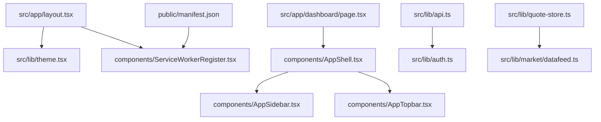
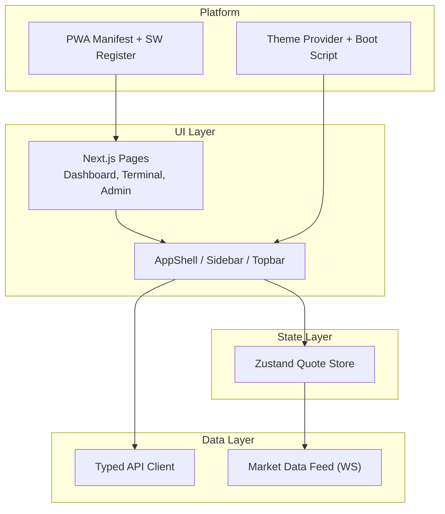
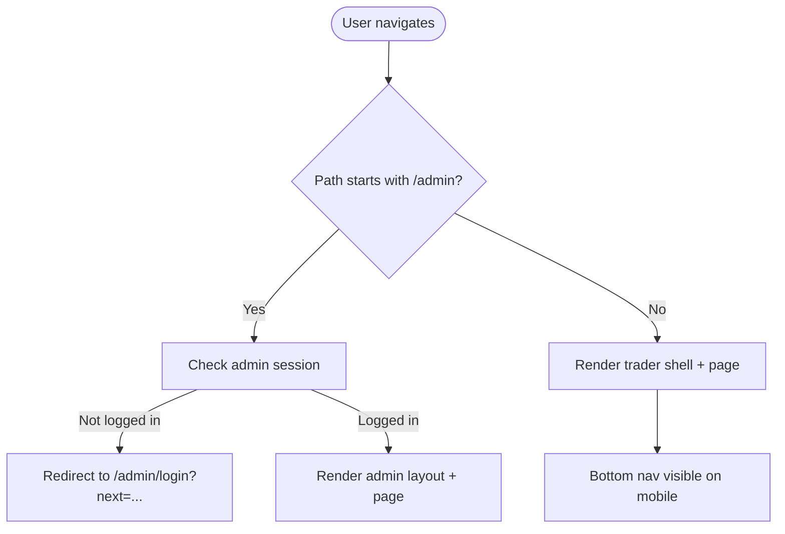
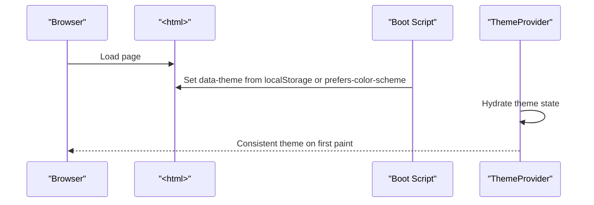
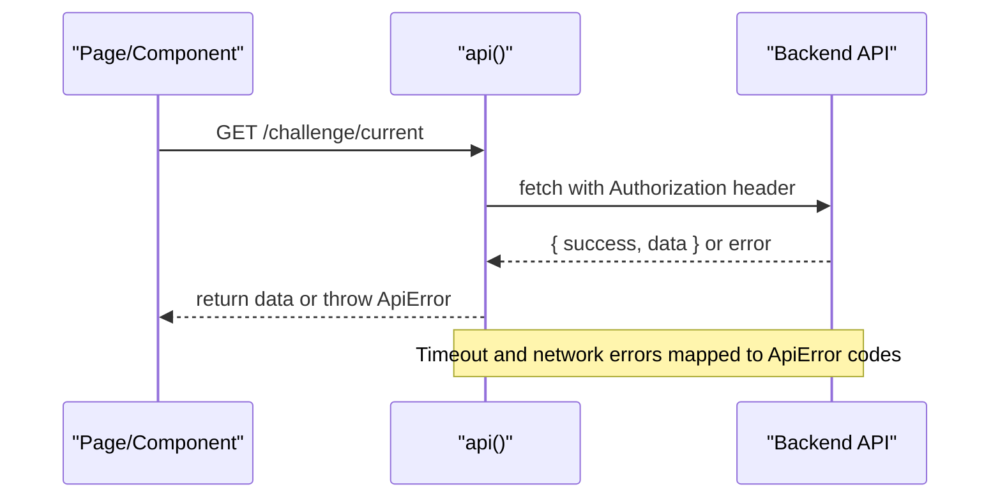
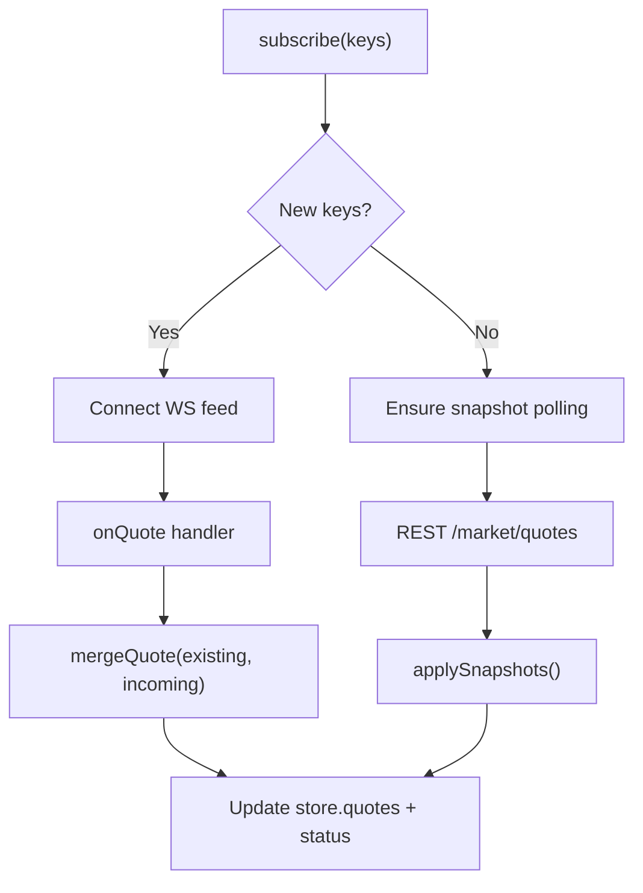
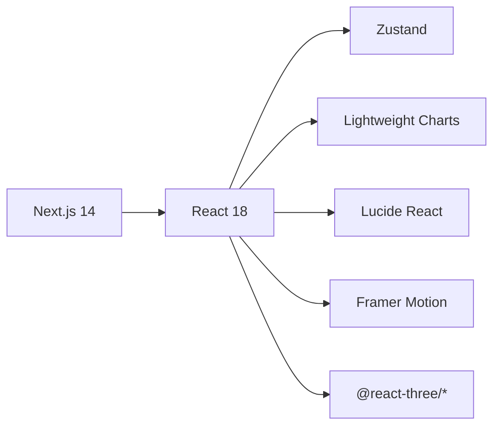

# Frontend Application

<cite>
**Referenced Files in This Document**
- [package.json](file://frontend/trader/package.json)
- [next.config.mjs](file://frontend/trader/next.config.mjs)
- [layout.tsx](file://frontend/trader/src/app/layout.tsx)
- [theme.tsx](file://frontend/trader/src/lib/theme.tsx)
- [api.ts](file://frontend/trader/src/lib/api.ts)
- [types.ts](file://frontend/trader/src/lib/types.ts)
- [quote-store.ts](file://frontend/trader/src/lib/quote-store.ts)
- [AppShell.tsx](file://frontend/trader/src/components/AppShell.tsx)
- [AppSidebar.tsx](file://frontend/trader/src/components/AppSidebar.tsx)
- [AppTopbar.tsx](file://frontend/trader/src/components/AppTopbar.tsx)
- [ServiceWorkerRegister.tsx](file://frontend/trader/src/components/ServiceWorkerRegister.tsx)
- [manifest.json](file://frontend/trader/public/manifest.json)
- [dashboard/page.tsx](file://frontend/trader/src/app/dashboard/page.tsx)
- [terminal/page.tsx](file://frontend/trader/src/app/terminal/page.tsx)
- [admin/layout.tsx](file://frontend/trader/src/app/admin/layout.tsx)
- [nav.tsx](file://frontend/trader/src/lib/nav.tsx)
- [globals.css](file://frontend/trader/src/styles/globals.css)
</cite>

## Table of Contents
1. Introduction
2. Project Structure
3. Core Components
4. Architecture Overview
5. Detailed Component Analysis
6. Dependency Analysis
7. Performance Considerations
8. Troubleshooting Guide
9. Conclusion

## Introduction
This document describes the Next.js 14 frontend application for a paper trading platform. It covers the app router structure, React component architecture with TypeScript, state management using Zustand, API client behavior, and the institutional-modern UI design system with light/dark themes. It also explains routing strategies, performance optimizations, PWA capabilities via service worker, and integration with real-time market data through WebSocket streams. The documentation includes the trading terminal interface, dashboard components, administrative panels, and user experience flows.

## Project Structure
The frontend is organized as a Next.js 14 App Router project under frontend/trader:
- Pages are defined under src/app with route groups (for example, admin and funded).
- Shared UI components live under src/components.
- Client-side state and utilities are under src/lib.
- Global styles and theming are under src/styles.
- Public assets include PWA manifest and icons.

**Diagram sources**
- [layout.tsx:1-56](file://frontend/trader/src/app/layout.tsx#L1-L56)
- [theme.tsx:1-55](file://frontend/trader/src/lib/theme.tsx#L1-L55)
- [ServiceWorkerRegister.tsx:1-16](file://frontend/trader/src/components/ServiceWorkerRegister.tsx#L1-L16)
- [dashboard/page.tsx:1-136](file://frontend/trader/src/app/dashboard/page.tsx#L1-L136)
- [AppShell.tsx:1-60](file://frontend/trader/src/components/AppShell.tsx#L1-L60)
- [AppSidebar.tsx:1-118](file://frontend/trader/src/components/AppSidebar.tsx#L1-L118)
- [AppTopbar.tsx:1-184](file://frontend/trader/src/components/AppTopbar.tsx#L1-L184)
- [api.ts:1-148](file://frontend/trader/src/lib/api.ts#L1-L148)
- [manifest.json:1-32](file://frontend/trader/public/manifest.json#L1-L32)

**Section sources**
- [package.json:1-31](file://frontend/trader/package.json#L1-L31)
- [next.config.mjs:1-19](file://frontend/trader/next.config.mjs#L1-L19)
- [layout.tsx:1-56](file://frontend/trader/src/app/layout.tsx#L1-L56)

## Core Components
- Root layout and PWA setup: The root layout injects metadata, theme provider, and service worker registration. It sets up PWA manifest and Apple web app meta tags.
- Theme system: A client-only theme context provides light/dark modes with early boot script to avoid flash on load and persists preference to localStorage.
- Shell chrome: AppShell composes sidebar, topbar, content area, bottom navigation, and PWA install prompt. It handles sidebar collapse state and integrates auth gating.
- Sidebar and navigation: AppSidebar renders primary navigation based on a centralized nav config, supports collapsed mode, and exposes sign-out flow.
- Topbar: AppTopbar displays market indices from the quote store and a notifications panel.
- Dashboard page: Composes stat cards, equity chart, challenge progress, and positions table; subscribes to quotes and fetches challenge data.
- Admin layout: Guards admin routes by checking session and redirects unauthenticated users to login.

**Section sources**
- [layout.tsx:1-56](file://frontend/trader/src/app/layout.tsx#L1-L56)
- [theme.tsx:1-55](file://frontend/trader/src/lib/theme.tsx#L1-L55)
- [AppShell.tsx:1-60](file://frontend/trader/src/components/AppShell.tsx#L1-L60)
- [AppSidebar.tsx:1-118](file://frontend/trader/src/components/AppSidebar.tsx#L1-L118)
- [AppTopbar.tsx:1-184](file://frontend/trader/src/components/AppTopbar.tsx#L1-L184)
- [dashboard/page.tsx:1-136](file://frontend/trader/src/app/dashboard/page.tsx#L1-L136)
- [admin/layout.tsx:1-46](file://frontend/trader/src/app/admin/layout.tsx#L1-L46)

## Architecture Overview
The application follows a layered approach:
- Presentation layer: Next.js pages and React components render UI and handle user interactions.
- State layer: Zustand stores manage global client state such as quotes and subscriptions.
- Data layer: A typed API client wraps fetch calls, attaches tokens, handles timeouts, and normalizes errors.
- Real-time layer: Market data feed connects via WebSocket and merges ticks into the quote store; REST snapshots backfill when needed.
- Theming and UX: CSS variables define an institutional-modern palette with light/dark support; global styles provide primitives and responsive behaviors.

**Diagram sources**
- [dashboard/page.tsx:1-136](file://frontend/trader/src/app/dashboard/page.tsx#L1-L136)
- [AppShell.tsx:1-60](file://frontend/trader/src/components/AppShell.tsx#L1-L60)
- [quote-store.ts:1-151](file://frontend/trader/src/lib/quote-store.ts#L1-L151)
- [api.ts:1-148](file://frontend/trader/src/lib/api.ts#L1-L148)
- [theme.tsx:1-55](file://frontend/trader/src/lib/theme.tsx#L1-L55)
- [ServiceWorkerRegister.tsx:1-16](file://frontend/trader/src/components/ServiceWorkerRegister.tsx#L1-L16)
- [manifest.json:1-32](file://frontend/trader/public/manifest.json#L1-L32)

## Detailed Component Analysis

### App Router and Routing Strategy
- Root layout defines metadata, viewport, and PWA settings; it mounts the theme provider and service worker register.
- Route groups:
  - /admin uses a dedicated layout that enforces admin session checks before rendering content.
  - /terminal redirects to /watchlist for legacy compatibility.
- Navigation configuration centralizes routes and active-state logic for both desktop sidebar and mobile bottom tabs.

**Diagram sources**
- [admin/layout.tsx:1-46](file://frontend/trader/src/app/admin/layout.tsx#L1-L46)
- [terminal/page.tsx:1-11](file://frontend/trader/src/app/terminal/page.tsx#L1-L11)
- [nav.tsx:1-55](file://frontend/trader/src/lib/nav.tsx#L1-L55)

**Section sources**
- [layout.tsx:1-56](file://frontend/trader/src/app/layout.tsx#L1-L56)
- [admin/layout.tsx:1-46](file://frontend/trader/src/app/admin/layout.tsx#L1-L46)
- [terminal/page.tsx:1-11](file://frontend/trader/src/app/terminal/page.tsx#L1-L11)
- [nav.tsx:1-55](file://frontend/trader/src/lib/nav.tsx#L1-L55)

### Theme System and Accessibility
- ThemeProvider initializes theme early via a boot script to prevent flash, then hydrates React state. It persists selection to localStorage and respects system preference.
- CSS variables define semantic colors for gains/losses, brand accents, surfaces, and text across light and dark modes.
- Accessibility features include focus-visible outlines, aria attributes on interactive elements, and reduced-motion media query handling.

**Diagram sources**
- [theme.tsx:1-55](file://frontend/trader/src/lib/theme.tsx#L1-L55)
- [globals.css:1-183](file://frontend/trader/src/styles/globals.css#L1-L183)

**Section sources**
- [theme.tsx:1-55](file://frontend/trader/src/lib/theme.tsx#L1-L55)
- [globals.css:1-183](file://frontend/trader/src/styles/globals.css#L1-L183)

### API Client Implementation
- Centralized api function attaches Bearer token from session, merges headers, applies per-route timeouts, and unwraps envelope responses.
- On 401, it clears sessions and redirects to appropriate login flows (trader vs admin).
- Errors are normalized into a typed ApiError with code, message, status, and optional details. Network and timeout errors are handled distinctly.

**Diagram sources**
- [api.ts:1-148](file://frontend/trader/src/lib/api.ts#L1-L148)

**Section sources**
- [api.ts:1-148](file://frontend/trader/src/lib/api.ts#L1-L148)

### Real-Time Market Data Integration
- Quote store manages quotes map, subscription set, status, and market open flag.
- subscribe(keys) ensures snapshot polling and WebSocket connection via getDataFeed(). It merges incoming ticks with existing quotes, preferring REST snapshots when market is closed.
- Status transitions: idle → connecting → live/snapshot/error; periodic market status checks keep state accurate.

**Diagram sources**
- [quote-store.ts:1-151](file://frontend/trader/src/lib/quote-store.ts#L1-L151)

**Section sources**
- [quote-store.ts:1-151](file://frontend/trader/src/lib/quote-store.ts#L1-L151)

### Trading Terminal Interface
- Legacy /terminal route redirects to /watchlist to unify terminal access.
- Watchlist-based terminal leverages the quote store for live prices and integrates with order and position panels elsewhere in the app.

**Section sources**
- [terminal/page.tsx:1-11](file://frontend/trader/src/app/terminal/page.tsx#L1-L11)

### Dashboard Components
- Dashboard page composes stat cards, equity curve chart, challenge progress card, and positions table.
- Subscribes to demo instruments and positions for live updates; fetches current challenge data via API; computes derived metrics like available margin.

**Section sources**
- [dashboard/page.tsx:1-136](file://frontend/trader/src/app/dashboard/page.tsx#L1-L136)

### Administrative Panels
- Admin layout guards all /admin routes by verifying admin session; redirects to login with next parameter if not authenticated.
- Provides a consistent admin shell with sidebar and main content area.

**Section sources**
- [admin/layout.tsx:1-46](file://frontend/trader/src/app/admin/layout.tsx#L1-L46)

### User Experience Flows
- Sign out: Sidebar triggers session clear and navigates to login.
- Notifications: Topbar toggles a panel with demo notifications; accessible via aria-expanded and role="dialog".
- Mobile navigation: Bottom nav shows primary tabs; More menu exposes additional actions including sign out.

**Section sources**
- [AppSidebar.tsx:1-118](file://frontend/trader/src/components/AppSidebar.tsx#L1-L118)
- [AppTopbar.tsx:1-184](file://frontend/trader/src/components/AppTopbar.tsx#L1-L184)
- [nav.tsx:1-55](file://frontend/trader/src/lib/nav.tsx#L1-L55)

## Dependency Analysis
Key dependencies and their roles:
- Next.js 14 with standalone output for efficient deployment.
- React 18 with hooks for UI composition and lifecycle.
- Zustand for lightweight global state (quotes, subscriptions).
- Lightweight charts for visualizations.
- Lucide-react for iconography.
- Framer Motion and Three.js/Fiber/Drei for advanced animations and 3D visuals where used.

**Diagram sources**
- [package.json:1-31](file://frontend/trader/package.json#L1-L31)

**Section sources**
- [package.json:1-31](file://frontend/trader/package.json#L1-L31)

## Performance Considerations
- Early theme application via boot script prevents layout shift and flash on load.
- Sidebar collapse state persisted to DOM attribute and localStorage avoids reflow on reload.
- API timeouts are adaptive: default 15 seconds, extended for instrument sync endpoints to accommodate large downloads.
- Quote merging minimizes re-renders by only updating changed quotes; snapshot polling frequency adapts to market open/closed state.
- Next.js standalone output reduces bundle size for Node hosting environments.
- CSS variables and minimal reflows ensure smooth theme switching and responsive layouts.

[No sources needed since this section provides general guidance]

## Troubleshooting Guide
Common issues and resolutions:
- Authentication failures:
  - 401 responses trigger session clearing and redirect to appropriate login (trader or admin). Friendly messages guide users to sign in again.
- Timeouts:
  - Instrument sync and similar long-running operations use extended timeouts; if they fail, retry on stable connections.
- Network errors:
  - Ensure backend is reachable at the configured origin; dev proxy rewrites /api/* to backend during development.
- Service Worker registration:
  - Non-fatal if registration fails; app continues to work without offline capabilities.

**Section sources**
- [api.ts:1-148](file://frontend/trader/src/lib/api.ts#L1-L148)
- [next.config.mjs:1-19](file://frontend/trader/next.config.mjs#L1-L19)
- [ServiceWorkerRegister.tsx:1-16](file://frontend/trader/src/components/ServiceWorkerRegister.tsx#L1-L16)

## Conclusion
The frontend combines a robust Next.js 14 app router with a clean React component architecture, Zustand-driven state for real-time data, and a typed API client for reliable communication. The institutional-modern design system delivers accessible, responsive interfaces with seamless light/dark themes. Real-time market data integration via WebSocket and REST snapshots ensures traders see accurate, timely information. PWA support enables installability and improved user experience. The modular structure and thoughtful routing strategy make the application maintainable and scalable for both trader and admin workflows.