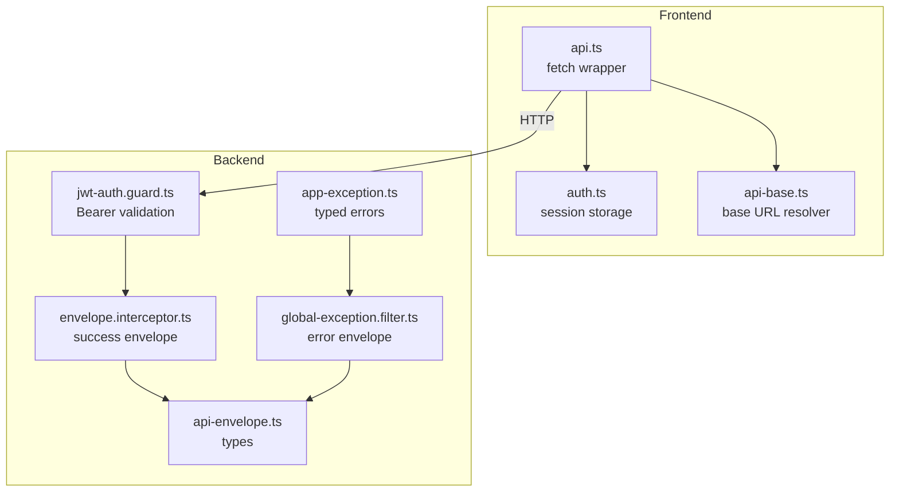
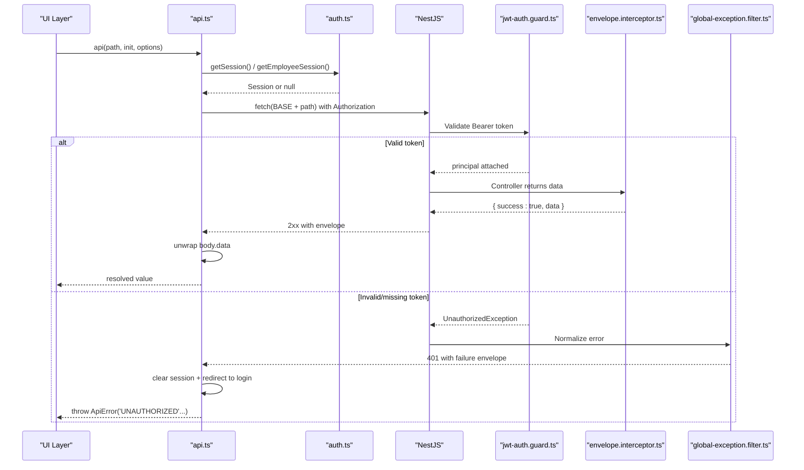
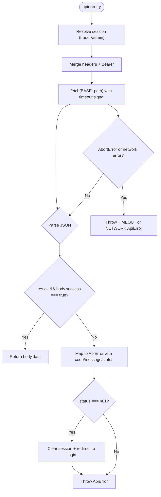
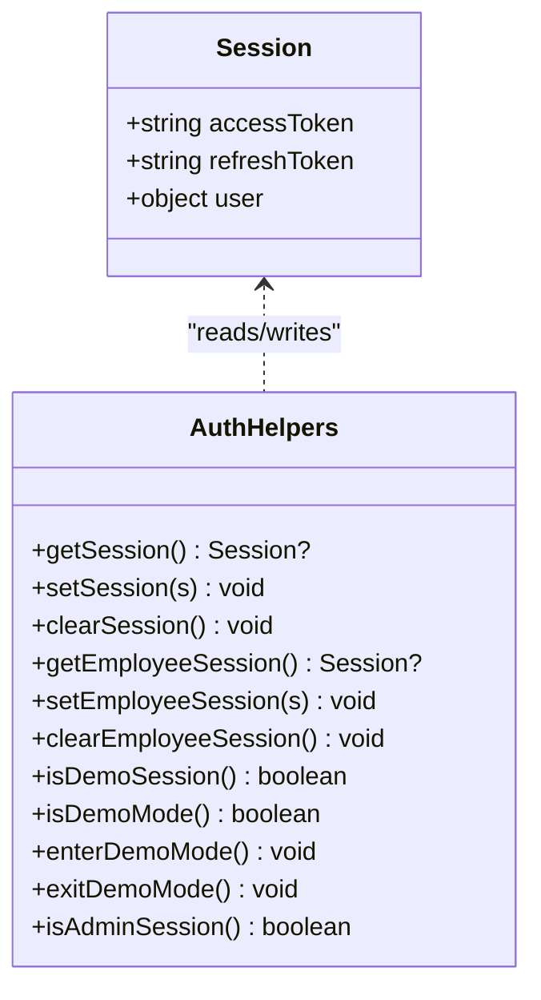
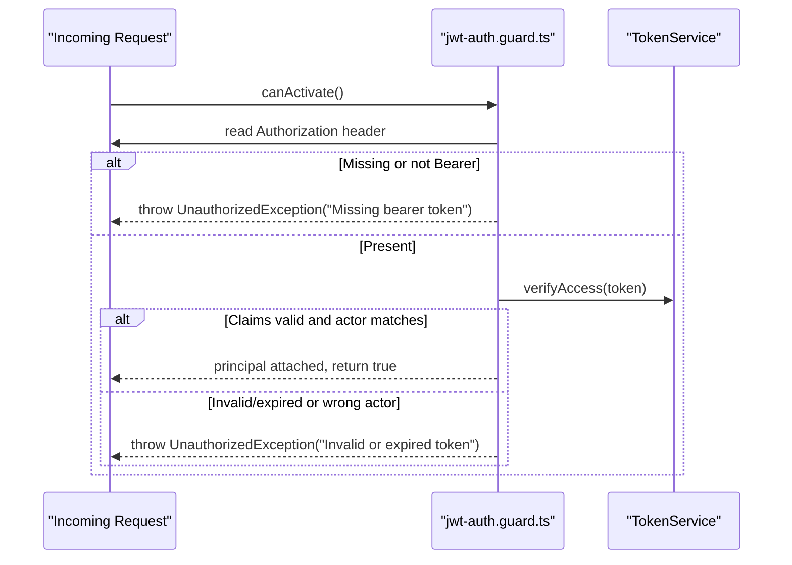
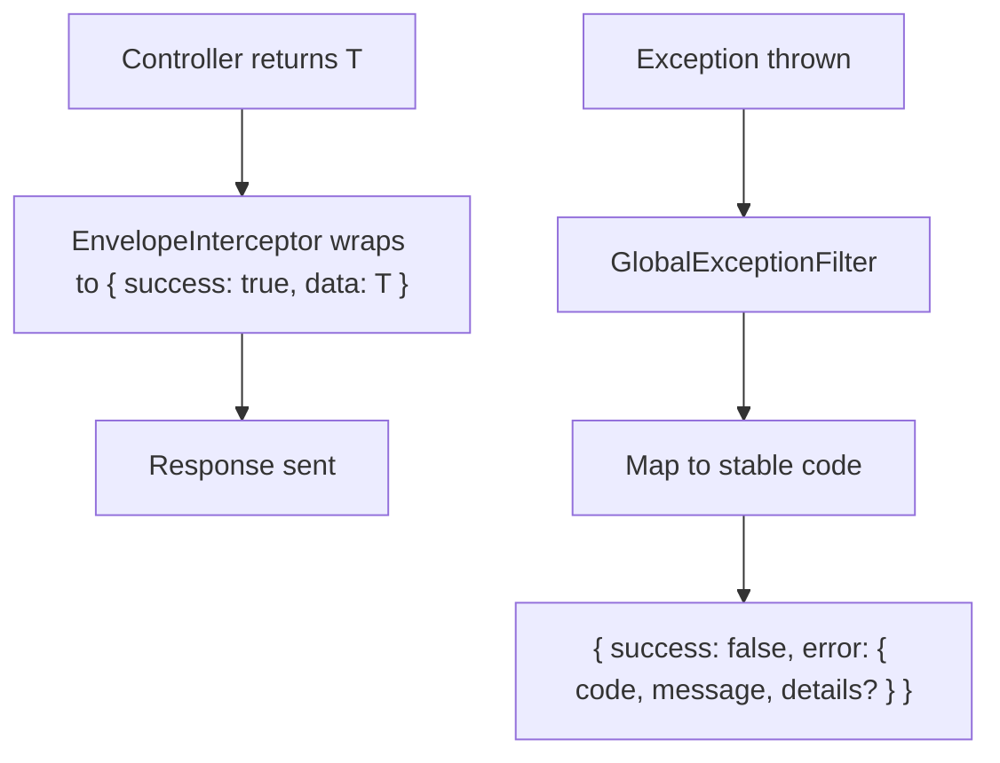
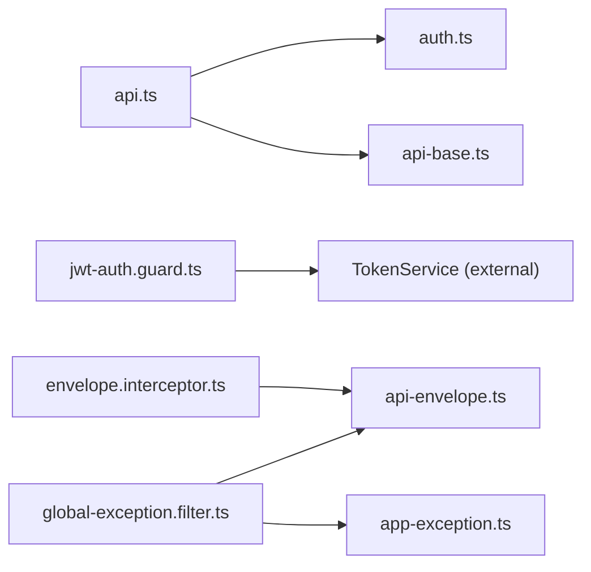

# API Client & Request Handling

<cite>
**Referenced Files in This Document**
- [api.ts](file://frontend/trader/src/lib/api.ts)
- [auth.ts](file://frontend/trader/src/lib/auth.ts)
- [api-base.ts](file://frontend/trader/src/lib/api-base.ts)
- [jwt-auth.guard.ts](file://backend/apps/api/src/modules/auth/presentation/jwt-auth.guard.ts)
- [global-exception.filter.ts](file://backend/libs/shared/src/http/global-exception.filter.ts)
- [envelope.interceptor.ts](file://backend/libs/shared/src/http/envelope.interceptor.ts)
- [api-envelope.ts](file://backend/libs/shared/src/http/api-envelope.ts)
- [app-exception.ts](file://backend/libs/shared/src/http/app-exception.ts)
</cite>

## Table of Contents
1. [Introduction](#introduction)
2. [Project Structure](#project-structure)
3. [Core Components](#core-components)
4. [Architecture Overview](#architecture-overview)
5. [Detailed Component Analysis](#detailed-component-analysis)
6. [Dependency Analysis](#dependency-analysis)
7. [Performance Considerations](#performance-considerations)
8. [Troubleshooting Guide](#troubleshooting-guide)
9. [Conclusion](#conclusion)
10. [Appendices](#appendices)

## Introduction
This document explains the end-to-end API client implementation used by the frontend to communicate with the backend. It covers HTTP request/response handling, authentication integration (Bearer tokens and session management), error management, timeouts, and response envelope unwrapping. It also clarifies how requests are intercepted on both sides, how errors are normalized, and how to implement custom interceptors or extend behavior such as retry mechanisms and request queuing.

## Project Structure
The API client spans two layers:
- Frontend client: a thin fetch-based client that attaches Bearer tokens, enforces timeouts, normalizes responses, and handles auth redirects.
- Backend server: NestJS modules that validate tokens via guards, wrap successful responses into a standard envelope, and convert all exceptions into a consistent failure envelope.

**Diagram sources**
- [api.ts:1-148](file://frontend/trader/src/lib/api.ts#L1-L148)
- [auth.ts:1-266](file://frontend/trader/src/lib/auth.ts#L1-L266)
- [api-base.ts:1-13](file://frontend/trader/src/lib/api-base.ts#L1-L13)
- [jwt-auth.guard.ts:1-34](file://backend/apps/api/src/modules/auth/presentation/jwt-auth.guard.ts#L1-L34)
- [envelope.interceptor.ts:1-12](file://backend/libs/shared/src/http/envelope.interceptor.ts#L1-L12)
- [global-exception.filter.ts:1-91](file://backend/libs/shared/src/http/global-exception.filter.ts#L1-L91)
- [api-envelope.ts:1-16](file://backend/libs/shared/src/http/api-envelope.ts#L1-L16)
- [app-exception.ts:1-19](file://backend/libs/shared/src/http/app-exception.ts#L1-L19)

**Section sources**
- [api.ts:1-148](file://frontend/trader/src/lib/api.ts#L1-L148)
- [auth.ts:1-266](file://frontend/trader/src/lib/auth.ts#L1-L266)
- [api-base.ts:1-13](file://frontend/trader/src/lib/api-base.ts#L1-L13)
- [jwt-auth.guard.ts:1-34](file://backend/apps/api/src/modules/auth/presentation/jwt-auth.guard.ts#L1-L34)
- [envelope.interceptor.ts:1-12](file://backend/libs/shared/src/http/envelope.interceptor.ts#L1-L12)
- [global-exception.filter.ts:1-91](file://backend/libs/shared/src/http/global-exception.filter.ts#L1-L91)
- [api-envelope.ts:1-16](file://backend/libs/shared/src/http/api-envelope.ts#L1-L16)
- [app-exception.ts:1-19](file://backend/libs/shared/src/http/app-exception.ts#L1-L19)

## Core Components
- Frontend API client (api.ts): Centralized fetch wrapper that:
  - Resolves base URL from environment or defaults to same-origin path.
  - Attaches Bearer token from the appropriate session (trader vs admin).
  - Enforces per-request timeouts with AbortController.
  - Unwraps success envelopes and throws typed ApiError for failures.
  - Redirects to login when receiving 401 Unauthorized.
- Session management (auth.ts): Stores and retrieves trader and employee sessions, supports demo mode, and exposes helpers to check session validity.
- Backend authentication guard (jwt-auth.guard.ts): Validates Authorization header, verifies JWT claims, and rejects invalid/expired tokens with standardized messages.
- Response envelope (envelope.interceptor.ts + api-envelope.ts): Wraps controller outputs into { success: true, data } and defines success/failure types.
- Error normalization (global-exception.filter.ts + app-exception.ts): Converts all exceptions into a consistent failure envelope with stable codes and messages.

**Section sources**
- [api.ts:1-148](file://frontend/trader/src/lib/api.ts#L1-L148)
- [auth.ts:1-266](file://frontend/trader/src/lib/auth.ts#L1-L266)
- [jwt-auth.guard.ts:1-34](file://backend/apps/api/src/modules/auth/presentation/jwt-auth.guard.ts#L1-L34)
- [envelope.interceptor.ts:1-12](file://backend/libs/shared/src/http/envelope.interceptor.ts#L1-L12)
- [api-envelope.ts:1-16](file://backend/libs/shared/src/http/api-envelope.ts#L1-L16)
- [global-exception.filter.ts:1-91](file://backend/libs/shared/src/http/global-exception.filter.ts#L1-L91)
- [app-exception.ts:1-19](file://backend/libs/shared/src/http/app-exception.ts#L1-L19)

## Architecture Overview
The client-server flow ensures consistent authentication, predictable responses, and robust error handling.

**Diagram sources**
- [api.ts:89-145](file://frontend/trader/src/lib/api.ts#L89-L145)
- [auth.ts:32-64](file://frontend/trader/src/lib/auth.ts#L32-L64)
- [jwt-auth.guard.ts:10-33](file://backend/apps/api/src/modules/auth/presentation/jwt-auth.guard.ts#L10-L33)
- [envelope.interceptor.ts:5-11](file://backend/libs/shared/src/http/envelope.interceptor.ts#L5-L11)
- [global-exception.filter.ts:18-68](file://backend/libs/shared/src/http/global-exception.filter.ts#L18-L68)

## Detailed Component Analysis

### Frontend API Client (api.ts)
Responsibilities:
- Base URL resolution via apiBase().
- Header merging with persistent Bearer token attachment last to prevent overwriting.
- Timeouts using AbortController; long-running sync endpoints use extended timeouts.
- Response unwrapping: expects { success: true, data } on success; otherwise throws ApiError with code, message, status, and optional details.
- Authentication handling: on 401, clears session and redirects to appropriate login page based on route context.
- Network error handling: converts network failures and aborts into typed ApiError instances.

Key behaviors:
- Admin vs trader routes: selects the correct session store and redirect target.
- Friendly messages: maps backend messages to user-friendly prompts for missing/expired tokens.
- Timeout messaging: provides specific guidance for instrument sync timeouts.

**Diagram sources**
- [api.ts:73-145](file://frontend/trader/src/lib/api.ts#L73-L145)

**Section sources**
- [api.ts:1-148](file://frontend/trader/src/lib/api.ts#L1-L148)

### Session Management (auth.ts)
Responsibilities:
- Store and retrieve separate sessions for traders and employees/admins.
- Validate access tokens using simple heuristics (JWT-like structure and non-demo tokens).
- Support demo mode flags and migration from legacy keys.
- Provide login functions for trader and admin flows without relying on the authenticated client.

Key behaviors:
- Separate localStorage keys for trader and employee sessions.
- Migration helper to move legacy admin sessions to new keys.
- Demo mode detection and toggling.

**Diagram sources**
- [auth.ts:5-148](file://frontend/trader/src/lib/auth.ts#L5-L148)

**Section sources**
- [auth.ts:1-266](file://frontend/trader/src/lib/auth.ts#L1-L266)

### Backend Authentication Guard (jwt-auth.guard.ts)
Responsibilities:
- Enforce presence of Authorization header starting with Bearer.
- Verify JWT access token and ensure actor matches expected kind (USER vs EMPLOYEE).
- Attach principal to request context on success.
- Throw UnauthorizedException with standardized messages on failure.

**Diagram sources**
- [jwt-auth.guard.ts:10-33](file://backend/apps/api/src/modules/auth/presentation/jwt-auth.guard.ts#L10-L33)

**Section sources**
- [jwt-auth.guard.ts:1-34](file://backend/apps/api/src/modules/auth/presentation/jwt-auth.guard.ts#L1-34)

### Response Envelope and Error Normalization
- Success envelope: All successful controller responses are wrapped into { success: true, data }.
- Failure envelope: Global exception filter converts HttpException and AppException into { success: false, error: { code, message, details? } }.
- Stable codes: HTTP statuses map to stable codes (e.g., 401 -> UNAUTHORIZED, 429 -> RATE_LIMITED).

**Diagram sources**
- [envelope.interceptor.ts:5-11](file://backend/libs/shared/src/http/envelope.interceptor.ts#L5-L11)
- [global-exception.filter.ts:18-68](file://backend/libs/shared/src/http/global-exception.filter.ts#L18-L68)
- [api-envelope.ts:1-16](file://backend/libs/shared/src/http/api-envelope.ts#L1-L16)
- [app-exception.ts:1-19](file://backend/libs/shared/src/http/app-exception.ts#L1-L19)

**Section sources**
- [envelope.interceptor.ts:1-12](file://backend/libs/shared/src/http/envelope.interceptor.ts#L1-L12)
- [global-exception.filter.ts:1-91](file://backend/libs/shared/src/http/global-exception.filter.ts#L1-L91)
- [api-envelope.ts:1-16](file://backend/libs/shared/src/http/api-envelope.ts#L1-L16)
- [app-exception.ts:1-19](file://backend/libs/shared/src/http/app-exception.ts#L1-L19)

## Dependency Analysis
- Frontend dependencies:
  - api.ts depends on auth.ts for session retrieval and on api-base.ts for base URL.
  - auth.ts is independent except for api-base usage in direct login/profile calls.
- Backend dependencies:
  - jwt-auth.guard.ts depends on TokenService (external) and domain types.
  - envelope.interceptor.ts depends on ApiSuccess type.
  - global-exception.filter.ts depends on AppException and ApiFailure types.

**Diagram sources**
- [api.ts:1-148](file://frontend/trader/src/lib/api.ts#L1-L148)
- [auth.ts:1-266](file://frontend/trader/src/lib/auth.ts#L1-L266)
- [api-base.ts:1-13](file://frontend/trader/src/lib/api-base.ts#L1-L13)
- [jwt-auth.guard.ts:1-34](file://backend/apps/api/src/modules/auth/presentation/jwt-auth.guard.ts#L1-L34)
- [envelope.interceptor.ts:1-12](file://backend/libs/shared/src/http/envelope.interceptor.ts#L1-L12)
- [global-exception.filter.ts:1-91](file://backend/libs/shared/src/http/global-exception.filter.ts#L1-L91)
- [api-envelope.ts:1-16](file://backend/libs/shared/src/http/api-envelope.ts#L1-L16)
- [app-exception.ts:1-19](file://backend/libs/shared/src/http/app-exception.ts#L1-L19)

**Section sources**
- [api.ts:1-148](file://frontend/trader/src/lib/api.ts#L1-L148)
- [auth.ts:1-266](file://frontend/trader/src/lib/auth.ts#L1-L266)
- [api-base.ts:1-13](file://frontend/trader/src/lib/api-base.ts#L1-L13)
- [jwt-auth.guard.ts:1-34](file://backend/apps/api/src/modules/auth/presentation/jwt-auth.guard.ts#L1-L34)
- [envelope.interceptor.ts:1-12](file://backend/libs/shared/src/http/envelope.interceptor.ts#L1-L12)
- [global-exception.filter.ts:1-91](file://backend/libs/shared/src/http/global-exception.filter.ts#L1-L91)
- [api-envelope.ts:1-16](file://backend/libs/shared/src/http/api-envelope.ts#L1-L16)
- [app-exception.ts:1-19](file://backend/libs/shared/src/http/app-exception.ts#L1-L19)

## Performance Considerations
- Timeouts: Default and extended timeouts reduce hanging requests; long-running operations like instrument sync use longer limits to avoid premature aborts.
- Same-origin proxy: Using same-origin /api/v1 avoids Next.js rewrite limits; explicit origins can be set for direct backend calls when needed.
- Minimal overhead: The client performs lightweight header merging and envelope unwrapping; no heavy serialization beyond JSON.
- Avoid redundant retries: Since automatic retries are not implemented, callers should design idempotent operations if they choose to retry at higher layers.

[No sources needed since this section provides general guidance]

## Troubleshooting Guide
Common issues and resolutions:
- 401 Unauthorized:
  - Cause: Missing or invalid/expired Bearer token.
  - Behavior: Frontend clears session and redirects to login; backend returns UNAUTHORIZED with friendly message.
  - Resolution: Re-authenticate; ensure session stores contain valid tokens.
- Network errors:
  - Cause: Backend unreachable or CORS/proxy misconfiguration.
  - Behavior: Frontend throws NETWORK ApiError with helpful message including base URL.
  - Resolution: Verify backend is running and accessible at configured BASE; check proxy settings.
- Timeouts:
  - Cause: Long-running operations exceed default timeout.
  - Behavior: Frontend throws TIMEOUT ApiError with specific guidance for sync endpoints.
  - Resolution: Use extended timeout option for long operations; ensure stable connection.
- Validation or business errors:
  - Cause: Backend returns structured errors via AppException or HttpException.
  - Behavior: Frontend receives failure envelope and throws ApiError with stable code and message.
  - Resolution: Inspect error.code and error.message; handle in UI accordingly.

**Section sources**
- [api.ts:67-145](file://frontend/trader/src/lib/api.ts#L67-L145)
- [jwt-auth.guard.ts:10-33](file://backend/apps/api/src/modules/auth/presentation/jwt-auth.guard.ts#L10-L33)
- [global-exception.filter.ts:18-91](file://backend/libs/shared/src/http/global-exception.filter.ts#L18-L91)

## Conclusion
The API client provides a robust, consistent interface for authenticated requests with clear error semantics and predictable response shapes. Authentication is enforced server-side via JWT guards, while the client manages sessions, timeouts, and user-friendly error states. The standardized envelope simplifies success/error handling across the application. For advanced needs like retries or request queuing, extend the client layer while preserving these contracts.

[No sources needed since this section summarizes without analyzing specific files]

## Appendices

### Examples and Usage Patterns

- Making an authenticated request:
  - Call the client with the desired path and options; it automatically attaches the Bearer token from the current session and unwraps the response data.
  - Reference: [api.ts:89-145](file://frontend/trader/src/lib/api.ts#L89-L145)

- Handling different response types:
  - The client returns body.data directly; callers should assert types locally after receiving the result.
  - Errors are thrown as ApiError with code, message, status, and optional details.
  - Reference: [api.ts:109-145](file://frontend/trader/src/lib/api.ts#L109-L145)

- Implementing custom interceptors:
  - Frontend: Wrap the api function or create a higher-order function to add logging, metrics, or retry logic around fetch calls.
  - Backend: Add NestJS interceptors to transform responses or logs; use the existing envelope interceptor as a pattern.
  - References:
    - [envelope.interceptor.ts:5-11](file://backend/libs/shared/src/http/envelope.interceptor.ts#L5-L11)
    - [api.ts:89-145](file://frontend/trader/src/lib/api.ts#L89-L145)

- Automatic token refresh:
  - Current implementation does not include automatic refresh; on 401, the client clears the session and redirects to login.
  - To add refresh, introduce a refresh flow before redirecting, then retry the original request once.
  - Reference: [api.ts:118-127](file://frontend/trader/src/lib/api.ts#L118-L127)

- Request queuing:
  - Not implemented in the client; consider adding a queue for concurrent or rate-limited operations at the caller level.
  - Reference: [api.ts:89-145](file://frontend/trader/src/lib/api.ts#L89-L145)

- Retry mechanisms:
  - Not built-in; implement retries in your own wrapper around the client with exponential backoff and jitter for resilience.
  - Reference: [api.ts:73-87](file://frontend/trader/src/lib/api.ts#L73-L87)