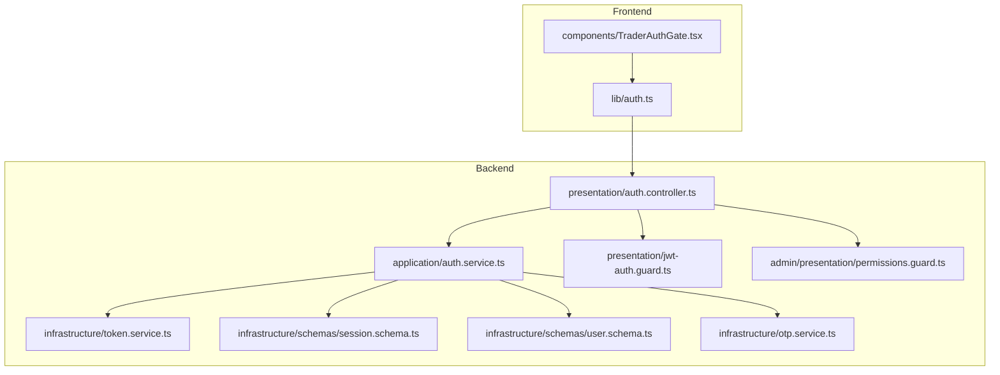
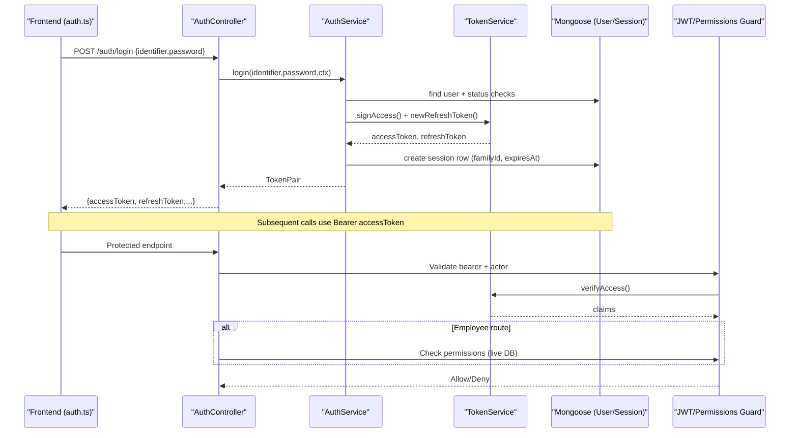
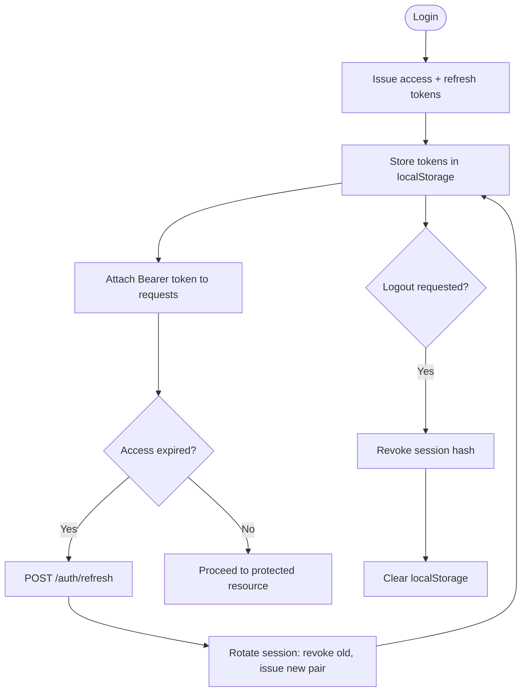
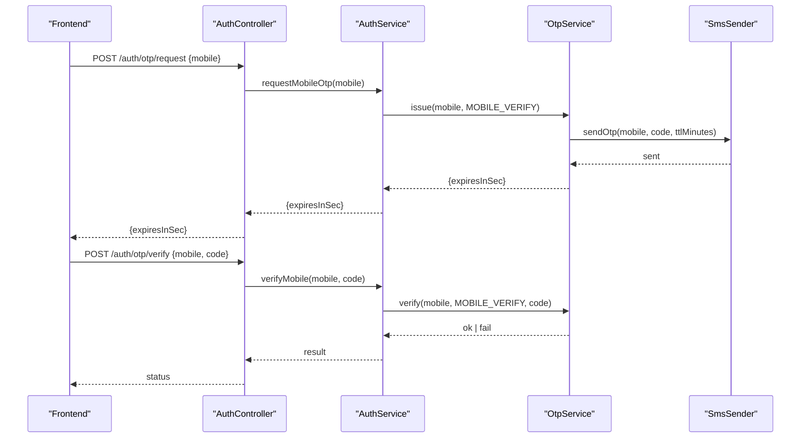
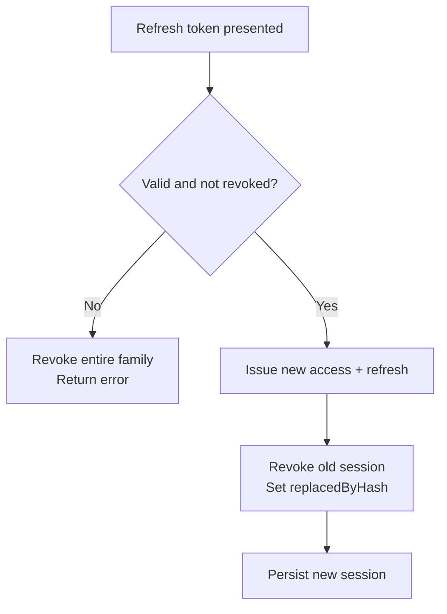
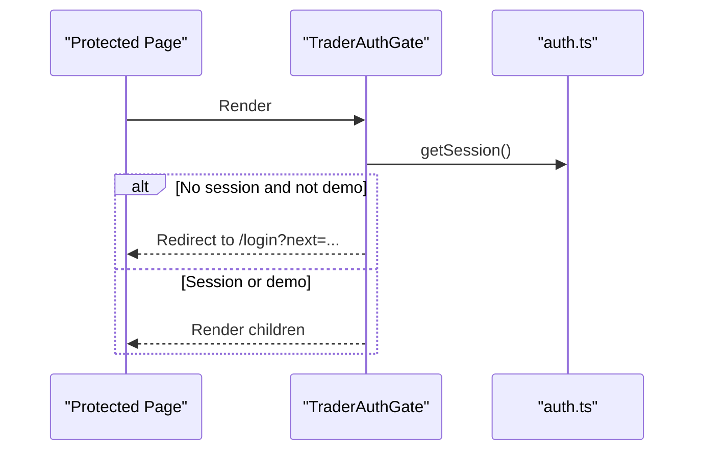
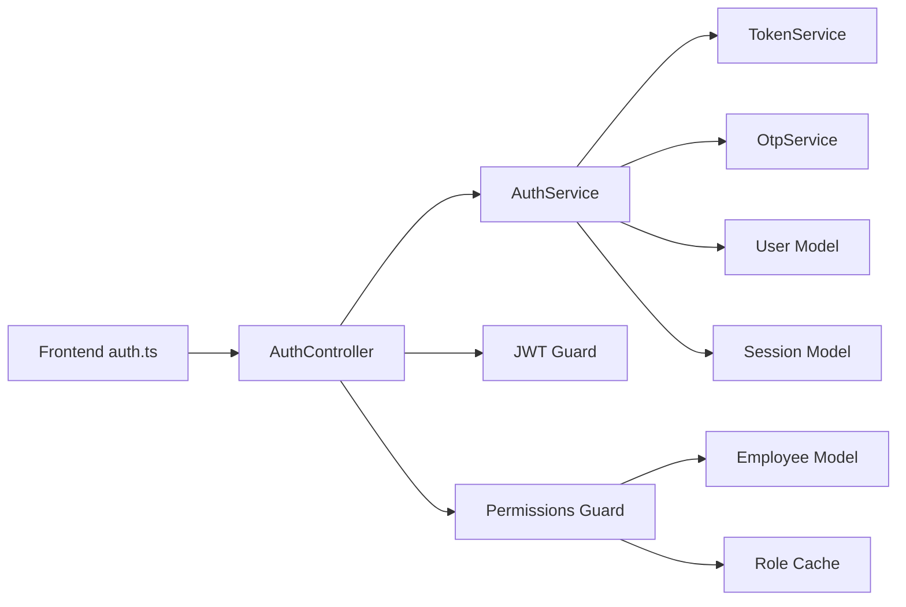

# Authentication State Management

<cite>
**Referenced Files in This Document**
- [auth.module.ts](file://backend/apps/api/src/modules/auth/auth.module.ts)
- [auth.controller.ts](file://backend/apps/api/src/modules/auth/presentation/auth.controller.ts)
- [jwt-auth.guard.ts](file://backend/apps/api/src/modules/auth/presentation/jwt-auth.guard.ts)
- [permissions.guard.ts](file://backend/apps/api/src/modules/admin/presentation/permissions.guard.ts)
- [auth.service.ts](file://backend/apps/api/src/modules/auth/application/auth.service.ts)
- [token.service.ts](file://backend/apps/api/src/modules/auth/infrastructure/token.service.ts)
- [session.schema.ts](file://backend/apps/api/src/modules/auth/infrastructure/schemas/session.schema.ts)
- [user.schema.ts](file://backend/apps/api/src/modules/auth/infrastructure/schemas/user.schema.ts)
- [auth.types.ts](file://backend/apps/api/src/modules/auth/domain/auth.types.ts)
- [permissions.ts](file://backend/apps/api/src/modules/admin/domain/permissions.ts)
- [otp.service.ts](file://backend/apps/api/src/modules/auth/infrastructure/otp.service.ts)
- [msg91-sms.sender.ts](file://backend/apps/api/src/modules/auth/infrastructure/sms/msg91-sms.sender.ts)
- [auth.ts](file://frontend/trader/src/lib/auth.ts)
- [TraderAuthGate.tsx](file://frontend/trader/src/components/TraderAuthGate.tsx)
</cite>

## Table of Contents
1. [Introduction](#introduction)
2. [Project Structure](#project-structure)
3. [Core Components](#core-components)
4. [Architecture Overview](#architecture-overview)
5. [Detailed Component Analysis](#detailed-component-analysis)
6. [Dependency Analysis](#dependency-analysis)
7. [Performance Considerations](#performance-considerations)
8. [Troubleshooting Guide](#troubleshooting-guide)
9. [Conclusion](#conclusion)
10. [Appendices](#appendices)

## Introduction
This document explains how authentication state is managed across the backend and frontend, focusing on user session handling, role-based access control (RBAC), protected routes, token storage strategies, and session persistence across page reloads. It also covers multi-factor authentication support via OTP, automatic logout mechanisms, session timeout handling, and security best practices. Examples are provided for protecting routes, checking permissions, and implementing custom authentication flows.

## Project Structure
The authentication system spans a NestJS backend module and a Next.js frontend:
- Backend: AuthModule wires controllers, services, JWT configuration, Mongoose schemas, OTP/SMS providers, and guards.
- Frontend: A client-side auth library manages sessions in localStorage, exposes login/register/profile APIs, and provides an auth gate component to protect pages.

**Diagram sources**
- [auth.controller.ts:53-138](file://backend/apps/api/src/modules/auth/presentation/auth.controller.ts#L53-L138)
- [auth.service.ts:28-346](file://backend/apps/api/src/modules/auth/application/auth.service.ts#L28-L346)
- [token.service.ts:20-90](file://backend/apps/api/src/modules/auth/infrastructure/token.service.ts#L20-L90)
- [session.schema.ts:9-47](file://backend/apps/api/src/modules/auth/infrastructure/schemas/session.schema.ts#L9-L47)
- [user.schema.ts:5-71](file://backend/apps/api/src/modules/auth/infrastructure/schemas/user.schema.ts#L5-L71)
- [jwt-auth.guard.ts:10-34](file://backend/apps/api/src/modules/auth/presentation/jwt-auth.guard.ts#L10-L34)
- [permissions.guard.ts:18-42](file://backend/apps/api/src/modules/admin/presentation/permissions.guard.ts#L18-L42)
- [otp.service.ts:15-76](file://backend/apps/api/src/modules/auth/infrastructure/otp.service.ts#L15-L76)
- [auth.ts:5-143](file://frontend/trader/src/lib/auth.ts#L5-L143)
- [TraderAuthGate.tsx:8-24](file://frontend/trader/src/components/TraderAuthGate.tsx#L8-L24)

**Section sources**
- [auth.module.ts:24-56](file://backend/apps/api/src/modules/auth/auth.module.ts#L24-L56)
- [auth.controller.ts:53-138](file://backend/apps/api/src/modules/auth/presentation/auth.controller.ts#L53-L138)
- [auth.ts:5-143](file://frontend/trader/src/lib/auth.ts#L5-L143)

## Core Components
- Session and Token Lifecycle:
  - Login issues short-lived access tokens and long-lived refresh tokens; refresh rotates sessions and revokes families on reuse.
  - Logout revokes the current session; logout-all revokes all active sessions for a user.
- RBAC and Guards:
  - JWT guard validates bearer tokens and enforces actor type (USER vs EMPLOYEE).
  - Permissions guard checks employee roles and per-user allow/deny overrides against a live database record.
- OTP/MFA Support:
  - OTP issuance with rate limits, cooldowns, TTL, and attempt caps; delivery via pluggable SMS provider.
- Frontend State:
  - Stores access/refresh tokens and user profile in localStorage; supports demo mode and separate admin session keys.
  - Provides login/register/profile helpers and an auth gate to protect routes.

**Section sources**
- [auth.service.ts:145-232](file://backend/apps/api/src/modules/auth/application/auth.service.ts#L145-L232)
- [token.service.ts:42-89](file://backend/apps/api/src/modules/auth/infrastructure/token.service.ts#L42-L89)
- [jwt-auth.guard.ts:10-34](file://backend/apps/api/src/modules/auth/presentation/jwt-auth.guard.ts#L10-L34)
- [permissions.guard.ts:18-42](file://backend/apps/api/src/modules/admin/presentation/permissions.guard.ts#L18-L42)
- [otp.service.ts:28-74](file://backend/apps/api/src/modules/auth/infrastructure/otp.service.ts#L28-L74)
- [auth.ts:32-143](file://frontend/trader/src/lib/auth.ts#L32-L143)

## Architecture Overview
The authentication flow uses RS256-signed JWTs for access tokens and opaque refresh tokens persisted as hashes. Sessions are tracked per refresh token with family rotation and theft detection. Admin endpoints enforce RBAC by reading live employee records and applying deny-wins logic.

**Diagram sources**
- [auth.controller.ts:86-107](file://backend/apps/api/src/modules/auth/presentation/auth.controller.ts#L86-L107)
- [auth.service.ts:145-216](file://backend/apps/api/src/modules/auth/application/auth.service.ts#L145-L216)
- [token.service.ts:42-58](file://backend/apps/api/src/modules/auth/infrastructure/token.service.ts#L42-L58)
- [session.schema.ts:9-47](file://backend/apps/api/src/modules/auth/infrastructure/schemas/session.schema.ts#L9-L47)
- [jwt-auth.guard.ts:10-34](file://backend/apps/api/src/modules/auth/presentation/jwt-auth.guard.ts#L10-L34)
- [permissions.guard.ts:18-42](file://backend/apps/api/src/modules/admin/presentation/permissions.guard.ts#L18-L42)

## Detailed Component Analysis

### User Session Handling and Token Storage
- Backend:
  - Access tokens: RS256 JWT with subject, actor, typ, optional roles; short TTL from config.
  - Refresh tokens: Opaque random strings hashed before storage; rotated on each refresh; revoked on reuse or explicit logout.
  - Sessions: One row per issued refresh token with principalId, actor, familyId, device/IP/User-Agent, expiry, and optional revoke/replaced-by tracking.
- Frontend:
  - Stores access/refresh tokens and user profile under dedicated localStorage keys; validates tokens before trusting them.
  - Separate keys for admin/employee sessions to isolate trader and admin contexts.
  - Demo mode flag allows browsing without JWT; exit clears demo flag.

**Diagram sources**
- [auth.service.ts:145-232](file://backend/apps/api/src/modules/auth/application/auth.service.ts#L145-L232)
- [token.service.ts:42-89](file://backend/apps/api/src/modules/auth/infrastructure/token.service.ts#L42-L89)
- [session.schema.ts:9-47](file://backend/apps/api/src/modules/auth/infrastructure/schemas/session.schema.ts#L9-L47)
- [auth.ts:32-143](file://frontend/trader/src/lib/auth.ts#L32-L143)

**Section sources**
- [auth.service.ts:145-232](file://backend/apps/api/src/modules/auth/application/auth.service.ts#L145-L232)
- [token.service.ts:42-89](file://backend/apps/api/src/modules/auth/infrastructure/token/service.ts#L42-L89)
- [session.schema.ts:9-47](file://backend/apps/api/src/modules/auth/infrastructure/schemas/session.schema.ts#L9-L47)
- [auth.ts:32-143](file://frontend/trader/src/lib/auth.ts#L32-L143)

### Role-Based Access Control and Protected Routes
- JWT Guard:
  - Validates Authorization header format, verifies RS256 access token, ensures actor matches expected kind, and attaches principal to request.
- Permissions Guard:
  - Runs after employee authentication; reads live employee record; resolves effective permissions using role cache and per-user allow/deny overrides; denies if insufficient.
- RBAC Model:
  - Central permission catalog with default roles; hasPermission implements deny-wins semantics.

```mermaid
classDiagram
class JwtAuthGuard {
+canActivate(context) bool
}
class PermissionsGuard {
+canActivate(context) Promise~bool~
}
class TokenService {
+verifyAccess(token) AccessTokenClaims
}
class EmployeeModel {
+findById(id) Employee
}
class PermissionEngine {
+hasPermission(subject, rolePermissions, required) bool
}
JwtAuthGuard --> TokenService : "verifies access token"
PermissionsGuard --> EmployeeModel : "reads live employee"
PermissionsGuard --> PermissionEngine : "evaluates permissions"
```

**Diagram sources**
- [jwt-auth.guard.ts:10-34](file://backend/apps/api/src/modules/auth/presentation/jwt-auth.guard.ts#L10-L34)
- [permissions.guard.ts:18-42](file://backend/apps/api/src/modules/admin/presentation/permissions.guard.ts#L18-L42)
- [token.service.ts:51-58](file://backend/apps/api/src/modules/auth/infrastructure/token.service.ts#L51-L58)
- [permissions.ts:30-65](file://backend/apps/api/src/modules/admin/domain/permissions.ts#L30-L65)

**Section sources**
- [jwt-auth.guard.ts:10-34](file://backend/apps/api/src/modules/auth/presentation/jwt-auth.guard.ts#L10-L34)
- [permissions.guard.ts:18-42](file://backend/apps/api/src/modules/admin/presentation/permissions.guard.ts#L18-L42)
- [permissions.ts:30-65](file://backend/apps/api/src/modules/admin/domain/permissions.ts#L30-L65)

### Multi-Factor Authentication (OTP) Flow
- OTP issuance enforces:
  - Max sends per hour, resend cooldown, TTL, max attempts per code.
  - Code stored as a peppered hash; delivery via pluggable SMS provider (console or MSG91).
- Verification consumes the OTP and marks it used; wrong attempts increment counters until lockout.

**Diagram sources**
- [auth.controller.ts:63-73](file://backend/apps/api/src/modules/auth/presentation/auth.controller.ts#L63-L73)
- [auth.service.ts:83-102](file://backend/apps/api/src/modules/auth/application/auth.service.ts#L83-L102)
- [otp.service.ts:28-74](file://backend/apps/api/src/modules/auth/infrastructure/otp.service.ts#L28-L74)
- [msg91-sms.sender.ts:20-34](file://backend/apps/api/src/modules/auth/infrastructure/sms/msg91-sms.sender.ts#L20-L34)

**Section sources**
- [otp.service.ts:28-74](file://backend/apps/api/src/modules/auth/infrastructure/otp.service.ts#L28-L74)
- [auth.controller.ts:63-73](file://backend/apps/api/src/modules/auth/presentation/auth.controller.ts#L63-L73)
- [auth.service.ts:83-102](file://backend/apps/api/src/modules/auth/application/auth.service.ts#L83-L102)
- [msg91-sms.sender.ts:20-34](file://backend/apps/api/src/modules/auth/infrastructure/sms/msg91-sms.sender.ts#L20-L34)

### Automatic Logout and Session Timeout Handling
- Explicit logout revokes the current session by marking revokedAt.
- Refresh rotation revokes the previous refresh token and updates replacedByHash.
- Reuse of a revoked/expired refresh token triggers family-wide revocation to mitigate token theft.
- Sessions have expiresAt; indexes include TTL expiration for cleanup.

**Diagram sources**
- [auth.service.ts:185-216](file://backend/apps/api/src/modules/auth/application/auth.service.ts#L185-L216)
- [session.schema.ts:9-47](file://backend/apps/api/src/modules/auth/infrastructure/schemas/session.schema.ts#L9-L47)

**Section sources**
- [auth.service.ts:185-232](file://backend/apps/api/src/modules/auth/application/auth.service.ts#L185-L232)
- [session.schema.ts:9-47](file://backend/apps/api/src/modules/auth/infrastructure/schemas/session.schema.ts#L9-L47)

### Frontend Route Protection and Custom Flows
- TraderAuthGate redirects unauthenticated users to login unless in demo mode.
- The auth library centralizes session read/write and exposes login/register/profile functions that call backend endpoints directly.
- Admin/employee sessions are isolated into separate localStorage keys and validated independently.

**Diagram sources**
- [TraderAuthGate.tsx:8-24](file://frontend/trader/src/components/TraderAuthGate.tsx#L8-L24)
- [auth.ts:32-143](file://frontend/trader/src/lib/auth.ts#L32-L143)

**Section sources**
- [TraderAuthGate.tsx:8-24](file://frontend/trader/src/components/TraderAuthGate.tsx#L8-L24)
- [auth.ts:32-143](file://frontend/trader/src/lib/auth.ts#L32-L143)

## Dependency Analysis
Key dependencies and coupling:
- AuthController depends on AuthService and guards; throttling protects sensitive endpoints.
- AuthService depends on TokenService, OTP service, and Mongoose models for users and sessions.
- TokenService relies on JWT service and app config for key material and TTLs.
- PermissionsGuard depends on live Employee model and role cache to evaluate permissions at request time.
- Frontend auth.ts depends on apiBase and performs direct fetch calls for login/register/profile.

**Diagram sources**
- [auth.controller.ts:53-138](file://backend/apps/api/src/modules/auth/presentation/auth.controller.ts#L53-L138)
- [auth.service.ts:28-346](file://backend/apps/api/src/modules/auth/application/auth.service.ts#L28-L346)
- [token.service.ts:20-90](file://backend/apps/api/src/modules/auth/infrastructure/token.service.ts#L20-L90)
- [otp.service.ts:15-76](file://backend/apps/api/src/modules/auth/infrastructure/otp.service.ts#L15-L76)
- [permissions.guard.ts:18-42](file://backend/apps/api/src/modules/admin/presentation/permissions.guard.ts#L18-L42)
- [auth.ts:180-266](file://frontend/trader/src/lib/auth.ts#L180-L266)

**Section sources**
- [auth.controller.ts:53-138](file://backend/apps/api/src/modules/auth/presentation/auth.controller.ts#L53-L138)
- [auth.service.ts:28-346](file://backend/apps/api/src/modules/auth/application/auth.service.ts#L28-L346)
- [permissions.guard.ts:18-42](file://backend/apps/api/src/modules/admin/presentation/permissions.guard.ts#L18-L42)
- [auth.ts:180-266](file://frontend/trader/src/lib/auth.ts#L180-L266)

## Performance Considerations
- Short-lived access tokens reduce exposure window; refresh rotation minimizes stale token usage.
- OTP rate limiting and cooldowns prevent abuse and reduce load on SMS providers.
- Live permission checks ensure correctness at the cost of DB reads; caching roles reduces repeated lookups.
- LocalStorage operations are synchronous and fast; validate tokens locally to avoid unnecessary network calls.

[No sources needed since this section provides general guidance]

## Troubleshooting Guide
Common issues and resolutions:
- Invalid or expired token: Ensure Bearer token is present and valid; handle 401 responses by refreshing or redirecting to login.
- Session revoked: Indicates reuse of a revoked/expired refresh token; force re-login.
- OTP errors: Respect cooldowns and attempt limits; request a new OTP when locked out.
- Insufficient permissions: Verify employee status and effective permissions; check deny overrides.

**Section sources**
- [jwt-auth.guard.ts:15-27](file://backend/apps/api/src/modules/auth/presentation/jwt-auth.guard.ts#L15-L27)
- [auth.controller.ts:25-51](file://backend/apps/api/src/modules/auth/presentation/auth.controller.ts#L25-L51)
- [auth.service.ts:185-232](file://backend/apps/api/src/modules/auth/application/auth.service.ts#L185-L232)
- [otp.service.ts:55-74](file://backend/apps/api/src/modules/auth/infrastructure/otp.service.ts#L55-L74)
- [permissions.guard.ts:26-40](file://backend/apps/api/src/modules/admin/presentation/permissions.guard.ts#L26-L40)

## Conclusion
The system implements robust authentication state management with secure token handling, session rotation, and strong RBAC enforcement. OTP-based MFA adds an extra layer of protection, while frontend gates and session utilities provide a smooth user experience. Following the recommended practices ensures resilience against token theft, unauthorized access, and abuse.

[No sources needed since this section summarizes without analyzing specific files]

## Appendices

### Protecting Routes and Checking Permissions
- Backend:
  - Apply JWT guard to require a valid access token and correct actor type.
  - For admin endpoints, apply permissions guard and decorate handlers with required permissions.
- Frontend:
  - Wrap protected pages with the auth gate to enforce login or demo mode.
  - Use the auth library to check session presence and navigate accordingly.

**Section sources**
- [jwt-auth.guard.ts:10-34](file://backend/apps/api/src/modules/auth/presentation/jwt-auth.guard.ts#L10-L34)
- [permissions.guard.ts:18-42](file://backend/apps/api/src/modules/admin/presentation/permissions.guard.ts#L18-L42)
- [TraderAuthGate.tsx:8-24](file://frontend/trader/src/components/TraderAuthGate.tsx#L8-L24)

### Implementing Custom Authentication Flows
- Extend login/registration flows by adding new DTOs and controller endpoints.
- Integrate additional MFA channels by implementing the SMS port and wiring it through OTP service.
- Add custom guards for fine-grained authorization beyond RBAC by combining JWT and permissions checks.

**Section sources**
- [auth.controller.ts:57-138](file://backend/apps/api/src/modules/auth/presentation/auth.controller.ts#L57-L138)
- [otp.service.ts:28-74](file://backend/apps/api/src/modules/auth/infrastructure/otp.service.ts#L28-L74)
- [msg91-sms.sender.ts:20-34](file://backend/apps/api/src/modules/auth/infrastructure/sms/msg91-sms.sender.ts#L20-L34)