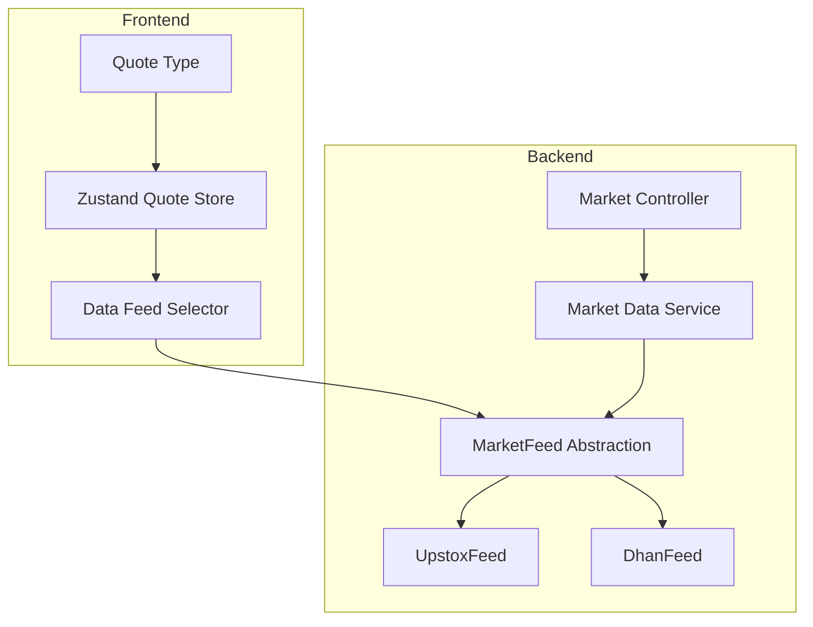
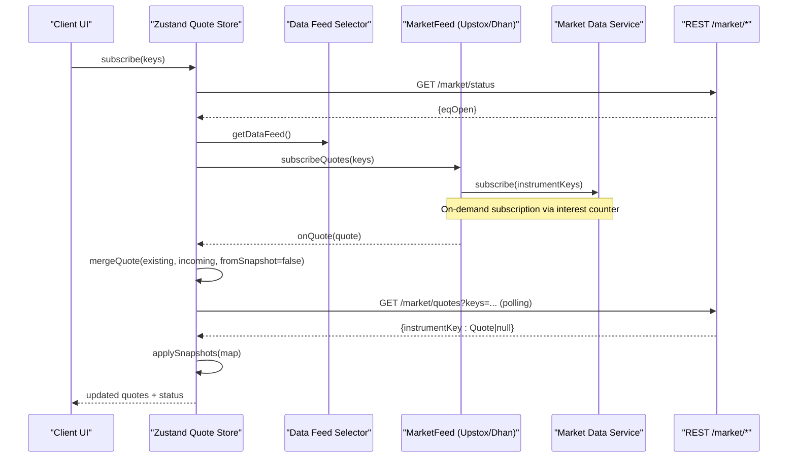
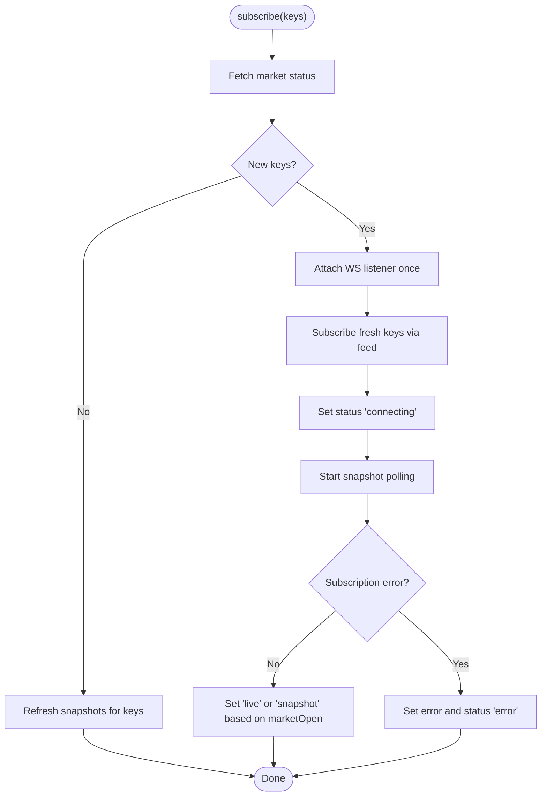
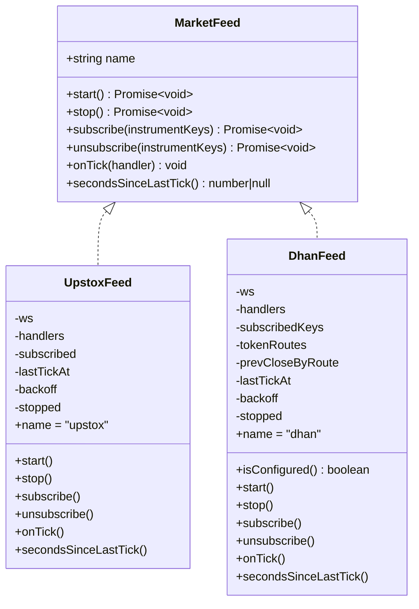
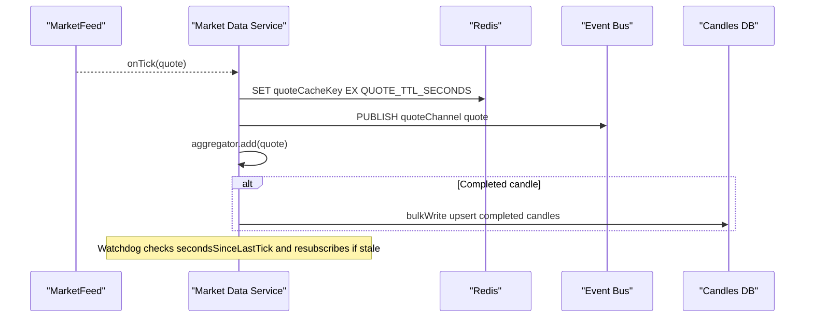
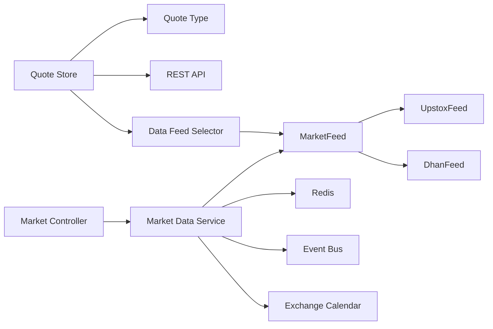

# Real-time Quote Store

<cite>
**Referenced Files in This Document**
- [quote-store.ts](file://frontend/trader/src/lib/quote-store.ts)
- [types.ts](file://frontend/trader/src/lib/types.ts)
- [market-feed.port.ts](file://backend/apps/api/src/modules/market/infrastructure/feed/market-feed.port.ts)
- [upstox-feed.ts](file://backend/apps/api/src/modules/market/infrastructure/feed/upstox-feed.ts)
- [dhan-feed.ts](file://backend/apps/api/src/modules/market/infrastructure/feed/dhan-feed.ts)
- [market-data.service.ts](file://backend/apps/api/src/modules/market/application/market-data.service.ts)
- [market.controller.ts](file://backend/apps/api/src/modules/market/presentation/market.controller.ts)
</cite>

## Table of Contents
1. [Introduction](#introduction)
2. [Project Structure](#project-structure)
3. [Core Components](#core-components)
4. [Architecture Overview](#architecture-overview)
5. [Detailed Component Analysis](#detailed-component-analysis)
6. [Dependency Analysis](#dependency-analysis)
7. [Performance Considerations](#performance-considerations)
8. [Troubleshooting Guide](#troubleshooting-guide)
9. [Conclusion](#conclusion)

## Introduction
This document explains the real-time quote store implemented with Zustand on the frontend and its integration with backend market data services. It covers:
- Quote state management using a client-side store
- WebSocket connection handling via a selectable data feed abstraction
- Market data synchronization strategies combining live ticks with REST snapshots
- Subscription management for instrument keys
- Market status detection and its effect on merge logic
- Error handling, retry behavior, and performance optimizations for high-frequency updates
- Practical examples for subscribing to quotes, handling updates, and managing connection states

## Project Structure
The real-time quote system spans the frontend store and backend market data pipeline:
- Frontend:
  - A Zustand store that maintains quotes, subscription set, error, status, and market open flag
  - A datafeed selector that provides a unified interface to upstream feeds
  - Types defining the Quote shape used across the app
- Backend:
  - A MarketFeed abstraction with concrete implementations (Upstox, Dhan)
  - A MarketDataService that owns the single feed instance, writes ticks to Redis, fans out events, aggregates candles, and monitors feed health
  - REST endpoints exposing market status and snapshot quotes

**Diagram sources**
- [quote-store.ts:1-151](file://frontend/trader/src/lib/quote-store.ts#L1-L151)
- [market-feed.port.ts:1-23](file://backend/apps/api/src/modules/market/infrastructure/feed/market-feed.port.ts#L1-L23)
- [upstox-feed.ts:1-136](file://backend/apps/api/src/modules/market/infrastructure/feed/upstox-feed.ts#L1-L136)
- [dhan-feed.ts:1-279](file://backend/apps/api/src/modules/market/infrastructure/feed/dhan-feed.ts#L1-L279)
- [market-data.service.ts:1-139](file://backend/apps/api/src/modules/market/application/market-data.service.ts#L1-L139)
- [market.controller.ts:1-76](file://backend/apps/api/src/modules/market/presentation/market.controller.ts#L1-L76)
- [types.ts:1-23](file://frontend/trader/src/lib/types.ts#L1-L23)

**Section sources**
- [quote-store.ts:1-151](file://frontend/trader/src/lib/quote-store.ts#L1-L151)
- [market-feed.port.ts:1-23](file://backend/apps/api/src/modules/market/infrastructure/feed/market-feed.port.ts#L1-L23)
- [upstox-feed.ts:1-136](file://backend/apps/api/src/modules/market/infrastructure/feed/upstox-feed.ts#L1-L136)
- [dhan-feed.ts:1-279](file://backend/apps/api/src/modules/market/infrastructure/feed/dhan-feed.ts#L1-L279)
- [market-data.service.ts:1-139](file://backend/apps/api/src/modules/market/application/market-data.service.ts#L1-L139)
- [market.controller.ts:1-76](file://backend/apps/api/src/modules/market/presentation/market.controller.ts#L1-L76)
- [types.ts:1-23](file://frontend/trader/src/lib/types.ts#L1-L23)

## Core Components
- Quote Store (Zustand): Holds quotes map, subscribed keys set, error message, status, and marketOpen flag. Provides subscribe(keys) to initiate subscriptions and polling.
- Data Feed Abstraction: A selector that returns a feed implementing a common interface with methods like subscribeQuotes and an event handler for incoming quotes.
- MarketFeed Interface: Defines start, stop, subscribe/unsubscribe, onTick, and secondsSinceLastTick for consistent feed behavior.
- UpstoxFeed: Production WSS adapter with token authorization, binary decoding, reconnect backoff, and per-key subscription tracking.
- DhanFeed: Alternative WSS adapter supporting batched subscriptions, route resolution from instruments, disconnect handling, and reconnect backoff.
- Market Data Service: Owns one feed instance, increments/decrements interest to manage on-demand subscriptions, writes ticks to Redis, publishes events, aggregates candles, and runs a stale-feed watchdog.
- Market Controller: Exposes REST endpoints for search, quotes snapshot, candles, option chain, and market status.

**Section sources**
- [quote-store.ts:1-151](file://frontend/trader/src/lib/quote-store.ts#L1-L151)
- [market-feed.port.ts:1-23](file://backend/apps/api/src/modules/market/infrastructure/feed/market-feed.port.ts#L1-L23)
- [upstox-feed.ts:1-136](file://backend/apps/api/src/modules/market/infrastructure/feed/upstox-feed.ts#L1-L136)
- [dhan-feed.ts:1-279](file://backend/apps/api/src/modules/market/infrastructure/feed/dhan-feed.ts#L1-L279)
- [market-data.service.ts:1-139](file://backend/apps/api/src/modules/market/application/market-data.service.ts#L1-L139)
- [market.controller.ts:1-76](file://backend/apps/api/src/modules/market/presentation/market.controller.ts#L1-L76)

## Architecture Overview
End-to-end flow from client subscription to quote updates:

**Diagram sources**
- [quote-store.ts:38-90](file://frontend/trader/src/lib/quote-store.ts#L38-L90)
- [quote-store.ts:102-150](file://frontend/trader/src/lib/quote-store.ts#L102-L150)
- [market-feed.port.ts:13-22](file://backend/apps/api/src/modules/market/infrastructure/feed/market-feed.port.ts#L13-L22)
- [upstox-feed.ts:110-126](file://backend/apps/api/src/modules/market/infrastructure/feed/upstox-feed.ts#L110-L126)
- [dhan-feed.ts:150-159](file://backend/apps/api/src/modules/market/infrastructure/feed/dhan-feed.ts#L150-L159)
- [market-data.service.ts:61-96](file://backend/apps/api/src/modules/market/application/market-data.service.ts#L61-L96)
- [market.controller.ts:47-59](file://backend/apps/api/src/modules/market/presentation/market.controller.ts#L47-L59)

## Detailed Component Analysis

### Quote Store (Zustand)
Responsibilities:
- Maintain quotes map keyed by instrumentKey
- Track subscribed keys to avoid duplicate subscriptions
- Manage connection status: idle, connecting, live, snapshot, error
- Detect market open/closed and adjust merge strategy
- Merge incoming quotes with existing ones based on timestamps and source type
- Poll REST snapshots at intervals tuned by market status
- Attach a single WS listener and reuse it across subscriptions

Key behaviors:
- mergeQuote: When market is closed, prefer REST snapshots; when open, prefer newer ticks or snapshots if older than existing
- fetchMarketStatus: Periodically checks /market/status to update marketOpen
- ensureSnapshotPolling: Starts/stops interval to refresh snapshots and market status
- subscribe(keys): Deduplicates keys, starts polling, attaches WS listener once, subscribes fresh keys, sets status accordingly, and handles errors

**Diagram sources**
- [quote-store.ts:22-36](file://frontend/trader/src/lib/quote-store.ts#L22-L36)
- [quote-store.ts:38-90](file://frontend/trader/src/lib/quote-store.ts#L38-L90)
- [quote-store.ts:102-150](file://frontend/trader/src/lib/quote-store.ts#L102-L150)

**Section sources**
- [quote-store.ts:1-151](file://frontend/trader/src/lib/quote-store.ts#L1-L151)

### MarketFeed Abstraction and Implementations
Abstraction:
- MarketFeed defines start/stop, subscribe/unsubscribe, onTick, and secondsSinceLastTick
- Ensures consistent behavior across different upstream providers

UpstoxFeed:
- Authorizes feed URL using access token
- Connects via WebSocket, decodes binary messages into Quote arrays
- Tracks last tick time for staleness checks
- Implements exponential backoff reconnection capped at a maximum delay
- Subscribes per key and sends full mode subscription requests

DhanFeed:
- Builds WSS URL with credentials
- Resolves instrument keys to exchange segment and security ID via instruments DB
- Batches subscriptions to respect provider limits
- Handles disconnect packets and resubscribes after reconnect
- Tracks prevClose per route to compute change metrics

**Diagram sources**
- [market-feed.port.ts:13-22](file://backend/apps/api/src/modules/market/infrastructure/feed/market-feed.port.ts#L13-L22)
- [upstox-feed.ts:13-136](file://backend/apps/api/src/modules/market/infrastructure/feed/upstox-feed.ts#L13-L136)
- [dhan-feed.ts:37-279](file://backend/apps/api/src/modules/market/infrastructure/feed/dhan-feed.ts#L37-L279)

**Section sources**
- [market-feed.port.ts:1-23](file://backend/apps/api/src/modules/market/infrastructure/feed/market-feed.port.ts#L1-L23)
- [upstox-feed.ts:1-136](file://backend/apps/api/src/modules/market/infrastructure/feed/upstox-feed.ts#L1-L136)
- [dhan-feed.ts:1-279](file://backend/apps/api/src/modules/market/infrastructure/feed/dhan-feed.ts#L1-L279)

### Market Data Service (Backend Ingestion Pipeline)
Responsibilities:
- Owns a single MarketFeed instance and listens for ticks
- Writes each normalized Quote to Redis with TTL
- Publishes quotes on a channel for consumers
- Aggregates 1-minute candles and flushes them in batches
- Monitors feed health and triggers re-subscription if stale during market hours
- Manages on-demand upstream subscriptions via an interest counter

**Diagram sources**
- [market-data.service.ts:43-52](file://backend/apps/api/src/modules/market/application/market-data.service.ts#L43-L52)
- [market-data.service.ts:61-96](file://backend/apps/api/src/modules/market/application/market-data.service.ts#L61-L96)
- [market-data.service.ts:103-139](file://backend/apps/api/src/modules/market/application/market-data.service.ts#L103-L139)

**Section sources**
- [market-data.service.ts:1-139](file://backend/apps/api/src/modules/market/application/market-data.service.ts#L1-L139)

### REST Endpoints for Status and Snapshots
Endpoints:
- GET /market/status: Returns market open flags for equity and currency segments
- GET /market/quotes?keys=...: Returns a map of instrumentKey to Quote or null for requested keys (limited to 200)

These are used by the frontend store to:
- Determine marketOpen and adjust merge logic
- Refresh snapshots periodically when live ticks are not available or when market is closed

**Section sources**
- [market.controller.ts:47-59](file://backend/apps/api/src/modules/market/presentation/market.controller.ts#L47-L59)

### Data Models
Quote model used throughout the system includes fields such as instrumentKey, ltp, change, changePct, bid, ask, volume, prevClose, and timestamp.

**Section sources**
- [types.ts:1-23](file://frontend/trader/src/lib/types.ts#L1-L23)

## Dependency Analysis
- The frontend store depends on:
  - types.ts for Quote structure
  - api module for REST calls to /market/status and /market/quotes
  - datafeed selector for WS integration
- The backend MarketDataService depends on:
  - MarketFeed abstraction and concrete implementations
  - Redis for caching quotes
  - Event bus for fan-out
  - Exchange calendar for market open checks
  - Instruments service for quote snapshots and metadata
- Feeds depend on:
  - Credentials services for tokens
  - Instrument schemas for route resolution (Dhan)
  - Protobuf utilities (Upstox) for message decoding

**Diagram sources**
- [quote-store.ts:1-151](file://frontend/trader/src/lib/quote-store.ts#L1-L151)
- [market-feed.port.ts:1-23](file://backend/apps/api/src/modules/market/infrastructure/feed/market-feed.port.ts#L1-L23)
- [upstox-feed.ts:1-136](file://backend/apps/api/src/modules/market/infrastructure/feed/upstox-feed.ts#L1-L136)
- [dhan-feed.ts:1-279](file://backend/apps/api/src/modules/market/infrastructure/feed/dhan-feed.ts#L1-L279)
- [market-data.service.ts:1-139](file://backend/apps/api/src/modules/market/application/market-data.service.ts#L1-L139)
- [market.controller.ts:1-76](file://backend/apps/api/src/modules/market/presentation/market.controller.ts#L1-L76)

**Section sources**
- [quote-store.ts:1-151](file://frontend/trader/src/lib/quote-store.ts#L1-L151)
- [market-data.service.ts:1-139](file://backend/apps/api/src/modules/market/application/market-data.service.ts#L1-L139)

## Performance Considerations
- Efficient merging:
  - mergeQuote avoids unnecessary updates by comparing timestamps and source type
  - Snapshot-only preference when market is closed reduces noise from simulator/live ticks
- Reduced network overhead:
  - Deduplicate subscription keys to prevent redundant upstream requests
  - Batch REST snapshot requests by joining keys into a single query
- Adaptive polling:
  - Faster snapshot polling when market is closed ensures timely last-close prices
  - Slower polling during market hours minimizes unnecessary REST traffic
- Backpressure and batching:
  - Backend aggregates candles and flushes in batches to reduce DB writes
  - DhanFeed batches subscriptions to respect provider limits
- Staleness detection:
  - Watchdog monitors secondsSinceLastTick and resubscribes tracked keys if no ticks arrive during market hours
- Memory and CPU:
  - Single WS listener attached once prevents duplicate handlers
  - Quotes stored in a map keyed by instrumentKey for O(1) updates

[No sources needed since this section provides general guidance]

## Troubleshooting Guide
Common issues and resolutions:
- No quotes received:
  - Verify marketOpen status via /market/status
  - Check feed connection logs and reconnection attempts
  - Ensure instrument keys are valid and mapped in the catalog
- Frequent errors:
  - Inspect error messages set by the store’s subscribe method
  - Confirm credentials are configured for the selected feed
  - Validate REST endpoints return expected data
- Stale data:
  - Confirm snapshot polling is active and intervals are appropriate
  - Check backend watchdog logs for stale feed warnings
  - Re-trigger subscriptions for affected keys

Operational tips:
- Use the store’s status field to reflect current state: idle, connecting, live, snapshot, error
- Monitor secondsSinceLastTick on the feed to detect connectivity issues
- Leverage interest-based subscriptions to minimize upstream load

**Section sources**
- [quote-store.ts:102-150](file://frontend/trader/src/lib/quote-store.ts#L102-L150)
- [upstox-feed.ts:91-97](file://backend/apps/api/src/modules/market/infrastructure/feed/upstox-feed.ts#L91-L97)
- [dhan-feed.ts:142-148](file://backend/apps/api/src/modules/market/infrastructure/feed/dhan-feed.ts#L142-L148)
- [market-data.service.ts:128-139](file://backend/apps/api/src/modules/market/application/market-data.service.ts#L128-L139)

## Conclusion
The real-time quote store combines a robust Zustand-based client state with a resilient backend ingestion pipeline. It uses a flexible feed abstraction to support multiple providers, merges live ticks with REST snapshots intelligently based on market status, and employs efficient subscription and polling strategies to handle high-frequency market data. Error handling and staleness detection ensure reliability, while batching and adaptive intervals optimize performance under load.

[No sources needed since this section summarizes without analyzing specific files]