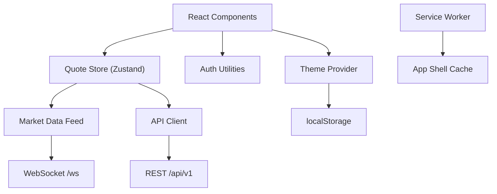
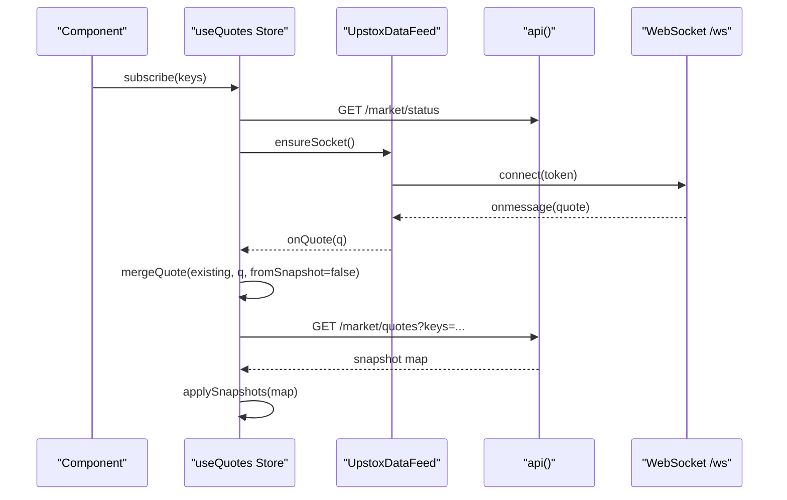
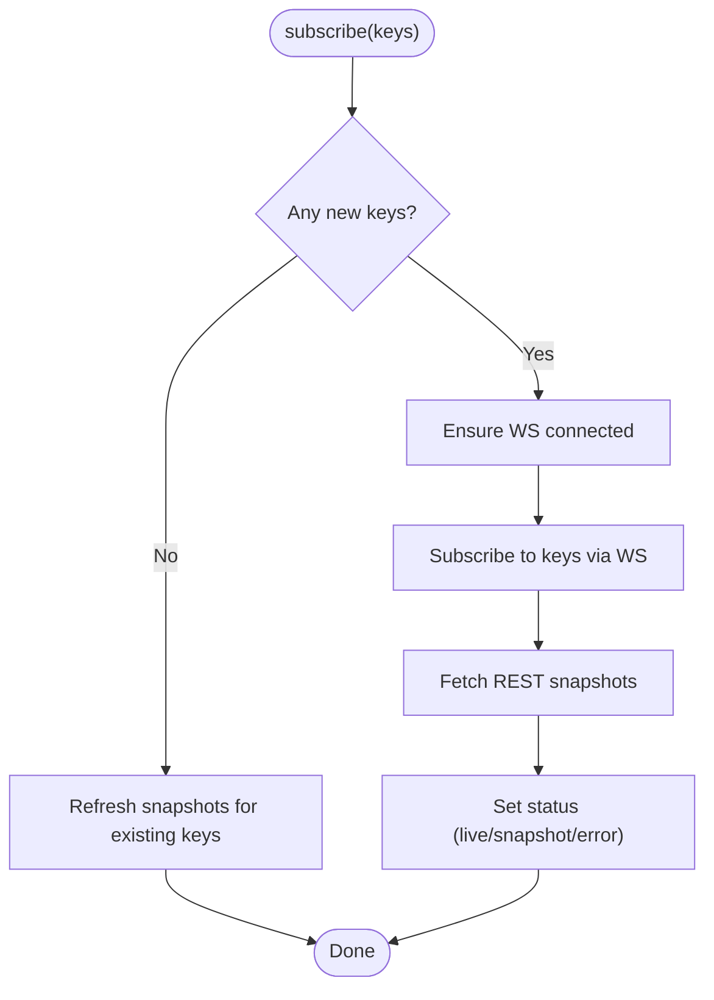
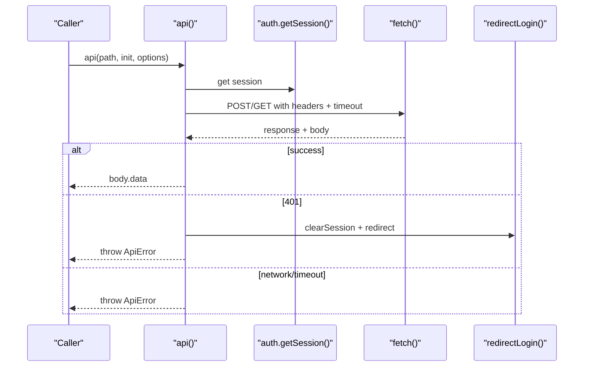
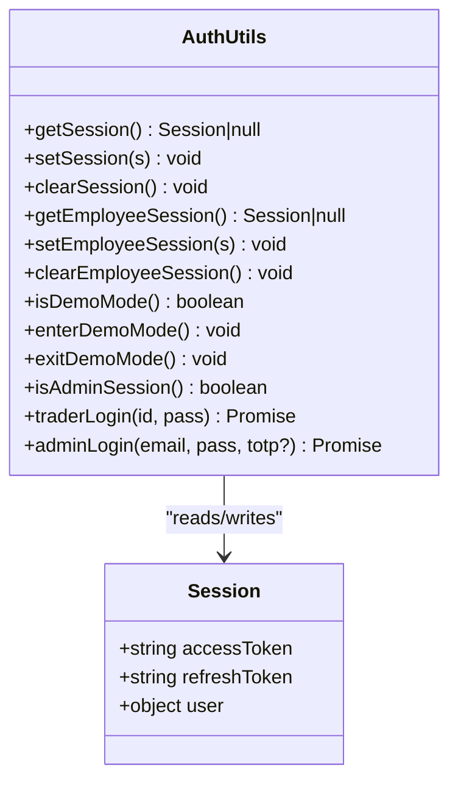
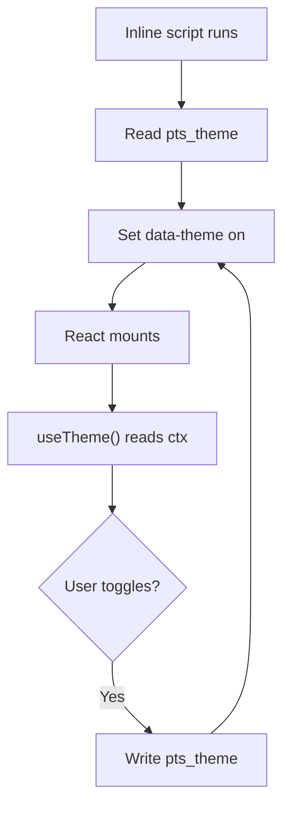
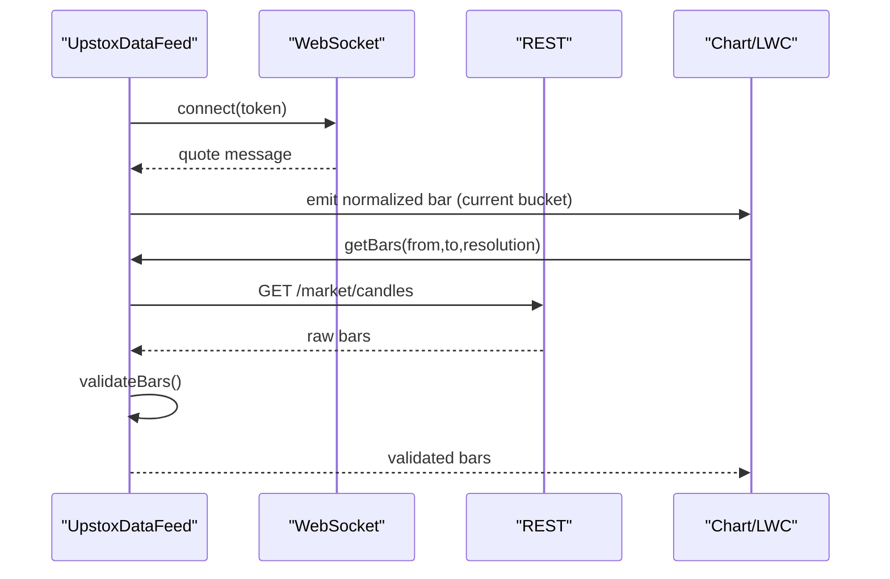
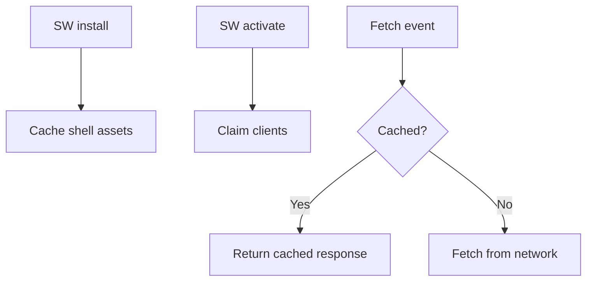
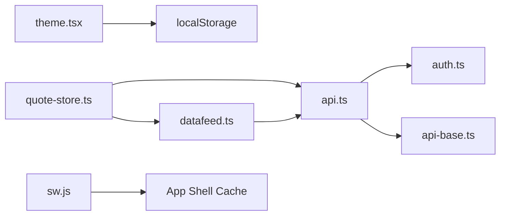
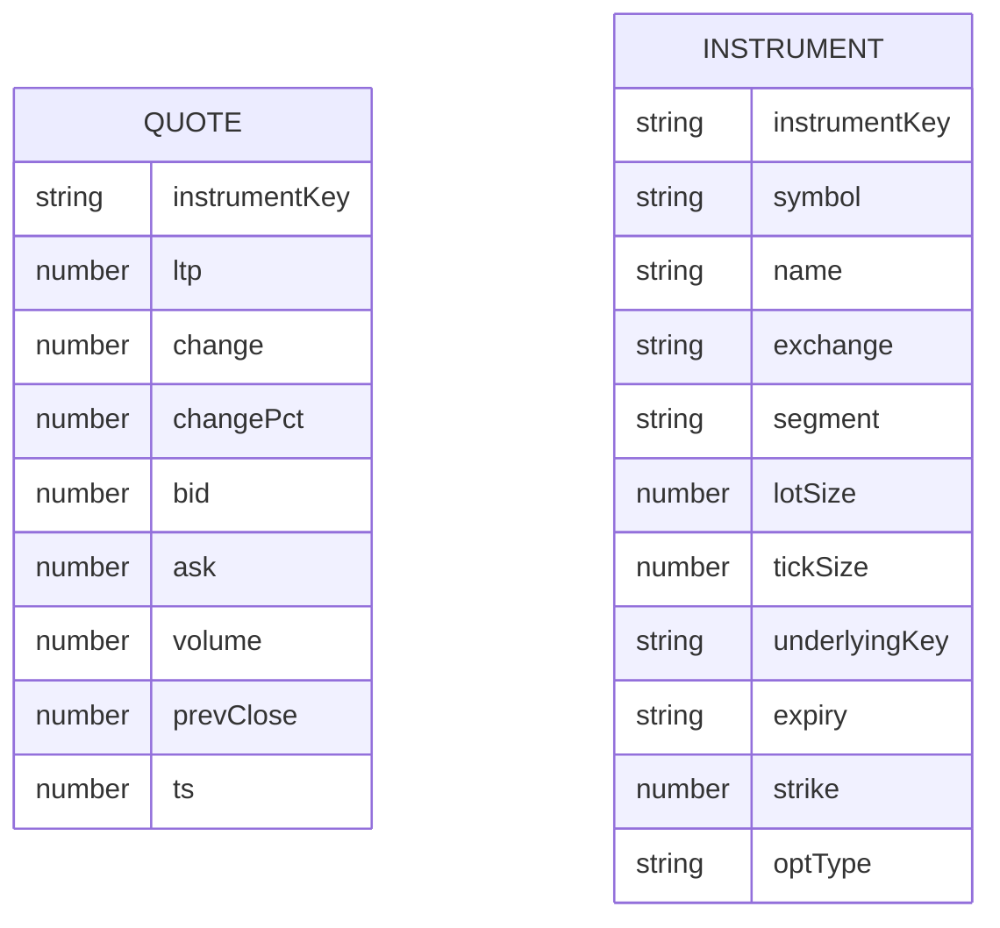

# State Management & Data Flow

<cite>
**Referenced Files in This Document**
- [quote-store.ts](file://frontend/trader/src/lib/quote-store.ts)
- [api.ts](file://frontend/trader/src/lib/api.ts)
- [auth.ts](file://frontend/trader/src/lib/auth.ts)
- [theme.tsx](file://frontend/trader/src/lib/theme.tsx)
- [datafeed.ts](file://frontend/trader/src/lib/market/datafeed.ts)
- [types.ts](file://frontend/trader/src/lib/types.ts)
- [api-base.ts](file://frontend/trader/src/lib/api-base.ts)
- [sw.js](file://frontend/trader/public/sw.js)
</cite>

## Table of Contents
1. [Introduction](#introduction)
2. [Project Structure](#project-structure)
3. [Core Components](#core-components)
4. [Architecture Overview](#architecture-overview)
5. [Detailed Component Analysis](#detailed-component-analysis)
6. [Dependency Analysis](#dependency-analysis)
7. [Performance Considerations](#performance-considerations)
8. [Troubleshooting Guide](#troubleshooting-guide)
9. [Conclusion](#conclusion)
10. [Appendices](#appendices)

## Introduction
This document explains the Zustand-based state management system and data flow for real-time market data, API client behavior, authentication state, and theme persistence. It covers reactive patterns, synchronization strategies between WebSocket ticks and REST snapshots, error handling and retries, offline support via service worker caching, and how state persists across page reloads.

## Project Structure
The frontend module relevant to this documentation is organized under the trader app’s lib directory:
- Quote store (Zustand) for live quotes and subscription lifecycle
- API client with token attachment, timeouts, and error normalization
- Authentication utilities for session storage and redirects
- Theme provider with early boot script to avoid flash and persist preferences
- Market data feed adapter bridging REST history and WebSocket live quotes
- Shared types for quotes and instruments
- Service worker for basic shell caching

**Diagram sources**
- [quote-store.ts:92-150](file://frontend/trader/src/lib/quote-store.ts#L92-L150)
- [datafeed.ts:204-466](file://frontend/trader/src/lib/market/datafeed.ts#L204-L466)
- [api.ts:89-145](file://frontend/trader/src/lib/api.ts#L89-L145)
- [theme.tsx:11-34](file://frontend/trader/src/lib/theme.tsx#L11-L34)
- [sw.js:1-24](file://frontend/trader/public/sw.js#L1-L24)

**Section sources**
- [quote-store.ts:1-151](file://frontend/trader/src/lib/quote-store.ts#L1-L151)
- [datafeed.ts:1-467](file://frontend/trader/src/lib/market/datafeed.ts#L1-L467)
- [api.ts:1-148](file://frontend/trader/src/lib/api.ts#L1-L148)
- [auth.ts:1-266](file://frontend/trader/src/lib/auth.ts#L1-L266)
- [theme.tsx:1-55](file://frontend/trader/src/lib/theme.tsx#L1-L55)
- [sw.js:1-24](file://frontend/trader/public/sw.js#L1-L24)

## Core Components
- Quote store: Manages a map of quotes, subscription set, status, and market open flag. Merges incoming ticks and REST snapshots while respecting timestamps and market hours.
- API client: Centralized fetch wrapper that attaches Bearer tokens, enforces timeouts, normalizes errors, and handles 401 redirects for trader and admin routes.
- Authentication: Stores and retrieves trader and employee sessions from localStorage, supports demo mode, and provides login/register helpers.
- Theme provider: Applies theme early via an inline script, persists selection to localStorage, and exposes React context for toggling.
- Market data feed: A singleton adapter that connects to WebSocket for live quotes and uses REST endpoints for symbol search, instrument resolution, and historical bars.
- Types: Shared interfaces for quotes, instruments, and trading primitives.
- Service worker: Caches the application shell for offline access.

**Section sources**
- [quote-store.ts:9-16](file://frontend/trader/src/lib/quote-store.ts#L9-L16)
- [api.ts:67-145](file://frontend/trader/src/lib/api.ts#L67-L145)
- [auth.ts:5-21](file://frontend/trader/src/lib/auth.ts#L5-L21)
- [theme.tsx:4-34](file://frontend/trader/src/lib/theme.tsx#L4-L34)
- [datafeed.ts:204-466](file://frontend/trader/src/lib/market/datafeed.ts#L204-L466)
- [types.ts:1-23](file://frontend/trader/src/lib/types.ts#L1-L23)
- [sw.js:1-24](file://frontend/trader/public/sw.js#L1-L24)

## Architecture Overview
The system combines a reactive Zustand store with a robust data feed layer:
- Subscriptions trigger WebSocket connection and initial REST snapshot refresh.
- Live ticks are merged into the store using timestamp-aware logic; when the market is closed, REST last-close snapshots take precedence.
- The API client ensures authenticated requests and consistent error handling.
- Theme and auth states persist via localStorage; the service worker caches the shell for offline availability.

**Diagram sources**
- [quote-store.ts:92-150](file://frontend/trader/src/lib/quote-store.ts#L92-L150)
- [datafeed.ts:367-413](file://frontend/trader/src/lib/market/datafeed.ts#L367-L413)
- [api.ts:89-145](file://frontend/trader/src/lib/api.ts#L89-L145)

## Detailed Component Analysis

### Quote Store (Zustand)
Responsibilities:
- Maintain quotes map, subscribed keys, error, status, and marketOpen flag.
- Merge incoming quotes based on timestamps and market-open state.
- Manage WebSocket subscription lifecycle and REST snapshot polling.
- Provide a subscribe(keys) action used by components.

Key behaviors:
- On first subscription, attach a single listener to the data feed and start periodic market status checks.
- When new keys are added, request a WebSocket subscription and immediately refresh snapshots.
- Polling interval adapts to market hours: faster when closed to keep UI fresh.

Reactive pattern:
- Zustand updates trigger re-renders only for consumers of useQuotes.
- Merging avoids unnecessary updates by comparing timestamps and source type (snapshot vs live).

**Diagram sources**
- [quote-store.ts:92-150](file://frontend/trader/src/lib/quote-store.ts#L92-L150)

**Section sources**
- [quote-store.ts:22-36](file://frontend/trader/src/lib/quote-store.ts#L22-L36)
- [quote-store.ts:38-90](file://frontend/trader/src/lib/quote-store.ts#L38-L90)
- [quote-store.ts:92-150](file://frontend/trader/src/lib/quote-store.ts#L92-L150)

### API Client
Responsibilities:
- Attach Bearer token from current session (trader or admin).
- Enforce per-request timeouts with special handling for long-running sync endpoints.
- Normalize responses and throw typed ApiError with user-friendly messages.
- Handle 401 by clearing sessions and redirecting to appropriate login pages.

Error handling:
- Distinguishes network errors, timeouts, and server errors.
- Provides fallback messages for proxy failures during instrument sync.

**Diagram sources**
- [api.ts:7-23](file://frontend/trader/src/lib/api.ts#L7-L23)
- [api.ts:67-145](file://frontend/trader/src/lib/api.ts#L67-L145)

**Section sources**
- [api.ts:7-23](file://frontend/trader/src/lib/api.ts#L7-L23)
- [api.ts:67-145](file://frontend/trader/src/lib/api.ts#L67-L145)

### Authentication State Management
Responsibilities:
- Persist trader and employee sessions separately in localStorage.
- Validate JWT-like access tokens and handle legacy migration.
- Support demo mode for static dashboards without backend.
- Provide login/register functions that bypass the main API client to avoid circular dependencies.

Persistence:
- Sessions survive page reloads via localStorage.
- Admin and trader sessions are isolated to prevent cross-contamination.

**Diagram sources**
- [auth.ts:5-21](file://frontend/trader/src/lib/auth.ts#L5-L21)
- [auth.ts:32-142](file://frontend/trader/src/lib/auth.ts#L32-L142)
- [auth.ts:180-266](file://frontend/trader/src/lib/auth.ts#L180-L266)

**Section sources**
- [auth.ts:5-21](file://frontend/trader/src/lib/auth.ts#L5-L21)
- [auth.ts:32-142](file://frontend/trader/src/lib/auth.ts#L32-L142)
- [auth.ts:180-266](file://frontend/trader/src/lib/auth.ts#L180-L266)

### Theme State Persistence
Responsibilities:
- Apply theme early via an inline script to prevent flash.
- Persist theme preference to localStorage.
- Expose React context for toggling and reading theme.

Behavior:
- Respects OS preference if no explicit choice exists.
- Also manages sidebar collapsed state via HTML attributes.

**Diagram sources**
- [theme.tsx:11-34](file://frontend/trader/src/lib/theme.tsx#L11-L34)
- [theme.tsx:43-54](file://frontend/trader/src/lib/theme.tsx#L43-L54)

**Section sources**
- [theme.tsx:11-34](file://frontend/trader/src/lib/theme.tsx#L11-L34)
- [theme.tsx:43-54](file://frontend/trader/src/lib/theme.tsx#L43-L54)

### Market Data Feed (WebSocket Integration)
Responsibilities:
- Connect to WebSocket with bearer token query parameter.
- Subscribe/unsubscribe to quotes and bars.
- Convert REST candles to chart-compatible bars with validation and deduplication.
- Provide a shared singleton instance.

Synchronization strategy:
- Live ticks update the current bar bucket only; older ticks are ignored.
- Snapshot merging prefers REST last-close when market is closed.

**Diagram sources**
- [datafeed.ts:204-466](file://frontend/trader/src/lib/market/datafeed.ts#L204-L466)

**Section sources**
- [datafeed.ts:55-78](file://frontend/trader/src/lib/market/datafeed.ts#L55-L78)
- [datafeed.ts:120-157](file://frontend/trader/src/lib/market/datafeed.ts#L120-L157)
- [datafeed.ts:269-302](file://frontend/trader/src/lib/market/datafeed.ts#L269-L302)
- [datafeed.ts:367-413](file://frontend/trader/src/lib/market/datafeed.ts#L367-L413)
- [datafeed.ts:421-458](file://frontend/trader/src/lib/market/datafeed.ts#L421-L458)

### Offline Support and Caching
- Service worker caches the application shell URLs to enable offline navigation and fast reloads.
- Does not cache dynamic API responses; relies on online connectivity for live data.

**Diagram sources**
- [sw.js:1-24](file://frontend/trader/public/sw.js#L1-L24)

**Section sources**
- [sw.js:1-24](file://frontend/trader/public/sw.js#L1-L24)

## Dependency Analysis
- Quote store depends on:
  - API client for market status and snapshots
  - Market data feed for live quotes
  - Types for Quote structure
- API client depends on:
  - Auth utilities for session retrieval
  - API base URL resolver
- Market data feed depends on:
  - API client for REST calls
  - WebSocket for live streaming
- Theme provider depends on:
  - localStorage for persistence
  - Inline script for early theme application

**Diagram sources**
- [quote-store.ts:1-151](file://frontend/trader/src/lib/quote-store.ts#L1-L151)
- [datafeed.ts:1-467](file://frontend/trader/src/lib/market/datafeed.ts#L1-L467)
- [api.ts:1-148](file://frontend/trader/src/lib/api.ts#L1-L148)
- [auth.ts:1-266](file://frontend/trader/src/lib/auth.ts#L1-L266)
- [api-base.ts:1-13](file://frontend/trader/src/lib/api-base.ts#L1-L13)
- [theme.tsx:1-55](file://frontend/trader/src/lib/theme.tsx#L1-L55)
- [sw.js:1-24](file://frontend/trader/public/sw.js#L1-L24)

**Section sources**
- [quote-store.ts:1-151](file://frontend/trader/src/lib/quote-store.ts#L1-L151)
- [datafeed.ts:1-467](file://frontend/trader/src/lib/market/datafeed.ts#L1-L467)
- [api.ts:1-148](file://frontend/trader/src/lib/api.ts#L1-L148)
- [auth.ts:1-266](file://frontend/trader/src/lib/auth.ts#L1-L266)
- [api-base.ts:1-13](file://frontend/trader/src/lib/api-base.ts#L1-L13)
- [theme.tsx:1-55](file://frontend/trader/src/lib/theme.tsx#L1-L55)
- [sw.js:1-24](file://frontend/trader/public/sw.js#L1-L24)

## Performance Considerations
- Efficient merging: Quote store compares timestamps and source type to avoid redundant updates.
- Adaptive polling: Snapshot polling frequency increases when market is closed to keep UI responsive.
- Single WS connection: Data feed maintains one WebSocket and shares it across subscriptions.
- Bar validation: Historical bars are validated, deduplicated, and filtered to reduce noise and rendering load.
- Early theme application: Inline script prevents layout thrash and repaints caused by theme mismatch.
- Timeouts: Long-running endpoints have extended timeouts to avoid premature failures.

[No sources needed since this section provides general guidance]

## Troubleshooting Guide
Common issues and resolutions:
- WebSocket connection fails:
  - Ensure the engine process is running and accessible at the expected URL.
  - Verify browser console for connection warnings and check network tab for WebSocket handshake.
- No quotes after subscribing:
  - Confirm the user is authenticated; unauthenticated users cannot connect to live quotes.
  - Check REST snapshot endpoint returns data; if not, verify market status and keys.
- API errors:
  - 401 indicates expired or missing session; the client clears session and redirects to login.
  - Timeout errors may occur during instrument sync; retry on a stable connection.
- Theme flashing:
  - Ensure the inline theme script executes before React hydration and that localStorage contains a valid value.

**Section sources**
- [datafeed.ts:367-413](file://frontend/trader/src/lib/market/datafeed.ts#L367-L413)
- [api.ts:118-145](file://frontend/trader/src/lib/api.ts#L118-L145)
- [theme.tsx:11-34](file://frontend/trader/src/lib/theme.tsx#L11-L34)

## Conclusion
The system combines a reactive Zustand store with a resilient data feed layer to deliver real-time market data, backed by robust API and authentication utilities. Timestamp-aware merging, adaptive polling, and careful WebSocket lifecycle management ensure efficient and accurate state updates. Theme persistence and service worker caching improve perceived performance and offline resilience. Together, these components provide a scalable foundation for trading dashboards and terminals.

[No sources needed since this section summarizes without analyzing specific files]

## Appendices

### Data Models

**Diagram sources**
- [types.ts:1-23](file://frontend/trader/src/lib/types.ts#L1-L23)

**Section sources**
- [types.ts:1-23](file://frontend/trader/src/lib/types.ts#L1-L23)