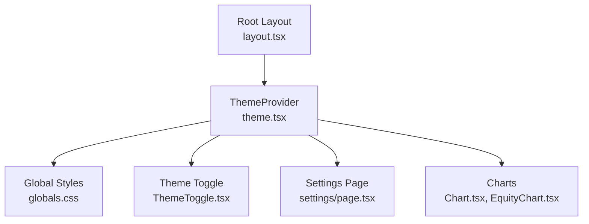
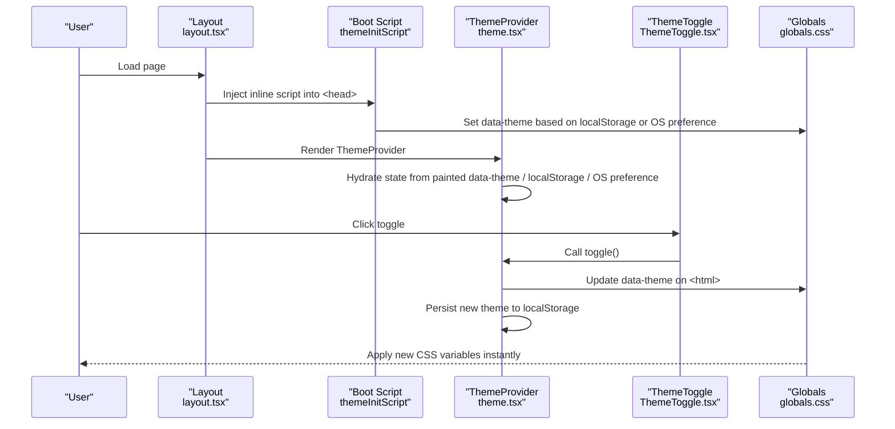
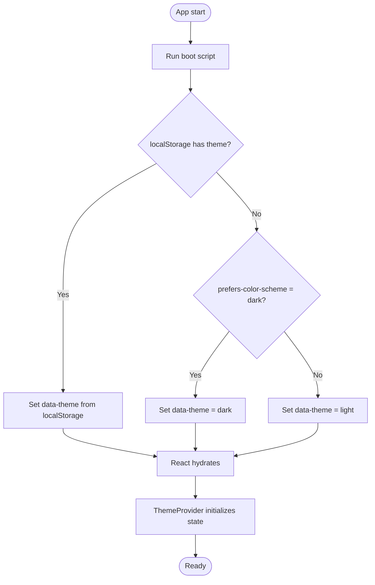
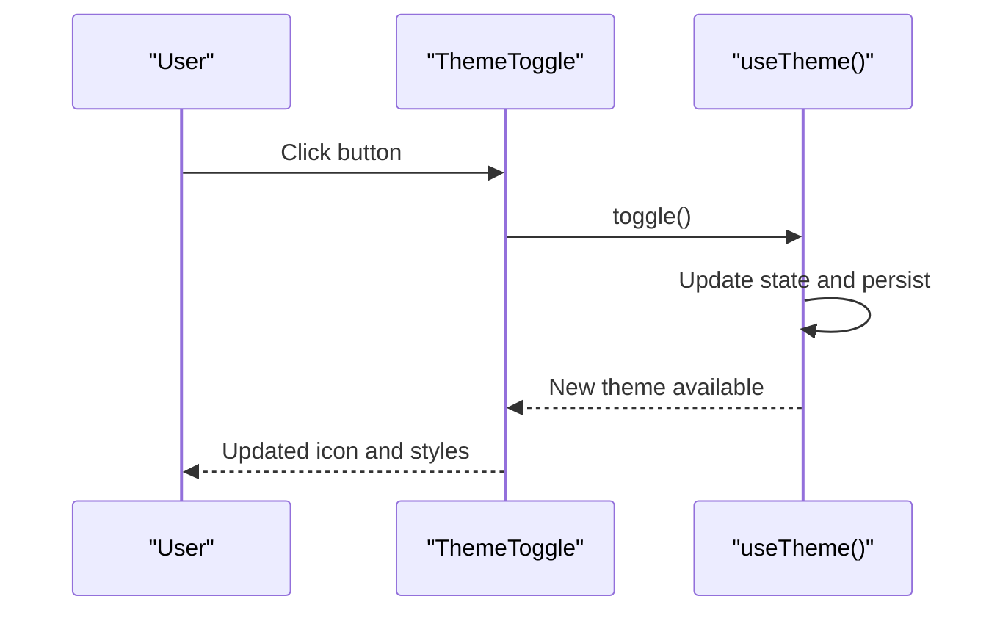
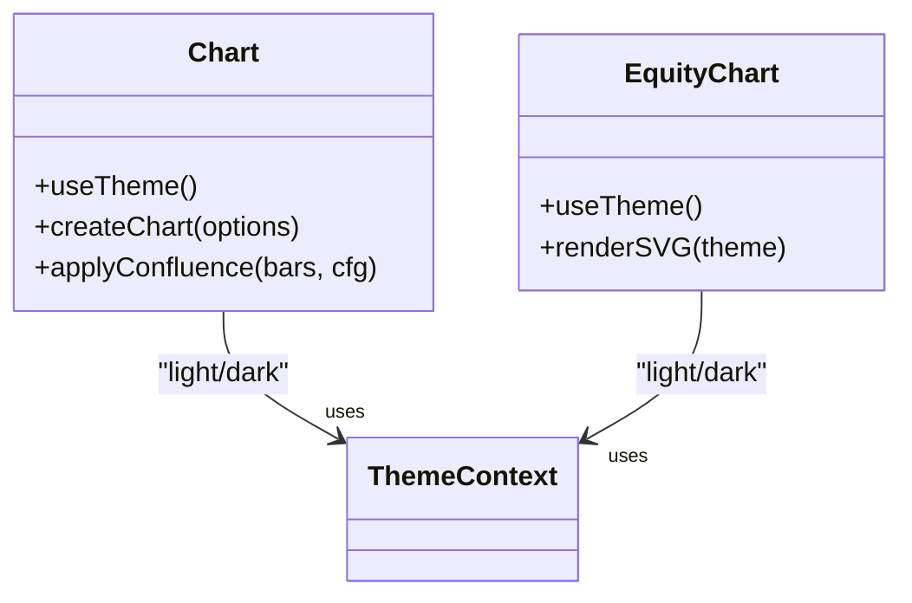
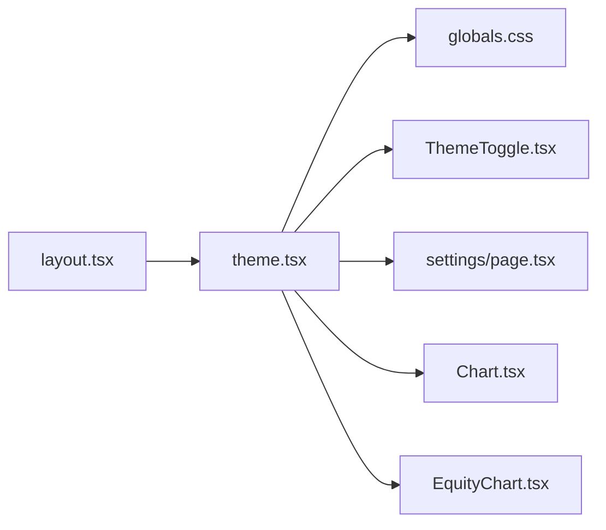

# Theme & UI State

<cite>
**Referenced Files in This Document**
- [theme.tsx](file://frontend/trader/src/lib/theme.tsx)
- [ThemeToggle.tsx](file://frontend/trader/src/components/ThemeToggle.tsx)
- [globals.css](file://frontend/trader/src/styles/globals.css)
- [layout.tsx](file://frontend/trader/src/app/layout.tsx)
- [Chart.tsx](file://frontend/trader/src/components/Chart.tsx)
- [EquityChart.tsx](file://frontend/trader/src/components/dashboard/EquityChart.tsx)
- [settings/page.tsx](file://frontend/trader/src/app/settings/page.tsx)
</cite>

## Table of Contents
1. [Introduction](#introduction)
2. [Project Structure](#project-structure)
3. [Core Components](#core-components)
4. [Architecture Overview](#architecture-overview)
5. [Detailed Component Analysis](#detailed-component-analysis)
6. [Dependency Analysis](#dependency-analysis)
7. [Performance Considerations](#performance-considerations)
8. [Troubleshooting Guide](#troubleshooting-guide)
9. [Conclusion](#conclusion)
10. [Appendices](#appendices)

## Introduction
This document explains the theme state management system for dark/light mode switching, persistent preferences, and dynamic styling across the application. It covers the theme context provider, CSS variable-driven theming, component-level integration, toggle behavior, browser preference detection, accessibility considerations, and responsive design patterns. It also includes guidance for creating theme-aware components and customizing color schemes.

## Project Structure
The theme system is centered around a small set of files:
- A client-side React context provider that owns theme state and persistence
- An early boot script to prevent flash-of-wrong-theme during hydration
- Global CSS variables defining light and dark palettes
- UI components that consume the theme context to render appropriately
- A settings page exposing explicit theme selection

**Diagram sources**
- [layout.tsx:31-52](file://frontend/trader/src/app/layout.tsx#L31-L52)
- [theme.tsx:11-34](file://frontend/trader/src/lib/theme.tsx#L11-L34)
- [globals.css:6-97](file://frontend/trader/src/styles/globals.css#L6-L97)
- [ThemeToggle.tsx:8-30](file://frontend/trader/src/components/ThemeToggle.tsx#L8-L30)
- [settings/page.tsx:6-37](file://frontend/trader/src/app/settings/page.tsx#L6-L37)
- [Chart.tsx:112-114](file://frontend/trader/src/components/Chart.tsx#L112-L114)
- [EquityChart.tsx:8-11](file://frontend/trader/src/components/dashboard/EquityChart.tsx#L8-L11)

**Section sources**
- [layout.tsx:31-52](file://frontend/trader/src/app/layout.tsx#L31-L52)
- [theme.tsx:11-34](file://frontend/trader/src/lib/theme.tsx#L11-L34)
- [globals.css:6-97](file://frontend/trader/src/styles/globals.css#L6-L97)

## Core Components
- ThemeProvider: Owns theme state, persists it to localStorage, applies data-theme to <html>, and respects prefers-color-scheme when no preference exists.
- useTheme hook: Provides current theme and setters to consumers.
- themeInitScript: Runs before React hydrates to avoid flash-of-white/dark by setting data-theme immediately.
- ThemeToggle: Button to switch themes with accessible labels and SSR-safe icon rendering.
- Settings page: Explicit theme picker using the same context.

Key behaviors:
- Persistence: The chosen theme is stored under a dedicated key in localStorage and restored on subsequent visits.
- Browser preference: If no saved preference exists, the system falls back to the OS/browser preference via matchMedia.
- Data attribute: The active theme is reflected as data-theme on the root element, driving CSS variable overrides.

**Section sources**
- [theme.tsx:11-34](file://frontend/trader/src/lib/theme.tsx#L11-L34)
- [theme.tsx:43-54](file://frontend/trader/src/lib/theme.tsx#L43-L54)
- [ThemeToggle.tsx:8-30](file://frontend/trader/src/components/ThemeToggle.tsx#L8-L30)
- [settings/page.tsx:6-37](file://frontend/trader/src/app/settings/page.tsx#L6-L37)

## Architecture Overview
The theme system follows a provider-consumer pattern with CSS variables as the single source of truth for colors and effects.

**Diagram sources**
- [layout.tsx:31-52](file://frontend/trader/src/app/layout.tsx#L31-L52)
- [theme.tsx:11-34](file://frontend/trader/src/lib/theme.tsx#L11-L34)
- [theme.tsx:43-54](file://frontend/trader/src/lib/theme.tsx#L43-L54)
- [ThemeToggle.tsx:8-30](file://frontend/trader/src/components/ThemeToggle.tsx#L8-L30)
- [globals.css:6-97](file://frontend/trader/src/styles/globals.css#L6-L97)

## Detailed Component Analysis

### Theme Provider and Boot Script
- Purpose: Centralize theme state, persist user choice, and ensure consistent initial theme before React hydration.
- Mechanism:
  - Boot script sets data-theme on <html> immediately, reading localStorage or OS preference.
  - On mount, ThemeProvider reads the already-painted data-theme, then localStorage, then OS preference to initialize React state.
  - Changes update both data-theme and localStorage synchronously.
- Accessibility: Uses semantic attributes and avoids mismatched SSR/client states by deferring icon rendering until after mount.

**Diagram sources**
- [theme.tsx:11-34](file://frontend/trader/src/lib/theme.tsx#L11-L34)
- [theme.tsx:43-54](file://frontend/trader/src/lib/theme.tsx#L43-L54)

**Section sources**
- [theme.tsx:11-34](file://frontend/trader/src/lib/theme.tsx#L11-L34)
- [theme.tsx:43-54](file://frontend/trader/src/lib/theme.tsx#L43-L54)

### Theme Toggle
- Behavior: Switches between light and dark modes via the context’s toggle function.
- SSR safety: Defers icon rendering until after mount to avoid hydration mismatches.
- Accessibility: Provides an aria-label describing the next action (e.g., “Switch to dark mode”).

**Diagram sources**
- [ThemeToggle.tsx:8-30](file://frontend/trader/src/components/ThemeToggle.tsx#L8-L30)
- [theme.tsx:11-34](file://frontend/trader/src/lib/theme.tsx#L11-L34)

**Section sources**
- [ThemeToggle.tsx:8-30](file://frontend/trader/src/components/ThemeToggle.tsx#L8-L30)

### Settings Page Theme Picker
- Behavior: Presents light/dark swatches; selecting one calls setTheme to apply immediately.
- Integration: Uses the same context as other parts of the app, ensuring consistency.

**Section sources**
- [settings/page.tsx:6-37](file://frontend/trader/src/app/settings/page.tsx#L6-L37)

### Chart Components and Dynamic Styling
- Lightweight Charts integration: Recreates chart instances when theme changes to apply correct text and grid colors.
- SVG area chart: Uses theme-aware CSS variables for stroke/fill colors and gradient IDs keyed by theme.

**Diagram sources**
- [Chart.tsx:112-114](file://frontend/trader/src/components/Chart.tsx#L112-L114)
- [Chart.tsx:234-306](file://frontend/trader/src/components/Chart.tsx#L234-L306)
- [EquityChart.tsx:8-11](file://frontend/trader/src/components/dashboard/EquityChart.tsx#L8-L11)
- [EquityChart.tsx:28-32](file://frontend/trader/src/components/dashboard/EquityChart.tsx#L28-L32)

**Section sources**
- [Chart.tsx:112-114](file://frontend/trader/src/components/Chart.tsx#L112-L114)
- [Chart.tsx:234-306](file://frontend/trader/src/components/Chart.tsx#L234-L306)
- [EquityChart.tsx:8-11](file://frontend/trader/src/components/dashboard/EquityChart.tsx#L8-L11)
- [EquityChart.tsx:28-32](file://frontend/trader/src/components/dashboard/EquityChart.tsx#L28-L32)

## Dependency Analysis
- Root layout injects the boot script and wraps the app with ThemeProvider.
- All theme-aware components import useTheme to read or mutate theme state.
- CSS variables are scoped via data-theme selectors, so changing the attribute updates all dependent styles globally.

**Diagram sources**
- [layout.tsx:31-52](file://frontend/trader/src/app/layout.tsx#L31-L52)
- [theme.tsx:11-34](file://frontend/trader/src/lib/theme.tsx#L11-L34)
- [globals.css:6-97](file://frontend/trader/src/styles/globals.css#L6-L97)
- [ThemeToggle.tsx:8-30](file://frontend/trader/src/components/ThemeToggle.tsx#L8-L30)
- [settings/page.tsx:6-37](file://frontend/trader/src/app/settings/page.tsx#L6-L37)
- [Chart.tsx:112-114](file://frontend/trader/src/components/Chart.tsx#L112-L114)
- [EquityChart.tsx:8-11](file://frontend/trader/src/components/dashboard/EquityChart.tsx#L8-L11)

**Section sources**
- [layout.tsx:31-52](file://frontend/trader/src/app/layout.tsx#L31-L52)
- [theme.tsx:11-34](file://frontend/trader/src/lib/theme.tsx#L11-L34)
- [globals.css:6-97](file://frontend/trader/src/styles/globals.css#L6-L97)

## Performance Considerations
- Early theme application: The boot script prevents flash-of-wrong-theme by setting data-theme before React renders.
- Minimal re-renders: Theme state changes only affect consumers that subscribe via useTheme.
- Chart recreation cost: Some charts recreate their instances on theme change to ensure correct colors; this is intentional and bounded to chart nodes.
- CSS transitions: Smooth transitions are applied to background and color properties for a polished experience.

[No sources needed since this section provides general guidance]

## Troubleshooting Guide
- Flash of wrong theme on first load:
  - Ensure the boot script is injected into <head> before React hydrates.
  - Verify localStorage contains a valid theme value or that OS preference is correctly detected.
- Theme not applying to third-party libraries:
  - For canvas-based charts, recreate the instance when theme changes to pick up new colors.
- Inconsistent icons on SSR:
  - Defer rendering of theme-dependent icons until after mount to avoid hydration mismatches.
- Persistent preference not saving:
  - Confirm localStorage writes succeed and that the key used matches the one read by the provider and boot script.

**Section sources**
- [theme.tsx:11-34](file://frontend/trader/src/lib/theme.tsx#L11-L34)
- [theme.tsx:43-54](file://frontend/trader/src/lib/theme.tsx#L43-L54)
- [Chart.tsx:234-306](file://frontend/trader/src/components/Chart.tsx#L234-L306)
- [ThemeToggle.tsx:8-30](file://frontend/trader/src/components/ThemeToggle.tsx#L8-L30)

## Conclusion
The theme system combines a lightweight React context with CSS variables and an early boot script to deliver a robust, accessible, and performant dark/light mode experience. Consumers integrate via a simple hook, while global styles react to a single data attribute. The approach scales well across the app and supports customization through CSS variables and component-specific logic where necessary.

[No sources needed since this section summarizes without analyzing specific files]

## Appendices

### CSS Variable Management and Customization
- Light and dark palettes are defined as CSS variables under data-theme selectors.
- To add a new theme variant:
  - Add a new selector (for example, a high-contrast dark) and define the full set of variables.
  - Extend the theme type and provider to support the new value.
  - Update the settings page and any toggles to include the new option.
- Semantic variables (text, panel, gain/loss, accent) should be used throughout components to maintain consistency.

**Section sources**
- [globals.css:6-97](file://frontend/trader/src/styles/globals.css#L6-L97)

### Responsive Design Patterns
- The theme toggle adapts sizing on smaller screens via media queries.
- Global styles include reduced-motion preferences and mobile-friendly spacing.
- Charts and panels rely on CSS variables for backgrounds and borders, which automatically adapt to theme and screen size.

**Section sources**
- [ThemeToggle.tsx:16-27](file://frontend/trader/src/components/ThemeToggle.tsx#L16-L27)
- [globals.css:180-182](file://frontend/trader/src/styles/globals.css#L180-L182)

### Creating Theme-Aware Components
- Use the useTheme hook to read the current theme and conditionally render or pass options to child components.
- For libraries that do not respect CSS variables (like some charting libraries), recreate or reconfigure the instance when theme changes.
- Prefer CSS variables for styling within your own components to benefit from automatic theme switching.

**Section sources**
- [Chart.tsx:112-114](file://frontend/trader/src/components/Chart.tsx#L112-L114)
- [Chart.tsx:234-306](file://frontend/trader/src/components/Chart.tsx#L234-L306)
- [EquityChart.tsx:8-11](file://frontend/trader/src/components/dashboard/EquityChart.tsx#L8-L11)

### Accessibility Considerations
- Provide descriptive aria-labels on theme controls to communicate intent to assistive technologies.
- Avoid visual-only indicators; pair icons with text or titles where appropriate.
- Respect reduced motion preferences for animations and transitions.

**Section sources**
- [ThemeToggle.tsx:14-15](file://frontend/trader/src/components/ThemeToggle.tsx#L14-L15)
- [globals.css:180-182](file://frontend/trader/src/styles/globals.css#L180-L182)