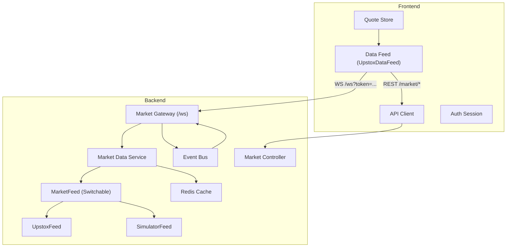
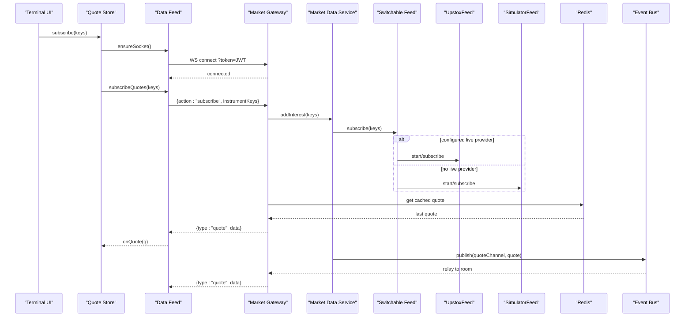
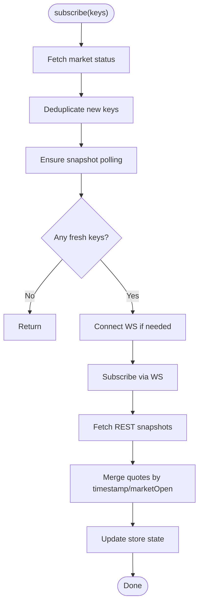
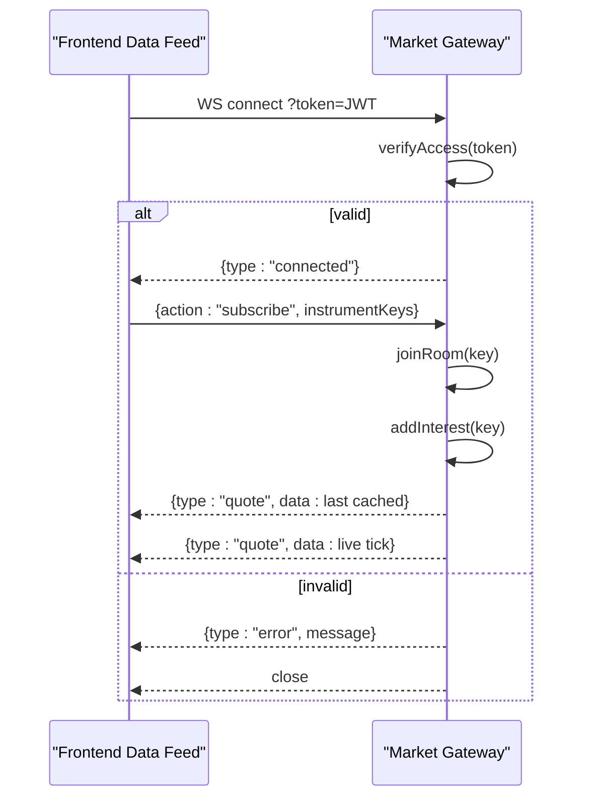
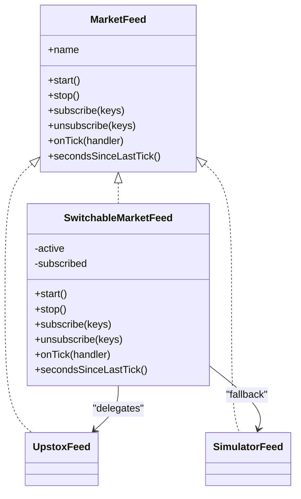
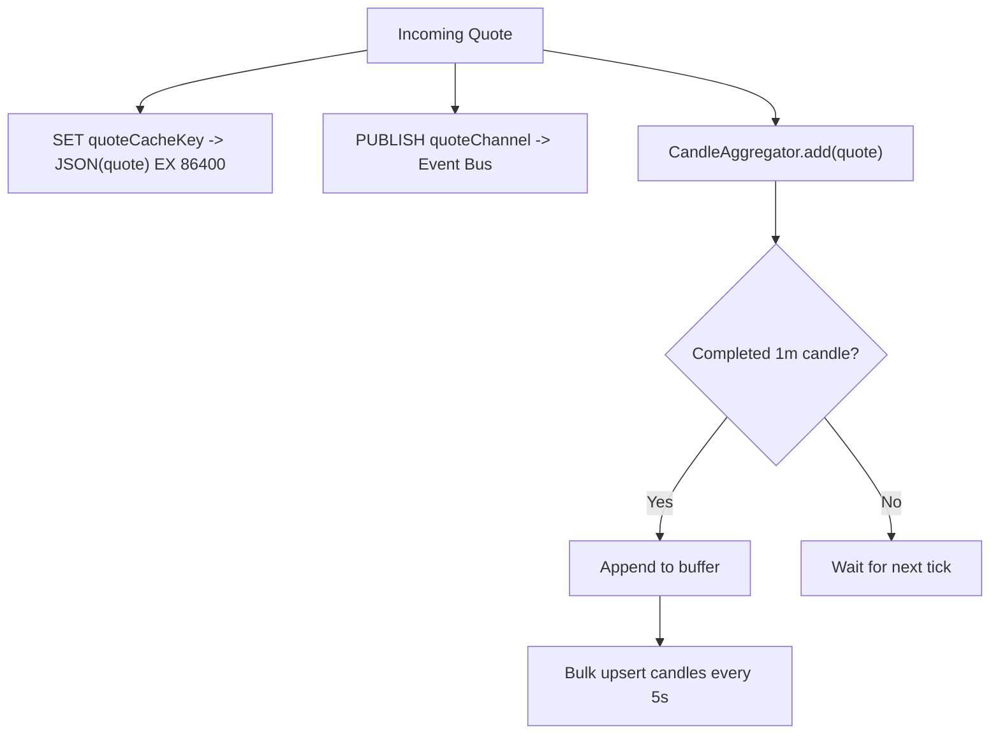
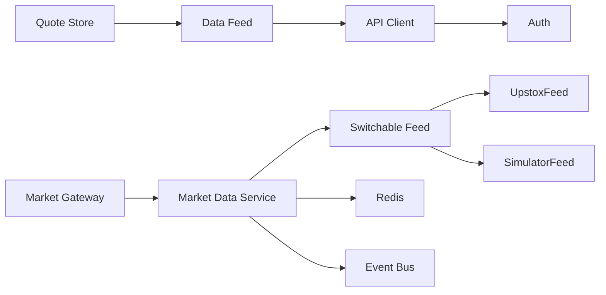

# Market Data Integration

<cite>
**Referenced Files in This Document**
- [quote-store.ts](file://frontend/trader/src/lib/quote-store.ts)
- [datafeed.ts](file://frontend/trader/src/lib/market/datafeed.ts)
- [api.ts](file://frontend/trader/src/lib/api.ts)
- [auth.ts](file://frontend/trader/src/lib/auth.ts)
- [market.gateway.ts](file://backend/apps/api/src/modules/market/presentation/market.gateway.ts)
- [market-data.service.ts](file://backend/apps/api/src/modules/market/application/market-data.service.ts)
- [market-feed.port.ts](file://backend/apps/api/src/modules/market/infrastructure/feed/market-feed.port.ts)
- [upstox-feed.ts](file://backend/apps/api/src/modules/market/infrastructure/feed/upstox-feed.ts)
- [simulator-feed.ts](file://backend/apps/api/src/modules/market/infrastructure/feed/simulator-feed.ts)
- [switchable-market-feed.ts](file://backend/apps/api/src/modules/market/infrastructure/feed/switchable-market-feed.ts)
- [market.controller.ts](file://backend/apps/api/src/modules/market/presentation/market.controller.ts)
</cite>

## Table of Contents
1. Introduction
2. Project Structure
3. Core Components
4. Architecture Overview
5. Detailed Component Analysis
6. Dependency Analysis
7. Performance Considerations
8. Troubleshooting Guide
9. Conclusion

## Introduction
This document explains the market data integration layer that powers the trading terminal. It covers the quote store architecture for real-time price management, WebSocket connection lifecycle and authentication, fallback mechanisms using demo feeds, data normalization and caching strategies, error handling for network failures, API client behavior, and performance optimizations such as debouncing/throttling patterns and efficient re-rendering.

## Project Structure
The market data system spans frontend and backend:
- Frontend:
  - Quote store manages subscriptions, merges snapshots with live ticks, and coordinates with a shared data feed.
  - Data feed implements a TradingView-compatible adapter over REST candles and engine WebSocket quotes.
  - API client handles authenticated HTTP requests and user-friendly errors.
  - Auth module stores sessions and exposes helpers for login flows and demo mode.
- Backend:
  - WebSocket gateway authenticates clients via JWT query token, fans out quotes per instrument room, and bridges to an event bus.
  - Market data service owns a single upstream feed, tracks per-instrument interest, writes normalized quotes to Redis, aggregates 1-minute candles, and runs a stale-feed watchdog.
  - Feed abstraction defines a uniform interface; concrete adapters include Upstox (production WSS), Simulator (deterministic synthetic), and a switchable aggregator with failover logic.
  - REST controller exposes search, instruments, status, quotes, candles, option chain, and expiries endpoints.

**Diagram sources**
- [quote-store.ts:92-150](file://frontend/trader/src/lib/quote-store.ts#L92-L150)
- [datafeed.ts:204-467](file://frontend/trader/src/lib/market/datafeed.ts#L204-L467)
- [api.ts:89-148](file://frontend/trader/src/lib/api.ts#L89-L148)
- [market.gateway.ts:19-134](file://backend/apps/api/src/modules/market/presentation/market.gateway.ts#L19-L134)
- [market-data.service.ts:15-139](file://backend/apps/api/src/modules/market/application/market-data.service.ts#L15-L139)
- [switchable-market-feed.ts:19-186](file://backend/apps/api/src/modules/market/infrastructure/feed/switchable-market-feed.ts#L19-L186)
- [upstox-feed.ts:8-136](file://backend/apps/api/src/modules/market/infrastructure/feed/upstox-feed.ts#L8-L136)
- [simulator-feed.ts:15-145](file://backend/apps/api/src/modules/market/infrastructure/feed/simulator-feed.ts#L15-L145)
- [market.controller.ts:21-76](file://backend/apps/api/src/modules/market/presentation/market.controller.ts#L21-L76)

**Section sources**
- [quote-store.ts:92-150](file://frontend/trader/src/lib/quote-store.ts#L92-L150)
- [datafeed.ts:204-467](file://frontend/trader/src/lib/market/datafeed.ts#L204-L467)
- [api.ts:89-148](file://frontend/trader/src/lib/api.ts#L89-L148)
- [market.gateway.ts:19-134](file://backend/apps/api/src/modules/market/presentation/market.gateway.ts#L19-L134)
- [market-data.service.ts:15-139](file://backend/apps/api/src/modules/market/application/market-data.service.ts#L15-L139)
- [switchable-market-feed.ts:19-186](file://backend/apps/api/src/modules/market/infrastructure/feed/switchable-market-feed.ts#L19-L186)
- [upstox-feed.ts:8-136](file://backend/apps/api/src/modules/market/infrastructure/feed/upstox-feed.ts#L8-L136)
- [simulator-feed.ts:15-145](file://backend/apps/api/src/modules/market/infrastructure/feed/simulator-feed.ts#L15-L145)
- [market.controller.ts:21-76](file://backend/apps/api/src/modules/market/presentation/market.controller.ts#L21-L76)

## Core Components
- Quote Store: Centralized state for quotes, subscription tracking, snapshot polling, and merging rules between live ticks and REST snapshots based on market open/closed state.
- Data Feed: A shared singleton that connects to the engine WebSocket, subscribes/unsubscribes instruments, and updates both chart bars and quote listeners.
- WebSocket Gateway: Authenticates connections via JWT query parameter, creates per-instrument rooms, relays cached last quotes and live ticks, and manages interest counts with the market data service.
- Market Data Service: Owns one upstream feed, tracks per-instrument consumer interest, normalizes and publishes quotes to Redis and the event bus, aggregates 1-minute candles, and monitors feed health.
- Feed Abstraction and Adapters: Uniform interface for upstream providers; includes production Upstox WSS, deterministic simulator, and a switchable aggregator with failover.
- REST Controller: Exposes endpoints for search, instruments, status, quotes, candles, option chain, and expiries.

**Section sources**
- [quote-store.ts:92-150](file://frontend/trader/src/lib/quote-store.ts#L92-L150)
- [datafeed.ts:204-467](file://frontend/trader/src/lib/market/datafeed.ts#L204-L467)
- [market.gateway.ts:19-134](file://backend/apps/api/src/modules/market/presentation/market.gateway.ts#L19-L134)
- [market-data.service.ts:15-139](file://backend/apps/api/src/modules/market/application/market-data.service.ts#L15-L139)
- [market-feed.port.ts:1-23](file://backend/apps/api/src/modules/market/infrastructure/feed/market-feed.port.ts#L1-L23)
- [switchable-market-feed.ts:19-186](file://backend/apps/api/src/modules/market/infrastructure/feed/switchable-market-feed.ts#L19-L186)
- [market.controller.ts:21-76](file://backend/apps/api/src/modules/market/presentation/market.controller.ts#L21-L76)

## Architecture Overview
The system uses a hybrid approach:
- Live path: Engine WebSocket streams normalized quotes from upstream providers through a gateway to subscribed clients.
- Fallback path: When market is closed or WS is unavailable, the frontend polls REST last-close snapshots and prefers them over live ticks.
- Caching: Quotes are persisted in Redis with TTL and served immediately upon subscription.
- Aggregation: The backend aggregates 1-minute candles and persists them efficiently.

**Diagram sources**
- [quote-store.ts:92-150](file://frontend/trader/src/lib/quote-store.ts#L92-L150)
- [datafeed.ts:336-413](file://frontend/trader/src/lib/market/datafeed.ts#L336-L413)
- [market.gateway.ts:48-113](file://backend/apps/api/src/modules/market/presentation/market.gateway.ts#L48-L113)
- [market-data.service.ts:43-108](file://backend/apps/api/src/modules/market/application/market-data.service.ts#L43-L108)
- [switchable-market-feed.ts:57-124](file://backend/apps/api/src/modules/market/infrastructure/feed/switchable-market-feed.ts#L57-L124)
- [upstox-feed.ts:26-89](file://backend/apps/api/src/modules/market/infrastructure/feed/upstox-feed.ts#L26-L89)
- [simulator-feed.ts:40-98](file://backend/apps/api/src/modules/market/infrastructure/feed/simulator-feed.ts#L40-L98)

## Detailed Component Analysis

### Quote Store Architecture
- State model: maintains a map of quotes, a set of subscribed keys, error/status, and market open flag.
- Merge strategy: when market is closed, REST snapshots override live ticks; otherwise, timestamps determine precedence.
- Snapshot polling: periodically fetches last quotes via REST and refreshes market status; interval adapts to market hours.
- Subscription flow: deduplicates keys, ensures snapshot polling, attaches a single listener to the data feed, and triggers initial REST snapshot for fresh keys.

**Diagram sources**
- [quote-store.ts:22-90](file://frontend/trader/src/lib/quote-store.ts#L22-L90)
- [quote-store.ts:92-150](file://frontend/trader/src/lib/quote-store.ts#L92-L150)

**Section sources**
- [quote-store.ts:22-90](file://frontend/trader/src/lib/quote-store.ts#L22-L90)
- [quote-store.ts:92-150](file://frontend/trader/src/lib/quote-store.ts#L92-L150)

### WebSocket Connection Management and Authentication
- Frontend:
  - Builds WS URL dynamically and attaches JWT via query parameter.
  - Ensures a single shared socket with reconnect backoff and error logging.
  - Sends subscribe/unsubscribe messages and routes incoming quotes to handlers.
- Backend:
  - Validates JWT from query string; rejects unauthenticated connections.
  - Creates per-client state and per-instrument rooms.
  - On first join, bumps upstream interest; on last leave, drops it.
  - Relays cached last quote and subsequent live quotes from the event bus.

**Diagram sources**
- [datafeed.ts:367-413](file://frontend/trader/src/lib/market/datafeed.ts#L367-L413)
- [market.gateway.ts:48-113](file://backend/apps/api/src/modules/market/presentation/market.gateway.ts#L48-L113)

**Section sources**
- [datafeed.ts:367-413](file://frontend/trader/src/lib/market/datafeed.ts#L367-L413)
- [market.gateway.ts:48-113](file://backend/apps/api/src/modules/market/presentation/market.gateway.ts#L48-L113)

### Fallback Mechanisms Using Demo Feeds
- Switchable feed selects primary provider based on configuration and credentials; falls back to alternate live providers or simulator if idle/stale.
- Simulator generates deterministic quotes using reference closes, last candle close, or segment-aware synthetic bases.
- Market data service watchdog resubscribes tracked keys when feed is stale during market hours.

**Diagram sources**
- [market-feed.port.ts:1-23](file://backend/apps/api/src/modules/market/infrastructure/feed/market-feed.port.ts#L1-L23)
- [switchable-market-feed.ts:19-186](file://backend/apps/api/src/modules/market/infrastructure/feed/switchable-market-feed.ts#L19-L186)
- [upstox-feed.ts:8-136](file://backend/apps/api/src/modules/market/infrastructure/feed/upstox-feed.ts#L8-L136)
- [simulator-feed.ts:15-145](file://backend/apps/api/src/modules/market/infrastructure/feed/simulator-feed.ts#L15-L145)

**Section sources**
- [switchable-market-feed.ts:19-186](file://backend/apps/api/src/modules/market/infrastructure/feed/switchable-market-feed.ts#L19-L186)
- [simulator-feed.ts:15-145](file://backend/apps/api/src/modules/market/infrastructure/feed/simulator-feed.ts#L15-L145)
- [market-data.service.ts:128-139](file://backend/apps/api/src/modules/market/application/market-data.service.ts#L128-L139)

### Data Normalization and Caching Strategies
- Backend normalization:
  - Each incoming tick is stored in Redis with a 24-hour TTL under a per-instrument key and published to the event bus.
  - Candle aggregation buffers completed 1-minute candles and bulk-writes to MongoDB.
- Frontend normalization:
  - Bar validation enforces sane OHLC relationships, filters outliers, sorts, and deduplicates timestamps.
  - Pricescale computation aligns chart rendering with instrument tick sizes.
- Snapshot preference:
  - When market is closed, REST snapshots take precedence over live ticks to avoid stale intraday noise.

**Diagram sources**
- [market-data.service.ts:103-126](file://backend/apps/api/src/modules/market/application/market-data.service.ts#L103-L126)
- [datafeed.ts:124-157](file://frontend/trader/src/lib/market/datafeed.ts#L124-L157)

**Section sources**
- [market-data.service.ts:103-126](file://backend/apps/api/src/modules/market/application/market-data.service.ts#L103-L126)
- [datafeed.ts:124-157](file://frontend/trader/src/lib/market/datafeed.ts#L124-L157)

### Error Handling for Network Failures
- Frontend API client:
  - Attaches Bearer tokens, unwraps envelope responses, throws typed ApiError with codes like TIMEOUT or NETWORK.
  - Redirects to login on 401 and clears sessions appropriately for trader/admin contexts.
- WebSocket:
  - Reconnects with exponential backoff on Upstox feed side; logs helpful diagnostics on frontend WS errors.
  - Gateway sends explicit error frames for auth failures and closes connections.
- Stale feed detection:
  - Watchdog resubscribes tracked keys when no ticks arrive during market hours.

**Section sources**
- [api.ts:89-148](file://frontend/trader/src/lib/api.ts#L89-L148)
- [upstox-feed.ts:91-97](file://backend/apps/api/src/modules/market/infrastructure/feed/upstox-feed.ts#L91-L97)
- [market.gateway.ts:48-61](file://backend/apps/api/src/modules/market/presentation/market.gateway.ts#L48-L61)
- [market-data.service.ts:128-139](file://backend/apps/api/src/modules/market/application/market-data.service.ts#L128-L139)

### API Client Implementation and Request/Response Handling
- Unified api function:
  - Resolves base URL, attaches Authorization header, sets timeouts, and unwraps response envelopes.
  - Maps domain errors to friendly messages and redirects on 401.
- Authentication flow:
  - Trader login POST returns access and refresh tokens; profile fetch populates user details.
  - Admin login uses separate session keys and supports TOTP.
  - Demo mode flags allow offline/static experiences without live data.

**Section sources**
- [api.ts:89-148](file://frontend/trader/src/lib/api.ts#L89-L148)
- [auth.ts:180-266](file://frontend/trader/src/lib/auth.ts#L180-L266)

### Efficient Re-rendering and Real-Time Updates
- Quote store:
  - Merges only changed quotes and avoids unnecessary state updates by comparing existing vs incoming quotes.
  - Uses a single listener attached once to the data feed to minimize overhead.
- Chart bars:
  - Live ticks update only the current bucket; older timestamps are ignored to prevent history rewriting.
  - Validation guards against outlier LTP spikes that could corrupt charts.

**Section sources**
- [quote-store.ts:22-36](file://frontend/trader/src/lib/quote-store.ts#L22-L36)
- [quote-store.ts:119-149](file://frontend/trader/src/lib/quote-store.ts#L119-L149)
- [datafeed.ts:415-458](file://frontend/trader/src/lib/market/datafeed.ts#L415-L458)

## Dependency Analysis
- Frontend dependencies:
  - Quote Store depends on Data Feed and API client.
  - Data Feed depends on API client for REST and WebSocket for streaming.
  - API client depends on Auth session utilities.
- Backend dependencies:
  - Market Gateway depends on TokenService, Redis, EventBus, and MarketDataService.
  - MarketDataService depends on MarketFeed abstraction, Redis, EventBus, and ExchangeCalendarService.
  - SwitchableMarketFeed composes multiple concrete feeds and credential services.

**Diagram sources**
- [quote-store.ts:92-150](file://frontend/trader/src/lib/quote-store.ts#L92-L150)
- [datafeed.ts:204-467](file://frontend/trader/src/lib/market/datafeed.ts#L204-L467)
- [api.ts:89-148](file://frontend/trader/src/lib/api.ts#L89-L148)
- [market.gateway.ts:19-134](file://backend/apps/api/src/modules/market/presentation/market.gateway.ts#L19-L134)
- [market-data.service.ts:15-139](file://backend/apps/api/src/modules/market/application/market-data.service.ts#L15-L139)
- [switchable-market-feed.ts:19-186](file://backend/apps/api/src/modules/market/infrastructure/feed/switchable-market-feed.ts#L19-L186)

**Section sources**
- [quote-store.ts:92-150](file://frontend/trader/src/lib/quote-store.ts#L92-L150)
- [datafeed.ts:204-467](file://frontend/trader/src/lib/market/datafeed.ts#L204-L467)
- [api.ts:89-148](file://frontend/trader/src/lib/api.ts#L89-L148)
- [market.gateway.ts:19-134](file://backend/apps/api/src/modules/market/presentation/market.gateway.ts#L19-L134)
- [market-data.service.ts:15-139](file://backend/apps/api/src/modules/market/application/market-data.service.ts#L15-L139)
- [switchable-market-feed.ts:19-186](file://backend/apps/api/src/modules/market/infrastructure/feed/switchable-market-feed.ts#L19-L186)

## Performance Considerations
- Debouncing/Throttling:
  - Snapshot polling is throttled via setInterval with intervals tuned to market open/closed states.
  - Candle flush occurs at fixed intervals to batch writes and reduce DB pressure.
- Efficient Re-rendering:
  - Quote merge logic prevents redundant updates by comparing timestamps and market state.
  - Chart bar updates mutate only the current bucket and ignore older timestamps.
- Backpressure and Limits:
  - Instrument lists are capped (e.g., max 200 keys) to prevent excessive subscriptions.
  - Outlier filtering protects charts from anomalous ticks.
- Caching:
  - Redis-backed quote cache provides immediate last-known values on subscription and reduces upstream load.

[No sources needed since this section provides general guidance]

## Troubleshooting Guide
- WebSocket connection fails:
  - Verify engine is running and reachable; check frontend logs for WS URL and error messages.
  - Ensure JWT token is present and valid; gateway rejects missing tokens.
- No quotes received:
  - Check market status endpoint; confirm market hours.
  - Inspect feed health watchdog logs for stale feed alerts and automatic resubscribe actions.
- API errors:
  - Use ApiError codes (TIMEOUT, NETWORK) to diagnose connectivity or server issues.
  - For 401, confirm session validity and redirect to login flows.
- Charts look incorrect:
  - Validate bars using built-in checks; ensure pricescale matches instrument tick size.
  - Filter outliers and ensure time alignment to resolution buckets.

**Section sources**
- [datafeed.ts:393-409](file://frontend/trader/src/lib/market/datafeed.ts#L393-L409)
- [market.gateway.ts:48-61](file://backend/apps/api/src/modules/market/presentation/market.gateway.ts#L48-L61)
- [market-data.service.ts:128-139](file://backend/apps/api/src/modules/market/application/market-data.service.ts#L128-L139)
- [api.ts:110-141](file://frontend/trader/src/lib/api.ts#L110-L141)

## Conclusion
The market data integration layer combines robust streaming, resilient fallbacks, and efficient caching to deliver reliable real-time pricing to the trading terminal. The quote store orchestrates subscriptions and merges data intelligently, while the backend’s feed abstraction and watchdog ensure continuity even when upstream providers experience issues. Together with disciplined normalization, caching, and performance safeguards, the system provides a stable foundation for live trading workflows.