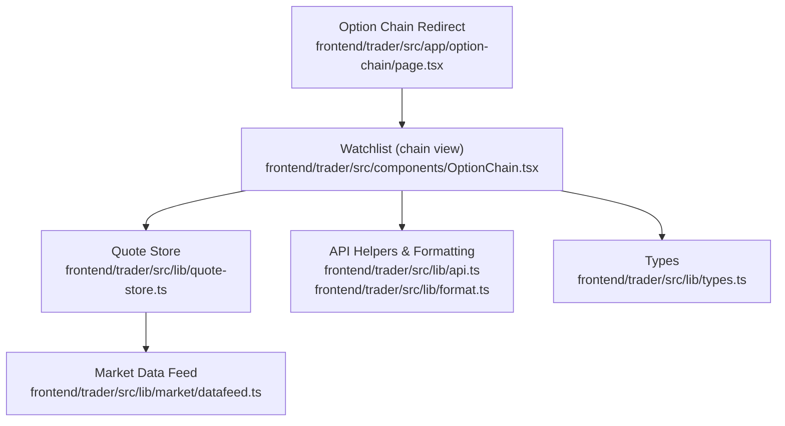
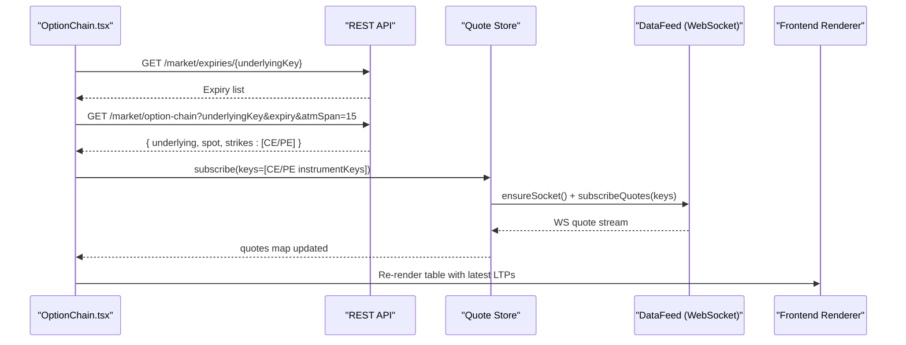
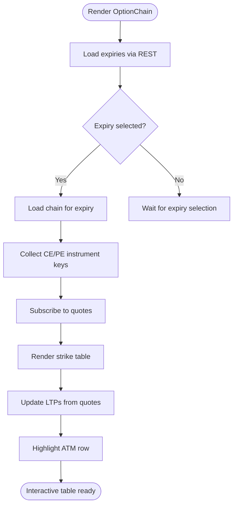
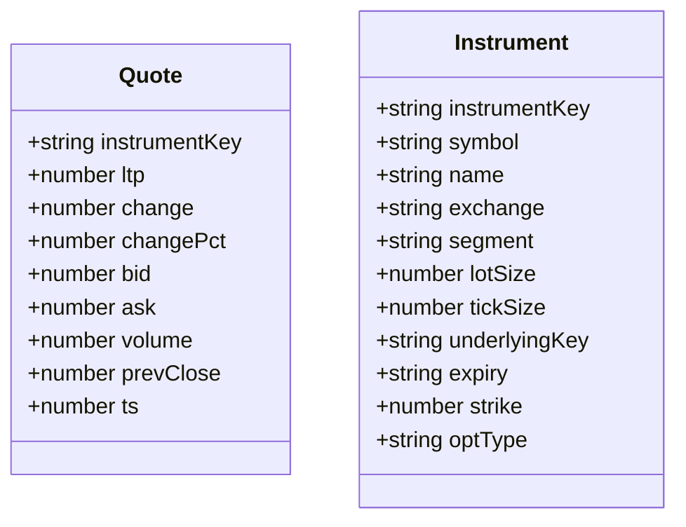
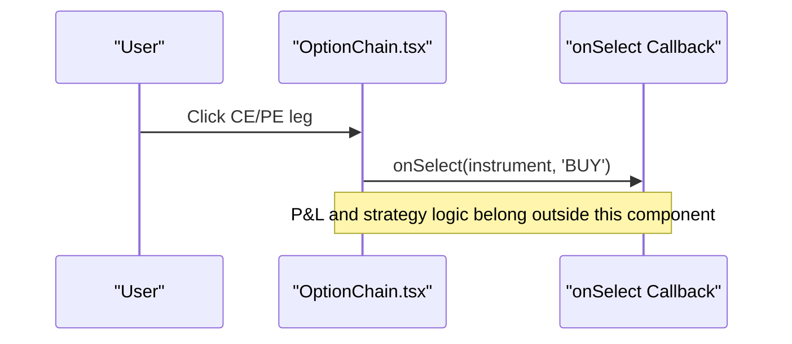
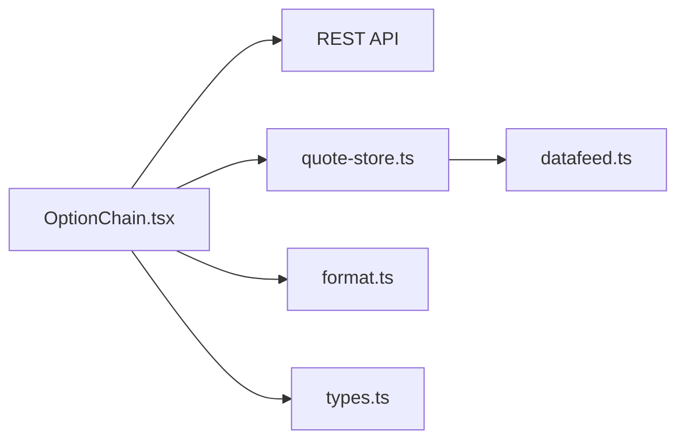

# Option Chain Visualization

<cite>
**Referenced Files in This Document**
- [page.tsx](file://frontend/trader/src/app/option-chain/page.tsx)
- [OptionChain.tsx](file://frontend/trader/src/components/OptionChain.tsx)
- [quote-store.ts](file://frontend/trader/src/lib/quote-store.ts)
- [datafeed.ts](file://frontend/trader/src/lib/market/datafeed.ts)
- [types.ts](file://frontend/trader/src/lib/types.ts)
- [format.ts](file://frontend/trader/src/lib/format.ts)
</cite>

## Table of Contents
1. [Introduction](#introduction)
2. [Project Structure](#project-structure)
3. [Core Components](#core-components)
4. [Architecture Overview](#architecture-overview)
5. [Detailed Component Analysis](#detailed-component-analysis)
6. [Dependency Analysis](#dependency-analysis)
7. [Performance Considerations](#performance-considerations)
8. [Troubleshooting Guide](#troubleshooting-guide)
9. [Conclusion](#conclusion)

## Introduction
This document explains the option chain visualization component used to display and interact with options contracts for a given underlying instrument. It covers the table layout, expiry selection, strike filtering, real-time price updates, and interactive features such as contract selection. It also outlines data structures, streaming architecture, and performance considerations for rendering large option chains efficiently.

## Project Structure
The option chain feature is implemented on the frontend using Next.js components and a client-side quote store that integrates with a WebSocket-based market feed. A legacy route redirects to the watchlist where the chain view is embedded.

**Diagram sources**
- [page.tsx:1-25](file://frontend/trader/src/app/option-chain/page.tsx#L1-L25)
- [OptionChain.tsx:1-170](file://frontend/trader/src/components/OptionChain.tsx#L1-L170)
- [quote-store.ts:1-151](file://frontend/trader/src/lib/quote-store.ts#L1-L151)
- [datafeed.ts:1-467](file://frontend/trader/src/lib/market/datafeed.ts#L1-L467)
- [types.ts:1-23](file://frontend/trader/src/lib/types.ts#L1-L23)
- [format.ts:1-43](file://frontend/trader/src/lib/format.ts#L1-L43)

**Section sources**
- [page.tsx:1-25](file://frontend/trader/src/app/option-chain/page.tsx#L1-L25)
- [OptionChain.tsx:1-170](file://frontend/trader/src/components/OptionChain.tsx#L1-L170)

## Core Components
- Option chain redirect page: routes legacy URLs to the watchlist chain view with query parameters preserved.
- OptionChain component: fetches expiries and chain data, subscribes to live quotes, renders a strike-centered table with CE/PE legs, highlights ATM rows, and supports selecting a leg for trading.
- Quote store: manages subscriptions, merges incoming quotes from WebSocket or REST snapshots, and tracks market open status.
- Market data feed: provides WebSocket connectivity, symbol search, bar history, and quote streaming.
- Types and formatting: define shared interfaces for quotes/instruments and provide consistent number formatting.

Key responsibilities:
- Fetch expiries and option chain for a selected expiry.
- Subscribe to all CE/PE instruments in the chain for live LTP updates.
- Render a compact strike table with CE LTP on the left, strike in the center, and PE LTP on the right.
- Highlight ATM strikes based on spot proximity.
- Provide click-to-select behavior for order entry integration.

**Section sources**
- [OptionChain.tsx:17-170](file://frontend/trader/src/components/OptionChain.tsx#L17-L170)
- [quote-store.ts:1-151](file://frontend/trader/src/lib/quote-store.ts#L1-L151)
- [datafeed.ts:204-467](file://frontend/trader/src/lib/market/datafeed.ts#L204-L467)
- [types.ts:1-23](file://frontend/trader/src/lib/types.ts#L1-L23)
- [format.ts:1-43](file://frontend/trader/src/lib/format.ts#L1-L43)

## Architecture Overview
The option chain uses a hybrid data flow combining REST for initial payloads and WebSocket for live updates. The component requests expiries and chain data via REST, then subscribes to quotes for all relevant instruments. The quote store maintains a single WebSocket connection and merges incoming ticks with snapshot data when needed.

**Diagram sources**
- [OptionChain.tsx:35-72](file://frontend/trader/src/components/OptionChain.tsx#L35-L72)
- [quote-store.ts:96-151](file://frontend/trader/src/lib/quote-store.ts#L96-L151)
- [datafeed.ts:336-413](file://frontend/trader/src/lib/market/datafeed.ts#L336-L413)

## Detailed Component Analysis

### Option Chain Table Layout
- Header shows the title and current spot price.
- Controls include an expiry selector dropdown and optional close button.
- Table columns: CE LTP (left), Strike (center), PE LTP (right).
- ATM row highlighting is applied when a strike is within a small percentage of spot.
- Empty/error/loading states are handled explicitly.

**Diagram sources**
- [OptionChain.tsx:35-72](file://frontend/trader/src/components/OptionChain.tsx#L35-L72)
- [OptionChain.tsx:109-145](file://frontend/trader/src/components/OptionChain.tsx#L109-L145)

**Section sources**
- [OptionChain.tsx:85-166](file://frontend/trader/src/components/OptionChain.tsx#L85-L166)

### Strike Price Filtering
- The chain request includes an ATM span parameter to limit visible strikes around the spot price.
- ATM detection is performed client-side by comparing each strike to the spot with a small threshold.
- No additional server-side filters are present in the component; filtering is primarily controlled by the ATM span and client-side ATM highlight.

Implementation notes:
- ATM span is passed in the query string when fetching the chain.
- ATM class is applied when the absolute difference between strike and spot is less than a small fraction of spot.

**Section sources**
- [OptionChain.tsx:57-58](file://frontend/trader/src/components/OptionChain.tsx#L57-L58)
- [OptionChain.tsx:122-124](file://frontend/trader/src/components/OptionChain.tsx#L122-L124)

### Expiry Date Selection
- On mount, expiries are fetched for the underlying key and the first expiry is auto-selected.
- Changing the expiry triggers a new chain fetch and re-subscription to quotes for the new set of instruments.
- Loading and empty states guide the user while data is being retrieved.

**Section sources**
- [OptionChain.tsx:35-50](file://frontend/trader/src/components/OptionChain.tsx#L35-L50)
- [OptionChain.tsx:52-72](file://frontend/trader/src/components/OptionChain.tsx#L52-L72)
- [OptionChain.tsx:94-108](file://frontend/trader/src/components/OptionChain.tsx#L94-L108)

### Greeks Display (Delta, Gamma, Theta, Vega)
- The current implementation does not render Greeks in the option chain table.
- The data model and UI focus on LTP, volume, and basic quote fields.
- To add Greeks, extend the chain response and table columns, and integrate pricing/Greeks computation in the backend or a pricing service.

[No sources needed since this section describes missing functionality]

### Real-Time Price Updates and Volume/Open Interest
- Live LTP updates arrive via WebSocket through the data feed and are merged into the quote store.
- The quote store polls REST snapshots periodically to keep data fresh, especially when the market is closed.
- Volume is part of the quote type and can be displayed if added to the table. Open interest is not included in the current quote structure.

**Diagram sources**
- [types.ts:1-23](file://frontend/trader/src/lib/types.ts#L1-L23)

**Section sources**
- [quote-store.ts:22-82](file://frontend/trader/src/lib/quote-store.ts#L22-L82)
- [quote-store.ts:96-151](file://frontend/trader/src/lib/quote-store.ts#L96-L151)
- [datafeed.ts:336-413](file://frontend/trader/src/lib/market/datafeed.ts#L336-L413)
- [types.ts:1-23](file://frontend/trader/src/lib/types.ts#L1-L23)

### Interactive Features: Contract Selection and P&L Calculation
- Clicking a CE or PE leg triggers a selection callback with instrument details and default side BUY.
- P&L calculation is not implemented in the component; it should be integrated at the order/position layer using strategy-specific logic.
- Strategy building tools are not present in the current component; they would require additional UI and state management.

**Diagram sources**
- [OptionChain.tsx:74-83](file://frontend/trader/src/components/OptionChain.tsx#L74-L83)

**Section sources**
- [OptionChain.tsx:74-83](file://frontend/trader/src/components/OptionChain.tsx#L74-L83)

## Dependency Analysis
The option chain depends on several modules:
- REST endpoints for expiries and chain data.
- Quote store for subscription management and merging quotes.
- Market data feed for WebSocket connectivity and quote streaming.
- Formatting utilities for consistent numeric presentation.

**Diagram sources**
- [OptionChain.tsx:1-170](file://frontend/trader/src/components/OptionChain.tsx#L1-L170)
- [quote-store.ts:1-151](file://frontend/trader/src/lib/quote-store.ts#L1-L151)
- [datafeed.ts:1-467](file://frontend/trader/src/lib/market/datafeed.ts#L1-L467)
- [format.ts:1-43](file://frontend/trader/src/lib/format.ts#L1-L43)
- [types.ts:1-23](file://frontend/trader/src/lib/types.ts#L1-L23)

**Section sources**
- [OptionChain.tsx:1-170](file://frontend/trader/src/components/OptionChain.tsx#L1-L170)
- [quote-store.ts:1-151](file://frontend/trader/src/lib/quote-store.ts#L1-L151)
- [datafeed.ts:1-467](file://frontend/trader/src/lib/market/datafeed.ts#L1-L467)

## Performance Considerations
- Minimize re-renders: The component updates only when quotes change; use memoization for expensive computations if adding more columns.
- Batch subscriptions: The quote store deduplicates instrument keys and ensures a single WebSocket connection for multiple subscriptions.
- Snapshot fallback: When the market is closed, REST snapshots are preferred to avoid stale or irrelevant WebSocket ticks.
- Efficient table rendering: Keep the strike table lean; consider virtualization if displaying very wide spans or many strikes.
- Avoid unnecessary network calls: Debounce expiry changes and reuse existing subscriptions when possible.
- Format numbers consistently: Use the provided formatter to prevent hydration mismatches and reduce overhead.

[No sources needed since this section provides general guidance]

## Troubleshooting Guide
Common issues and resolutions:
- No expiries found: Ensure the underlying is supported for index options; verify the endpoint returns a non-empty list.
- Chain empty: Check that the selected expiry has available strikes; adjust ATM span if necessary.
- Quotes not updating: Confirm WebSocket connection and engine availability; check error state in the quote store.
- Incorrect ATM highlight: Verify spot value and threshold logic; ensure spot is loaded before rendering.
- Hydration/format mismatches: Use the provided formatting utilities to maintain consistent output across server and client.

**Section sources**
- [OptionChain.tsx:101-108](file://frontend/trader/src/components/OptionChain.tsx#L101-L108)
- [quote-store.ts:119-149](file://frontend/trader/src/lib/quote-store.ts#L119-L149)
- [datafeed.ts:367-413](file://frontend/trader/src/lib/market/datafeed.ts#L367-L413)
- [format.ts:1-43](file://frontend/trader/src/lib/format.ts#L1-L43)

## Conclusion
The option chain visualization provides a focused, efficient interface for viewing and interacting with options contracts. It leverages REST for initial data and WebSocket for live updates, with robust handling of loading, errors, and ATM highlighting. While Greeks and advanced strategy tools are not currently implemented, the modular design allows for straightforward extension. For large chains, adopt virtualization and careful subscription management to maintain responsiveness.

[No sources needed since this section summarizes without analyzing specific files]