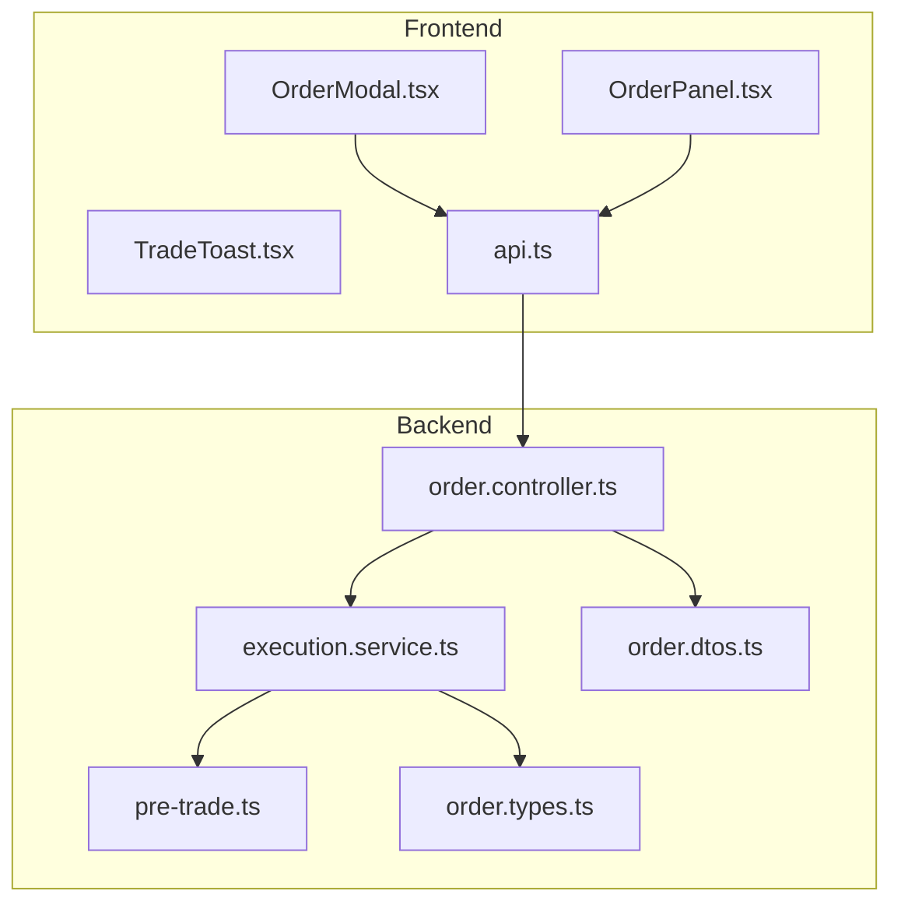
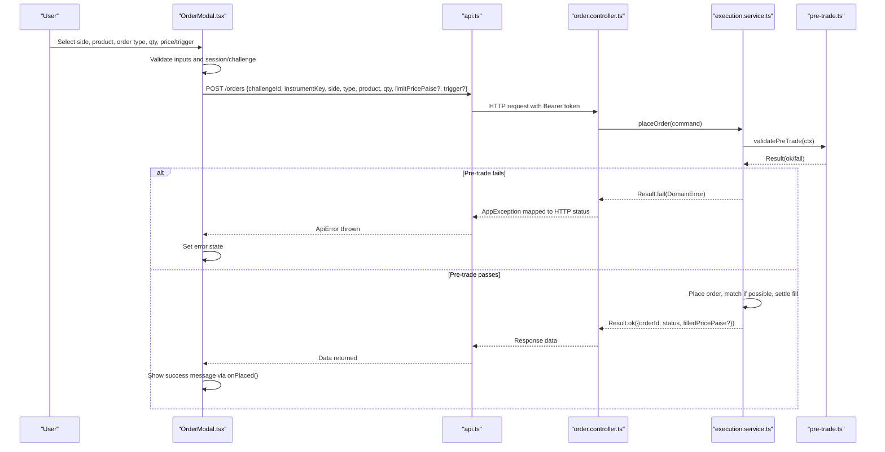
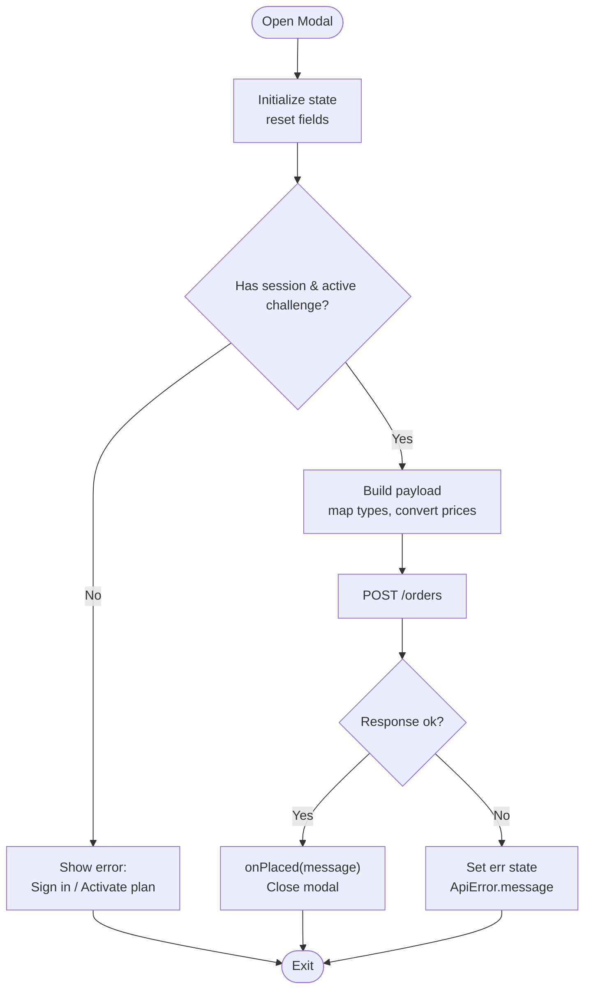
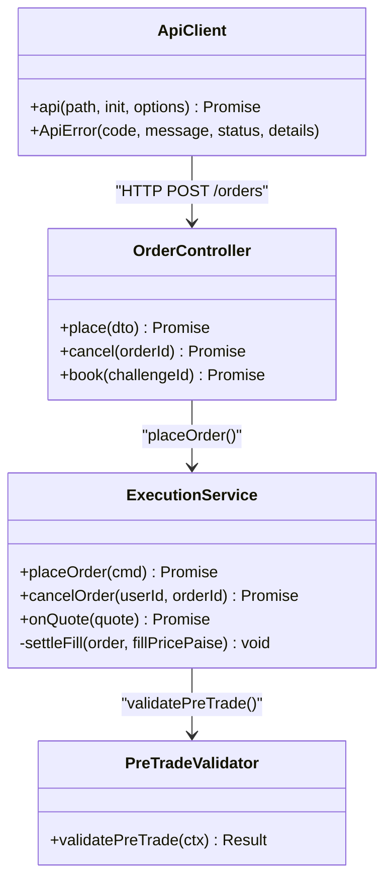
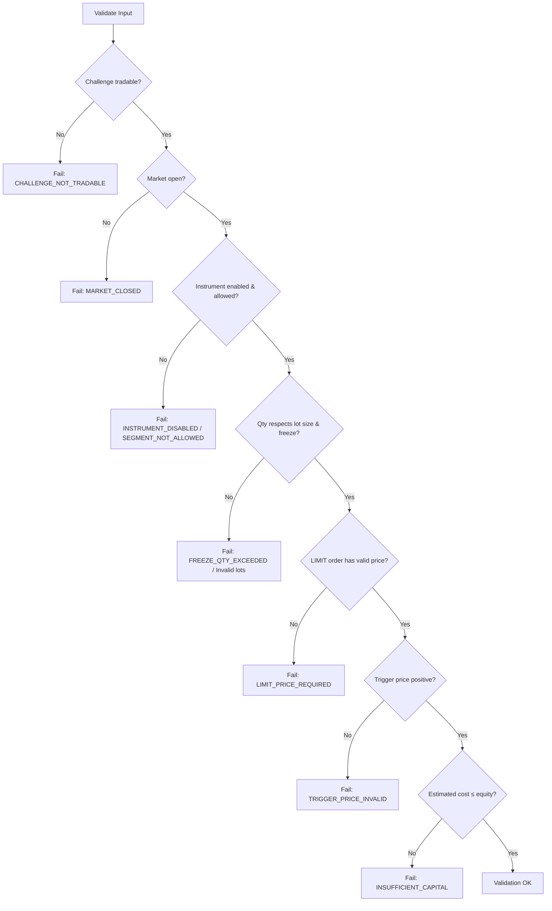
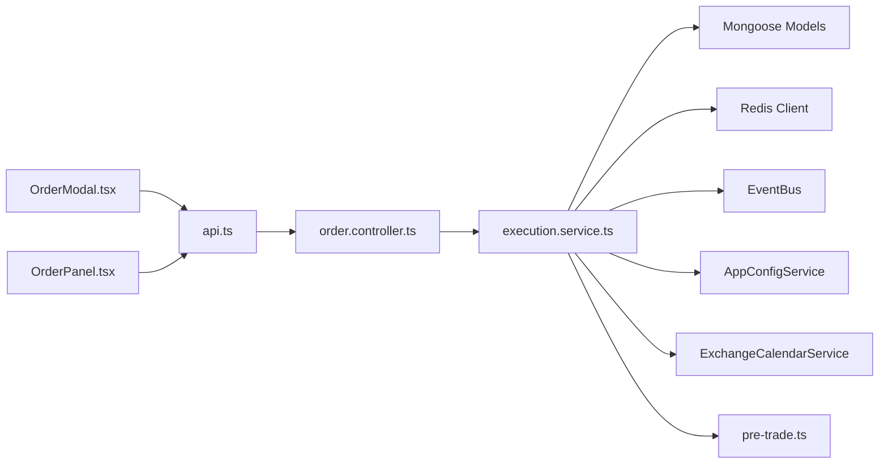

# Order Management Interface

<cite>
**Referenced Files in This Document**
- [OrderModal.tsx](file://frontend/trader/src/components/trading/OrderModal.tsx)
- [TradeToast.tsx](file://frontend/trader/src/components/trading/TradeToast.tsx)
- [OrderPanel.tsx](file://frontend/trader/src/components/OrderPanel.tsx)
- [api.ts](file://frontend/trader/src/lib/api.ts)
- [types.ts](file://frontend/trader/src/lib/types.ts)
- [order.controller.ts](file://backend/apps/api/src/modules/trading/presentation/order.controller.ts)
- [execution.service.ts](file://backend/apps/api/src/modules/trading/application/execution.service.ts)
- [order.types.ts](file://backend/apps/api/src/modules/trading/domain/order.types.ts)
- [order.dtos.ts](file://backend/apps/api/src/modules/trading/presentation/dto/order.dtos.ts)
- [pre-trade.ts](file://backend/apps/api/src/modules/trading/domain/pre-trade.ts)
</cite>

## Table of Contents
1. Introduction
2. Project Structure
3. Core Components
4. Architecture Overview
5. Detailed Component Analysis
6. Dependency Analysis
7. Performance Considerations
8. Troubleshooting Guide
9. Conclusion

## Introduction
This document explains the order management interface with a focus on the order modal, form validation, order type selection (market, limit, stop-loss), quantity and price handling, trade toast notifications, API integration for placing orders, error handling for failed transactions, user experience patterns, accessibility features, mobile responsiveness, and state management across the order lifecycle. It covers both the frontend components and backend execution flow to provide a complete picture of how orders are validated, placed, and settled.

## Project Structure
The order management feature spans frontend React components and a NestJS backend module:
- Frontend:
  - OrderModal.tsx: A modal-based order ticket with side selection, product tabs, order types, optional triggers, and submission.
  - TradeToast.tsx: A transient status notification component used after order placement or errors.
  - OrderPanel.tsx: An alternative inline order panel with similar capabilities.
  - api.ts: Centralized HTTP client that attaches auth tokens, handles timeouts, and normalizes errors into ApiError.
  - types.ts: Shared TypeScript types for quotes, instruments, sides, and challenge progress.
- Backend:
  - order.controller.ts: REST endpoints for placing, canceling, and viewing orders.
  - execution.service.ts: Virtual execution engine that validates pre-trade rules, places orders, matches limits, fires triggers, settles fills, updates positions/equity, and publishes events.
  - order.types.ts: Domain types for orders, statuses, and triggers.
  - order.dtos.ts: Request DTOs with validation decorators for incoming order payloads.
  - pre-trade.ts: Pure validation function enforcing business rules before order acceptance.

**Diagram sources**
- [OrderModal.tsx:1-374](file://frontend/trader/src/components/trading/OrderModal.tsx#L1-L374)
- [OrderPanel.tsx:1-179](file://frontend/trader/src/components/OrderPanel.tsx#L1-L179)
- [TradeToast.tsx:1-42](file://frontend/trader/src/components/trading/TradeToast.tsx#L1-L42)
- [api.ts:1-148](file://frontend/trader/src/lib/api.ts#L1-L148)
- [order.controller.ts:1-48](file://backend/apps/api/src/modules/trading/presentation/order.controller.ts#L1-L48)
- [execution.service.ts:1-309](file://backend/apps/api/src/modules/trading/application/execution.service.ts#L1-L309)
- [pre-trade.ts:1-79](file://backend/apps/api/src/modules/trading/domain/pre-trade.ts#L1-L79)
- [order.types.ts:1-32](file://backend/apps/api/src/modules/trading/domain/order.types.ts#L1-L32)
- [order.dtos.ts:1-22](file://backend/apps/api/src/modules/trading/presentation/dto/order.dtos.ts#L1-L22)

**Section sources**
- [OrderModal.tsx:1-374](file://frontend/trader/src/components/trading/OrderModal.tsx#L1-L374)
- [OrderPanel.tsx:1-179](file://frontend/trader/src/components/OrderPanel.tsx#L1-L179)
- [api.ts:1-148](file://frontend/trader/src/lib/api.ts#L1-L148)
- [order.controller.ts:1-48](file://backend/apps/api/src/modules/trading/presentation/order.controller.ts#L1-L48)
- [execution.service.ts:1-309](file://backend/apps/api/src/modules/trading/application/execution.service.ts#L1-L309)
- [pre-trade.ts:1-79](file://backend/apps/api/src/modules/trading/domain/pre-trade.ts#L1-L79)
- [order.types.ts:1-32](file://backend/apps/api/src/modules/trading/domain/order.types.ts#L1-L32)
- [order.dtos.ts:1-22](file://backend/apps/api/src/modules/trading/presentation/dto/order.dtos.ts#L1-L22)

## Core Components
- OrderModal: Modal dialog for placing orders with side selection (Buy/Sell), product selection (MIS/CNC/NRML), order type selection (Market/Limit/Stop-Limit/Stop-Market), optional trigger inputs (trigger price, target, stop-loss), and robust validation before submission. It also checks session and active challenge eligibility prior to placing an order.
- TradeToast: Lightweight notification that auto-dismisses after a short duration, indicating success or error outcomes from order actions.
- OrderPanel: Inline order ticket variant with similar functionality, including estimated value preview and optional trigger attachment.
- API Client: Centralized fetch wrapper that attaches Bearer tokens, enforces timeouts, redirects on authentication failures, and throws typed ApiError instances for consistent error handling.

Key responsibilities:
- Form validation: Enforce positive numeric inputs, required fields based on order type, and mutual exclusivity for triggers where applicable.
- Session and challenge gating: Ensure the user is authenticated and has an active trading challenge before allowing order placement.
- API integration: POST /orders with structured payload; handle responses and errors gracefully.
- User feedback: Show immediate UI states (loading, disabled buttons), display errors inline, and show toast notifications for results.

**Section sources**
- [OrderModal.tsx:21-172](file://frontend/trader/src/components/trading/OrderModal.tsx#L21-L172)
- [TradeToast.tsx:1-42](file://frontend/trader/src/components/trading/TradeToast.tsx#L1-L42)
- [OrderPanel.tsx:17-92](file://frontend/trader/src/components/OrderPanel.tsx#L17-L92)
- [api.ts:89-148](file://frontend/trader/src/lib/api.ts#L89-L148)

## Architecture Overview
The order placement flow involves frontend validation, API call, backend pre-trade checks, virtual matching, settlement, and event publishing. The following sequence diagram maps the actual code paths:

**Diagram sources**
- [OrderModal.tsx:94-172](file://frontend/trader/src/components/trading/OrderModal.tsx#L94-L172)
- [api.ts:91-148](file://frontend/trader/src/lib/api.ts#L91-L148)
- [order.controller.ts:23-46](file://backend/apps/api/src/modules/trading/presentation/order.controller.ts#L23-L46)
- [execution.service.ts:68-130](file://backend/apps/api/src/modules/trading/application/execution.service.ts#L68-L130)
- [pre-trade.ts:33-78](file://backend/apps/api/src/modules/trading/domain/pre-trade.ts#L33-L78)

## Detailed Component Analysis

### OrderModal Implementation
- Inputs and State:
  - Side: BUY/SELL toggle.
  - Product: MIS/CNC/NRML (mapped to INTRADAY/CARRY_FORWARD for API).
  - Order Type: MARKET, LIMIT, SL, SL-M (mapped to MARKET/LIMIT for API).
  - Quantity: Minimum enforced at 1; defaults to lot size when opening modal.
  - Price: For LIMIT orders; step increments supported.
  - Trigger: Optional trigger price, target, or stop-loss; mutually exclusive logic handled by conditional rendering and validation.
- Validation Logic:
  - Requires active session and active challenge status (PENDING/ACTIVE).
  - Validates numeric inputs and positivity for prices and triggers.
  - Converts rupees to paise for API payloads.
  - Maps UI order types to API-compatible types.
- Submission Flow:
  - Calls POST /orders with structured payload.
  - On success, displays a success message via onPlaced callback and closes modal.
  - On failure, sets error state for inline display.
- Accessibility and UX:
  - Uses role="dialog", aria-modal, aria-labelledby for screen readers.
  - Escape key closes modal; prevents background scrolling while open.
  - Mobile responsive layout with bottom sheet behavior on small screens.
  - Visual feedback: disabled submit during submission, inline error banner.

**Diagram sources**
- [OrderModal.tsx:49-75](file://frontend/trader/src/components/trading/OrderModal.tsx#L49-L75)
- [OrderModal.tsx:94-172](file://frontend/trader/src/components/trading/OrderModal.tsx#L94-L172)
- [OrderModal.tsx:174-258](file://frontend/trader/src/components/trading/OrderModal.tsx#L174-L258)
- [OrderModal.tsx:260-370](file://frontend/trader/src/components/trading/OrderModal.tsx#L260-L370)

**Section sources**
- [OrderModal.tsx:21-172](file://frontend/trader/src/components/trading/OrderModal.tsx#L21-L172)
- [OrderModal.tsx:174-370](file://frontend/trader/src/components/trading/OrderModal.tsx#L174-L370)

### TradeToast Notifications
- Purpose: Display transient messages for order outcomes (success or error).
- Behavior: Auto-dismisses after a fixed timeout; uses role="status" for accessibility.
- Styling: Positioned at bottom center with subtle animation; color-coded borders for ok/err.

**Section sources**
- [TradeToast.tsx:1-42](file://frontend/trader/src/components/trading/TradeToast.tsx#L1-L42)

### OrderPanel (Alternative UI)
- Provides an inline order ticket with similar capabilities: side, product, order type, quantity, limit price, optional trigger (SL XOR Target), estimated value preview, and submit.
- Uses the same API client and error handling pattern; returns success/error messages via onPlaced callback.

**Section sources**
- [OrderPanel.tsx:17-92](file://frontend/trader/src/components/OrderPanel.tsx#L17-L92)
- [OrderPanel.tsx:94-179](file://frontend/trader/src/components/OrderPanel.tsx#L94-L179)

### API Integration and Error Handling
- Client:
  - Attaches Bearer token automatically; supports custom headers.
  - Enforces default timeouts; abort controller cancels long-running requests.
  - Normalizes responses; throws ApiError with code, message, status, and details.
  - Handles 401 by clearing sessions and redirecting to login appropriately.
- Backend Controller:
  - Protects routes with JWT guard.
  - Throttles order placement to prevent abuse.
  - Unwraps domain Result to throw AppException with appropriate HTTP status codes.
- Execution Service:
  - Validates pre-trade rules using pure function.
  - Places orders, attempts immediate fills for market/limit orders, manages triggers, and settles fills under per-account locks.
  - Updates positions, holdings, trades, ledger entries, and challenge equity; publishes events for downstream consumers.

**Diagram sources**
- [api.ts:89-148](file://frontend/trader/src/lib/api.ts#L89-L148)
- [order.controller.ts:23-46](file://backend/apps/api/src/modules/trading/presentation/order.controller.ts#L23-L46)
- [execution.service.ts:68-130](file://backend/apps/api/src/modules/trading/application/execution.service.ts#L68-L130)
- [pre-trade.ts:33-78](file://backend/apps/api/src/modules/trading/domain/pre-trade.ts#L33-L78)

**Section sources**
- [api.ts:1-148](file://frontend/trader/src/lib/api.ts#L1-L148)
- [order.controller.ts:1-48](file://backend/apps/api/src/modules/trading/presentation/order.controller.ts#L1-L48)
- [execution.service.ts:1-309](file://backend/apps/api/src/modules/trading/application/execution.service.ts#L1-L309)
- [pre-trade.ts:1-79](file://backend/apps/api/src/modules/trading/domain/pre-trade.ts#L1-L79)

### Order Validation Logic
- Frontend:
  - Ensures numeric inputs are finite and positive.
  - Converts rupees to paise for API payloads.
  - Maps UI order types to API-compatible types.
  - Checks session and active challenge status before submission.
- Backend:
  - DTO validation enforces allowed values and constraints (e.g., side, type, product, qty, limitPricePaise, trigger).
  - Pre-trade validation checks:
    - Challenge must be tradable (PENDING/ACTIVE).
    - Market must be open for the segment.
    - Instrument must be enabled and allowed by plan segments.
    - Quantity must respect lot size and freeze limits.
    - Limit orders require a positive limit price.
    - Trigger price must be positive.
    - Estimated cost must not exceed available equity.

**Diagram sources**
- [pre-trade.ts:33-78](file://backend/apps/api/src/modules/trading/domain/pre-trade.ts#L33-L78)
- [order.dtos.ts:1-22](file://backend/apps/api/src/modules/trading/presentation/dto/order.dtos.ts#L1-L22)
- [OrderModal.tsx:94-172](file://frontend/trader/src/components/trading/OrderModal.tsx#L94-L172)

**Section sources**
- [pre-trade.ts:1-79](file://backend/apps/api/src/modules/trading/domain/pre-trade.ts#L1-L79)
- [order.dtos.ts:1-22](file://backend/apps/api/src/modules/trading/presentation/dto/order.dtos.ts#L1-L22)
- [OrderModal.tsx:94-172](file://frontend/trader/src/components/trading/OrderModal.tsx#L94-L172)

### API Call Patterns
- Frontend:
  - Uses centralized api() function to POST /orders with JSON body containing challengeId, instrumentKey, side, type, product, qty, optional limitPricePaise, and optional trigger.
  - Handles ApiError uniformly; shows inline errors or triggers toast via onPlaced callbacks.
- Backend:
  - Controller receives validated DTO, calls ExecutionService.placeOrder, unwraps Result to throw AppException with mapped HTTP status.
  - Execution service performs pre-trade validation, persists order, attempts immediate fills, and settles fills under per-account Redis lock.

**Section sources**
- [OrderModal.tsx:141-172](file://frontend/trader/src/components/trading/OrderModal.tsx#L141-L172)
- [OrderPanel.tsx:68-92](file://frontend/trader/src/components/OrderPanel.tsx#L68-L92)
- [api.ts:91-148](file://frontend/trader/src/lib/api.ts#L91-L148)
- [order.controller.ts:23-46](file://backend/apps/api/src/modules/trading/presentation/order.controller.ts#L23-L46)
- [execution.service.ts:68-130](file://backend/apps/api/src/modules/trading/application/execution.service.ts#L68-L130)

### State Management for Order Lifecycle
- Frontend:
  - Local state tracks side, product, order type, quantities, prices, triggers, submitting flag, and error message.
  - Effects reset state when modal opens/closes; fetch current challenge info to gate trading.
  - Success path invokes onPlaced callback to propagate result to parent (e.g., toast).
- Backend:
  - Orders persist with status OPEN/FILLED/CANCELLED/REJECTED.
  - Positions update net quantity, average price, realized PnL; holdings mirror carry-forward positions.
  - Trades recorded with fill price, charges, realized PnL.
  - Challenge equity updated; peak equity tracked; trading days counted; events published for downstream processes.

**Section sources**
- [OrderModal.tsx:35-75](file://frontend/trader/src/components/trading/OrderModal.tsx#L35-L75)
- [OrderModal.tsx:94-172](file://frontend/trader/src/components/trading/OrderModal.tsx#L94-L172)
- [execution.service.ts:181-262](file://backend/apps/api/src/modules/trading/application/execution.service.ts#L181-L262)

## Dependency Analysis
- Frontend dependencies:
  - OrderModal depends on quote store for LTP, format utilities, icons, API client, and auth session.
  - TradeToast is independent and consumed by parent components to display results.
  - OrderPanel mirrors OrderModal’s dependencies and usage patterns.
- Backend dependencies:
  - OrderController depends on ExecutionService and PortfolioService; uses JWT guard and throttling.
  - ExecutionService depends on Mongoose models (Order, Position, Holding, Trade, Challenge, LedgerEntry, Instrument), Redis client, EventBus, AppConfigService, ExchangeCalendarService, and shared utilities (Result, DomainError, Quote cache keys).
  - Pre-trade validator is pure and depends on shared domain primitives (Quantity, Result, DomainError).

**Diagram sources**
- [OrderModal.tsx:1-10](file://frontend/trader/src/components/trading/OrderModal.tsx#L1-L10)
- [OrderPanel.tsx:1-10](file://frontend/trader/src/components/OrderPanel.tsx#L1-L10)
- [api.ts:1-10](file://frontend/trader/src/lib/api.ts#L1-L10)
- [order.controller.ts:1-10](file://backend/apps/api/src/modules/trading/presentation/order.controller.ts#L1-L10)
- [execution.service.ts:1-21](file://backend/apps/api/src/modules/trading/application/execution.service.ts#L1-L21)
- [pre-trade.ts:1-3](file://backend/apps/api/src/modules/trading/domain/pre-trade.ts#L1-L3)

**Section sources**
- [OrderModal.tsx:1-10](file://frontend/trader/src/components/trading/OrderModal.tsx#L1-L10)
- [OrderPanel.tsx:1-10](file://frontend/trader/src/components/OrderPanel.tsx#L1-L10)
- [api.ts:1-10](file://frontend/trader/src/lib/api.ts#L1-L10)
- [order.controller.ts:1-10](file://backend/apps/api/src/modules/trading/presentation/order.controller.ts#L1-L10)
- [execution.service.ts:1-21](file://backend/apps/api/src/modules/trading/application/execution.service.ts#L1-L21)
- [pre-trade.ts:1-3](file://backend/apps/api/src/modules/trading/domain/pre-trade.ts#L1-L3)

## Performance Considerations
- Frontend:
  - Minimal re-renders by updating local state; modal resets efficiently on open/close.
  - Debouncing or input validation can reduce unnecessary API calls; consider adding debounced price updates if needed.
- Backend:
  - Per-account Redis locks ensure race-free equity and drawdown calculations; lock durations are bounded to avoid deadlocks.
  - Immediate matching reduces latency for market and crossable limit orders.
  - Quote caching via Redis avoids repeated lookups; slippage configuration controls fill pricing.
  - Throttling on order placement protects against abuse.

[No sources needed since this section provides general guidance]

## Troubleshooting Guide
Common issues and resolutions:
- Authentication failures:
  - Symptom: 401 responses; redirection to login.
  - Resolution: Ensure session token is present; client clears session and redirects appropriately.
- No active challenge:
  - Symptom: Frontend rejects placement; backend may return CHALLENGE_NOT_TRADABLE.
  - Resolution: Activate a plan before trading; verify challenge status.
- Market closed:
  - Symptom: Backend returns MARKET_CLOSED.
  - Resolution: Wait until market opens for the relevant segment.
- Insufficient capital:
  - Symptom: Backend returns INSUFFICIENT_CAPITAL.
  - Resolution: Reduce order size or increase available equity.
- Invalid inputs:
  - Symptom: Frontend validation errors; backend DTO/validation errors.
  - Resolution: Enter positive numeric values; ensure limit price for LIMIT orders; ensure trigger price is positive.
- Network timeouts:
  - Symptom: ApiError with TIMEOUT code.
  - Resolution: Retry request; check network stability; adjust timeout if necessary.

**Section sources**
- [api.ts:25-65](file://frontend/trader/src/lib/api.ts#L25-L65)
- [api.ts:103-148](file://frontend/trader/src/lib/api.ts#L103-L148)
- [order.controller.ts:11-21](file://backend/apps/api/src/modules/trading/presentation/order.controller.ts#L11-L21)
- [pre-trade.ts:33-78](file://backend/apps/api/src/modules/trading/domain/pre-trade.ts#L33-L78)

## Conclusion
The order management interface combines a robust frontend modal with comprehensive validation and a resilient backend execution engine. Users can select order types (market, limit, stop-loss), configure quantities and prices, and receive immediate feedback through inline errors and toast notifications. The backend enforces strict pre-trade rules, ensures data consistency with per-account locks, and updates positions, equity, and events accordingly. Accessibility features and mobile responsiveness enhance usability across devices. Together, these components deliver a reliable, user-friendly trading experience with clear error handling and state management throughout the order lifecycle.

[No sources needed since this section summarizes without analyzing specific files]