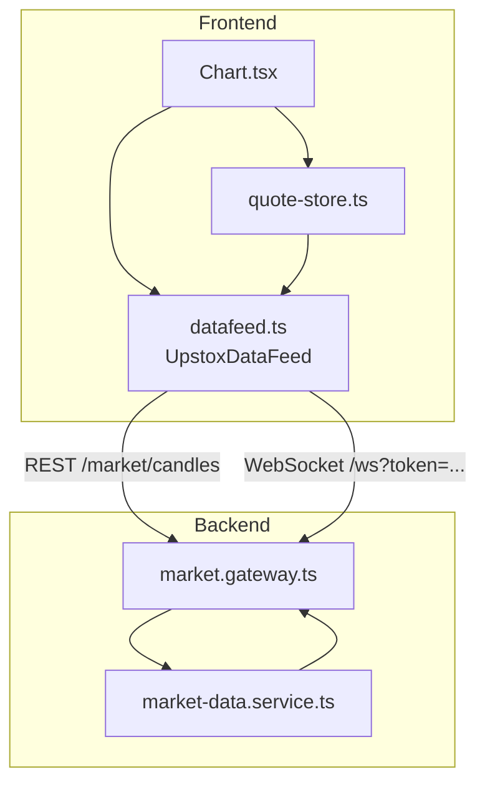
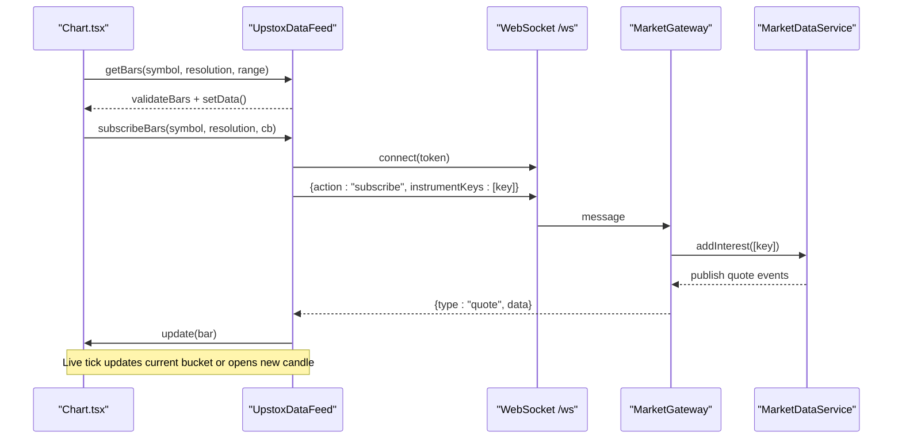
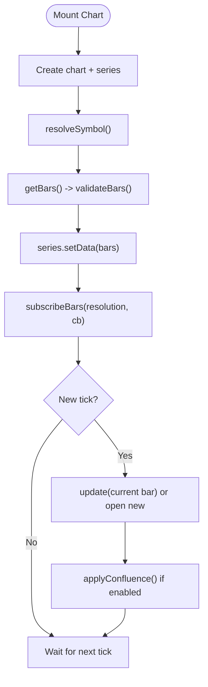
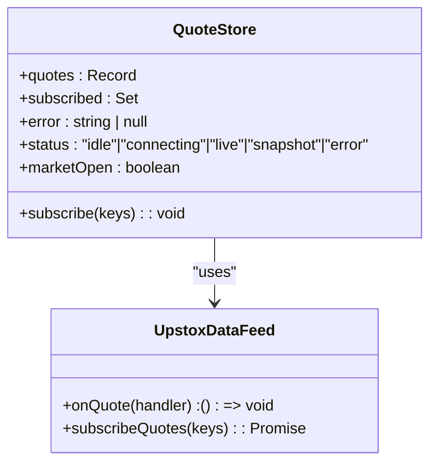
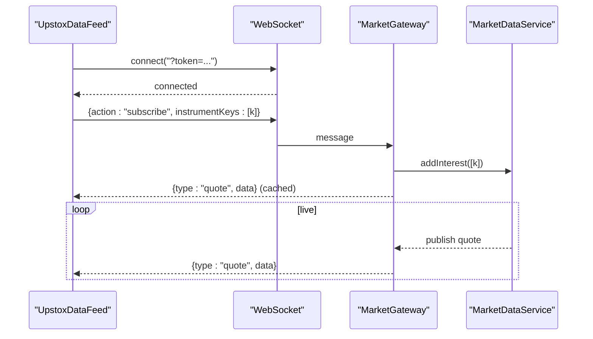
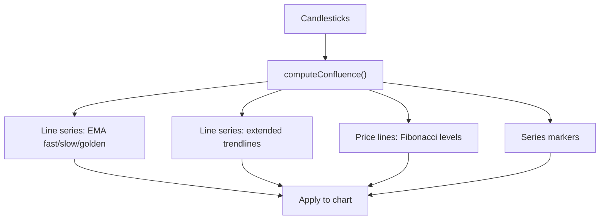
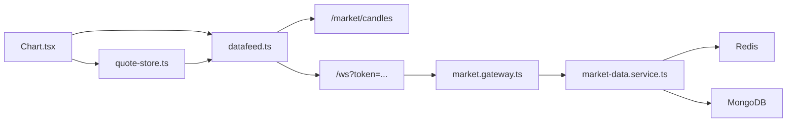

# Real-time Charting System

<cite>
**Referenced Files in This Document**
- [Chart.tsx](file://frontend/trader/src/components/Chart.tsx)
- [datafeed.ts](file://frontend/trader/src/lib/market/datafeed.ts)
- [quote-store.ts](file://frontend/trader/src/lib/quote-store.ts)
- [types.ts](file://frontend/trader/src/lib/types.ts)
- [market.gateway.ts](file://backend/apps/api/src/modules/market/presentation/market.gateway.ts)
- [market-data.service.ts](file://backend/apps/api/src/modules/market/application/market-data.service.ts)
</cite>

## Table of Contents
1. [Introduction](#introduction)
2. [Project Structure](#project-structure)
3. [Core Components](#core-components)
4. [Architecture Overview](#architecture-overview)
5. [Detailed Component Analysis](#detailed-component-analysis)
6. [Dependency Analysis](#dependency-analysis)
7. [Performance Considerations](#performance-considerations)
8. [Troubleshooting Guide](#troubleshooting-guide)
9. [Conclusion](#conclusion)
10. [Appendices](#appendices)

## Introduction
This document explains the real-time charting system that renders Lightweight Charts candlesticks, streams live quotes via WebSocket, and manages large datasets efficiently. It covers the quote store for market data, WebSocket connection handling, performance optimizations, customization options, technical indicators support, responsive design patterns, event handling, and memory management strategies.

## Project Structure
The charting stack is split between frontend components and backend services:
- Frontend
  - Chart component integrates Lightweight Charts and subscribes to bars and quotes.
  - Data feed adapter translates REST history and WebSocket ticks into Lightweight Charts updates.
  - Quote store aggregates live quotes and snapshots with a single shared WebSocket.
- Backend
  - WebSocket gateway authenticates clients, fans out quotes per instrument, and coordinates interest-based upstream subscriptions.
  - Market data service ingests ticks, persists candles, publishes events, and monitors feed health.

**Diagram sources**
- [Chart.tsx:112-466](file://frontend/trader/src/components/Chart.tsx#L112-L466)
- [datafeed.ts:204-466](file://frontend/trader/src/lib/market/datafeed.ts#L204-L466)
- [quote-store.ts:96-150](file://frontend/trader/src/lib/quote-store.ts#L96-L150)
- [market.gateway.ts:26-133](file://backend/apps/api/src/modules/market/presentation/market.gateway.ts#L26-L133)
- [market-data.service.ts:25-139](file://backend/apps/api/src/modules/market/application/market-data.service.ts#L25-L139)

**Section sources**
- [Chart.tsx:112-466](file://frontend/trader/src/components/Chart.tsx#L112-L466)
- [datafeed.ts:204-466](file://frontend/trader/src/lib/market/datafeed.ts#L204-L466)
- [quote-store.ts:96-150](file://frontend/trader/src/lib/quote-store.ts#L96-L150)
- [market.gateway.ts:26-133](file://backend/apps/api/src/modules/market/presentation/market.gateway.ts#L26-L133)
- [market-data.service.ts:25-139](file://backend/apps/api/src/modules/market/application/market-data.service.ts#L25-L139)

## Core Components
- Lightweight Charts integration: The chart component creates and configures the chart instance, adds candlestick and overlay line series, and applies theme-aware styling and autoscaling.
- Candlestick rendering: Bars are loaded from REST history, validated, normalized, and set on the series; live ticks update the current bar or open new ones based on time buckets.
- Real-time data streaming: A shared WebSocket connects once and handles both bar updates and quote updates; the backend uses rooms per instrument and Redis caching for last quotes.
- Quote store: Manages subscriptions, merges incoming quotes with snapshots, tracks market open status, and provides reactive access to quotes for UI components.

**Section sources**
- [Chart.tsx:236-306](file://frontend/trader/src/components/Chart.tsx#L236-L306)
- [Chart.tsx:309-466](file://frontend/trader/src/components/Chart.tsx#L309-L466)
- [datafeed.ts:269-302](file://frontend/trader/src/lib/market/datafeed.ts#L269-L302)
- [datafeed.ts:304-359](file://frontend/trader/src/lib/market/datafeed.ts#L304-L359)
- [datafeed.ts:421-458](file://frontend/trader/src/lib/market/datafeed.ts#L421-L458)
- [quote-store.ts:96-150](file://frontend/trader/src/lib/quote-store.ts#L96-L150)
- [market.gateway.ts:48-133](file://backend/apps/api/src/modules/market/presentation/market.gateway.ts#L48-L133)
- [market-data.service.ts:103-139](file://backend/apps/api/src/modules/market/application/market-data.service.ts#L103-L139)

## Architecture Overview
The system follows a client-server streaming architecture:
- Client-side chart requests historical bars via REST and subscribes to live bar updates via WebSocket.
- The data feed adapter normalizes timestamps, validates bars, and updates the chart incrementally.
- The backend gateway authenticates connections, fans out quotes to subscribers, and coordinates upstream subscriptions based on active rooms.
- The market data service ingests ticks, caches quotes in Redis, publishes events, and aggregates 1-minute candles.

**Diagram sources**
- [Chart.tsx:309-466](file://frontend/trader/src/components/Chart.tsx#L309-L466)
- [datafeed.ts:269-302](file://frontend/trader/src/lib/market/datafeed.ts#L269-L302)
- [datafeed.ts:304-359](file://frontend/trader/src/lib/market/datafeed.ts#L304-L359)
- [datafeed.ts:421-458](file://frontend/trader/src/lib/market/datafeed.ts#L421-L458)
- [market.gateway.ts:48-133](file://backend/apps/api/src/modules/market/presentation/market.gateway.ts#L48-L133)
- [market-data.service.ts:65-108](file://backend/apps/api/src/modules/market/application/market-data.service.ts#L65-L108)

## Detailed Component Analysis

### Lightweight Charts Integration and Candlestick Rendering
- Chart lifecycle: Creates chart and series on mount, applies theme colors, grid lines, price scale margins, and crosshair mode. Cleans up on unmount to prevent leaks.
- History loading: Resolves symbol info, fetches bars within a time window, validates and normalizes them, sets initial data, and fits the scale.
- Live updates: Subscribes to bar updates; each tick updates the current candle’s OHLC or opens a new candle when the time bucket changes.
- Overlays: Adds EMA and trendline line series with autoscale disabled so they do not distort the price scale. Fibonacci levels are drawn as price lines only when enabled.

**Diagram sources**
- [Chart.tsx:236-306](file://frontend/trader/src/components/Chart.tsx#L236-L306)
- [Chart.tsx:309-466](file://frontend/trader/src/components/Chart.tsx#L309-L466)
- [datafeed.ts:269-302](file://frontend/trader/src/lib/market/datafeed.ts#L269-L302)
- [datafeed.ts:421-458](file://frontend/trader/src/lib/market/datafeed.ts#L421-L458)

**Section sources**
- [Chart.tsx:236-306](file://frontend/trader/src/components/Chart.tsx#L236-L306)
- [Chart.tsx:309-466](file://frontend/trader/src/components/Chart.tsx#L309-L466)

### Quote Store Implementation
- State model: Holds quotes map, subscribed keys, error state, status, and market open flag.
- Subscription flow: On first subscription, attaches a single listener to the data feed, starts snapshot polling, and initiates WebSocket subscription for fresh keys.
- Merge logic: When market is closed, REST snapshots win; otherwise, newer timestamps overwrite older quotes.
- Polling: Periodically refreshes quotes via REST and checks market status to adjust behavior.

**Diagram sources**
- [quote-store.ts:96-150](file://frontend/trader/src/lib/quote-store.ts#L96-L150)
- [datafeed.ts:336-359](file://frontend/trader/src/lib/market/datafeed.ts#L336-L359)
- [types.ts:1-8](file://frontend/trader/src/lib/types.ts#L1-L8)

**Section sources**
- [quote-store.ts:96-150](file://frontend/trader/src/lib/quote-store.ts#L96-L150)
- [types.ts:1-8](file://frontend/trader/src/lib/types.ts#L1-L8)

### WebSocket Connection Handling
- Client side:
  - Builds URL from environment or host; connects once and reuses the socket.
  - Sends subscribe/unsubscribe messages with instrument keys.
  - Handles errors and reconnects automatically after short delays.
- Server side:
  - Authenticates via JWT token query parameter.
  - Maintains per-instrument rooms; first subscriber triggers upstream interest, last leaves drops it.
  - Publishes cached last quote immediately upon joining a room, then relays live quotes.

**Diagram sources**
- [datafeed.ts:367-413](file://frontend/trader/src/lib/market/datafeed.ts#L367-L413)
- [market.gateway.ts:48-133](file://backend/apps/api/src/modules/market/presentation/market.gateway.ts#L48-L133)
- [market-data.service.ts:65-108](file://backend/apps/api/src/modules/market/application/market-data.service.ts#L65-L108)

**Section sources**
- [datafeed.ts:367-413](file://frontend/trader/src/lib/market/datafeed.ts#L367-L413)
- [market.gateway.ts:48-133](file://backend/apps/api/src/modules/market/presentation/market.gateway.ts#L48-L133)
- [market-data.service.ts:65-108](file://backend/apps/api/src/modules/market/application/market-data.service.ts#L65-L108)

### Technical Indicators Support and Customization
- Indicators: Computes confluence overlays including EMAs, golden cross line, trendlines, Fibonacci levels, and markers. Results are applied to line series and price lines without affecting autoscale.
- Customization: Theme-aware colors, grid visibility, price scale margins, crosshair mode, and timeframe buttons for 1m/5m/15m/1h resolutions.
- Multi-timeframe: Optionally loads 1-minute bars to improve indicator accuracy when higher timeframes are selected.

**Diagram sources**
- [Chart.tsx:157-232](file://frontend/trader/src/components/Chart.tsx#L157-L232)
- [Chart.tsx:236-306](file://frontend/trader/src/components/Chart.tsx#L236-L306)
- [Chart.tsx:417-438](file://frontend/trader/src/components/Chart.tsx#L417-L438)

**Section sources**
- [Chart.tsx:157-232](file://frontend/trader/src/components/Chart.tsx#L157-L232)
- [Chart.tsx:236-306](file://frontend/trader/src/components/Chart.tsx#L236-L306)
- [Chart.tsx:417-438](file://frontend/trader/src/components/Chart.tsx#L417-L438)

### Responsive Design Patterns
- Auto-sizing: Uses autoSize and ResizeObserver to recreate the chart when container size changes.
- Layout: Flex layout ensures the chart fills available space; timeframe toolbar sits above the chart area.
- Scale margins: Top/bottom margins keep labels visible during heavy overlays.

**Section sources**
- [Chart.tsx:236-306](file://frontend/trader/src/components/Chart.tsx#L236-L306)
- [Chart.tsx:468-499](file://frontend/trader/src/components/Chart.tsx#L468-L499)

## Dependency Analysis
- Chart depends on:
  - Lightweight Charts API for rendering.
  - Data feed for history and live updates.
  - Quote store for live LTP used in validation and seeding.
- Data feed depends on:
  - REST endpoints for instruments and candles.
  - WebSocket endpoint for live quotes and bar updates.
- Backend gateway depends on:
  - Token service for authentication.
  - Event bus and Redis for fan-out and caching.
  - Market data service for interest management and ingestion.
- Market data service depends on:
  - Market feed abstraction for upstream ticks.
  - Redis for quote cache and TTL.
  - MongoDB for 1-minute candle persistence.

**Diagram sources**
- [Chart.tsx:309-466](file://frontend/trader/src/components/Chart.tsx#L309-L466)
- [datafeed.ts:269-302](file://frontend/trader/src/lib/market/datafeed.ts#L269-L302)
- [datafeed.ts:367-413](file://frontend/trader/src/lib/market/datafeed.ts#L367-L413)
- [market.gateway.ts:48-133](file://backend/apps/api/src/modules/market/presentation/market.gateway.ts#L48-L133)
- [market-data.service.ts:103-139](file://backend/apps/api/src/modules/market/application/market-data.service.ts#L103-L139)

**Section sources**
- [Chart.tsx:309-466](file://frontend/trader/src/components/Chart.tsx#L309-L466)
- [datafeed.ts:269-302](file://frontend/trader/src/lib/market/datafeed.ts#L269-L302)
- [datafeed.ts:367-413](file://frontend/trader/src/lib/market/datafeed.ts#L367-L413)
- [market.gateway.ts:48-133](file://backend/apps/api/src/modules/market/presentation/market.gateway.ts#L48-L133)
- [market-data.service.ts:103-139](file://backend/apps/api/src/modules/market/application/market-data.service.ts#L103-L139)

## Performance Considerations
- Efficient updates: Use incremental updates for the current candle instead of full dataset refreshes.
- Validation and normalization: Reject invalid bars, deduplicate timestamps, and filter outliers to maintain smooth rendering.
- Autoscale control: Disable autoscale for overlay series to avoid unnecessary recalculations; apply targeted refits only when needed.
- Request limits: Cap countBack for history queries to reduce payload sizes.
- Debounced recomputation: Use requestAnimationFrame to batch indicator recomputation on rapid ticks.
- Memory cleanup: Remove series, price lines, and markers on chart destroy; unsubscribe listeners to prevent leaks.
- Interest-based subscriptions: Backend subscribes only to instruments with active rooms to minimize upstream load.

[No sources needed since this section provides general guidance]

## Troubleshooting Guide
- No candle data:
  - Ensure instruments are synced and accessible via REST.
  - Verify authentication token is present for live data.
- WebSocket connection failed:
  - Confirm engine is running and reachable at the expected host/port.
  - Check token validity and CORS/WSS configuration.
- Stale feed:
  - Backend watchdog detects stale feeds during market hours and resubscribes automatically.
- Out-of-range prices:
  - Validate incoming ticks against recent price ranges to prevent scale jumps.

**Section sources**
- [Chart.tsx:352-360](file://frontend/trader/src/components/Chart.tsx#L352-L360)
- [Chart.tsx:440-450](file://frontend/trader/src/components/Chart.tsx#L440-L450)
- [datafeed.ts:393-413](file://frontend/trader/src/lib/market/datafeed.ts#L393-L413)
- [market-data.service.ts:128-139](file://backend/apps/api/src/modules/market/application/market-data.service.ts#L128-L139)

## Conclusion
The real-time charting system combines Lightweight Charts with a robust data feed and WebSocket pipeline to deliver responsive, accurate candlestick charts. The quote store centralizes live market data, while the backend scales efficiently using interest-based subscriptions and Redis caching. With careful validation, incremental updates, and memory-safe practices, the system supports large datasets and complex overlays while maintaining smooth performance.

[No sources needed since this section summarizes without analyzing specific files]

## Appendices

### Chart Configuration Examples
- Timeframes: Configure supported resolutions and user-selectable buttons for 1m/5m/15m/1h.
- Price formatting: Derive precision and minMove from instrument tick size and segment.
- Overlay settings: Toggle EMAs, trendlines, Fibonacci levels, and markers via confluence settings.

**Section sources**
- [Chart.tsx:38-92](file://frontend/trader/src/components/Chart.tsx#L38-L92)
- [Chart.tsx:75-83](file://frontend/trader/src/components/Chart.tsx#L75-L83)
- [Chart.tsx:157-232](file://frontend/trader/src/components/Chart.tsx#L157-L232)

### Event Handling Patterns
- Bar subscription: Subscribe once per chart lifecycle; handle seed bar and ensure monotonic time progression.
- Quote subscription: Attach a single listener; merge quotes with snapshots; track market open status.
- Cleanup: Unsubscribe bars and quotes on unmount; clear intervals and timers.

**Section sources**
- [Chart.tsx:309-466](file://frontend/trader/src/components/Chart.tsx#L309-L466)
- [quote-store.ts:96-150](file://frontend/trader/src/lib/quote-store.ts#L96-L150)

### Memory Management Strategies
- Destroy chart and series on unmount to free resources.
- Clear price lines and markers before reapplying overlays.
- Avoid storing large arrays in component state; use refs for mutable buffers.
- Limit history payloads and use validation to drop invalid data early.

**Section sources**
- [Chart.tsx:293-306](file://frontend/trader/src/components/Chart.tsx#L293-L306)
- [Chart.tsx:140-155](file://frontend/trader/src/components/Chart.tsx#L140-L155)
- [datafeed.ts:124-157](file://frontend/trader/src/lib/market/datafeed.ts#L124-L157)