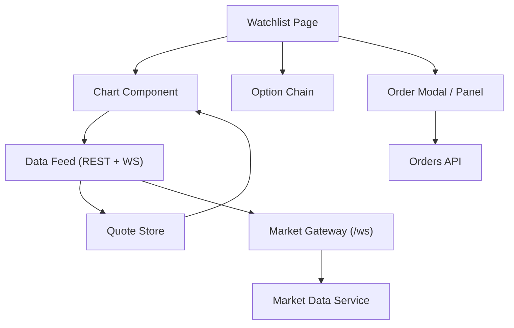
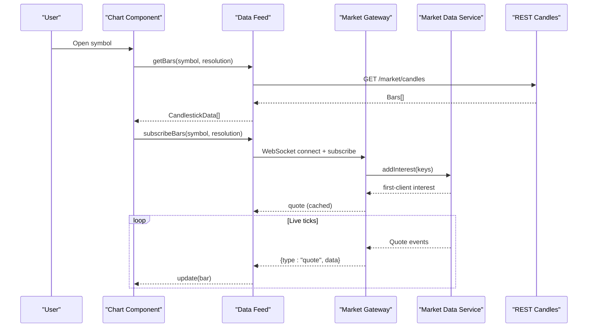
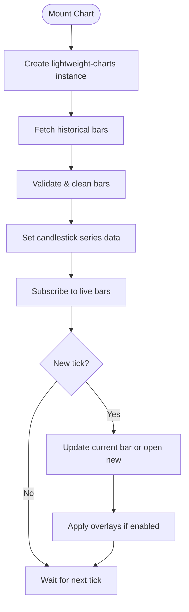
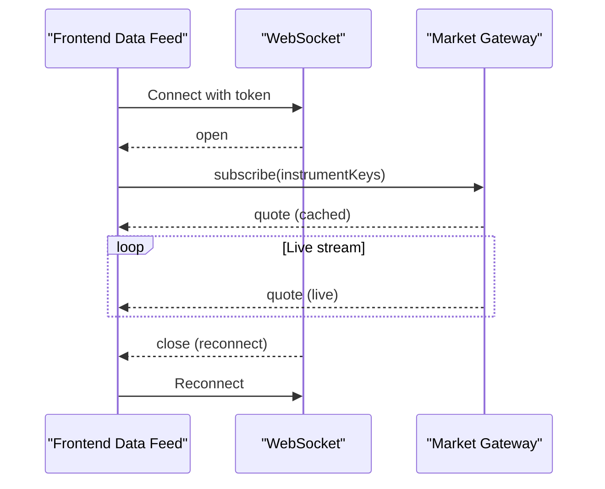
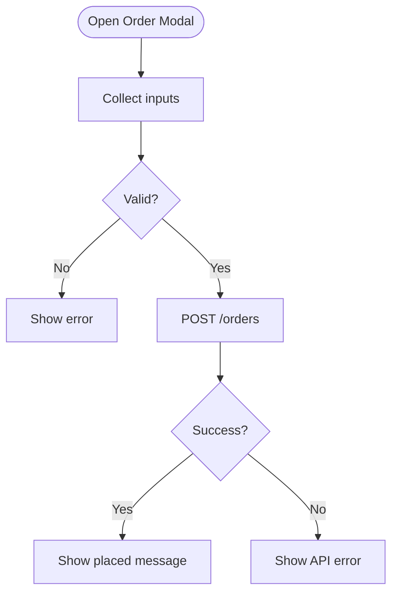
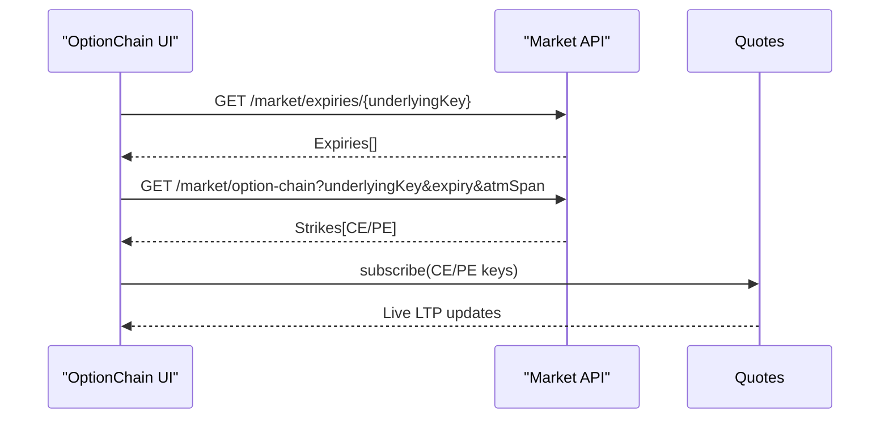
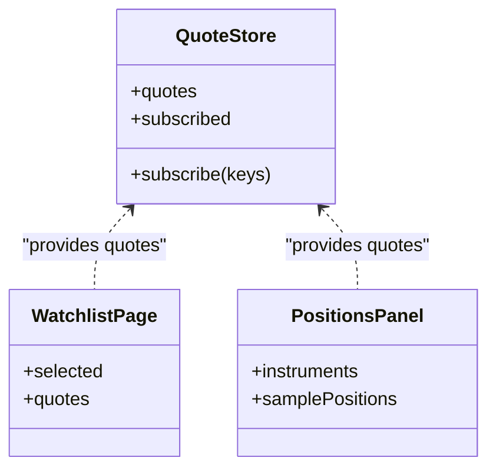
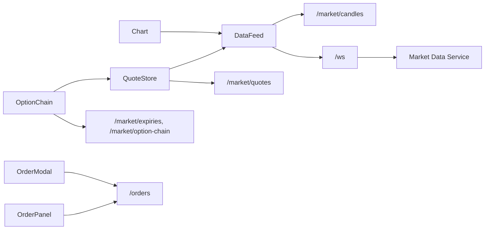

# Trading Terminal Interface

<cite>
**Referenced Files in This Document**
- [page.tsx](file://frontend/trader/src/app/watchlist/page.tsx)
- [Chart.tsx](file://frontend/trader/src/components/Chart.tsx)
- [datafeed.ts](file://frontend/trader/src/lib/market/datafeed.ts)
- [quote-store.ts](file://frontend/trader/src/lib/quote-store.ts)
- [OptionChain.tsx](file://frontend/trader/src/components/OptionChain.tsx)
- [OrderModal.tsx](file://frontend/trader/src/components/trading/OrderModal.tsx)
- [OrderPanel.tsx](file://frontend/trader/src/components/OrderPanel.tsx)
- [PositionsPanel.tsx](file://frontend/trader/src/components/PositionsPanel.tsx)
- [market.gateway.ts](file://backend/apps/api/src/modules/market/presentation/market.gateway.ts)
- [market-data.service.ts](file://backend/apps/api/src/modules/market/application/market-data.service.ts)
- [order.controller.ts](file://backend/apps/api/src/modules/trading/presentation/order.controller.ts)
</cite>

## Table of Contents
1. Introduction
2. Project Structure
3. Core Components
4. Architecture Overview
5. Detailed Component Analysis
6. Dependency Analysis
7. Performance Considerations
8. Troubleshooting Guide
9. Conclusion

## Introduction
This document explains the trading terminal interface, focusing on real-time charting with Lightweight Charts, order placement and validation, option chain visualization, live market data integration via WebSocket, order execution flow, position monitoring, responsive design, keyboard shortcuts, accessibility, performance optimizations for large datasets, and backend API integration with error handling strategies.

## Project Structure
The terminal is a Next.js client application composed of:
- A watchlist page that orchestrates list, chart, and option chain views
- A Lightweight Charts-based candlestick component with overlays and multi-timeframe support
- A data feed adapter that bridges REST candles and WebSocket quotes to the chart
- A quote store that merges live ticks and REST snapshots
- An option chain UI backed by REST endpoints
- Order modal and panel components for placing orders
- Backend modules exposing WebSocket gateway, market data pipeline, and order APIs

**Diagram sources**
- [page.tsx:481-710](file://frontend/trader/src/app/watchlist/page.tsx#L481-L710)
- [Chart.tsx:234-466](file://frontend/trader/src/components/Chart.tsx#L234-L466)
- [datafeed.ts:204-467](file://frontend/trader/src/lib/market/datafeed.ts#L204-L467)
- [quote-store.ts:96-151](file://frontend/trader/src/lib/quote-store.ts#L96-L151)
- [OptionChain.tsx:35-72](file://frontend/trader/src/components/OptionChain.tsx#L35-L72)
- [OrderModal.tsx:94-172](file://frontend/trader/src/components/trading/OrderModal.tsx#L94-L172)
- [OrderPanel.tsx:40-92](file://frontend/trader/src/components/OrderPanel.tsx#L40-L92)
- [market.gateway.ts:26-133](file://backend/apps/api/src/modules/market/presentation/market.gateway.ts#L26-L133)
- [market-data.service.ts:24-139](file://backend/apps/api/src/modules/market/application/market-data.service.ts#L24-L139)
- [order.controller.ts:23-47](file://backend/apps/api/src/modules/trading/presentation/order.controller.ts#L23-L47)

**Section sources**
- [page.tsx:481-710](file://frontend/trader/src/app/watchlist/page.tsx#L481-L710)
- [Chart.tsx:234-466](file://frontend/trader/src/components/Chart.tsx#L234-L466)
- [datafeed.ts:204-467](file://frontend/trader/src/lib/market/datafeed.ts#L204-L467)
- [quote-store.ts:96-151](file://frontend/trader/src/lib/quote-store.ts#L96-L151)
- [OptionChain.tsx:35-72](file://frontend/trader/src/components/OptionChain.tsx#L35-L72)
- [OrderModal.tsx:94-172](file://frontend/trader/src/components/trading/OrderModal.tsx#L94-L172)
- [OrderPanel.tsx:40-92](file://frontend/trader/src/components/OrderPanel.tsx#L40-L92)
- [market.gateway.ts:26-133](file://backend/apps/api/src/modules/market/presentation/market.gateway.ts#L26-L133)
- [market-data.service.ts:24-139](file://backend/apps/api/src/modules/market/application/market-data.service.ts#L24-L139)
- [order.controller.ts:23-47](file://backend/apps/api/src/modules/trading/presentation/order.controller.ts#L23-L47)

## Core Components
- Watchlist page: central layout, tabs, search, selection, mobile view switching, and orchestration of chart/chain/order flows
- Chart: Lightweight Charts integration, history loading, live updates, overlays (EMA, trendlines, Fibonacci), and confluence markers
- Data feed: REST candles + WebSocket quotes; bar bucketing, validation, deduplication, and outlier filtering
- Quote store: Zustand store merging live ticks and REST snapshots; market open status polling
- Option chain: expiry selection, strike table, live LTP via quotes subscription
- Order modal/panel: side/product/order type selection, price inputs, optional triggers, validation, submission, and feedback
- Positions panel: displays net quantity, average price, LTP, change, and P&L using live quotes

**Section sources**
- [page.tsx:82-167](file://frontend/trader/src/app/watchlist/page.tsx#L82-L167)
- [Chart.tsx:112-138](file://frontend/trader/src/components/Chart.tsx#L112-L138)
- [datafeed.ts:120-157](file://frontend/trader/src/lib/market/datafeed.ts#L120-L157)
- [quote-store.ts:22-68](file://frontend/trader/src/lib/quote-store.ts#L22-L68)
- [OptionChain.tsx:17-72](file://frontend/trader/src/components/OptionChain.tsx#L17-L72)
- [OrderModal.tsx:21-75](file://frontend/trader/src/components/trading/OrderModal.tsx#L21-L75)
- [OrderPanel.tsx:17-39](file://frontend/trader/src/components/OrderPanel.tsx#L17-L39)
- [PositionsPanel.tsx:8-49](file://frontend/trader/src/components/PositionsPanel.tsx#L8-L49)

## Architecture Overview
Real-time data path:
- Client subscribes to instrument keys via UpstoxDataFeed
- Data feed opens a WebSocket connection to the backend gateway with an access token
- Gateway authenticates, joins rooms per instrument, subscribes to the event bus, and relives cached last quote then live ticks
- Market Data Service aggregates 1m candles and persists them; it also manages upstream feed subscriptions on demand
- Chart receives historical bars via REST and updates live via WebSocket ticks

Order execution path:
- User submits order from modal or panel
- Frontend validates inputs and sends POST to /orders
- Backend controller enforces auth, throttling, and domain rules, returning success or structured errors

**Diagram sources**
- [Chart.tsx:308-466](file://frontend/trader/src/components/Chart.tsx#L308-L466)
- [datafeed.ts:269-324](file://frontend/trader/src/lib/market/datafeed.ts#L269-L324)
- [datafeed.ts:367-413](file://frontend/trader/src/lib/market/datafeed.ts#L367-L413)
- [market.gateway.ts:48-113](file://backend/apps/api/src/modules/market/presentation/market.gateway.ts#L48-L113)
- [market-data.service.ts:61-108](file://backend/apps/api/src/modules/market/application/market-data.service.ts#L61-L108)

**Section sources**
- [Chart.tsx:308-466](file://frontend/trader/src/components/Chart.tsx#L308-L466)
- [datafeed.ts:269-413](file://frontend/trader/src/lib/market/datafeed.ts#L269-L413)
- [market.gateway.ts:48-113](file://backend/apps/api/src/modules/market/presentation/market.gateway.ts#L48-L113)
- [market-data.service.ts:61-108](file://backend/apps/api/src/modules/market/application/market-data.service.ts#L61-L108)

## Detailed Component Analysis

### Real-time Charting with Lightweight Charts
- Creates chart instance with theme-aware colors and grid options
- Loads historical bars via REST, validates and cleans data, sets autoscale, and applies overlays
- Subscribes to live ticks; updates current candle or opens new one based on time bucket
- Supports multiple resolutions and multi-timeframe indicators
- Uses ResizeObserver to mount chart only when container has size; cleans up on unmount

**Diagram sources**
- [Chart.tsx:234-306](file://frontend/trader/src/components/Chart.tsx#L234-L306)
- [Chart.tsx:308-466](file://frontend/trader/src/components/Chart.tsx#L308-L466)
- [datafeed.ts:120-157](file://frontend/trader/src/lib/market/datafeed.ts#L120-L157)
- [datafeed.ts:415-458](file://frontend/trader/src/lib/market/datafeed.ts#L415-L458)

**Section sources**
- [Chart.tsx:234-466](file://frontend/trader/src/components/Chart.tsx#L234-L466)
- [datafeed.ts:120-157](file://frontend/trader/src/lib/market/datafeed.ts#L120-L157)
- [datafeed.ts:415-458](file://frontend/trader/src/lib/market/datafeed.ts#L415-L458)

### WebSocket Connection Handling
- Data feed builds WebSocket URL from environment or location protocol/host
- Ensures single shared socket with authentication via access token query parameter
- Handles open, message, error, and close events; reconnects after transient failures
- Maintains per-listener subscriptions and unsubscribes when no longer needed

**Diagram sources**
- [datafeed.ts:55-64](file://frontend/trader/src/lib/market/datafeed.ts#L55-L64)
- [datafeed.ts:367-413](file://frontend/trader/src/lib/market/datafeed.ts#L367-L413)
- [market.gateway.ts:48-61](file://backend/apps/api/src/modules/market/presentation/market.gateway.ts#L48-L61)

**Section sources**
- [datafeed.ts:55-64](file://frontend/trader/src/lib/market/datafeed.ts#L55-L64)
- [datafeed.ts:367-413](file://frontend/trader/src/lib/market/datafeed.ts#L367-L413)
- [market.gateway.ts:48-61](file://backend/apps/api/src/modules/market/presentation/market.gateway.ts#L48-L61)

### Order Placement Modal and Validation
- Collects side, product, order type, quantity, limit price, trigger/target prices
- Validates presence of active challenge and session; enforces numeric constraints
- Converts rupees to paise for backend; maps UI order types to API types
- Submits to /orders and shows confirmation toast; handles ApiError messages

**Diagram sources**
- [OrderModal.tsx:94-172](file://frontend/trader/src/components/trading/OrderModal.tsx#L94-L172)
- [OrderPanel.tsx:40-92](file://frontend/trader/src/components/OrderPanel.tsx#L40-L92)
- [order.controller.ts:28-36](file://backend/apps/api/src/modules/trading/presentation/order.controller.ts#L28-L36)

**Section sources**
- [OrderModal.tsx:94-172](file://frontend/trader/src/components/trading/OrderModal.tsx#L94-L172)
- [OrderPanel.tsx:40-92](file://frontend/trader/src/components/OrderPanel.tsx#L40-L92)
- [order.controller.ts:28-36](file://backend/apps/api/src/modules/trading/presentation/order.controller.ts#L28-L36)

### Option Chain Visualization
- Fetches expiries for underlying, selects expiry, loads strikes with ATM span
- Subscribes to CE/PE instruments for live LTP updates
- Highlights ATM strike and allows selecting legs to place orders

**Diagram sources**
- [OptionChain.tsx:35-72](file://frontend/trader/src/components/OptionChain.tsx#L35-L72)
- [OptionChain.tsx:119-143](file://frontend/trader/src/components/OptionChain.tsx#L119-L143)

**Section sources**
- [OptionChain.tsx:35-72](file://frontend/trader/src/components/OptionChain.tsx#L35-L72)
- [OptionChain.tsx:119-143](file://frontend/trader/src/components/OptionChain.tsx#L119-L143)

### Live Market Data Integration and Position Monitoring
- Quote store merges incoming ticks with REST snapshots, respects market open state
- Positions panel renders net qty, avg price, LTP, change, and P&L using live quotes
- Watchlist page subscribes to selected instruments and updates rows in real time

**Diagram sources**
- [quote-store.ts:96-151](file://frontend/trader/src/lib/quote-store.ts#L96-L151)
- [PositionsPanel.tsx:8-49](file://frontend/trader/src/components/PositionsPanel.tsx#L8-L49)
- [page.tsx:477-478](file://frontend/trader/src/app/watchlist/page.tsx#L477-L478)

**Section sources**
- [quote-store.ts:96-151](file://frontend/trader/src/lib/quote-store.ts#L96-L151)
- [PositionsPanel.tsx:8-49](file://frontend/trader/src/components/PositionsPanel.tsx#L8-L49)
- [page.tsx:477-478](file://frontend/trader/src/app/watchlist/page.tsx#L477-L478)

### Responsive Design Patterns
- Mobile view switches between list and detail; back navigation restores list
- Grid layout adapts to screen size; charts auto-size via ResizeObserver
- Touch-friendly controls and safe area insets for modals

**Section sources**
- [page.tsx:121-136](file://frontend/trader/src/app/watchlist/page.tsx#L121-L136)
- [Chart.tsx:234-306](file://frontend/trader/src/components/Chart.tsx#L234-L306)
- [OrderModal.tsx:260-370](file://frontend/trader/src/components/trading/OrderModal.tsx#L260-L370)

### Keyboard Shortcuts and Accessibility
- Escape key closes the order modal; body scroll lock while modal is open
- Search input supports keyboard focus; aria-labels used for actions
- Sidebar uses aria-pressed and aria-current for navigation states

**Section sources**
- [OrderModal.tsx:77-87](file://frontend/trader/src/components/trading/OrderModal.tsx#L77-L87)
- [page.tsx:504-517](file://frontend/trader/src/app/watchlist/page.tsx#L504-L517)

### Backend WebSocket Gateway and Market Data Pipeline
- Gateway authenticates clients via JWT token in query string
- Rooms per instrument fan-out; first client bumps upstream interest
- Redis cache provides last quote immediately; event bus relives live ticks
- Market Data Service aggregates 1m candles, persists batches, and monitors feed health

**Section sources**
- [market.gateway.ts:48-133](file://backend/apps/api/src/modules/market/presentation/market.gateway.ts#L48-L133)
- [market-data.service.ts:43-139](file://backend/apps/api/src/modules/market/application/market-data.service.ts#L43-L139)

## Dependency Analysis
- Chart depends on data feed for both history and live updates
- Data feed depends on REST API for candles and WebSocket gateway for quotes
- Quote store depends on data feed’s quote listener and REST snapshot endpoints
- Option chain depends on REST endpoints and quote store for live LTP
- Order modal/panel depend on REST /orders endpoint and session/challenge context
- Backend gateway depends on Market Data Service and Redis/event bus

**Diagram sources**
- [Chart.tsx:308-466](file://frontend/trader/src/components/Chart.tsx#L308-L466)
- [datafeed.ts:269-324](file://frontend/trader/src/lib/market/datafeed.ts#L269-L324)
- [quote-store.ts:70-82](file://frontend/trader/src/lib/quote-store.ts#L70-L82)
- [OptionChain.tsx:35-72](file://frontend/trader/src/components/OptionChain.tsx#L35-L72)
- [OrderModal.tsx:141-153](file://frontend/trader/src/components/trading/OrderModal.tsx#L141-L153)
- [OrderPanel.tsx:68-80](file://frontend/trader/src/components/OrderPanel.tsx#L68-L80)
- [market.gateway.ts:48-113](file://backend/apps/api/src/modules/market/presentation/market.gateway.ts#L48-L113)
- [market-data.service.ts:61-108](file://backend/apps/api/src/modules/market/application/market-data.service.ts#L61-L108)

**Section sources**
- [Chart.tsx:308-466](file://frontend/trader/src/components/Chart.tsx#L308-L466)
- [datafeed.ts:269-324](file://frontend/trader/src/lib/market/datafeed.ts#L269-L324)
- [quote-store.ts:70-82](file://frontend/trader/src/lib/quote-store.ts#L70-L82)
- [OptionChain.tsx:35-72](file://frontend/trader/src/components/OptionChain.tsx#L35-L72)
- [OrderModal.tsx:141-153](file://frontend/trader/src/components/trading/OrderModal.tsx#L141-L153)
- [OrderPanel.tsx:68-80](file://frontend/trader/src/components/OrderPanel.tsx#L68-L80)
- [market.gateway.ts:48-113](file://backend/apps/api/src/modules/market/presentation/market.gateway.ts#L48-L113)
- [market-data.service.ts:61-108](file://backend/apps/api/src/modules/market/application/market-data.service.ts#L61-L108)

## Performance Considerations
- Bar validation and cleaning: rejects invalid candles, sorts, deduplicates timestamps, filters outliers to prevent scale pollution
- Efficient live updates: updates only the current bucket; guards against out-of-order or polluted ticks
- Multi-timeframe indicators: fetches 1m bars only when needed to compute overlays without blocking main chart
- Autoscaling and margins: prevents overlays from distorting price scale; refits only when necessary
- WebSocket reconnection: exponential retry avoided; fixed interval reconnect minimizes overhead
- Quote store merging: prefers REST snapshots when market closed; avoids redundant updates
- Chart lifecycle: ResizeObserver ensures chart mounts only when sized; cleanup removes listeners and series to free memory

**Section sources**
- [datafeed.ts:120-157](file://frontend/trader/src/lib/market/datafeed.ts#L120-L157)
- [datafeed.ts:415-458](file://frontend/trader/src/lib/market/datafeed.ts#L415-L458)
- [Chart.tsx:54-68](file://frontend/trader/src/components/Chart.tsx#L54-L68)
- [Chart.tsx:234-306](file://frontend/trader/src/components/Chart.tsx#L234-L306)
- [quote-store.ts:22-68](file://frontend/trader/src/lib/quote-store.ts#L22-L68)

## Troubleshooting Guide
- No candle data: ensure instruments are synced and Dhan access token configured; check API availability
- WebSocket errors: verify engine is running and accessible; confirm authentication token present
- Order failures: validate challenge status and session; check network errors and API responses
- Stale feed: backend watchdog logs stale feed alerts during market hours and resubscribes

**Section sources**
- [Chart.tsx:358-360](file://frontend/trader/src/components/Chart.tsx#L358-L360)
- [Chart.tsx:440-449](file://frontend/trader/src/components/Chart.tsx#L440-L449)
- [datafeed.ts:393-413](file://frontend/trader/src/lib/market/datafeed.ts#L393-L413)
- [OrderModal.tsx:98-106](file://frontend/trader/src/components/trading/OrderModal.tsx#L98-L106)
- [market-data.service.ts:128-139](file://backend/apps/api/src/modules/market/application/market-data.service.ts#L128-L139)

## Conclusion
The trading terminal integrates a robust Lightweight Charts implementation with a resilient WebSocket-backed data pipeline, providing real-time updates, efficient rendering, and reliable order execution. The architecture separates concerns across frontend components, a data feed adapter, and backend services, ensuring scalability and maintainability. Proper validation, error handling, and performance optimizations make the terminal suitable for live trading workflows.