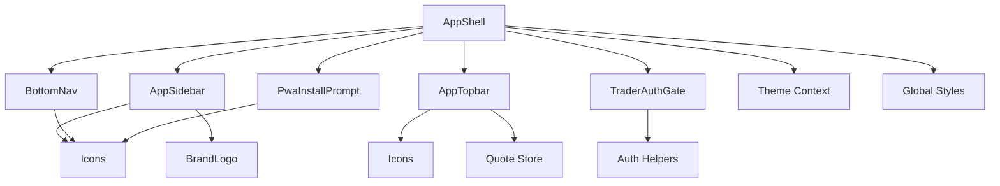
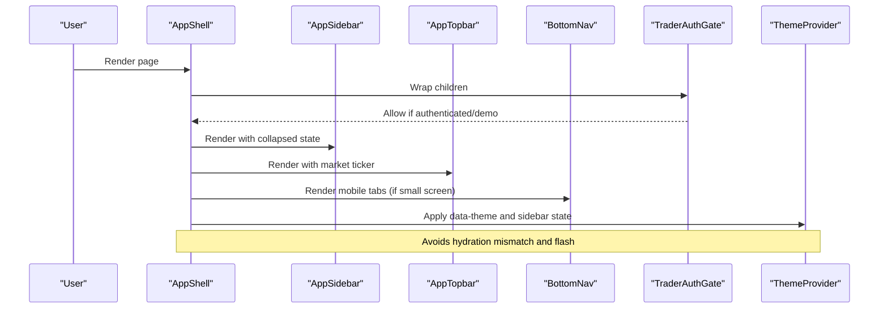
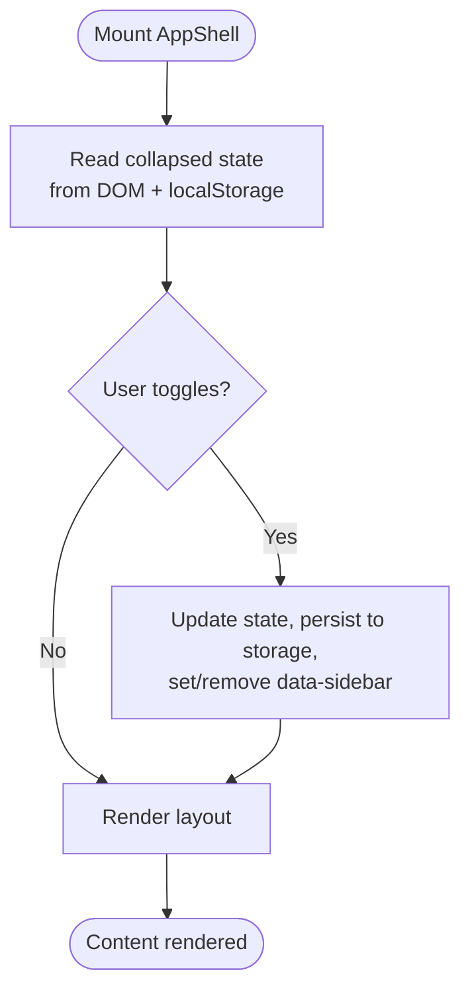
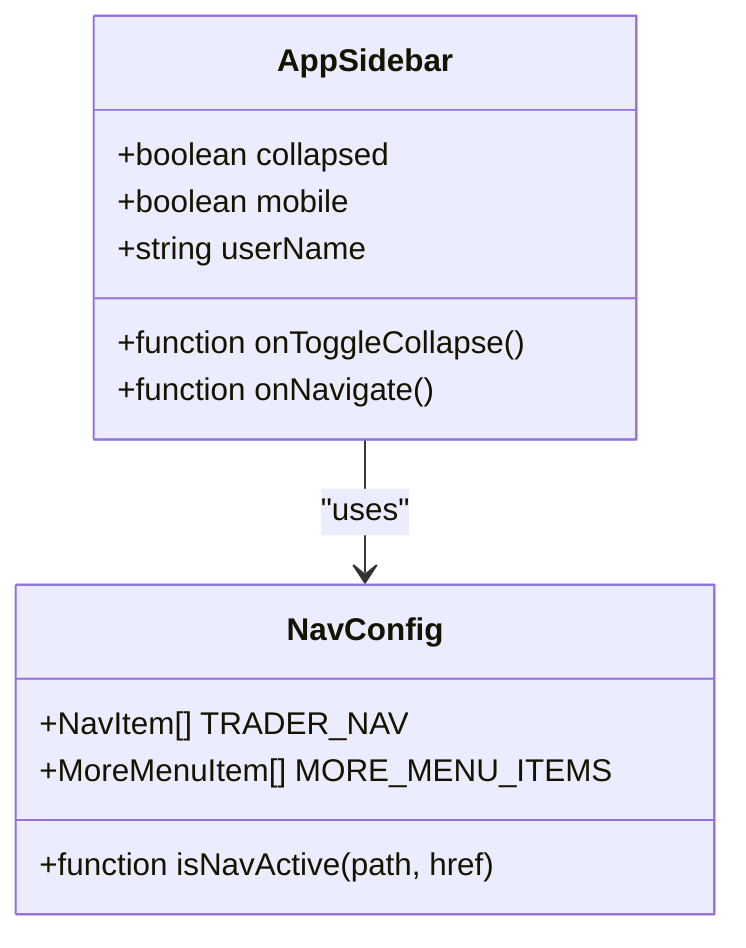
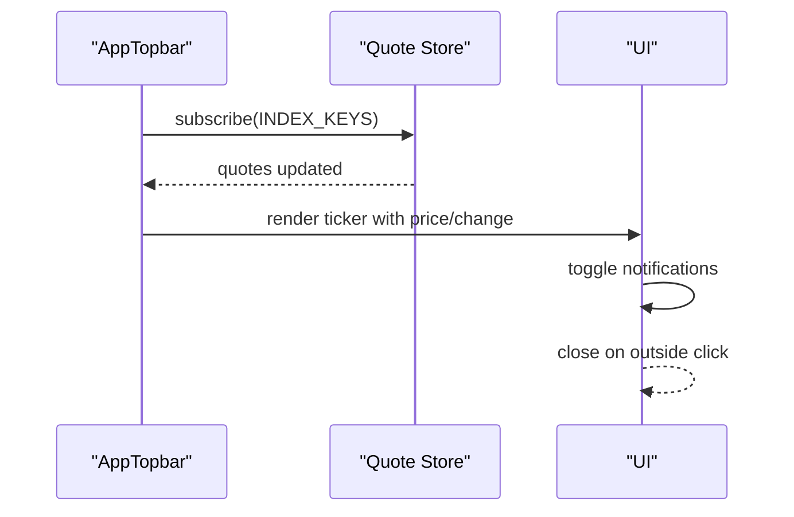
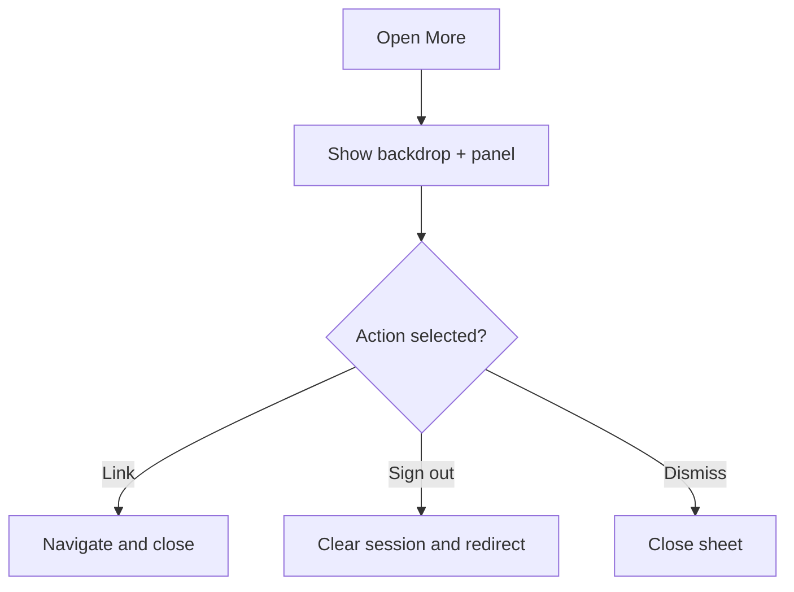
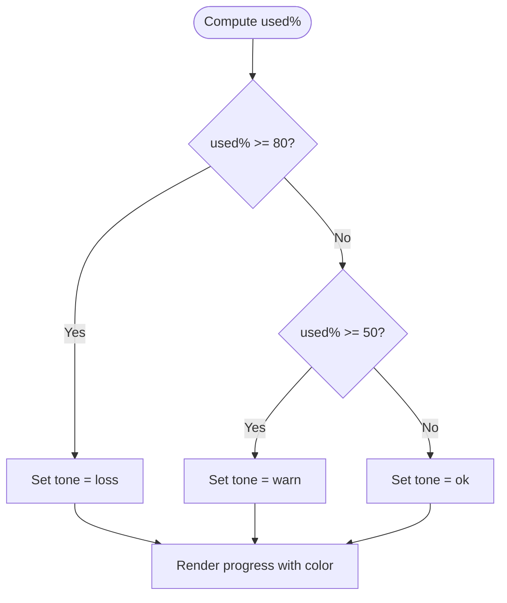
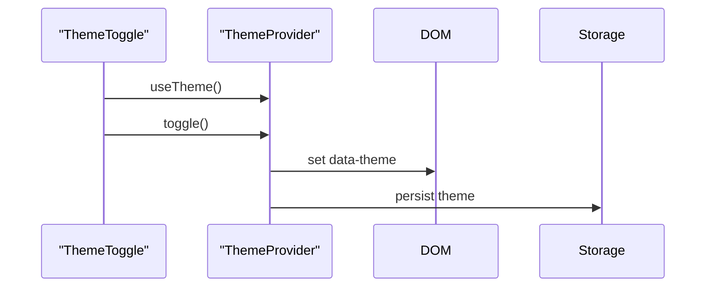
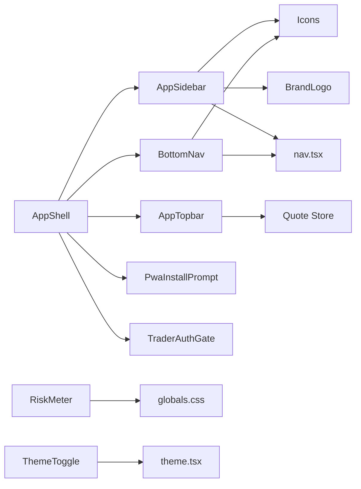

# UI Component Library

<cite>
**Referenced Files in This Document**
- [AppShell.tsx](file://frontend/trader/src/components/AppShell.tsx)
- [AppSidebar.tsx](file://frontend/trader/src/components/AppSidebar.tsx)
- [AppTopbar.tsx](file://frontend/trader/src/components/AppTopbar.tsx)
- [BottomNav.tsx](file://frontend/trader/src/components/BottomNav.tsx)
- [RiskMeter.tsx](file://frontend/trader/src/components/RiskMeter.tsx)
- [ThemeToggle.tsx](file://frontend/trader/src/components/ThemeToggle.tsx)
- [Icons.tsx](file://frontend/trader/src/components/Icons.tsx)
- [BrandLogo.tsx](file://frontend/trader/src/components/BrandLogo.tsx)
- [PwaInstallPrompt.tsx](file://frontend/trader/src/components/PwaInstallPrompt.tsx)
- [TraderAuthGate.tsx](file://frontend/trader/src/components/TraderAuthGate.tsx)
- [theme.tsx](file://frontend/trader/src/lib/theme.tsx)
- [nav.tsx](file://frontend/trader/src/lib/nav.tsx)
- [globals.css](file://frontend/trader/src/styles/globals.css)
</cite>

## Table of Contents
1. Introduction
2. Project Structure
3. Core Components
4. Architecture Overview
5. Detailed Component Analysis
6. Dependency Analysis
7. Performance Considerations
8. Troubleshooting Guide
9. Conclusion
10. Appendices

## Introduction
This document describes the reusable UI component library used by the trader application. It focuses on the application shell, sidebar navigation, top bar with user controls, and specialized components such as the risk meter. It explains composition patterns, prop interfaces, styling approaches (CSS variables and scoped styles), responsive behavior, accessibility, theme integration, usage examples, customization options, and best practices for extending the library consistently.

## Project Structure
The UI layer is organized around a small set of high-level chrome components that compose layout, navigation, and global behaviors:
- Shell: AppShell composes the sidebar, top bar, content area, mobile bottom nav, and PWA prompt.
- Sidebar: AppSidebar provides primary navigation and account actions; supports collapsed state and mobile mode.
- Top bar: AppTopbar shows market indices and notifications.
- Mobile navigation: BottomNav replaces the sidebar on small screens with a fixed tab bar and a “More” menu.
- Specialized components: RiskMeter (pre-trade risk indicator), ThemeToggle (light/dark switch), BrandLogo (brand assets), Icons (shared icon primitives), PwaInstallPrompt (install guidance).
- Shared libraries: theme context and initialization script, navigation configuration and helpers.
- Global styles: CSS custom properties define the design system tokens; component-specific styles are applied via class names and inline style blocks where appropriate.

**Diagram sources**
- [AppShell.tsx:1-60](file://frontend/trader/src/components/AppShell.tsx#L1-L60)
- [AppSidebar.tsx:1-118](file://frontend/trader/src/components/AppSidebar.tsx#L1-L118)
- [AppTopbar.tsx:1-184](file://frontend/trader/src/components/AppTopbar.tsx#L1-L184)
- [BottomNav.tsx:1-121](file://frontend/trader/src/components/BottomNav.tsx#L1-L121)
- [PwaInstallPrompt.tsx:1-148](file://frontend/trader/src/components/PwaInstallPrompt.tsx#L1-L148)
- [TraderAuthGate.tsx:1-25](file://frontend/trader/src/components/TraderAuthGate.tsx#L1-L25)
- [theme.tsx:1-55](file://frontend/trader/src/lib/theme.tsx#L1-L55)
- [globals.css:1-1056](file://frontend/trader/src/styles/globals.css#L1-L1056)

**Section sources**
- [AppShell.tsx:1-60](file://frontend/trader/src/components/AppShell.tsx#L1-L60)
- [globals.css:1-1056](file://frontend/trader/src/styles/globals.css#L1-L1056)

## Core Components
- AppShell: Provides the main layout with a collapsible left sidebar, sticky top bar, scrollable content region, and mobile bottom navigation. Persists sidebar collapse state to localStorage and applies a data attribute to avoid hydration mismatch.
- AppSidebar: Renders primary navigation items from a centralized config, supports collapsed mode (icons only), brand logo, settings/challenge links, and sign out. Uses Next.js navigation and active-state detection.
- AppTopbar: Displays live index tickers and a notification panel. Subscribes to quote updates and renders change indicators with semantic colors.
- BottomNav: Mobile-only fixed bottom tab bar with a “More” sheet for secondary actions including sign out.
- RiskMeter: Compact pre-trade risk indicator showing daily drawdown headroom with color-coded states.
- ThemeToggle: Light/dark mode toggle using a shared theme context; defers icon rendering to avoid SSR mismatch.
- BrandLogo: Reusable brand mark, monogram, wordmark, and lockup components.
- Icons: Centralized SVG icon primitives with consistent sizing and stroke/fill variants.
- PwaInstallPrompt: Platform-aware install prompts for iOS Safari and Android with deferred reminders.
- TraderAuthGate: Guards routes requiring authentication or demo session.

**Section sources**
- [AppShell.tsx:1-60](file://frontend/trader/src/components/AppShell.tsx#L1-L60)
- [AppSidebar.tsx:1-118](file://frontend/trader/src/components/AppSidebar.tsx#L1-L118)
- [AppTopbar.tsx:1-184](file://frontend/trader/src/components/AppTopbar.tsx#L1-L184)
- [BottomNav.tsx:1-121](file://frontend/trader/src/components/BottomNav.tsx#L1-L121)
- [RiskMeter.tsx:1-27](file://frontend/trader/src/components/RiskMeter.tsx#L1-L27)
- [ThemeToggle.tsx:1-31](file://frontend/trader/src/components/ThemeToggle.tsx#L1-L31)
- [BrandLogo.tsx:1-102](file://frontend/trader/src/components/BrandLogo.tsx#L1-L102)
- [Icons.tsx:1-46](file://frontend/trader/src/components/Icons.tsx#L1-L46)
- [PwaInstallPrompt.tsx:1-148](file://frontend/trader/src/components/PwaInstallPrompt.tsx#L1-L148)
- [TraderAuthGate.tsx:1-25](file://frontend/trader/src/components/TraderAuthGate.tsx#L1-L25)

## Architecture Overview
The shell orchestrates layout and cross-cutting concerns:
- Layout: Flex-based shell with sticky sidebar and top bar; content scrolls independently.
- Navigation: Centralized nav configuration drives both desktop sidebar and mobile bottom tabs; active state computed from current path.
- Theming: Theme provider sets data-theme early via an inline script to prevent flash; components read theme via context.
- Responsiveness: Media queries hide sidebar and show bottom nav below a threshold; safe-area insets respected for notched devices.
- Accessibility: Semantic roles, aria attributes, focus-visible outlines, and keyboard-friendly interactions.

**Diagram sources**
- [AppShell.tsx:1-60](file://frontend/trader/src/components/AppShell.tsx#L1-L60)
- [AppSidebar.tsx:1-118](file://frontend/trader/src/components/AppSidebar.tsx#L1-L118)
- [AppTopbar.tsx:1-184](file://frontend/trader/src/components/AppTopbar.tsx#L1-L184)
- [BottomNav.tsx:1-121](file://frontend/trader/src/components/BottomNav.tsx#L1-L121)
- [TraderAuthGate.tsx:1-25](file://frontend/trader/src/components/TraderAuthGate.tsx#L1-L25)
- [theme.tsx:1-55](file://frontend/trader/src/lib/theme.tsx#L1-L55)

## Detailed Component Analysis

### Application Shell (AppShell)
- Purpose: Composes the app chrome and manages sidebar collapse persistence.
- Props:
  - children: React node to render as page content.
  - userName: Optional string passed down to top bar/sidebar (unused in current implementation).
- Behavior:
  - Initializes collapsed state from DOM attribute and localStorage.
  - Toggles collapse and persists preference.
  - Wraps content with auth gate.
  - Renders sidebar, top bar, content area, bottom nav, and PWA prompt.
- Styling: Uses global CSS classes for shell structure; relies on CSS variables for theming.

**Diagram sources**
- [AppShell.tsx:1-60](file://frontend/trader/src/components/AppShell.tsx#L1-L60)

**Section sources**
- [AppShell.tsx:1-60](file://frontend/trader/src/components/AppShell.tsx#L1-L60)

### Sidebar Navigation (AppSidebar)
- Purpose: Primary navigation with brand, nav items, settings, challenge, and sign out.
- Props:
  - collapsed: boolean controlling icon-only mode.
  - onToggleCollapse: callback to update collapsed state.
  - mobile: boolean to enable mobile drawer behavior.
  - onNavigate: optional callback invoked on navigation clicks.
  - userName: optional string for display purposes.
- Features:
  - Active link highlighting based on current path.
  - Collapsed mode hides labels and centers icons.
  - Sign out clears session and navigates to login.
- Accessibility:
  - aria-label on aside and buttons.
  - aria-current for active pages.
  - aria-pressed on collapse button.

**Diagram sources**
- [AppSidebar.tsx:1-118](file://frontend/trader/src/components/AppSidebar.tsx#L1-L118)
- [nav.tsx:1-55](file://frontend/trader/src/lib/nav.tsx#L1-L55)

**Section sources**
- [AppSidebar.tsx:1-118](file://frontend/trader/src/components/AppSidebar.tsx#L1-L118)
- [nav.tsx:1-55](file://frontend/trader/src/lib/nav.tsx#L1-L55)

### Top Bar with Market Ticker and Notifications (AppTopbar)
- Purpose: Slim utility bar displaying market indices and a notification panel.
- Props:
  - userName: optional (unused in current implementation).
- Behavior:
  - Subscribes to index quotes and renders live values.
  - Toggles notification panel; closes when clicking outside.
  - Uses semantic colors for gains/losses.
- Accessibility:
  - aria-label for markets and notifications.
  - aria-expanded on notification trigger.

**Diagram sources**
- [AppTopbar.tsx:1-184](file://frontend/trader/src/components/AppTopbar.tsx#L1-L184)

**Section sources**
- [AppTopbar.tsx:1-184](file://frontend/trader/src/components/AppTopbar.tsx#L1-L184)

### Mobile Bottom Navigation (BottomNav)
- Purpose: Fixed bottom tab bar for small screens with a “More” menu for secondary actions.
- Behavior:
  - Highlights active tab based on current path.
  - Opens/closes “More” sheet; resets on navigation changes.
  - Sign out action clears session and redirects.
- Accessibility:
  - role="menu" and role="menuitem".
  - aria-expanded and aria-haspopup on more button.

**Diagram sources**
- [BottomNav.tsx:1-121](file://frontend/trader/src/components/BottomNav.tsx#L1-L121)

**Section sources**
- [BottomNav.tsx:1-121](file://frontend/trader/src/components/BottomNav.tsx#L1-L121)

### Risk Meter (RiskMeter)
- Purpose: Compact pre-trade risk indicator showing remaining drawdown headroom.
- Behavior:
  - Computes tone based on used percentage thresholds.
  - Displays progress track with color-coded fill.
- Customization:
  - Extend thresholds and tones to integrate with real-time risk calculations.

**Diagram sources**
- [RiskMeter.tsx:1-27](file://frontend/trader/src/components/RiskMeter.tsx#L1-L27)

**Section sources**
- [RiskMeter.tsx:1-27](file://frontend/trader/src/components/RiskMeter.tsx#L1-L27)

### Theme Toggle (ThemeToggle)
- Purpose: Switch between light and dark themes.
- Behavior:
  - Reads theme from context; toggles via provider.
  - Defers icon rendering to avoid SSR mismatch.
- Integration:
  - Uses ThemeProvider to apply data-theme and persist preference.

**Diagram sources**
- [ThemeToggle.tsx:1-31](file://frontend/trader/src/components/ThemeToggle.tsx#L1-L31)
- [theme.tsx:1-55](file://frontend/trader/src/lib/theme.tsx#L1-L55)

**Section sources**
- [ThemeToggle.tsx:1-31](file://frontend/trader/src/components/ThemeToggle.tsx#L1-L31)
- [theme.tsx:1-55](file://frontend/trader/src/lib/theme.tsx#L1-L55)

### Brand Logo (BrandLogo)
- Purpose: Provide consistent brand visuals across the app.
- Exports:
  - BrandMark: square mark image.
  - BrandMonogram: compact monogram for dense spaces.
  - BrandWordmark: composed text with brand colors.
  - BrandLockup: full lockup with optional image fallback.
- Usage:
  - Used in sidebar header and marketing surfaces.

**Section sources**
- [BrandLogo.tsx:1-102](file://frontend/trader/src/components/BrandLogo.tsx#L1-L102)

### Icons (Icons)
- Purpose: Centralized SVG icon primitives with consistent sizing and stroke/fill variants.
- Usage:
  - Consumed by sidebar, top bar, bottom nav, and other components.
- Extensibility:
  - Add new icons following existing pattern with base/filled variants.

**Section sources**
- [Icons.tsx:1-46](file://frontend/trader/src/components/Icons.tsx#L1-L46)

### PWA Install Prompt (PwaInstallPrompt)
- Purpose: Non-blocking install guidance for iOS Safari and Android.
- Behavior:
  - Detects standalone mode and platform specifics.
  - Shows iOS instructions or triggers beforeinstallprompt on Android.
  - Respects dismiss/defer preferences stored in localStorage.

**Section sources**
- [PwaInstallPrompt.tsx:1-148](file://frontend/trader/src/components/PwaInstallPrompt.tsx#L1-L148)

### Authentication Gate (TraderAuthGate)
- Purpose: Redirect unauthenticated visitors to login while allowing demo sessions.
- Behavior:
  - Checks session and demo flag; otherwise redirects with next parameter.
  - Renders children once ready.

**Section sources**
- [TraderAuthGate.tsx:1-25](file://frontend/trader/src/components/TraderAuthGate.tsx#L1-L25)

## Dependency Analysis
- AppShell depends on:
  - AppSidebar, AppTopbar, BottomNav, PwaInstallPrompt, TraderAuthGate.
  - Theme context and global styles for layout and appearance.
- AppSidebar depends on:
  - Icons, BrandLogo, nav configuration, and auth helpers for sign out.
- AppTopbar depends on:
  - Quote store for live market data and formatting utilities.
- BottomNav depends on:
  - Icons and nav configuration; uses auth helpers for sign out.
- RiskMeter and ThemeToggle depend on:
  - Global CSS variables for theming and visual consistency.

**Diagram sources**
- [AppShell.tsx:1-60](file://frontend/trader/src/components/AppShell.tsx#L1-L60)
- [AppSidebar.tsx:1-118](file://frontend/trader/src/components/AppSidebar.tsx#L1-L118)
- [AppTopbar.tsx:1-184](file://frontend/trader/src/components/AppTopbar.tsx#L1-L184)
- [BottomNav.tsx:1-121](file://frontend/trader/src/components/BottomNav.tsx#L1-L121)
- [RiskMeter.tsx:1-27](file://frontend/trader/src/components/RiskMeter.tsx#L1-L27)
- [ThemeToggle.tsx:1-31](file://frontend/trader/src/components/ThemeToggle.tsx#L1-L31)
- [theme.tsx:1-55](file://frontend/trader/src/lib/theme.tsx#L1-L55)
- [nav.tsx:1-55](file://frontend/trader/src/lib/nav.tsx#L1-L55)
- [globals.css:1-1056](file://frontend/trader/src/styles/globals.css#L1-L1056)

**Section sources**
- [AppShell.tsx:1-60](file://frontend/trader/src/components/AppShell.tsx#L1-L60)
- [AppSidebar.tsx:1-118](file://frontend/trader/src/components/AppSidebar.tsx#L1-L118)
- [AppTopbar.tsx:1-184](file://frontend/trader/src/components/AppTopbar.tsx#L1-L184)
- [BottomNav.tsx:1-121](file://frontend/trader/src/components/BottomNav.tsx#L1-L121)
- [RiskMeter.tsx:1-27](file://frontend/trader/src/components/RiskMeter.tsx#L1-L27)
- [ThemeToggle.tsx:1-31](file://frontend/trader/src/components/ThemeToggle.tsx#L1-L31)
- [theme.tsx:1-55](file://frontend/trader/src/lib/theme.tsx#L1-L55)
- [nav.tsx:1-55](file://frontend/trader/src/lib/nav.tsx#L1-L55)
- [globals.css:1-1056](file://frontend/trader/src/styles/globals.css#L1-L1056)

## Performance Considerations
- Hydration safety:
  - Theme and sidebar state are applied via a boot script before React hydrates to avoid layout shifts and theme flashes.
- Efficient updates:
  - Top bar subscribes only to required index keys to minimize re-renders.
- Responsive performance:
  - Bottom nav and sidebar visibility controlled via media queries to reduce unnecessary DOM work on desktop.
- Icon rendering:
  - ThemeToggle defers icon rendering until after mount to prevent SSR mismatches.

[No sources needed since this section provides general guidance]

## Troubleshooting Guide
- Sidebar jump on reload:
  - Ensure the boot script sets data-sidebar before React mounts; verify localStorage key usage matches the expected value.
- Theme flash:
  - Confirm the theme script runs early and sets data-theme; check that ThemeProvider reads the same attribute.
- Notification panel not closing:
  - Verify event listener attachment and removal; ensure click-outside logic targets the correct container.
- Mobile bottom nav overlap:
  - Check safe-area-inset-bottom usage and media query breakpoints to avoid content overlap on notched devices.
- Sign out not working:
  - Ensure clearSession is called and router navigation is triggered; confirm no route guards block redirection.

**Section sources**
- [theme.tsx:1-55](file://frontend/trader/src/lib/theme.tsx#L1-L55)
- [AppShell.tsx:1-60](file://frontend/trader/src/components/AppShell.tsx#L1-L60)
- [AppTopbar.tsx:1-184](file://frontend/trader/src/components/AppTopbar.tsx#L1-L184)
- [BottomNav.tsx:1-121](file://frontend/trader/src/components/BottomNav.tsx#L1-L121)

## Conclusion
The component library provides a cohesive, accessible, and theme-aware foundation for the trader application. The shell coordinates layout and cross-cutting concerns, while modular components handle navigation, user controls, and specialized UI needs. Consistent use of CSS variables, centralized navigation configuration, and robust responsiveness ensures scalability and maintainability. Extending the library involves adding new icons, updating nav configuration, and composing existing components within the shell.

[No sources needed since this section summarizes without analyzing specific files]

## Appendices

### Design System Principles
- Data-first visuals: Colors emphasize gains/losses and warnings; brand accents reserved for interactive elements.
- Consistent tokens: CSS variables define colors, radii, shadows, and typography for light and dark modes.
- Accessibility first: Semantic roles, aria attributes, and focus-visible outlines ensure usability.
- Responsive by default: Layout adapts to screen size with mobile-first considerations and safe-area support.

**Section sources**
- [globals.css:1-1056](file://frontend/trader/src/styles/globals.css#L1-L1056)

### Prop Interfaces Summary
- AppShell:
  - children: React.ReactNode
  - userName?: string
- AppSidebar:
  - collapsed: boolean
  - onToggleCollapse: () => void
  - mobile?: boolean
  - onNavigate?: () => void
  - userName?: string
- AppTopbar:
  - userName?: string
- BottomNav: none (internal state-driven)
- RiskMeter: none (internal state-driven)
- ThemeToggle: none (context-driven)
- BrandLogo components:
  - BrandMark: size?, className?
  - BrandMonogram: size?, className?
  - BrandWordmark: compact?, className?
  - BrandLockup: useImage?, className?, height?
- PwaInstallPrompt: none (internal state-driven)
- TraderAuthGate:
  - children: React.ReactNode

**Section sources**
- [AppShell.tsx:1-60](file://frontend/trader/src/components/AppShell.tsx#L1-L60)
- [AppSidebar.tsx:1-118](file://frontend/trader/src/components/AppSidebar.tsx#L1-L118)
- [AppTopbar.tsx:1-184](file://frontend/trader/src/components/AppTopbar.tsx#L1-L184)
- [BrandLogo.tsx:1-102](file://frontend/trader/src/components/BrandLogo.tsx#L1-L102)

### Styling Approach
- Global CSS variables define the design tokens for light and dark themes.
- Components use class names aligned with global styles; some components include scoped styles for localized rules.
- Responsive behavior is implemented via media queries and CSS logical properties.

**Section sources**
- [globals.css:1-1056](file://frontend/trader/src/styles/globals.css#L1-L1056)

### Best Practices for Extending the Library
- Add new navigation items to the centralized nav configuration to keep sidebar and bottom nav consistent.
- Use shared icons and brand components to maintain visual consistency.
- Prefer CSS variables for theming; avoid hardcoding colors.
- Ensure all interactive elements have proper aria attributes and keyboard support.
- Test responsive behavior across breakpoints and devices with safe-area insets.

[No sources needed since this section provides general guidance]