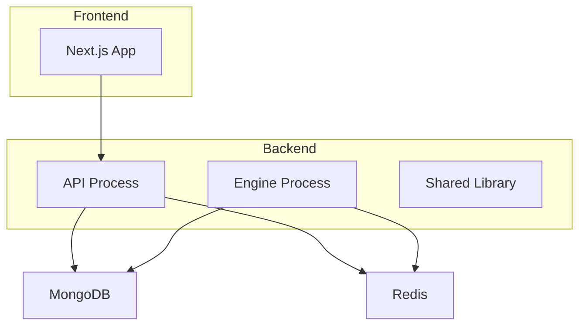
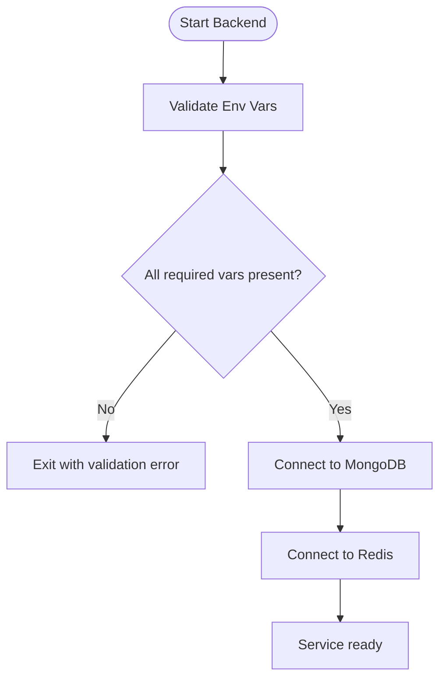
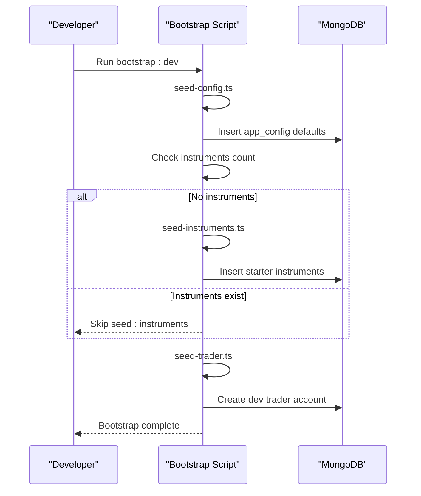
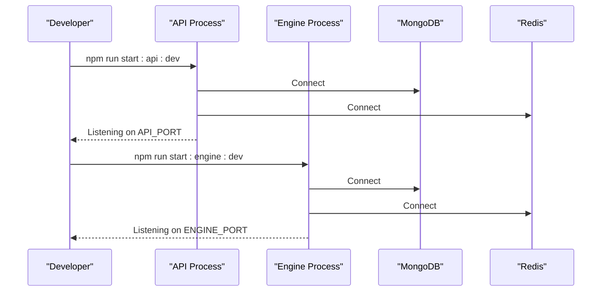
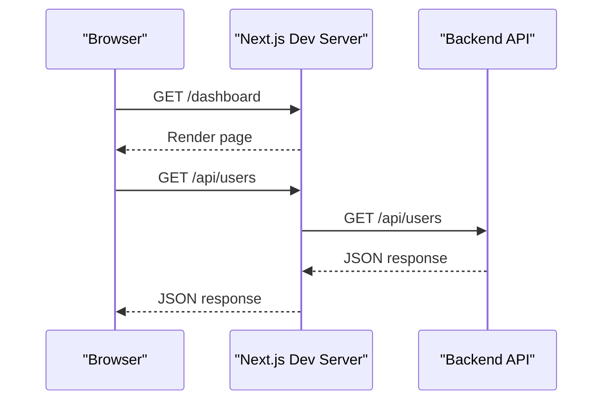
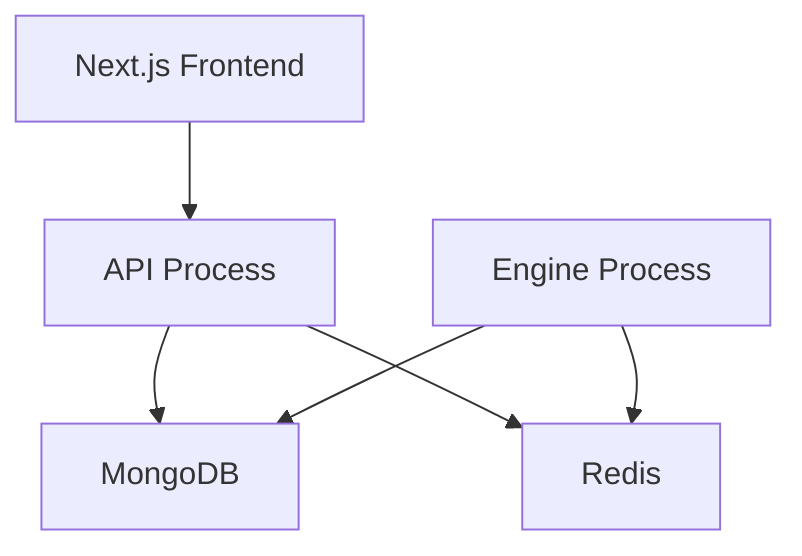

# Getting Started

<cite>
**Referenced Files in This Document**
- [README.md](file://README.md)
- [backend/package.json](file://backend/package.json)
- [frontend/trader/package.json](file://frontend/trader/package.json)
- [deploy/docker-compose.yml](file://deploy/docker-compose.yml)
- [backend/libs/shared/src/config/env.schema.ts](file://backend/libs/shared/src/config/env.schema.ts)
- [backend/scripts/seed-config.ts](file://backend/scripts/seed-config.ts)
- [backend/scripts/bootstrap-dev.ts](file://backend/scripts/bootstrap-dev.ts)
- [backend/scripts/generate-keys.ts](file://backend/scripts/generate-keys.ts)
- [frontend/trader/next.config.mjs](file://frontend/trader/next.config.mjs)
</cite>

## Table of Contents
1. Introduction
2. Prerequisites
3. Project Structure
4. Environment Configuration
5. Installation and Setup
6. Database Seeding
7. Running the Services
8. Frontend Development Workflow
9. Demo Mode
10. Tests
11. Troubleshooting Guide
12. Architecture Overview
13. Conclusion

## Introduction
This guide helps you set up the NiveshGuru Trading Platform development environment for both backend (API and Engine) and frontend (Next.js). It covers prerequisites, dependency management, environment variables, database seeding, quick start commands, testing, and accessing local interfaces. The platform runs as a modular monolith with two backend processes (API and Engine), a Next.js frontend that proxies API calls to the backend, and optional Docker-based deployment.

## Prerequisites
- Node.js and npm installed on your machine
- MongoDB accessible via a connection string (local or Atlas)
- Redis server running locally or accessible via URL
- A terminal with access to run Node scripts

## Project Structure
The repository contains:
- Backend: NestJS monorepo with apps/api, apps/engine, and libs/shared
- Frontend: Next.js application under frontend/trader
- Deploy: docker-compose configuration for production-like setup
- Scripts: seeding and bootstrap utilities for local development

**Diagram sources**
- [deploy/docker-compose.yml:20-108](file://deploy/docker-compose.yml#L20-L108)
- [frontend/trader/next.config.mjs:12-16](file://frontend/trader/next.config.mjs#L12-L16)

**Section sources**
- [README.md:8-25](file://README.md#L8-L25)

## Environment Configuration
The backend validates environment variables at boot and will refuse to start if required values are missing or invalid. Key variables include:

- MONGO_URI: Required MongoDB connection string
- REDIS_URL: Required Redis URL (default redis://localhost:6379)
- JWT_PRIVATE_KEY_B64 / JWT_PUBLIC_KEY_B64: RS256 keypair, base64-encoded PEM
- DATA_ENC_SECRET: Encryption secret for AES-GCM (KYC docs, TOTP secrets, PII)
- OTP_PEPPER: Server-side pepper for OTP hashing
- APP_BASE_URL: Public base URL used in email links
- CORS_ORIGINS: Allowed origins for browser requests
- STORAGE_DIR: Directory for encrypted file storage
- PAYMENT_PROVIDER and Razorpay keys (if using Razorpay)
- MARKET_FEED and broker-specific tokens (Upstox/Angel/Dhan)

You can generate JWT keys using the provided script, then export them as environment variables before starting services.

**Diagram sources**
- [backend/libs/shared/src/config/env.schema.ts:8-72](file://backend/libs/shared/src/config/env.schema.ts#L8-L72)

**Section sources**
- [backend/libs/shared/src/config/env.schema.ts:8-72](file://backend/libs/shared/src/config/env.schema.ts#L8-L72)
- [backend/scripts/generate-keys.ts:1-13](file://backend/scripts/generate-keys.ts#L1-L13)
- [deploy/docker-compose.yml:23-48](file://deploy/docker-compose.yml#L23-L48)
- [deploy/docker-compose.yml:69-98](file://deploy/docker-compose.yml#L69-L98)

## Installation and Setup
Install dependencies for both backend and frontend:

- Backend:
  - Navigate to backend/
  - Run npm install
- Frontend:
  - Navigate to frontend/trader/
  - Run npm install

Ensure MongoDB and Redis are reachable by the configured URLs.

**Section sources**
- [README.md:27-49](file://README.md#L27-L49)
- [backend/package.json:6-22](file://backend/package.json#L6-L22)
- [frontend/trader/package.json:5-10](file://frontend/trader/package.json#L5-L10)

## Database Seeding
Seed initial configuration and market holidays, then optionally seed instruments and a dev trader account:

- Seed config and holidays:
  - From backend/, run npm run seed:config
- Bootstrap dev data (config, instruments if empty, dev trader):
  - From backend/, run npm run bootstrap:dev

These scripts connect to MongoDB using MONGO_URI and insert defaults without overwriting admin-tuned values.

**Diagram sources**
- [backend/scripts/bootstrap-dev.ts:18-41](file://backend/scripts/bootstrap-dev.ts#L18-L41)
- [backend/scripts/seed-config.ts:12-61](file://backend/scripts/seed-config.ts#L12-L61)

**Section sources**
- [backend/scripts/seed-config.ts:12-61](file://backend/scripts/seed-config.ts#L12-L61)
- [backend/scripts/bootstrap-dev.ts:18-41](file://backend/scripts/bootstrap-dev.ts#L18-L41)

## Running the Services
Start the backend processes and verify health endpoints:

- API service:
  - From backend/, run npm run start:api:dev
  - Health endpoint: http://localhost:4000/health
- Engine service:
  - From backend/, run npm run start:engine:dev
  - Health endpoint: http://localhost:4100/health

Ports are configurable via API_PORT and ENGINE_PORT environment variables.

**Diagram sources**
- [backend/package.json:8-11](file://backend/package.json#L8-L11)
- [deploy/docker-compose.yml:20-64](file://deploy/docker-compose.yml#L20-L64)
- [deploy/docker-compose.yml:66-108](file://deploy/docker-compose.yml#L66-L108)

**Section sources**
- [README.md:27-40](file://README.md#L27-L40)
- [backend/package.json:8-11](file://backend/package.json#L8-L11)

## Frontend Development Workflow
Run the Next.js frontend and proxy API calls to the backend:

- Start dev server:
  - From frontend/trader/, run npm run dev
  - Default address: http://127.0.0.1:3075
- Build static output:
  - From frontend/trader/, run npm run build
- Type check:
  - From frontend/trader/, run npm run typecheck

The frontend rewrites /api/* to the backend origin configured via NEXT_PUBLIC_API_ORIGIN or defaulting to http://localhost:4000.

**Diagram sources**
- [frontend/trader/package.json:5-10](file://frontend/trader/package.json#L5-L10)
- [frontend/trader/next.config.mjs:12-16](file://frontend/trader/next.config.mjs#L12-L16)

**Section sources**
- [README.md:42-49](file://README.md#L42-L49)
- [frontend/trader/package.json:5-10](file://frontend/trader/package.json#L5-L10)
- [frontend/trader/next.config.mjs:12-16](file://frontend/trader/next.config.mjs#L12-L16)

## Demo Mode
The frontend supports demo mode when no session is present, allowing you to browse the user and admin app without a running backend. You can enable demo mode from the login screen to explore the UI.

**Section sources**
- [README.md:51-57](file://README.md#L51-L57)

## Tests
Run unit tests and e2e tests from the backend:

- Unit tests:
  - From backend/, run npm test
- E2E tests:
  - From backend/, run npm run test:e2e

Coverage can be generated with npm run test:cov.

**Section sources**
- [README.md:27-40](file://README.md#L27-L40)
- [backend/package.json:12-22](file://backend/package.json#L12-L22)

## Troubleshooting Guide
Common issues and resolutions:

- Missing MONGO_URI:
  - Ensure MONGO_URI is set; bootstrap and seed scripts require it
- Invalid environment configuration:
  - The backend validates env at boot; fix missing or invalid variables per the schema
- Redis connectivity:
  - Verify REDIS_URL points to a reachable Redis instance
- CORS errors:
  - Set CORS_ORIGINS to include your frontend origin
- Payment provider errors:
  - If PAYMENT_PROVIDER=razorpay, ensure all required Razorpay keys are set
- SMS/Mail provider misconfiguration:
  - When using msg91 or smtp, provide required credentials per schema rules

**Section sources**
- [backend/scripts/bootstrap-dev.ts:32-41](file://backend/scripts/bootstrap-dev.ts#L32-L41)
- [backend/libs/shared/src/config/env.schema.ts:8-72](file://backend/libs/shared/src/config/env.schema.ts#L8-L72)

## Architecture Overview
The system consists of:
- API process: REST + WebSocket surface
- Engine process: Feed ingestion, evaluators, schedulers
- Shared library: Kernel, config, Redis, auth, KYC, plans, market, trading modules
- Next.js frontend: User and admin pages with light/dark themes

**Diagram sources**
- [README.md:8-25](file://README.md#L8-L25)
- [deploy/docker-compose.yml:20-108](file://deploy/docker-compose.yml#L20-L108)

**Section sources**
- [README.md:79-87](file://README.md#L79-L87)

## Conclusion
You now have the steps to install dependencies, configure environment variables, seed the database, run the API and Engine services, start the frontend, run tests, and troubleshoot common issues. Use the quick start commands from the README for rapid setup, and leverage the bootstrap script to initialize a working local environment quickly.