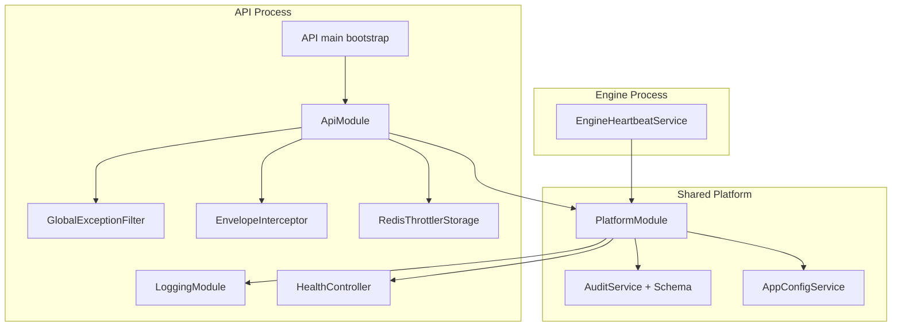
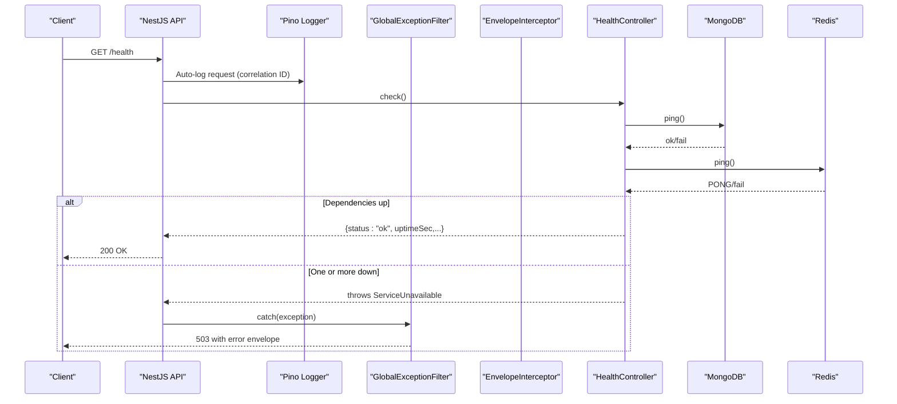
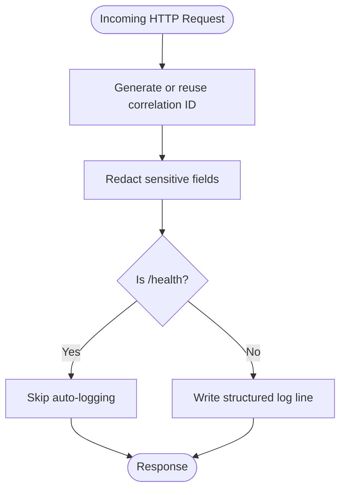
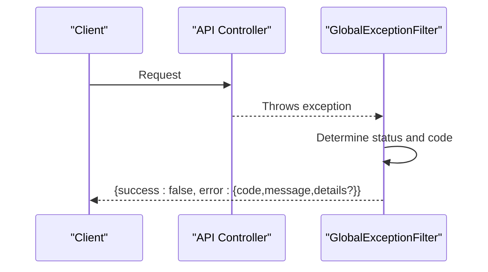
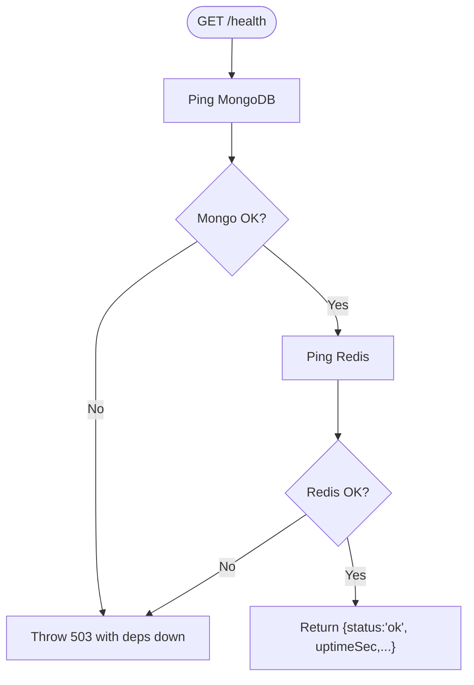
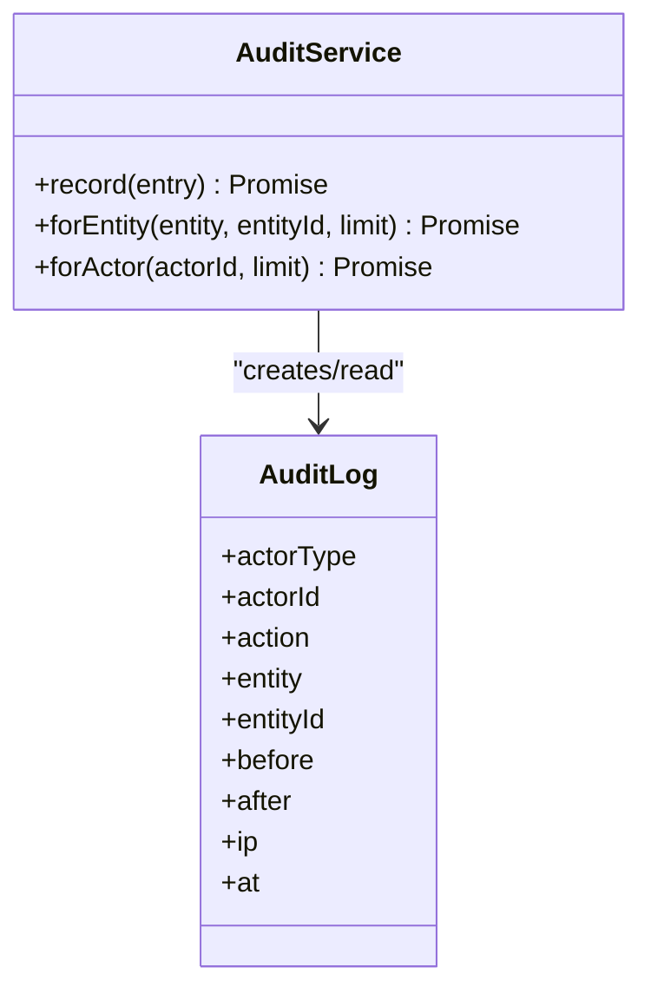
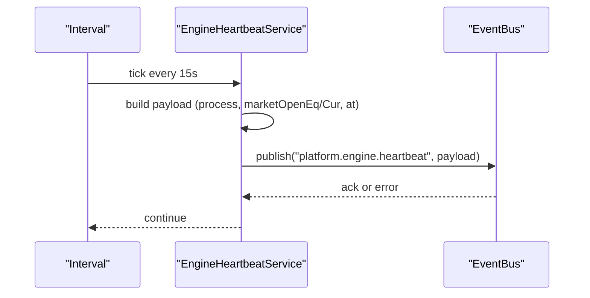
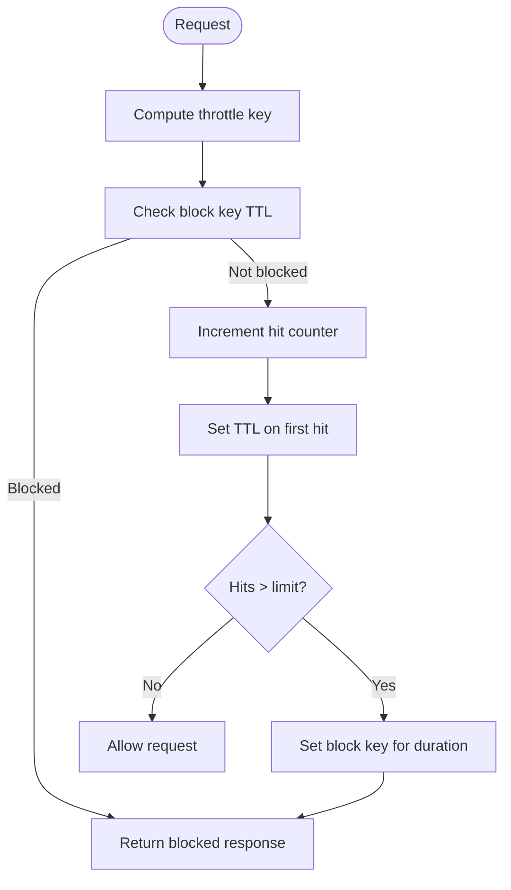
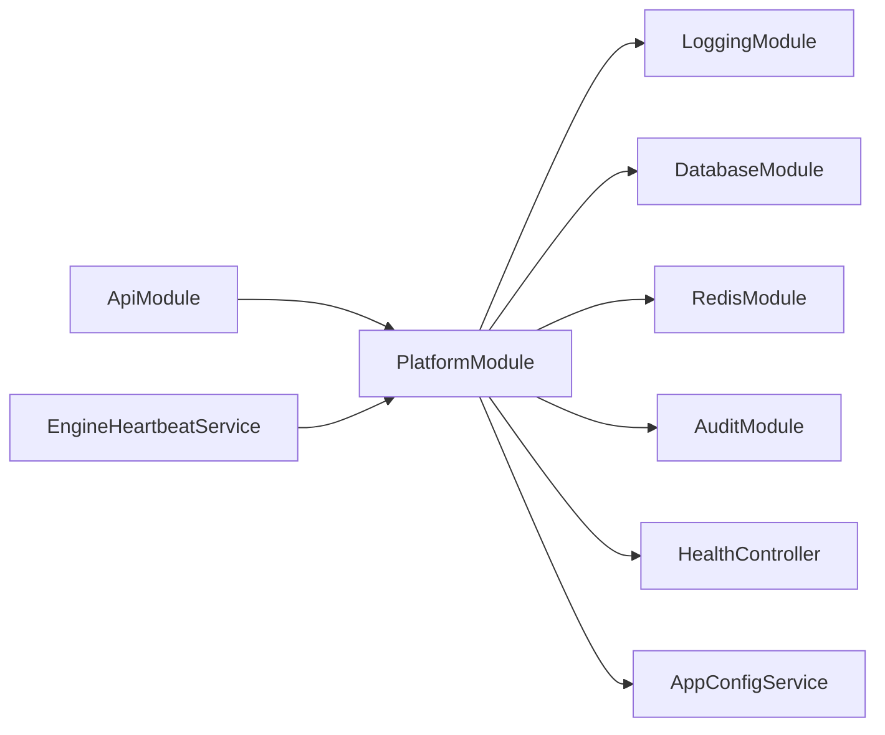

# Monitoring & Logging

<cite>
**Referenced Files in This Document**
- [logging.module.ts](file://backend/libs/shared/src/logging/logging.module.ts)
- [health.controller.ts](file://backend/libs/shared/src/health/health.controller.ts)
- [audit.service.ts](file://backend/libs/shared/src/audit/audit.service.ts)
- [audit-log.schema.ts](file://backend/libs/shared/src/audit/audit-log.schema.ts)
- [engine-heartbeat.service.ts](file://backend/apps/engine/src/engine-heartbeat.service.ts)
- [app-config.service.ts](file://backend/libs/shared/src/config/app-config.service.ts)
- [global-exception.filter.ts](file://backend/libs/shared/src/http/global-exception.filter.ts)
- [envelope.interceptor.ts](file://backend/libs/shared/src/http/envelope.interceptor.ts)
- [redis-throttler.storage.ts](file://backend/libs/shared/src/rate-limit/redis-throttler.storage.ts)
- [platform.module.ts](file://backend/libs/shared/src/platform.module.ts)
- [api.module.ts](file://backend/apps/api/src/api.module.ts)
- [main.ts](file://backend/apps/api/src/main.ts)
</cite>

## Table of Contents
1. Introduction
2. Project Structure
3. Core Components
4. Architecture Overview
5. Detailed Component Analysis
6. Dependency Analysis
7. Performance Considerations
8. Troubleshooting Guide
9. Conclusion
10. Appendices

## Introduction
This document describes the monitoring and logging capabilities implemented across the API and Engine processes to provide operational visibility, compliance-grade audit trails, health and heartbeat signals, error handling, and rate limiting. It explains how structured logs are produced with correlation IDs, how audit records capture user and system actions, how health checks verify dependencies, and how heartbeats confirm end-to-end event flow between services. It also outlines recommended practices for metrics collection, alerting, log aggregation, retention, debugging, and incident response.

## Project Structure
The monitoring and logging features are provided by shared platform modules and integrated into both the API and Engine processes:
- Structured HTTP request/response logging with correlation IDs and redaction is configured via a logging module.
- A global exception filter standardizes error responses and ensures internal errors do not leak details.
- An envelope interceptor wraps successful controller responses into a consistent shape.
- Health checks validate database and cache connectivity.
- Audit service provides immutable audit logging for compliance.
- Engine heartbeat publishes periodic status over the event bus to prove cross-process communication.
- Rate limiting uses Redis-backed storage to enforce per-route limits across instances.
- Platform module wires these capabilities globally for reuse across processes.

**Diagram sources**
- [main.ts:7-22](file://backend/apps/api/src/main.ts#L7-L22)
- [api.module.ts:23-58](file://backend/apps/api/src/api.module.ts#L23-L58)
- [platform.module.ts:21-38](file://backend/libs/shared/src/platform.module.ts#L21-L38)
- [logging.module.ts:7-34](file://backend/libs/shared/src/logging/logging.module.ts#L7-L34)
- [health.controller.ts:19-54](file://backend/libs/shared/src/health/health.controller.ts#L19-L54)
- [audit.service.ts:23-44](file://backend/libs/shared/src/audit/audit.service.ts#L23-L44)
- [audit-log.schema.ts:6-41](file://backend/libs/shared/src/audit/audit-log.schema.ts#L6-L41)
- [engine-heartbeat.service.ts:18-46](file://backend/apps/engine/src/engine-heartbeat.service.ts#L18-L46)
- [redis-throttler.storage.ts:12-55](file://backend/libs/shared/src/rate-limit/redis-throttler.storage.ts#L12-L55)

**Section sources**
- [main.ts:7-22](file://backend/apps/api/src/main.ts#L7-L22)
- [api.module.ts:23-58](file://backend/apps/api/src/api.module.ts#L23-L58)
- [platform.module.ts:21-38](file://backend/libs/shared/src/platform.module.ts#L21-L38)

## Core Components
- Structured HTTP logging with correlation IDs and sensitive data redaction.
- Global exception handling that returns standardized failure envelopes and avoids leaking internals.
- Response envelope interceptor ensuring consistent success payloads.
- Health endpoint verifying MongoDB and Redis availability.
- Immutable audit logging for user and system actions with read-only access patterns.
- Engine heartbeat publishing periodic status to validate end-to-end event flow.
- Redis-backed rate limiting for cross-instance throttling.
- Business configuration service with hot reload via Redis pub/sub.

**Section sources**
- [logging.module.ts:7-34](file://backend/libs/shared/src/logging/logging.module.ts#L7-L34)
- [global-exception.filter.ts:18-68](file://backend/libs/shared/src/http/global-exception.filter.ts#L18-L68)
- [envelope.interceptor.ts:5-10](file://backend/libs/shared/src/http/envelope.interceptor.ts#L5-L10)
- [health.controller.ts:19-54](file://backend/libs/shared/src/health/health.controller.ts#L19-L54)
- [audit.service.ts:23-44](file://backend/libs/shared/src/audit/audit.service.ts#L23-L44)
- [audit-log.schema.ts:6-41](file://backend/libs/shared/src/audit/audit-log.schema.ts#L6-L41)
- [engine-heartbeat.service.ts:18-46](file://backend/apps/engine/src/engine-heartbeat.service.ts#L18-L46)
- [redis-throttler.storage.ts:12-55](file://backend/libs/shared/src/rate-limit/redis-throttler.storage.ts#L12-L55)
- [app-config.service.ts:18-87](file://backend/libs/shared/src/config/app-config.service.ts#L18-L87)

## Architecture Overview
The API process bootstraps NestJS with structured logging, global exception filtering, and an envelope interceptor. The PlatformModule registers shared capabilities (logging, database, Redis, audit, health, config). The Engine process runs a heartbeat service that periodically publishes status events over the event bus to demonstrate end-to-end connectivity and exercise calendar logic.

**Diagram sources**
- [health.controller.ts:19-54](file://backend/libs/shared/src/health/health.controller.ts#L19-L54)
- [global-exception.filter.ts:18-68](file://backend/libs/shared/src/http/global-exception.filter.ts#L18-L68)
- [logging.module.ts:7-34](file://backend/libs/shared/src/logging/logging.module.ts#L7-L34)

## Detailed Component Analysis

### Structured Logging and Correlation IDs
- Request-level logs include a correlation ID derived from the incoming header when present; otherwise a UUID is generated.
- Sensitive fields such as authorization headers, cookies, passwords, OTPs, and tokens are redacted before being written to logs.
- Health endpoint requests are excluded from auto-logging to reduce noise.
- The API process uses buffered logging during bootstrap and integrates the structured logger globally.

**Diagram sources**
- [logging.module.ts:7-34](file://backend/libs/shared/src/logging/logging.module.ts#L7-L34)
- [main.ts:7-22](file://backend/apps/api/src/main.ts#L7-L22)

**Section sources**
- [logging.module.ts:7-34](file://backend/libs/shared/src/logging/logging.module.ts#L7-L34)
- [main.ts:7-22](file://backend/apps/api/src/main.ts#L7-L22)

### Global Exception Handling and Error Envelopes
- All exceptions are caught and converted into a standardized failure envelope with a code and message.
- Known application and HTTP exceptions map to appropriate HTTP statuses and codes.
- Unknown errors are logged with stack traces and return a generic internal error without leaking internals outside production.
- In non-production environments, error messages may be included in the response for developer convenience.

**Diagram sources**
- [global-exception.filter.ts:18-68](file://backend/libs/shared/src/http/global-exception.filter.ts#L18-L68)

**Section sources**
- [global-exception.filter.ts:18-68](file://backend/libs/shared/src/http/global-exception.filter.ts#L18-L68)

### Response Envelope Interceptor
- Every successful controller response is wrapped into a uniform structure indicating success and carrying the payload.
- This standardization simplifies client-side handling and supports consistent observability around response shapes.

**Section sources**
- [envelope.interceptor.ts:5-10](file://backend/libs/shared/src/http/envelope.interceptor.ts#L5-L10)

### Health Checks and Readiness/Liveness
- The health endpoint verifies both MongoDB and Redis connectivity.
- If either dependency is down, it responds with a 503 status including a descriptive message listing which dependencies failed.
- On success, it returns a compact report including uptime and dependency states.

**Diagram sources**
- [health.controller.ts:19-54](file://backend/libs/shared/src/health/health.controller.ts#L19-L54)

**Section sources**
- [health.controller.ts:19-54](file://backend/libs/shared/src/health/health.controller.ts#L19-L54)

### Audit Logging for Compliance
- The audit service provides write-once audit records capturing actor type, actor ID, action, entity, entity ID, optional before/after snapshots, and IP address.
- Records are stored in an immutable schema with indexes optimized for querying by entity and actor.
- The record method never throws; failures are logged loudly to avoid disrupting business operations while still surfacing issues for alerting.
- Read methods support retrieving recent entries by entity or actor.

**Diagram sources**
- [audit.service.ts:23-44](file://backend/libs/shared/src/audit/audit.service.ts#L23-L44)
- [audit-log.schema.ts:6-41](file://backend/libs/shared/src/audit/audit-log.schema.ts#L6-L41)

**Section sources**
- [audit.service.ts:23-44](file://backend/libs/shared/src/audit/audit.service.ts#L23-L44)
- [audit-log.schema.ts:6-41](file://backend/libs/shared/src/audit/audit-log.schema.ts#L6-L41)

### Engine Heartbeat and Cross-Process Visibility
- The engine process publishes a heartbeat every 15 seconds containing process identity, market open flags, and timestamp.
- This serves as proof that Redis Pub/Sub flows work across containers and continuously exercises the exchange calendar service to surface configuration drift early.
- Publish failures are logged to aid troubleshooting without stopping the timer.

**Diagram sources**
- [engine-heartbeat.service.ts:18-46](file://backend/apps/engine/src/engine-heartbeat.service.ts#L18-L46)

**Section sources**
- [engine-heartbeat.service.ts:18-46](file://backend/apps/engine/src/engine-heartbeat.service.ts#L18-L46)

### Rate Limiting and Throttling
- Throttling is backed by Redis to share state across multiple API instances.
- The storage tracks hits per key, enforces TTLs, and can block further requests for a configured duration after exceeding limits.
- Block durations are supported for stricter scenarios such as authentication endpoints.

**Diagram sources**
- [redis-throttler.storage.ts:12-55](file://backend/libs/shared/src/rate-limit/redis-throttler.storage.ts#L12-L55)

**Section sources**
- [redis-throttler.storage.ts:12-55](file://backend/libs/shared/src/rate-limit/redis-throttler.storage.ts#L12-L55)

### Business Configuration and Hot Reload
- Business configuration is persisted in the database and cached in memory for fast reads.
- Updates trigger a Redis pub/sub invalidation so all instances reload the changed key without restarts.
- Invalid or unknown values are handled safely using defaults and warnings.

**Section sources**
- [app-config.service.ts:18-87](file://backend/libs/shared/src/config/app-config.service.ts#L18-L87)

## Dependency Analysis
- The API process depends on the PlatformModule for shared infrastructure (logging, database, Redis, audit, health, config).
- The Engine process depends on the PlatformModule for shared infrastructure and uses the EventBus to publish heartbeats.
- Health checks depend on MongoDB and Redis; failures result in 503 responses.
- Audit logging depends on MongoDB; failures are logged but do not abort callers.
- Rate limiting depends on Redis; blocking behavior protects against abuse.

**Diagram sources**
- [api.module.ts:23-58](file://backend/apps/api/src/api.module.ts#L23-L58)
- [platform.module.ts:21-38](file://backend/libs/shared/src/platform.module.ts#L21-L38)

**Section sources**
- [api.module.ts:23-58](file://backend/apps/api/src/api.module.ts#L23-L58)
- [platform.module.ts:21-38](file://backend/libs/shared/src/platform.module.ts#L21-L38)

## Performance Considerations
- Use correlation IDs to correlate logs across services without adding overhead beyond header parsing and UUID generation.
- Exclude health checks from auto-logging to prevent high-frequency noise.
- Keep audit writes fire-and-forget safe; failures are logged but do not impact latency-sensitive paths.
- Cache business configuration in memory and invalidate selectively via Redis pub/sub to minimize database reads.
- Redis-backed throttling centralizes state and reduces per-instance memory usage.

[No sources needed since this section provides general guidance]

## Troubleshooting Guide
- Health endpoint returns 503 when MongoDB or Redis is unreachable; inspect dependency logs and network connectivity.
- If audit writes fail, look for loud error logs emitted by the audit service; investigate database connectivity and permissions.
- For unexpected errors, review structured logs with correlation IDs captured by the logger; the global exception filter ensures consistent error envelopes and logs stacks in server logs.
- If rate limiting blocks legitimate traffic, adjust throttler settings and review Redis keys used for tracking.
- If heartbeats stop appearing, check the engine process logs for publish failures and ensure Redis Pub/Sub channels are reachable.

**Section sources**
- [health.controller.ts:19-54](file://backend/libs/shared/src/health/health.controller.ts#L19-L54)
- [audit.service.ts:23-44](file://backend/libs/shared/src/audit/audit.service.ts#L23-L44)
- [global-exception.filter.ts:18-68](file://backend/libs/shared/src/http/global-exception.filter.ts#L18-L68)
- [redis-throttler.storage.ts:12-55](file://backend/libs/shared/src/rate-limit/redis-throttler.storage.ts#L12-L55)
- [engine-heartbeat.service.ts:18-46](file://backend/apps/engine/src/engine-heartbeat.service.ts#L18-L46)

## Conclusion
The system implements robust operational visibility through structured logging with correlation IDs, standardized error envelopes, health checks, immutable audit trails, and engine heartbeats. These components collectively enable reliable monitoring, compliance reporting, and rapid troubleshooting across the API and Engine processes. Recommended next steps include integrating metrics collection, configuring centralized log aggregation, defining alerting rules, and establishing retention policies aligned with operational needs.

[No sources needed since this section summarizes without analyzing specific files]

## Appendices

### Recommended Metrics, Alerting, and Retention Practices
- Metrics: Expose counters for request rates, error rates, latency percentiles, and dependency health; instrument throttling decisions and audit write failures.
- Alerting: Alert on health endpoint failures, sustained error spikes, heartbeat gaps, and audit write failures.
- Aggregation: Forward structured logs to a centralized system; use correlation IDs to trace requests across services.
- Retention: Define tiered retention for operational logs, audit logs, and metrics based on compliance and cost constraints.

[No sources needed since this section provides general guidance]