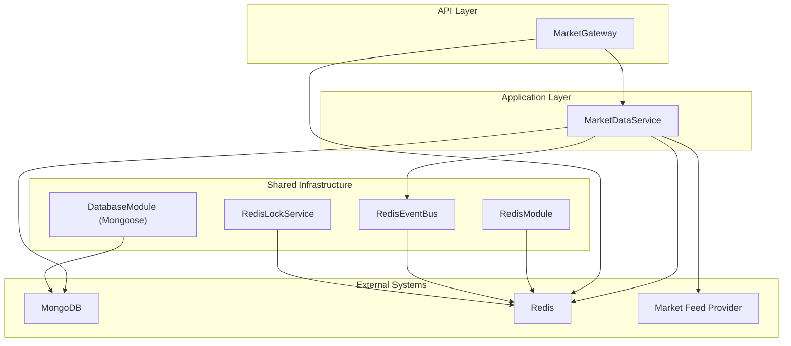
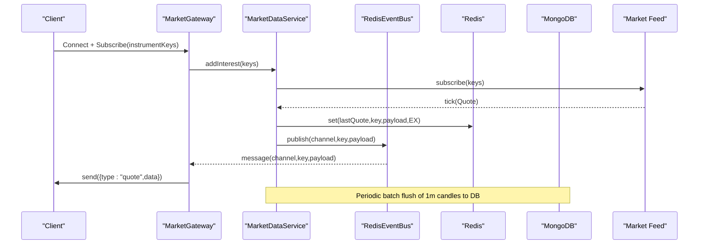
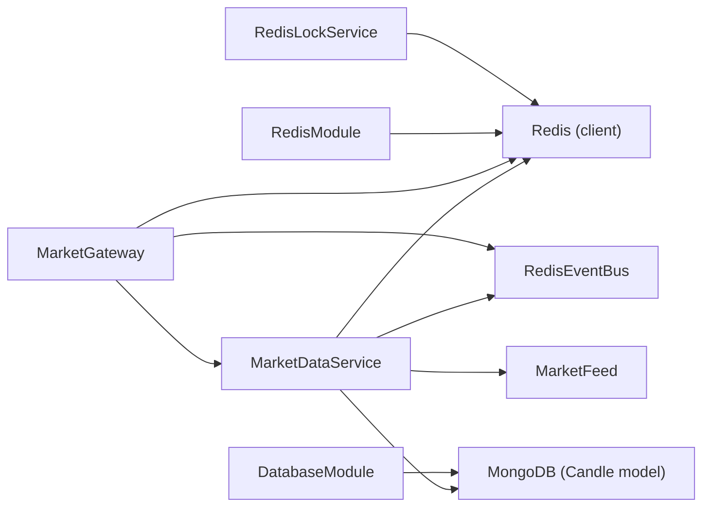

# Performance Optimization

<cite>
**Referenced Files in This Document**
- [database.module.ts](file://backend/libs/shared/src/database/database.module.ts)
- [redis.module.ts](file://backend/libs/shared/src/redis/redis.module.ts)
- [redis-lock.service.ts](file://backend/libs/shared/src/redis/redis-lock.service.ts)
- [redis-event-bus.ts](file://backend/libs/shared/src/redis/redis-event-bus.ts)
- [market.gateway.ts](file://backend/apps/api/src/modules/market/presentation/market.gateway.ts)
- [market-data.service.ts](file://backend/apps/api/src/modules/market/application/market-data.service.ts)
</cite>

## Table of Contents
1. Introduction
2. Project Structure
3. Core Components
4. Architecture Overview
5. Detailed Component Analysis
6. Dependency Analysis
7. Performance Considerations
8. Troubleshooting Guide
9. Conclusion

## Introduction
This document provides performance optimization guidance for the platform, focusing on database optimization (MongoDB), API and real-time data processing, Redis caching and distributed locking, WebSocket streaming, and production resource management. It synthesizes patterns present in the codebase to help you tune connection pools, indexing strategies, message batching, and scaling approaches while maintaining low latency and high throughput for market data workloads.

## Project Structure
The backend is organized into NestJS modules with shared infrastructure:
- Database module configures MongoDB via Mongoose with connection pooling and environment-aware index behavior.
- Redis module provisions clients, an event bus abstraction, and a distributed lock service.
- Market module implements a WebSocket gateway for real-time quotes, an ingestion pipeline that writes to Redis and aggregates candles, and persistence to MongoDB.

**Diagram sources**
- [database.module.ts:5-15](file://backend/libs/shared/src/database/database.module.ts#L5-L15)
- [redis.module.ts:10-27](file://backend/libs/shared/src/redis/redis.module.ts#L10-L27)
- [redis-event-bus.ts:15-40](file://backend/libs/shared/src/redis/redis-event-bus.ts#L15-L40)
- [redis-lock.service.ts:24-38](file://backend/libs/shared/src/redis/redis-lock.service.ts#L24-L38)
- [market.gateway.ts:26-42](file://backend/apps/api/src/modules/market/presentation/market.gateway.ts#L26-L42)
- [market-data.service.ts:24-41](file://backend/apps/api/src/modules/market/application/market-data.service.ts#L24-L41)

**Section sources**
- [database.module.ts:5-15](file://backend/libs/shared/src/database/database.module.ts#L5-L15)
- [redis.module.ts:10-27](file://backend/libs/shared/src/redis/redis.module.ts#L10-L27)
- [market.gateway.ts:26-42](file://backend/apps/api/src/modules/market/presentation/market.gateway.ts#L26-L42)
- [market-data.service.ts:24-41](file://backend/apps/api/src/modules/market/application/market-data.service.ts#L24-L41)

## Core Components
- MongoDB connection pool and indexing control are configured centrally, enabling tuning of maxPoolSize and environment-specific autoIndex behavior.
- Redis is used for:
  - Caching last quotes per instrument with TTL.
  - Pub/Sub event bus for fan-out to subscribers.
  - Distributed locks using atomic SET NX PX and Lua-based fenced release.
- Real-time streaming:
  - WebSocket gateway authenticates connections, manages per-instrument rooms, and relays quotes from the event bus.
  - Market data service subscribes on demand, writes ticks to Redis, publishes events, aggregates 1-minute candles, and flushes them in batches to MongoDB.

Key performance implications:
- On-demand upstream subscription prevents subscribing to the entire instrument master at once.
- Redis-backed quote cache reduces repeated reads and supports immediate quote delivery to new subscribers.
- Batched candle writes reduce MongoDB write overhead.
- Separate publisher/subscriber Redis clients isolate publish throughput from subscribe latency.

**Section sources**
- [database.module.ts:5-15](file://backend/libs/shared/src/database/database.module.ts#L5-L15)
- [redis.module.ts:10-27](file://backend/libs/shared/src/redis/redis.module.ts#L10-L27)
- [redis-lock.service.ts:24-38](file://backend/libs/shared/src/redis/redis-lock.service.ts#L24-L38)
- [redis-event-bus.ts:15-40](file://backend/libs/shared/src/redis/redis-event-bus.ts#L15-L40)
- [market.gateway.ts:48-133](file://backend/apps/api/src/modules/market/presentation/market.gateway.ts#L48-L133)
- [market-data.service.ts:43-139](file://backend/apps/api/src/modules/market/application/market-data.service.ts#L43-L139)

## Architecture Overview
The real-time pipeline connects market feed providers to clients through a scalable, Redis-backed event bus and caches. The WebSocket gateway fans out quotes to interested clients, while the market data service orchestrates ingestion, aggregation, and persistence.

**Diagram sources**
- [market.gateway.ts:91-133](file://backend/apps/api/src/modules/market/presentation/market.gateway.ts#L91-L133)
- [market-data.service.ts:43-139](file://backend/apps/api/src/modules/market/application/market-data.service.ts#L43-L139)
- [redis-event-bus.ts:26-63](file://backend/libs/shared/src/redis/redis-event-bus.ts#L26-L63)

## Detailed Component Analysis

### MongoDB Connection Pooling and Indexing
- Connection pool size is explicitly set to balance concurrency and resource usage.
- Auto-indexing is disabled in production to avoid runtime overhead; indexes should be managed via migrations or schema definitions.
- Server selection timeout ensures quick failure detection when MongoDB is unreachable.

Optimization tips:
- Tune maxPoolSize based on CPU cores and expected concurrent requests.
- Ensure required compound indexes exist for frequent queries (e.g., instrumentKey + timestamp).
- Monitor driver metrics for connection wait times and queue lengths.

**Section sources**
- [database.module.ts:5-15](file://backend/libs/shared/src/database/database.module.ts#L5-L15)

### Redis Caching and Event Bus
- Last quote per instrument is cached with a long TTL to serve immediate data to new subscribers and reduce downstream load.
- A Redis-backed event bus decouples producers and consumers, enabling horizontal scaling of subscribers.
- Separate publisher and subscriber clients improve isolation and prevent backpressure from one side affecting the other.

Optimization tips:
- Choose appropriate TTLs for quote cache based on market activity.
- Use channels scoped by instrument key to limit fan-out scope.
- Monitor Redis memory usage and eviction policies.

**Section sources**
- [redis.module.ts:10-27](file://backend/libs/shared/src/redis/redis.module.ts#L10-L27)
- [redis-event-bus.ts:15-63](file://backend/libs/shared/src/redis/redis-event-bus.ts#L15-L63)
- [market-data.service.ts:103-108](file://backend/apps/api/src/modules/market/application/market-data.service.ts#L103-L108)

### Distributed Locking
- Lock acquisition uses atomic SET NX PX with a unique token and a Lua script for fenced release to prevent releasing another process’s lock.
- Provides acquire, tryAcquire, and withLock helpers with configurable timeouts and backoff.

Use cases:
- Serialize equity/margin mutations per account to ensure consistency under concurrency.

Operational notes:
- Set TTL conservatively to avoid premature expiry during long operations.
- Log and alert on lock contention and timeouts.

**Section sources**
- [redis-lock.service.ts:6-61](file://backend/libs/shared/src/redis/redis-lock.service.ts#L6-L61)

### WebSocket Streaming and Room Management
- Connections are authenticated via JWT query parameter; errors close the connection early.
- Per-instrument rooms track active sockets; first client triggers upstream subscription, last client leaves drops interest.
- New subscribers receive the cached last quote immediately, then live updates via the event bus.
- Message parsing limits instrument keys to cap fan-out size per request.

Optimization tips:
- Enforce per-client subscription caps to prevent abuse.
- Monitor room sizes and socket states; drop stale connections proactively.
- Consider compression at the transport layer if payload sizes grow.

**Section sources**
- [market.gateway.ts:26-133](file://backend/apps/api/src/modules/market/presentation/market.gateway.ts#L26-L133)

### Ingestion Pipeline and Candle Aggregation
- On-module init, the feed is started and tick handler registered.
- Each tick is written to Redis cache and published to the event bus.
- 1-minute candles are aggregated in-memory and flushed in batches to MongoDB with upsert semantics.
- A watchdog checks feed health and resubscribes to tracked instruments if ticks stall during market hours.

Performance characteristics:
- Batching reduces write amplification to MongoDB.
- On-demand subscription scales with actual demand rather than full catalog.
- Timers are unref’d to avoid blocking process shutdown.

**Section sources**
- [market-data.service.ts:43-139](file://backend/apps/api/src/modules/market/application/market-data.service.ts#L43-L139)

## Dependency Analysis
The following diagram shows how components depend on each other and external systems.

**Diagram sources**
- [market-data.service.ts:24-41](file://backend/apps/api/src/modules/market/application/market-data.service.ts#L24-L41)
- [market.gateway.ts:26-42](file://backend/apps/api/src/modules/market/presentation/market.gateway.ts#L26-L42)
- [redis.module.ts:10-27](file://backend/libs/shared/src/redis/redis.module.ts#L10-L27)
- [database.module.ts:5-15](file://backend/libs/shared/src/database/database.module.ts#L5-L15)
- [redis-lock.service.ts:24-38](file://backend/libs/shared/src/redis/redis-lock.service.ts#L24-L38)

**Section sources**
- [market-data.service.ts:24-41](file://backend/apps/api/src/modules/market/application/market-data.service.ts#L24-L41)
- [market.gateway.ts:26-42](file://backend/apps/api/src/modules/market/presentation/market.gateway.ts#L26-L42)
- [redis.module.ts:10-27](file://backend/libs/shared/src/redis/redis.module.ts#L10-L27)
- [database.module.ts:5-15](file://backend/libs/shared/src/database/database.module.ts#L5-L15)
- [redis-lock.service.ts:24-38](file://backend/libs/shared/src/redis/redis-lock.service.ts#L24-L38)

## Performance Considerations

### Database Optimization (MongoDB)
- Indexing strategy:
  - Create compound indexes for time-series queries on instrumentKey and timestamp fields to accelerate range scans and aggregations.
  - Add unique indexes where applicable to enforce data integrity and speed up lookups.
- Query optimization:
  - Prefer projection to fetch only needed fields.
  - Use aggregation pipelines for complex transformations instead of multiple round trips.
- Connection pooling:
  - Adjust maxPoolSize based on workload and hardware.
  - Monitor serverSelectionTimeoutMS and adjust if network latency varies.
- Write patterns:
  - Use bulkWrite with ordered:false for resilience and throughput, as seen in candle flushing.
  - Upsert patterns reduce duplicate writes and simplify idempotency.

**Section sources**
- [database.module.ts:5-15](file://backend/libs/shared/src/database/database.module.ts#L5-L15)
- [market-data.service.ts:110-126](file://backend/apps/api/src/modules/market/application/market-data.service.ts#L110-L126)

### API Response Optimization
- Payload reduction:
  - Return only necessary fields in REST responses.
  - Use pagination and filtering to minimize response size.
- Compression:
  - Enable gzip/br at the reverse proxy (Nginx) for JSON payloads.
- Caching headers:
  - Apply appropriate Cache-Control and ETag headers for static or semi-static endpoints.

[No sources needed since this section provides general guidance]

### Real-Time Data Processing
- Message batching:
  - Aggregate candles in memory and flush periodically to reduce write pressure.
- Fan-out control:
  - Limit per-message subscriptions and cap instrument keys per subscribe request.
- Backpressure handling:
  - Drop or throttle slow consumers; monitor socket readyState before sending.

**Section sources**
- [market.gateway.ts:71-133](file://backend/apps/api/src/modules/market/presentation/market.gateway.ts#L71-L133)
- [market-data.service.ts:103-126](file://backend/apps/api/src/modules/market/application/market-data.service.ts#L103-L126)

### Redis Strategies
- Caching:
  - Cache last quotes with TTL to serve immediate data and reduce upstream calls.
- Distributed locking:
  - Use atomic SET NX PX and Lua-based fenced release to serialize critical sections safely.
- Event bus:
  - Publish/subscribe with separate clients to isolate throughput and latency.

**Section sources**
- [market-data.service.ts:103-108](file://backend/apps/api/src/modules/market/application/market-data.service.ts#L103-L108)
- [redis-lock.service.ts:6-61](file://backend/libs/shared/src/redis/redis-lock.service.ts#L6-L61)
- [redis-event-bus.ts:15-63](file://backend/libs/shared/src/redis/redis-event-bus.ts#L15-L63)

### Scaling Strategies
- Horizontal scaling:
  - Run multiple instances behind a load balancer; use Redis pub/sub for cross-instance communication.
- Load balancing:
  - Route WebSocket connections to sticky sessions or use Redis-backed presence for routing if needed.
- Database sharding:
  - Shard by instrumentKey or tenant to distribute read/write load across shards.
- Stateless services:
  - Keep application state in Redis; scale nodes independently.

[No sources needed since this section provides general guidance]

### Memory Management and GC Tuning
- Avoid large in-process buffers beyond necessary; flush frequently (as done with candle buffering).
- Monitor heap growth and GC pauses; adjust Node.js flags if needed (e.g., --max-old-space-size).
- Unref timers to avoid blocking process shutdown and reduce idle resource usage.

**Section sources**
- [market-data.service.ts:47-50](file://backend/apps/api/src/modules/market/application/market-data.service.ts#L47-L50)

## Troubleshooting Guide
- Stale feed detection:
  - Watchdog logs warnings when no ticks arrive during market hours and resubscribes to tracked instruments.
- Authentication failures:
  - Missing or invalid tokens result in immediate connection closure with an error message.
- Redis connectivity:
  - Retry strategy and ready checks are configured; monitor for disconnects and reconnections.
- Lock contention:
  - Timeouts acquiring locks indicate contention; consider increasing TTL or reducing critical section duration.

**Section sources**
- [market-data.service.ts:128-139](file://backend/apps/api/src/modules/market/application/market-data.service.ts#L128-L139)
- [market.gateway.ts:48-60](file://backend/apps/api/src/modules/market/presentation/market.gateway.ts#L48-L60)
- [redis.module.ts:10-16](file://backend/libs/shared/src/redis/redis.module.ts#L10-L16)
- [redis-lock.service.ts:40-51](file://backend/libs/shared/src/redis/redis-lock.service.ts#L40-L51)

## Conclusion
The system employs several proven patterns for high-performance market data processing:
- Centralized MongoDB connection pooling and controlled indexing.
- Redis-backed caching, event bus, and distributed locking for scalability and consistency.
- WebSocket streaming with per-instrument rooms and on-demand upstream subscriptions.
- Batched writes and in-memory aggregation to reduce database pressure.

By tuning these components—indexes, pool sizes, TTLs, batch intervals, and consumer limits—you can achieve low-latency, high-throughput operation suitable for production trading environments.