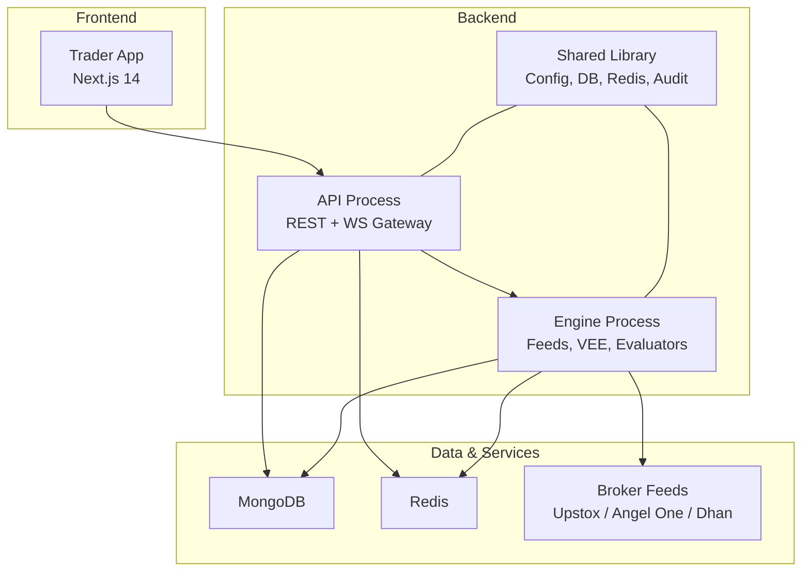
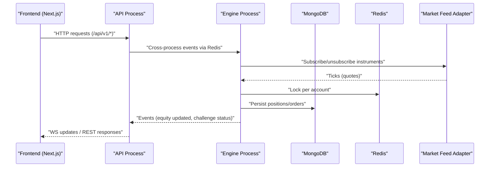
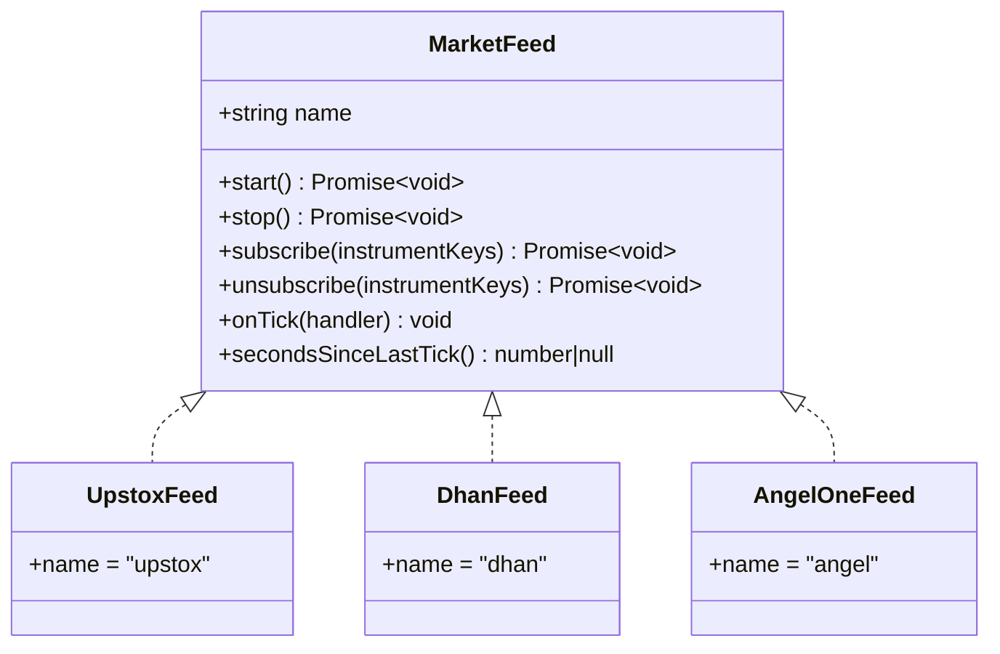
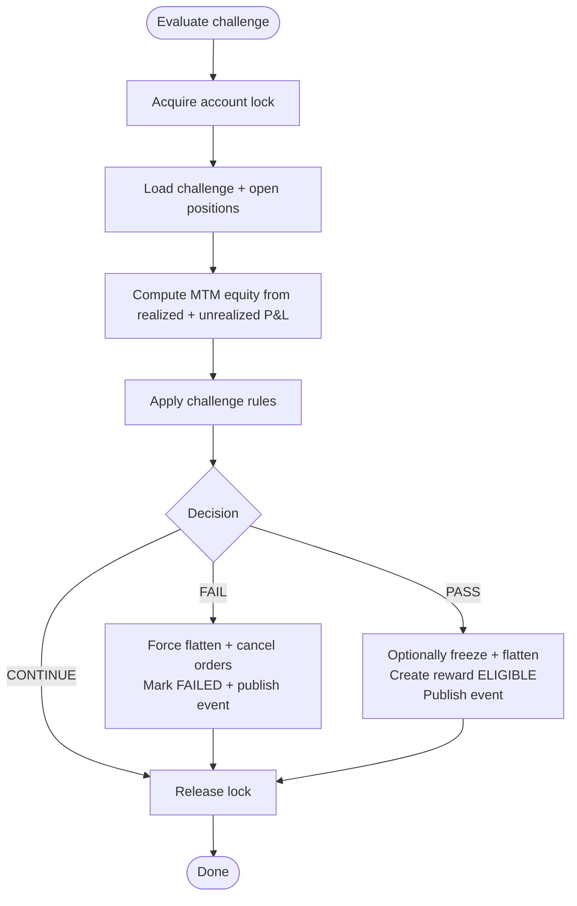
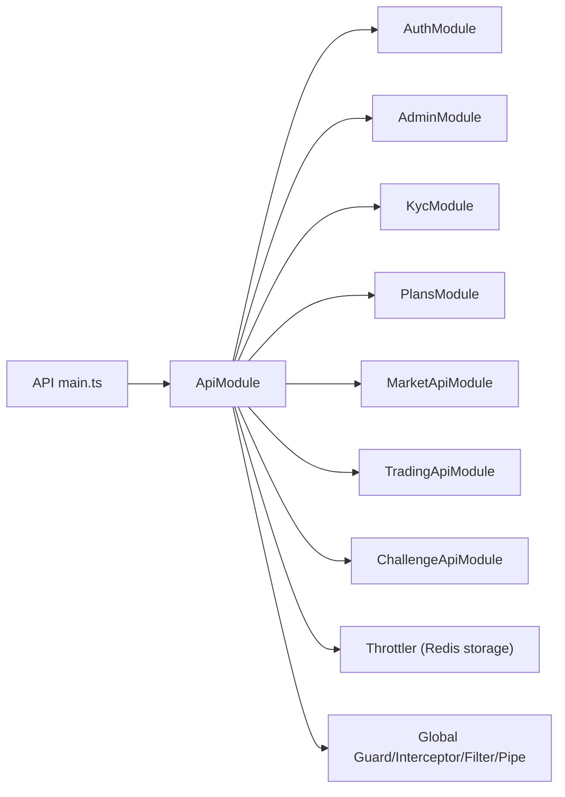
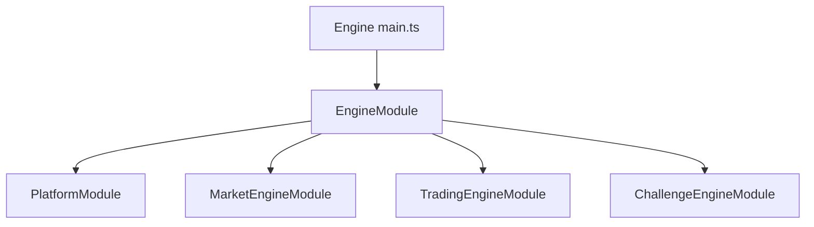
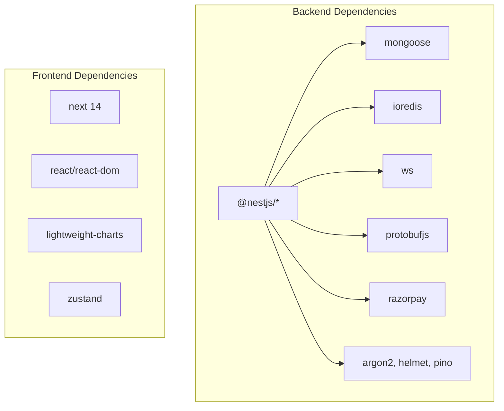

# Project Overview

<cite>
**Referenced Files in This Document**
- [README.md](file://README.md)
- [backend/package.json](file://backend/package.json)
- [frontend/trader/package.json](file://frontend/trader/package.json)
- [backend/apps/api/src/main.ts](file://backend/apps/api/src/main.ts)
- [backend/apps/engine/src/main.ts](file://backend/apps/engine/src/main.ts)
- [backend/apps/api/src/api.module.ts](file://backend/apps/api/src/api.module.ts)
- [backend/apps/engine/src/engine.module.ts](file://backend/apps/engine/src/engine.module.ts)
- [backend/libs/shared/src/platform.module.ts](file://backend/libs/shared/src/platform.module.ts)
- [backend/apps/api/src/modules/market/infrastructure/feed/market-feed.port.ts](file://backend/apps/api/src/modules/market/infrastructure/feed/market-feed.port.ts)
- [backend/apps/api/src/modules/market/infrastructure/feed/upstox-feed.ts](file://backend/apps/api/src/modules/market/infrastructure/feed/upstox-feed.ts)
- [backend/apps/api/src/modules/market/infrastructure/feed/dhan-feed.ts](file://backend/apps/api/src/modules/market/infrastructure/feed/dhan-feed.ts)
- [backend/apps/api/src/modules/market/infrastructure/feed/angel-one-feed.ts](file://backend/apps/api/src/modules/market/infrastructure/feed/angel-one-feed.ts)
- [backend/apps/api/src/modules/challenge/application/challenge-eval.service.ts](file://backend/apps/api/src/modules/challenge/application/challenge-eval.service.ts)
</cite>

## Table of Contents
1. Introduction
2. Project Structure
3. Core Components
4. Architecture Overview
5. Detailed Component Analysis
6. Dependency Analysis
7. Performance Considerations
8. Troubleshooting Guide
9. Conclusion

## Introduction
NiveshGuru is a challenge-based paper trading simulator for Indian markets (NSE/BSE, indices, options, currency). It provides a realistic trading environment without real money or broker execution, enabling traders to practice and get evaluated through structured challenges. The platform supports multi-broker market data integrations, real-time quotes, a robust challenge engine with KYC compliance, plans and payments, and administrative tools. It is production-ready with 109+ unit tests, institutional-grade security patterns, and a modular monolith architecture separating API and Engine processes.

Key highlights:
- Purpose: Challenge-based paper trading and trader evaluation for Indian markets
- Architecture: Modular monolith with separate API and Engine processes
- Market data: Multi-broker feeds (Upstox, Angel One, Dhan) plus deterministic simulator
- Features: Real-time WebSocket streaming, challenge system, KYC, plans/payments, admin tools
- Tech stack: NestJS backend, Next.js frontend, MongoDB, Redis, WebSockets
- Quality: 109+ unit tests, strict TypeScript, secure defaults (helmet, throttling, validation)

**Section sources**
- [README.md:1-87](file://README.md#L1-L87)

## Project Structure
The repository contains both backend and frontend code:
- Backend (NestJS): apps/api (REST/WebSocket surface), apps/engine (market ingestion, VEE, evaluators, schedulers), libs/shared (kernel, config, DB, Redis, audit, calendar, rate limiting)
- Frontend (Next.js): user and admin UIs with pages, components, theme, and state management
- Deploy: docker-compose + nginx configuration
- Docs: SRS and phase documentation

**Diagram sources**
- [backend/apps/api/src/main.ts:7-23](file://backend/apps/api/src/main.ts#L7-L23)
- [backend/apps/engine/src/main.ts:7-17](file://backend/apps/engine/src/main.ts#L7-L17)
- [backend/libs/shared/src/platform.module.ts:22-36](file://backend/libs/shared/src/platform.module.ts#L22-L36)

**Section sources**
- [README.md:7-25](file://README.md#L7-L25)
- [backend/package.json:6-22](file://backend/package.json#L6-L22)
- [frontend/trader/package.json:5-22](file://frontend/trader/package.json#L5-L22)

## Core Components
- API process: Exposes REST endpoints under /api/v1, global exception handling, request validation, throttling, CORS, and health checks
- Engine process: Handles market data ingestion, virtual execution engine (VEE), challenge evaluation, and WebSocket fan-out
- Shared platform module: Provides environment validation, logging, MongoDB, Redis event bus and locks, audit, exchange calendar, and app config
- Market data feeds: Pluggable feed adapters implementing a common interface for Upstox, Angel One, Dhan, and a simulator
- Challenge evaluator: Real-time rule evaluation with account-level locking, MTM equity computation, and terminal side effects

**Section sources**
- [backend/apps/api/src/api.module.ts:23-56](file://backend/apps/api/src/api.module.ts#L23-L56)
- [backend/apps/engine/src/engine.module.ts:15-20](file://backend/apps/engine/src/engine.module.ts#L15-L20)
- [backend/libs/shared/src/platform.module.ts:16-36](file://backend/libs/shared/src/platform.module.ts#L16-L36)
- [backend/apps/api/src/modules/market/infrastructure/feed/market-feed.port.ts:7-22](file://backend/apps/api/src/modules/market/infrastructure/feed/market-feed.port.ts#L7-L22)
- [backend/apps/api/src/modules/challenge/application/challenge-eval.service.ts:17-37](file://backend/apps/api/src/modules/challenge/application/challenge-eval.service.ts#L17-L37)

## Architecture Overview
The platform runs as two independent NestJS processes sharing infrastructure via Redis and MongoDB. The API exposes HTTP and WebSocket endpoints; the Engine ingests market data, drives the VEE, and evaluates challenges. A shared library provides cross-cutting concerns like configuration, auditing, and rate limiting.

**Diagram sources**
- [backend/apps/api/src/main.ts:7-23](file://backend/apps/api/src/main.ts#L7-L23)
- [backend/apps/engine/src/main.ts:7-17](file://backend/apps/engine/src/main.ts#L7-L17)
- [backend/libs/shared/src/platform.module.ts:22-36](file://backend/libs/shared/src/platform.module.ts#L22-L36)
- [backend/apps/api/src/modules/market/infrastructure/feed/market-feed.port.ts:7-22](file://backend/apps/api/src/modules/market/infrastructure/feed/market-feed.port.ts#L7-L22)

## Detailed Component Analysis

### Market Data Feeds (Multi-Broker Integration)
The market subsystem abstracts upstream brokers behind a single interface. Each adapter implements start/stop, subscribe/unsubscribe, tick handling, and liveness metrics. Adapters include:
- UpstoxFeed: WSS binary protobuf messages, token refresh on credential change
- DhanFeed: WSS JSON packets, instrument key mapping via catalog, batched subscriptions
- AngelOneFeed: WSS with heartbeat, tokenized routes per exchange type

**Diagram sources**
- [backend/apps/api/src/modules/market/infrastructure/feed/market-feed.port.ts:7-22](file://backend/apps/api/src/modules/market/infrastructure/feed/market-feed.port.ts#L7-L22)
- [backend/apps/api/src/modules/market/infrastructure/feed/upstox-feed.ts:12-24](file://backend/apps/api/src/modules/market/infrastructure/feed/upstox-feed.ts#L12-L24)
- [backend/apps/api/src/modules/market/infrastructure/feed/dhan-feed.ts:37-54](file://backend/apps/api/src/modules/market/infrastructure/feed/dhan-feed.ts#L37-L54)
- [backend/apps/api/src/modules/market/infrastructure/feed/angel-one-feed.ts:22-39](file://backend/apps/api/src/modules/market/infrastructure/feed/angel-one-feed.ts#L22-L39)

**Section sources**
- [backend/apps/api/src/modules/market/infrastructure/feed/upstox-feed.ts:26-136](file://backend/apps/api/src/modules/market/infrastructure/feed/upstox-feed.ts#L26-L136)
- [backend/apps/api/src/modules/market/infrastructure/feed/dhan-feed.ts:60-279](file://backend/apps/api/src/modules/market/infrastructure/feed/dhan-feed.ts#L60-L279)
- [backend/apps/api/src/modules/market/infrastructure/feed/angel-one-feed.ts:45-242](file://backend/apps/api/src/modules/market/infrastructure/feed/angel-one-feed.ts#L45-L242)

### Challenge Evaluation Engine
The challenge evaluator runs in the Engine process, computes mark-to-market equity using cached quotes, applies rules, and enforces terminal side effects (e.g., force flatten on failure/pass when configured). It uses a per-account lock to avoid race conditions with the VEE.

**Diagram sources**
- [backend/apps/api/src/modules/challenge/application/challenge-eval.service.ts:43-90](file://backend/apps/api/src/modules/challenge/application/challenge-eval.service.ts#L43-L90)
- [backend/apps/api/src/modules/challenge/application/challenge-eval.service.ts:92-131](file://backend/apps/api/src/modules/challenge/application/challenge-eval.service.ts#L92-L131)

**Section sources**
- [backend/apps/api/src/modules/challenge/application/challenge-eval.service.ts:17-133](file://backend/apps/api/src/modules/challenge/application/challenge-eval.service.ts#L17-L133)

### API Process and Global Wiring
The API bootstrap sets global prefix, security headers, CORS, shutdown hooks, and listens on a configurable port. The ApiModule wires feature modules, global guards/interceptors/filters, and Redis-backed throttling.

**Diagram sources**
- [backend/apps/api/src/main.ts:7-23](file://backend/apps/api/src/main.ts#L7-L23)
- [backend/apps/api/src/api.module.ts:23-56](file://backend/apps/api/src/api.module.ts#L23-L56)

**Section sources**
- [backend/apps/api/src/main.ts:7-23](file://backend/apps/api/src/main.ts#L7-L23)
- [backend/apps/api/src/api.module.ts:23-56](file://backend/apps/api/src/api.module.ts#L23-L56)

### Engine Process and Cross-Process Communication
The Engine bootstrap enables WebSocket support and imports market, trading, and challenge engine modules. It shares infrastructure via the PlatformModule (Redis, Mongo, audit, calendar).

**Diagram sources**
- [backend/apps/engine/src/main.ts:7-17](file://backend/apps/engine/src/main.ts#L7-L17)
- [backend/apps/engine/src/engine.module.ts:15-20](file://backend/apps/engine/src/engine.module.ts#L15-L20)
- [backend/libs/shared/src/platform.module.ts:22-36](file://backend/libs/shared/src/platform.module.ts#L22-L36)

**Section sources**
- [backend/apps/engine/src/main.ts:7-17](file://backend/apps/engine/src/main.ts#L7-L17)
- [backend/apps/engine/src/engine.module.ts:15-20](file://backend/apps/engine/src/engine.module.ts#L15-L20)

## Dependency Analysis
- Backend dependencies: NestJS ecosystem, Mongoose (MongoDB), ioredis (Redis), WebSocket, protobuf parsing, Razorpay, Argon2, Zod, Helmet, Pino logging
- Frontend dependencies: Next.js 14, React 18, lightweight charts, Zustand, Three.js ecosystem for visuals
- Infrastructure coupling: Both processes depend on shared modules for config, DB, Redis, audit, calendar, and rate limiting

**Diagram sources**
- [backend/package.json:24-50](file://backend/package.json#L24-L50)
- [frontend/trader/package.json:12-22](file://frontend/trader/package.json#L12-L22)

**Section sources**
- [backend/package.json:24-50](file://backend/package.json#L24-L50)
- [frontend/trader/package.json:12-22](file://frontend/trader/package.json#L12-L22)

## Performance Considerations
- Single-writer-per-account locking prevents race conditions during fills and evaluations
- Money represented as integer paise avoids floating-point drift
- Redis-backed throttling protects endpoints from abuse
- Market feeds implement exponential backoff reconnection and batched subscriptions
- Deterministic simulator enables reproducible testing and replay scenarios

[No sources needed since this section provides general guidance]

## Troubleshooting Guide
- Health checks: Use the health endpoint exposed by the platform module to verify service readiness
- Missing credentials: Feeds log warnings when tokens are not configured; ensure admin setup completes before starting feeds
- Validation errors: Global validation pipe strips unknown fields and transforms inputs; inspect DTOs if requests fail
- Rate limits: Throttling is enforced via Redis; adjust limits if legitimate traffic is blocked
- WebSocket issues: Confirm Engine process is running and WS adapter is enabled; check broker feed connectivity logs

**Section sources**
- [backend/libs/shared/src/platform.module.ts:34-36](file://backend/libs/shared/src/platform.module.ts#L34-L36)
- [backend/apps/api/src/main.ts:11-23](file://backend/apps/api/src/main.ts#L11-L23)
- [backend/apps/engine/src/main.ts:7-17](file://backend/apps/engine/src/main.ts#L7-L17)
- [backend/apps/api/src/api.module.ts:33-56](file://backend/apps/api/src/api.module.ts#L33-L56)

## Conclusion
NiveshGuru delivers a production-grade, challenge-based paper trading platform tailored for Indian markets. Its modular monolith separates concerns between API and Engine, while shared libraries standardize configuration, persistence, messaging, and observability. Multi-broker market data integration, real-time evaluation, KYC compliance, and administrative tooling provide a comprehensive experience for traders and operators alike. With strong testing coverage and security practices, the platform is well-positioned for scaling and further enhancements.

[No sources needed since this section summarizes without analyzing specific files]