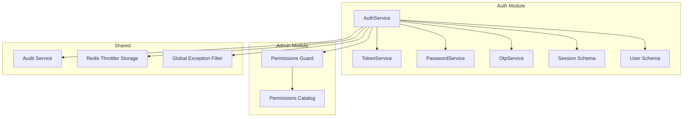
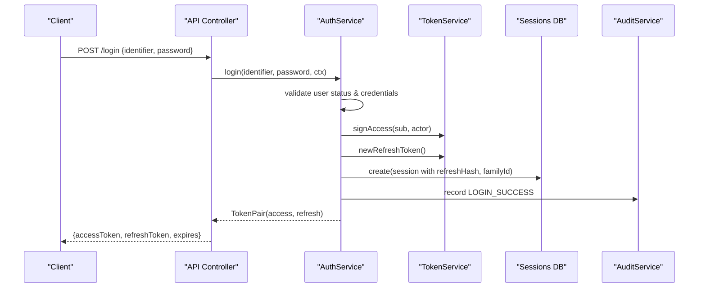
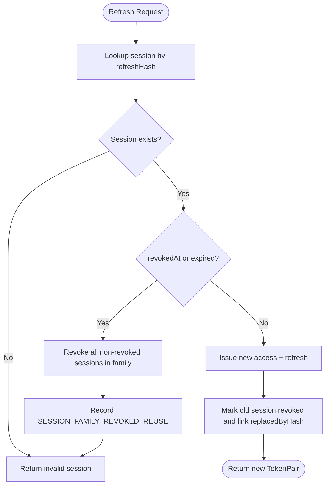
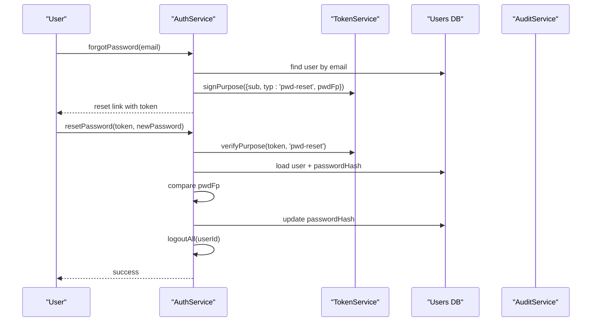
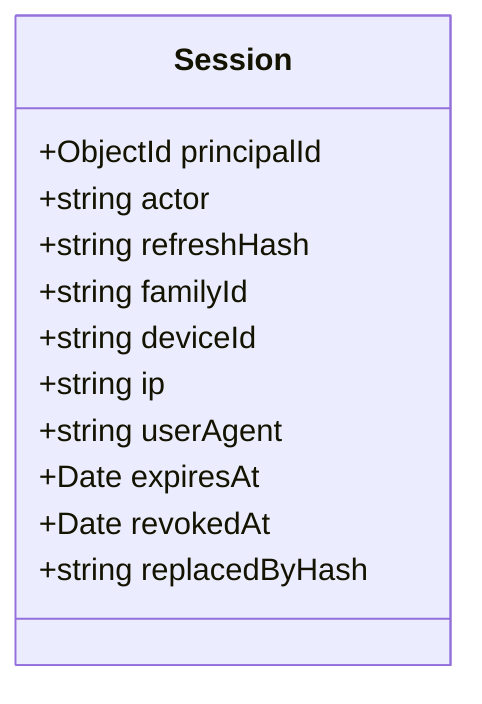
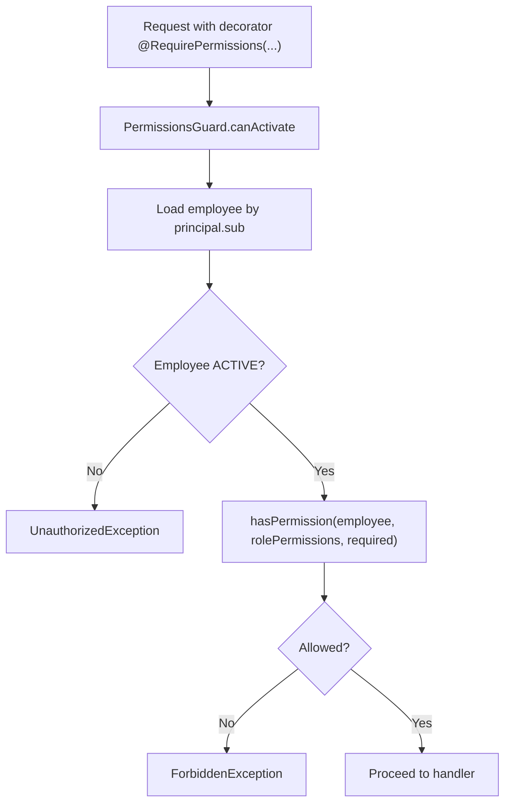
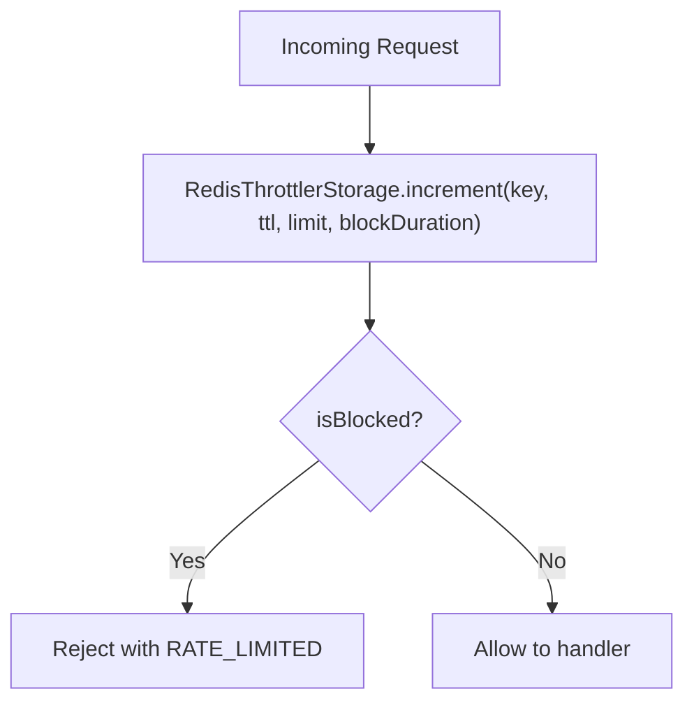
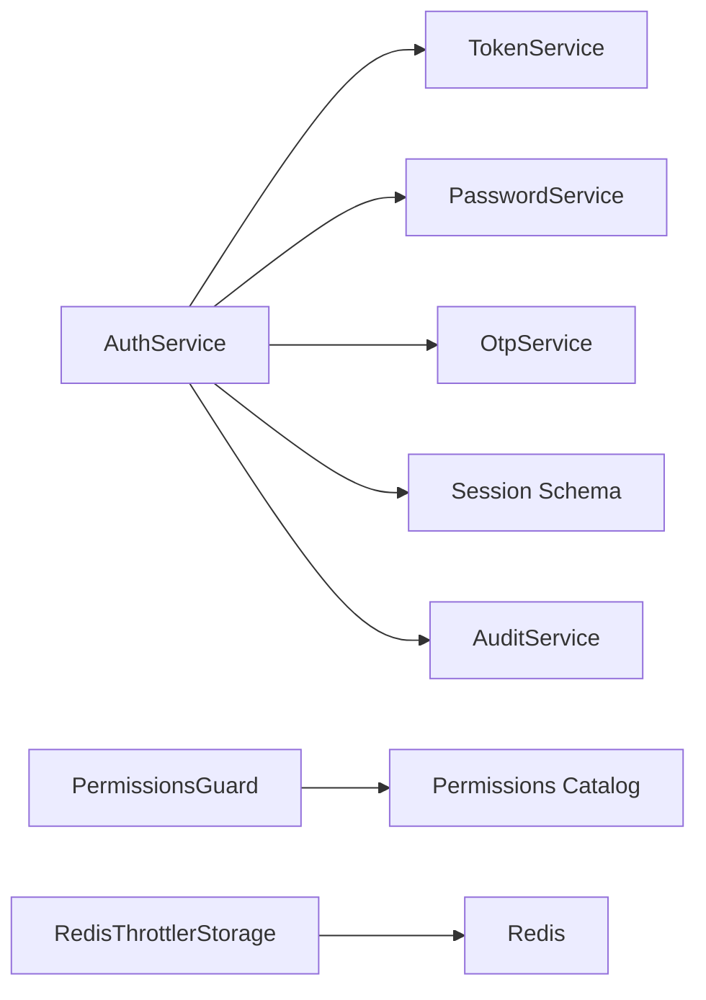

# Security Implementation

<cite>
**Referenced Files in This Document**
- [token.service.ts](file://backend/apps/api/src/modules/auth/infrastructure/token.service.ts)
- [password.service.ts](file://backend/apps/api/src/modules/auth/infrastructure/password.service.ts)
- [jwt-auth.guard.ts](file://backend/apps/api/src/modules/auth/presentation/jwt-auth.guard.ts)
- [permissions.guard.ts](file://backend/apps/api/src/modules/admin/presentation/permissions.guard.ts)
- [auth.service.ts](file://backend/apps/api/src/modules/auth/application/auth.service.ts)
- [session.schema.ts](file://backend/apps/api/src/modules/auth/infrastructure/schemas/session.schema.ts)
- [user.schema.ts](file://backend/apps/api/src/modules/auth/infrastructure/schemas/user.schema.ts)
- [crypto.util.ts](file://backend/apps/api/src/modules/auth/infrastructure/crypto.util.ts)
- [otp.service.ts](file://backend/apps/api/src/modules/auth/infrastructure/otp.service.ts)
- [redis-throttler.storage.ts](file://backend/libs/shared/src/rate-limit/redis-throttler.storage.ts)
- [audit.service.ts](file://backend/libs/shared/src/audit/audit.service.ts)
- [permissions.ts](file://backend/apps/api/src/modules/admin/domain/permissions.ts)
- [global-exception.filter.ts](file://backend/libs/shared/src/http/global-exception.filter.ts)
- [api.module.ts](file://backend/apps/api/src/api.module.ts)
</cite>

## Table of Contents
1. Introduction
2. Project Structure
3. Core Components
4. Architecture Overview
5. Detailed Component Analysis
6. Dependency Analysis
7. Performance Considerations
8. Troubleshooting Guide
9. Conclusion

## Introduction
This document provides a comprehensive security overview for the application, focusing on authentication, authorization, and data protection mechanisms. It covers JWT token handling with RS256 signing, refresh token rotation with family-based revocation, password hashing with Argon2, multi-factor authentication via OTP (with TOTP support surface), session management, role-based access control (RBAC), permission guards, audit logging, input validation, SQL injection prevention, XSS protection, CSRF mitigation, rate limiting, API throttling, brute force protection, secure coding practices, dependency scanning, and security monitoring tailored for financial applications.

## Project Structure
Security-related functionality is organized by domain modules:
- Authentication module: tokens, passwords, OTP, sessions, login flows, email verification, password reset
- Admin module: RBAC permissions catalog, permission guard, role cache
- Shared libraries: audit logging, rate limiting storage, HTTP exception filtering, configuration
- API layer: global exception filter, request validation settings

**Diagram sources**
- [auth.service.ts:145-216](file://backend/apps/api/src/modules/auth/application/auth.service.ts#L145-L216)
- [token.service.ts:42-84](file://backend/apps/api/src/modules/auth/infrastructure/token.service.ts#L42-L84)
- [password.service.ts:14-24](file://backend/apps/api/src/modules/auth/infrastructure/password.service.ts#L14-L24)
- [otp.service.ts:28-74](file://backend/apps/api/src/modules/auth/infrastructure/otp.service.ts#L28-L74)
- [session.schema.ts:9-41](file://backend/apps/api/src/modules/auth/infrastructure/schemas/session.schema.ts#L9-L41)
- [user.schema.ts:5-67](file://backend/apps/api/src/modules/auth/infrastructure/schemas/user.schema.ts#L5-L67)
- [permissions.guard.ts:18-40](file://backend/apps/api/src/modules/admin/presentation/permissions.guard.ts#L18-L40)
- [permissions.ts:5-64](file://backend/apps/api/src/modules/admin/domain/permissions.ts#L5-L64)
- [audit.service.ts:29-43](file://backend/libs/shared/src/audit/audit.service.ts#L29-L43)
- [redis-throttler.storage.ts:16-54](file://backend/libs/shared/src/rate-limit/redis-throttler.storage.ts#L16-L54)
- [global-exception.filter.ts:22-68](file://backend/libs/shared/src/http/global-exception.filter.ts#L22-L68)

**Section sources**
- [auth.service.ts:145-216](file://backend/apps/api/src/modules/auth/application/auth.service.ts#L145-L216)
- [token.service.ts:42-84](file://backend/apps/api/src/modules/auth/infrastructure/token.service.ts#L42-L84)
- [permissions.guard.ts:18-40](file://backend/apps/api/src/modules/admin/presentation/permissions.guard.ts#L18-L40)
- [redis-throttler.storage.ts:16-54](file://backend/libs/shared/src/rate-limit/redis-throttler.storage.ts#L16-L54)
- [audit.service.ts:29-43](file://backend/libs/shared/src/audit/audit.service.ts#L29-L43)
- [global-exception.filter.ts:22-68](file://backend/libs/shared/src/http/global-exception.filter.ts#L22-L68)

## Core Components
- TokenService: Signs and verifies RS256 JWTs for access tokens and short-lived purpose tokens; generates opaque refresh tokens stored as SHA-256 hashes; supports password fingerprinting for secure resets.
- PasswordService: Uses Argon2id with OWASP-recommended parameters to hash and verify passwords.
- OtpService: Issues and verifies time-bound OTP codes with per-target limits, cooldowns, attempt caps, and consumption tracking; integrates SMS delivery.
- AuthService: Orchestrates registration, login, mobile/email verification, password reset, session lifecycle, refresh rotation, and logout; records login history and audits key events.
- PermissionsGuard: Enforces fine-grained RBAC at controller level using a central permissions catalog and live employee state.
- RedisThrottlerStorage: Provides distributed rate limiting with blocking support across API instances.
- AuditService: Immutable audit trail writer for security-critical actions.
- GlobalExceptionFilter: Centralized error envelope that avoids leaking internals and maps HTTP statuses to stable error codes.

**Section sources**
- [token.service.ts:20-88](file://backend/apps/api/src/modules/auth/infrastructure/token.service.ts#L20-L88)
- [password.service.ts:4-24](file://backend/apps/api/src/modules/auth/infrastructure/password.service.ts#L4-L24)
- [otp.service.ts:11-74](file://backend/apps/api/src/modules/auth/infrastructure/otp.service.ts#L11-L74)
- [auth.service.ts:44-269](file://backend/apps/api/src/modules/auth/application/auth.service.ts#L44-L269)
- [permissions.guard.ts:13-40](file://backend/apps/api/src/modules/admin/presentation/permissions.guard.ts#L13-L40)
- [redis-throttler.storage.ts:7-54](file://backend/libs/shared/src/rate-limit/redis-throttler.storage.ts#L7-L54)
- [audit.service.ts:17-43](file://backend/libs/shared/src/audit/audit.service.ts#L17-L43)
- [global-exception.filter.ts:13-68](file://backend/libs/shared/src/http/global-exception.filter.ts#L13-L68)

## Architecture Overview
The authentication flow uses RS256-signed JWTs for short-lived access and purpose tokens, paired with opaque refresh tokens persisted as hashes. Sessions are grouped into families to enable family-wide revocation upon reuse or theft signals. RBAC is enforced via decorators and guards that consult live employee records and a centralized permissions catalog. Rate limiting is shared across instances via Redis. All sensitive operations are audited.

**Diagram sources**
- [auth.service.ts:145-183](file://backend/apps/api/src/modules/auth/application/auth.service.ts#L145-L183)
- [token.service.ts:42-84](file://backend/apps/api/src/modules/auth/infrastructure/token.service.ts#L42-L84)
- [session.schema.ts:9-41](file://backend/apps/api/src/modules/auth/infrastructure/schemas/session.schema.ts#L9-L41)
- [audit.service.ts:29-43](file://backend/libs/shared/src/audit/audit.service.ts#L29-L43)

## Detailed Component Analysis

### JWT and Refresh Token Rotation
- Access tokens: RS256 signed with private key, verified with public key; includes subject, actor kind, roles, and type enforcement.
- Purpose tokens: Short-lived tokens for email verification and password reset, with strict typ checks.
- Refresh tokens: Opaque random strings hashed with SHA-256 before storage; rotation issues a new pair and marks old session revoked; reused revoked token triggers family-wide revocation and audit event.

**Diagram sources**
- [auth.service.ts:190-216](file://backend/apps/api/src/modules/auth/application/auth.service.ts#L190-L216)
- [token.service.ts:73-84](file://backend/apps/api/src/modules/auth/infrastructure/token.service.ts#L73-L84)
- [session.schema.ts:9-41](file://backend/apps/api/src/modules/auth/infrastructure/schemas/session.schema.ts#L9-L41)

**Section sources**
- [token.service.ts:42-84](file://backend/apps/api/src/modules/auth/infrastructure/token.service.ts#L42-L84)
- [auth.service.ts:190-216](file://backend/apps/api/src/modules/auth/application/auth.service.ts#L190-L216)

### Password Hashing and Secure Reset
- Password hashing: Argon2id with memoryCost, timeCost, parallelism tuned for OWASP recommendations.
- Password reset: Purpose token includes a fingerprint of the current password hash; resetting changes the hash and invalidates all sessions.

**Diagram sources**
- [auth.service.ts:236-269](file://backend/apps/api/src/modules/auth/application/auth.service.ts#L236-L269)
- [token.service.ts:60-71](file://backend/apps/api/src/modules/auth/infrastructure/token.service.ts#L60-L71)
- [password.service.ts:14-24](file://backend/apps/api/src/modules/auth/infrastructure/password.service.ts#L14-L24)

**Section sources**
- [password.service.ts:4-24](file://backend/apps/api/src/modules/auth/infrastructure/password.service.ts#L4-L24)
- [auth.service.ts:236-269](file://backend/apps/api/src/modules/auth/application/auth.service.ts#L236-L269)

### Multi-Factor Authentication (TOTP Surface)
- The codebase includes TOTP test coverage indicating TOTP capability surface; OTP service currently implements SMS-based OTP with strict limits, cooldowns, and attempt caps. TOTP integration can be layered atop existing auth flows where required.

**Section sources**
- [otp.service.ts:11-74](file://backend/apps/api/src/modules/auth/infrastructure/otp.service.ts#L11-L74)

### Session Management
- Sessions store principal, actor, refresh hash, family ID, device metadata, IP, user agent, expiry, and revocation markers.
- Family-based revocation ensures compromised tokens invalidate related sessions.

**Diagram sources**
- [session.schema.ts:9-41](file://backend/apps/api/src/modules/auth/infrastructure/schemas/session.schema.ts#L9-L41)

**Section sources**
- [session.schema.ts:9-41](file://backend/apps/api/src/modules/auth/infrastructure/schemas/session.schema.ts#L9-L41)
- [auth.service.ts:190-232](file://backend/apps/api/src/modules/auth/application/auth.service.ts#L190-L232)

### Role-Based Access Control (RBAC) and Permission Guards
- Central permissions catalog defines granular permissions and default roles.
- PermissionsGuard enforces require-permission decorators against live employee records and role cache, with deny-wins semantics.

**Diagram sources**
- [permissions.guard.ts:18-40](file://backend/apps/api/src/modules/admin/presentation/permissions.guard.ts#L18-L40)
- [permissions.ts:5-64](file://backend/apps/api/src/modules/admin/domain/permissions.ts#L5-L64)

**Section sources**
- [permissions.guard.ts:13-40](file://backend/apps/api/src/modules/admin/presentation/permissions.guard.ts#L13-L40)
- [permissions.ts:5-64](file://backend/apps/api/src/modules/admin/domain/permissions.ts#L5-L64)

### Input Validation, Injection Prevention, and Output Sanitization
- Request validation: Whitelist mode strips unknown fields to reduce NoSQL injection surface.
- Query safety: Regex inputs are escaped before use in MongoDB queries to prevent injection.
- Data sanitization: Market data pipelines sanitize and filter outliers before returning results.

**Section sources**
- [api.module.ts:50](file://backend/apps/api/src/api.module.ts#L50)
- [user-admin.service.ts:27-30](file://backend/apps/api/src/modules/admin/application/user-admin.service.ts#L27-L30)
- [instrument.service.ts:72-107](file://backend/apps/api/src/modules/market/application/instrument.service.ts#L72-L107)
- [candle-sanitize.ts:33-146](file://backend/apps/api/src/modules/market/domain/candle-sanitize.ts#L33-L146)

### XSS Protection and CSRF Mitigation
- XSS: Avoid rendering untrusted data directly; rely on framework defaults and sanitization utilities for outputs. Ensure any user-provided content is encoded at render time.
- CSRF: For browser-based flows, ensure same-site cookies and CSRF tokens are used for state-changing requests. Validate Content-Type and origin headers server-side.

[No sources needed since this section provides general guidance]

### Rate Limiting, API Throttling, and Brute Force Protection
- Distributed throttling via Redis-backed storage supports per-route limits and blocking durations to mitigate brute force and abuse.
- OTP issuance enforces per-target hourly limits, resend cooldowns, and max attempts to protect against enumeration and brute force.

**Diagram sources**
- [redis-throttler.storage.ts:16-54](file://backend/libs/shared/src/rate-limit/redis-throttler.storage.ts#L16-L54)

**Section sources**
- [redis-throttler.storage.ts:7-54](file://backend/libs/shared/src/rate-limit/redis-throttler.storage.ts#L7-L54)
- [otp.service.ts:28-74](file://backend/apps/api/src/modules/auth/infrastructure/otp.service.ts#L28-L74)

### Audit Logging for Security Events
- Immutable audit entries capture actor, action, entity, IDs, and optional before/after snapshots. Writes never abort business operations but log loudly on failure.

**Section sources**
- [audit.service.ts:17-43](file://backend/libs/shared/src/audit/audit.service.ts#L17-L43)
- [auth.service.ts:71-78](file://backend/apps/api/src/modules/auth/application/auth.service.ts#L71-L78)
- [auth.service.ts:200-207](file://backend/apps/api/src/modules/auth/application/auth.service.ts#L200-L207)

### Data Protection at Rest
- Field encryption: AES-256-GCM with unique IVs and authenticated tags for sensitive fields (e.g., TOTP secrets). Key derived from a pepper and fixed context string; binary variant supports file blobs.

**Section sources**
- [crypto.util.ts:3-43](file://backend/apps/api/src/modules/auth/infrastructure/crypto.util.ts#L3-L43)

### Error Handling and Information Disclosure Prevention
- Global exception filter returns standardized error envelopes, mapping HTTP statuses to stable codes and avoiding internal details in production.

**Section sources**
- [global-exception.filter.ts:13-68](file://backend/libs/shared/src/http/global-exception.filter.ts#L13-L68)

## Dependency Analysis
Key dependencies and their roles:
- NestJS JwtService for RS256 token operations
- Mongoose schemas for users, sessions, and audit logs
- Redis for distributed rate limiting and potential future token revocation stores
- ConfigService/AppConfigService for runtime security parameters (JWT keys, TTLs, OTP limits)

**Diagram sources**
- [auth.service.ts:29-40](file://backend/apps/api/src/modules/auth/application/auth.service.ts#L29-L40)
- [token.service.ts:20-32](file://backend/apps/api/src/modules/auth/infrastructure/token.service.ts#L20-L32)
- [password.service.ts:4-12](file://backend/apps/api/src/modules/auth/infrastructure/password.service.ts#L4-L12)
- [otp.service.ts:15-26](file://backend/apps/api/src/modules/auth/infrastructure/otp.service.ts#L15-L26)
- [session.schema.ts:9-41](file://backend/apps/api/src/modules/auth/infrastructure/schemas/session.schema.ts#L9-L41)
- [audit.service.ts:23-27](file://backend/libs/shared/src/audit/audit.service.ts#L23-L27)
- [permissions.guard.ts:18-24](file://backend/apps/api/src/modules/admin/presentation/permissions.guard.ts#L18-L24)
- [permissions.ts:5-64](file://backend/apps/api/src/modules/admin/domain/permissions.ts#L5-L64)
- [redis-throttler.storage.ts:12-14](file://backend/libs/shared/src/rate-limit/redis-throttler.storage.ts#L12-L14)

**Section sources**
- [auth.service.ts:29-40](file://backend/apps/api/src/modules/auth/application/auth.service.ts#L29-L40)
- [redis-throttler.storage.ts:12-14](file://backend/libs/shared/src/rate-limit/redis-throttler.storage.ts#L12-L14)

## Performance Considerations
- Use short-lived access tokens to minimize exposure window; rotate refresh tokens on each use.
- Keep RBAC checks efficient by caching role permissions and reading live employee status only when necessary.
- Offload rate limiting to Redis to avoid per-process counters and ensure consistent limits across instances.
- Avoid heavy cryptographic operations on hot paths; precompute or cache where safe.

[No sources needed since this section provides general guidance]

## Troubleshooting Guide
- Invalid or expired tokens: Verify RS256 algorithm and key configuration; check token type claims.
- Session reuse detection: If refresh token reuse occurs, expect family revocation; investigate potential token theft.
- Rate limited requests: Inspect throttle keys and block durations; adjust limits based on traffic patterns.
- OTP failures: Confirm OTP limits, cooldowns, and attempt caps; ensure SMS delivery is functioning.
- Audit write failures: Monitor audit logger errors; they should not block business operations but must trigger alerts.

**Section sources**
- [jwt-auth.guard.ts:15-27](file://backend/apps/api/src/modules/auth/presentation/jwt-auth.guard.ts#L15-L27)
- [auth.service.ts:190-216](file://backend/apps/api/src/modules/auth/application/auth.service.ts#L190-L216)
- [redis-throttler.storage.ts:16-54](file://backend/libs/shared/src/rate-limit/redis-throttler.storage.ts#L16-L54)
- [otp.service.ts:55-74](file://backend/apps/api/src/modules/auth/infrastructure/otp.service.ts#L55-L74)
- [audit.service.ts:29-35](file://backend/libs/shared/src/audit/audit.service.ts#L29-L35)

## Conclusion
The system implements robust security controls suitable for financial applications:
- Strong authentication with RS256 JWTs and Argon2id password hashing
- Secure session management with refresh token rotation and family-based revocation
- Fine-grained RBAC with live permission enforcement
- Comprehensive audit logging and centralized error handling
- Distributed rate limiting and OTP safeguards against brute force
- Input validation and query sanitization to mitigate injection risks
- Encryption for sensitive fields at rest

Adopt continuous security monitoring, regular dependency scanning, and periodic vulnerability assessments to maintain compliance and resilience over time.

[No sources needed since this section summarizes without analyzing specific files]