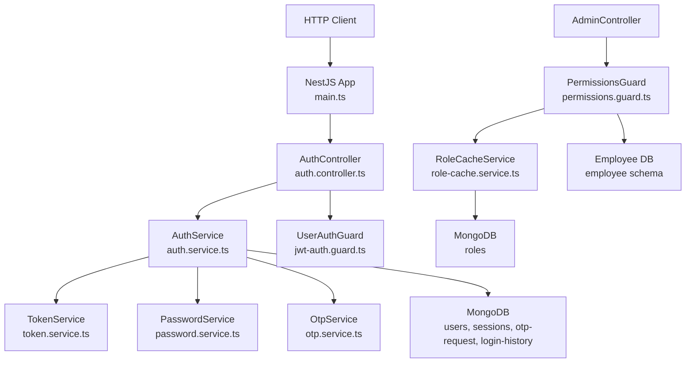
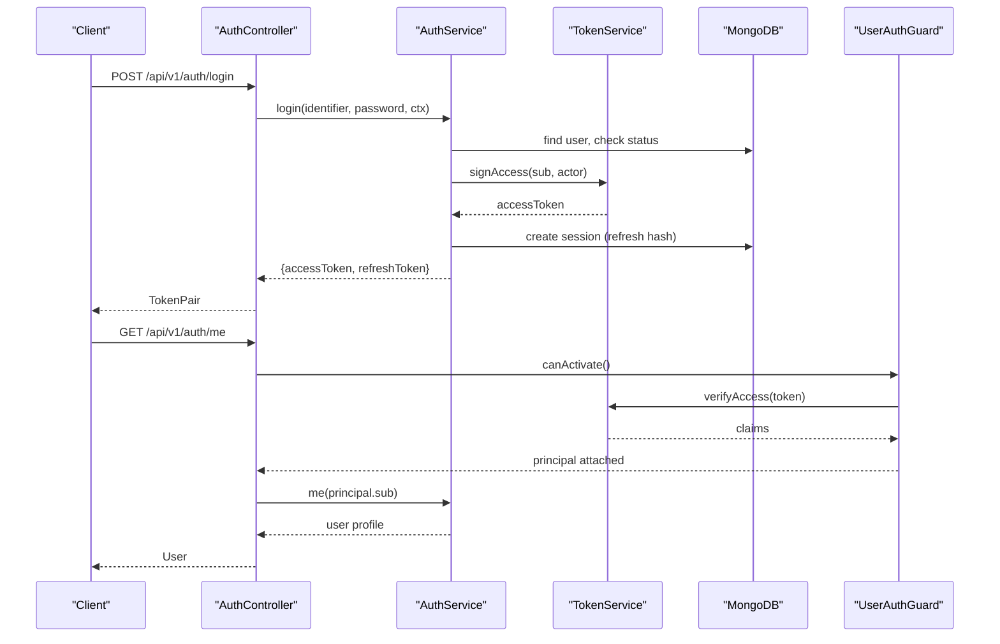
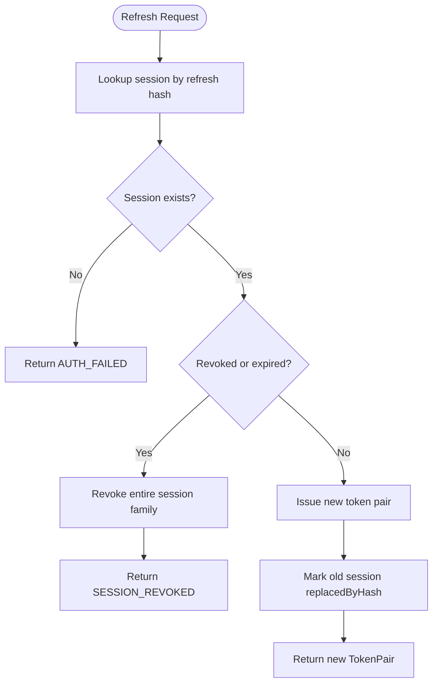
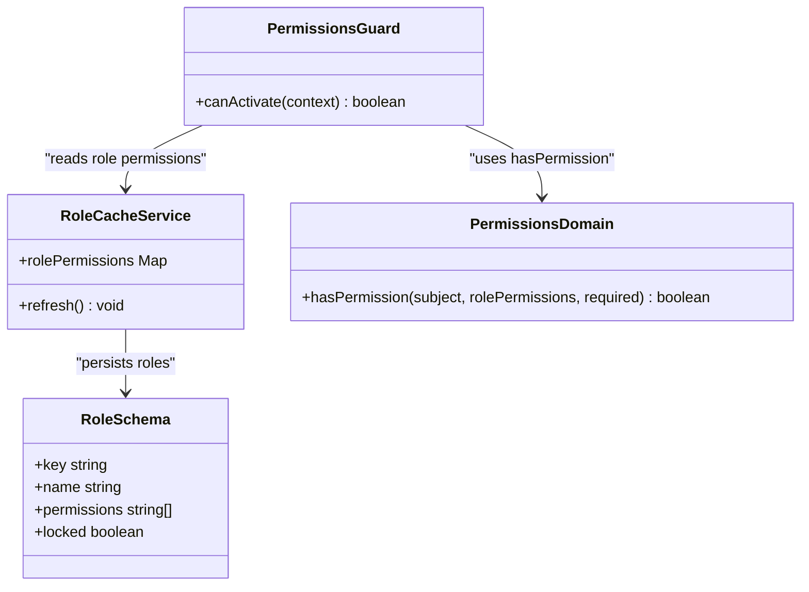
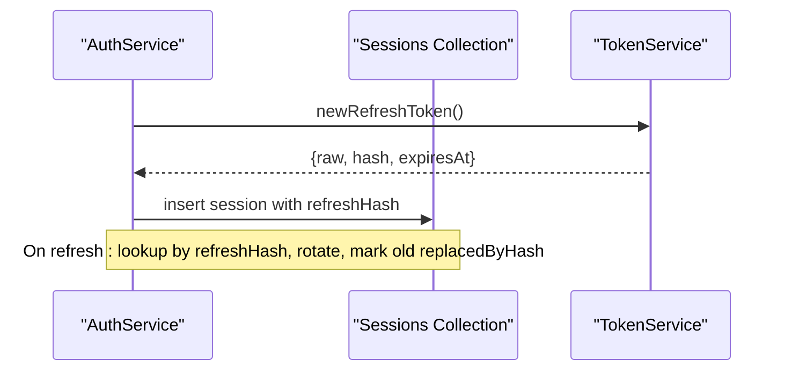
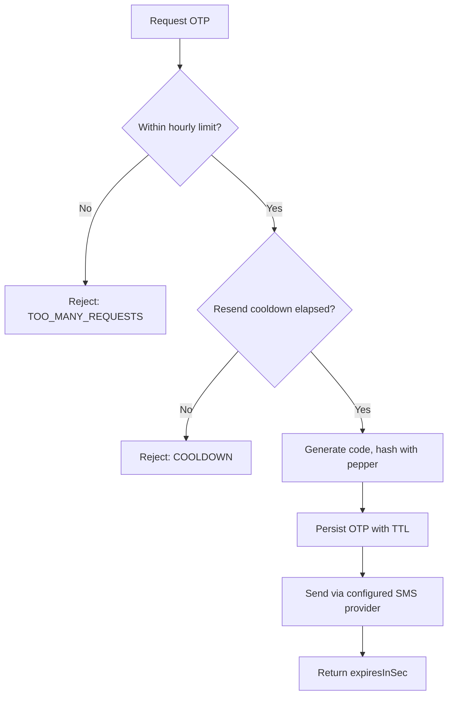
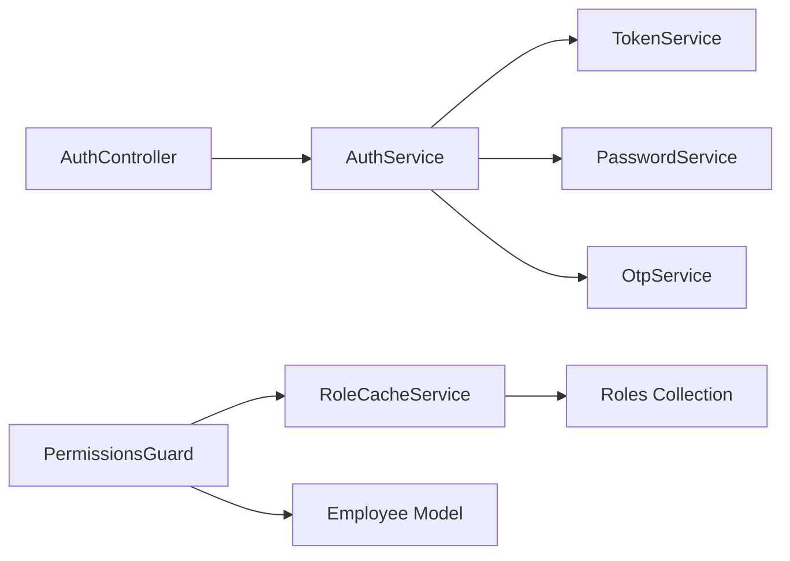

# Authentication & Security Architecture

<cite>
**Referenced Files in This Document**
- [main.ts](file://backend/apps/api/src/main.ts)
- [auth.module.ts](file://backend/apps/api/src/modules/auth/auth.module.ts)
- [auth.controller.ts](file://backend/apps/api/src/modules/auth/presentation/auth.controller.ts)
- [jwt-auth.guard.ts](file://backend/apps/api/src/modules/auth/presentation/jwt-auth.guard.ts)
- [auth.service.ts](file://backend/apps/api/src/modules/auth/application/auth.service.ts)
- [token.service.ts](file://backend/apps/api/src/modules/auth/infrastructure/token.service.ts)
- [password.service.ts](file://backend/apps/api/src/modules/auth/infrastructure/password.service.ts)
- [otp.service.ts](file://backend/apps/api/src/modules/auth/infrastructure/otp.service.ts)
- [permissions.guard.ts](file://backend/apps/api/src/modules/admin/presentation/permissions.guard.ts)
- [permissions.ts](file://backend/apps/api/src/modules/admin/domain/permissions.ts)
- [role-cache.service.ts](file://backend/apps/api/src/modules/admin/application/role-cache.service.ts)
- [role.schema.ts](file://backend/apps/api/src/modules/admin/infrastructure/role.schema.ts)
- [auth.types.ts](file://backend/apps/api/src/modules/auth/domain/auth.types.ts)
</cite>

## Table of Contents
1. Introduction
2. Project Structure
3. Core Components
4. Architecture Overview
5. Detailed Component Analysis
6. Dependency Analysis
7. Performance Considerations
8. Troubleshooting Guide
9. Conclusion

## Introduction
This document explains the authentication and security architecture of the trading platform with a focus on:
- JWT-based authentication flow (access tokens, refresh rotation, purpose tokens)
- Role-based access control (RBAC) for admin operations
- Session management and multi-factor support via OTP
- Password hashing and secure token handling
- Security boundaries between microservices and token propagation
- Admin module permissions and integration with the main auth flow
- Security headers, CORS configuration, and input validation strategies
- Examples of protected routes and custom guards

## Project Structure
The authentication and authorization features are implemented within the API application using a modular NestJS structure:
- Auth module provides user registration, login, OTP verification, password reset, session management, and JWT issuance/validation
- Admin module implements RBAC with permission guards and role caching
- Infrastructure services handle cryptographic operations, OTP storage, and token signing/verification
- The application bootstrap configures security headers and CORS

**Diagram sources**
- [main.ts:7-22](file://backend/apps/api/src/main.ts#L7-L22)
- [auth.controller.ts:53-139](file://backend/apps/api/src/modules/auth/presentation/auth.controller.ts#L53-L139)
- [auth.service.ts:28-346](file://backend/apps/api/src/modules/auth/application/auth.service.ts#L28-L346)
- [token.service.ts:20-89](file://backend/apps/api/src/modules/auth/infrastructure/token.service.ts#L20-L89)
- [password.service.ts:4-25](file://backend/apps/api/src/modules/auth/infrastructure/password.service.ts#L4-L25)
- [otp.service.ts:15-76](file://backend/apps/api/src/modules/auth/infrastructure/otp.service.ts#L15-L76)
- [jwt-auth.guard.ts:10-34](file://backend/apps/api/src/modules/auth/presentation/jwt-auth.guard.ts#L10-L34)
- [permissions.guard.ts:18-42](file://backend/apps/api/src/modules/admin/presentation/permissions.guard.ts#L18-L42)
- [role-cache.service.ts:12-45](file://backend/apps/api/src/modules/admin/application/role-cache.service.ts#L12-L45)

**Section sources**
- [main.ts:7-22](file://backend/apps/api/src/main.ts#L7-L22)
- [auth.module.ts:24-56](file://backend/apps/api/src/modules/auth/auth.module.ts#L24-L56)

## Core Components
- TokenService: Signs and verifies RS256 JWTs for access tokens and short-lived purpose tokens; generates opaque refresh tokens stored as SHA-256 hashes
- PasswordService: Argon2id hashing with OWASP-recommended parameters
- OtpService: Issues and verifies time-bound OTPs with rate limiting, cooldown, and attempt caps
- AuthService: Orchestrates registration, login, email/mobile verification, password reset, session lifecycle, and token pair issuance
- UserAuthGuard: Validates Bearer tokens, enforces actor type, and attaches principal to request
- PermissionsGuard + RoleCacheService: Enforces fine-grained admin permissions against live employee records and cached role-permission map
- Application bootstrap: Enables Helmet security headers and CORS with credentials

**Section sources**
- [token.service.ts:20-89](file://backend/apps/api/src/modules/auth/infrastructure/token.service.ts#L20-L89)
- [password.service.ts:4-25](file://backend/apps/api/src/modules/auth/infrastructure/password.service.ts#L4-L25)
- [otp.service.ts:15-76](file://backend/apps/api/src/modules/auth/infrastructure/otp.service.ts#L15-L76)
- [auth.service.ts:28-346](file://backend/apps/api/src/modules/auth/application/auth.service.ts#L28-L346)
- [jwt-auth.guard.ts:10-34](file://backend/apps/api/src/modules/auth/presentation/jwt-auth.guard.ts#L10-L34)
- [permissions.guard.ts:18-42](file://backend/apps/api/src/modules/admin/presentation/permissions.guard.ts#L18-L42)
- [role-cache.service.ts:12-45](file://backend/apps/api/src/modules/admin/application/role-cache.service.ts#L12-L45)
- [main.ts:7-22](file://backend/apps/api/src/main.ts#L7-L22)

## Architecture Overview
The system uses a stateless access token model with stateful refresh rotation:
- Access tokens are RS256-signed JWTs containing subject, actor kind, and optional roles
- Refresh tokens are opaque random values hashed and persisted per session; rotation revokes old refresh tokens and issues new pairs
- Purpose tokens are short-lived signed tokens for email verification and password reset flows
- Admin RBAC is enforced by reading live employee data and an in-memory role-permission cache

**Diagram sources**
- [auth.controller.ts:86-125](file://backend/apps/api/src/modules/auth/presentation/auth.controller.ts#L86-L125)
- [auth.service.ts:145-183](file://backend/apps/api/src/modules/auth/application/auth.service.ts#L145-L183)
- [token.service.ts:42-58](file://backend/apps/api/src/modules/auth/infrastructure/token.service.ts#L42-L58)
- [jwt-auth.guard.ts:15-27](file://backend/apps/api/src/modules/auth/presentation/jwt-auth.guard.ts#L15-L27)

## Detailed Component Analysis

### JWT-Based Authentication Flow
- Login validates credentials, checks account status, records login history, and issues a token pair
- Access tokens are short-lived RS256 JWTs verified by guards before route handlers execute
- Refresh flow rotates sessions: valid refresh → revoke old session row → issue new pair; reuse of revoked/expired refresh revokes entire family
- Logout revokes the current refresh token; logout-all revokes all active sessions for the user

**Diagram sources**
- [auth.service.ts:190-216](file://backend/apps/api/src/modules/auth/application/auth.service.ts#L190-L216)
- [token.service.ts:73-84](file://backend/apps/api/src/modules/auth/infrastructure/token.service.ts#L73-L84)

**Section sources**
- [auth.controller.ts:86-107](file://backend/apps/api/src/modules/auth/presentation/auth.controller.ts#L86-L107)
- [auth.service.ts:145-232](file://backend/apps/api/src/modules/auth/application/auth.service.ts#L145-L232)
- [token.service.ts:42-84](file://backend/apps/api/src/modules/auth/infrastructure/token.service.ts#L42-L84)
- [auth.types.ts:24-38](file://backend/apps/api/src/modules/auth/domain/auth.types.ts#L24-L38)

### Role-Based Access Control (RBAC) and Permission Guards
- Admin endpoints use RequirePermissions decorator to declare required permissions
- PermissionsGuard runs after EmployeeAuthGuard, loads live employee record, and evaluates permissions using hasPermission
- RoleCacheService maintains an in-memory map of role keys to permissions, refreshed periodically and seeded with defaults
- Deny-wins semantics ensure explicit denies override grants including wildcard permissions

**Diagram sources**
- [permissions.guard.ts:18-42](file://backend/apps/api/src/modules/admin/presentation/permissions.guard.ts#L18-L42)
- [role-cache.service.ts:12-45](file://backend/apps/api/src/modules/admin/application/role-cache.service.ts#L12-L45)
- [permissions.ts:1-65](file://backend/apps/api/src/modules/admin/domain/permissions.ts#L1-L65)
- [role.schema.ts:4-22](file://backend/apps/api/src/modules/admin/infrastructure/role.schema.ts#L4-L22)

**Section sources**
- [permissions.guard.ts:18-42](file://backend/apps/api/src/modules/admin/presentation/permissions.guard.ts#L18-L42)
- [permissions.ts:1-65](file://backend/apps/api/src/modules/admin/domain/permissions.ts#L1-L65)
- [role-cache.service.ts:12-45](file://backend/apps/api/src/modules/admin/application/role-cache.service.ts#L12-L45)
- [role.schema.ts:4-22](file://backend/apps/api/src/modules/admin/infrastructure/role.schema.ts#L4-L22)

### Session Management
- Sessions store principal ID, actor kind, device metadata, IP, user agent, expiration, and refresh token hash
- Rotation ensures only one active refresh per family at a time; reused refresh triggers family-wide revocation
- Active sessions can be listed by users; login history tracks success/failure with context

**Diagram sources**
- [auth.service.ts:298-316](file://backend/apps/api/src/modules/auth/application/auth.service.ts#L298-L316)
- [token.service.ts:73-84](file://backend/apps/api/src/modules/auth/infrastructure/token.service.ts#L73-L84)

**Section sources**
- [auth.service.ts:190-232](file://backend/apps/api/src/modules/auth/application/auth.service.ts#L190-L232)
- [auth.service.ts:298-316](file://backend/apps/api/src/modules/auth/application/auth.service.ts#L298-L316)

### Multi-Factor Authentication Support (OTP)
- OTP issuance enforces per-hour limits, resend cooldown, TTL, and attempt caps
- Codes are hashed with a pepper before storage; verification marks codes as consumed
- SMS provider is configurable via dependency injection

**Diagram sources**
- [otp.service.ts:28-53](file://backend/apps/api/src/modules/auth/infrastructure/otp.service.ts#L28-L53)

**Section sources**
- [otp.service.ts:15-76](file://backend/apps/api/src/modules/auth/infrastructure/otp.service.ts#L15-L76)
- [auth.module.ts:42-53](file://backend/apps/api/src/modules/auth/auth.module.ts#L42-L53)

### Password Hashing Implementation
- Uses Argon2id with memory cost, time cost, and parallelism tuned for OWASP recommendations
- Verification returns false on exceptions to avoid timing side-channels

**Section sources**
- [password.service.ts:4-25](file://backend/apps/api/src/modules/auth/infrastructure/password.service.ts#L4-L25)

### Security Boundaries and Token Propagation
- Access tokens are validated per request by guards; they carry actor kind and optional roles
- Cross-service calls should propagate the Authorization header with the Bearer token to downstream services that implement similar guard logic
- Refresh tokens are never sent to other services; they remain client-side and are used only with the auth service

**Section sources**
- [jwt-auth.guard.ts:15-27](file://backend/apps/api/src/modules/auth/presentation/jwt-auth.guard.ts#L15-L27)
- [token.service.ts:42-58](file://backend/apps/api/src/modules/auth/infrastructure/token.service.ts#L42-L58)

### Admin Module Integration with Main Auth Flow
- Admin endpoints require both EmployeeAuthGuard (valid employee token) and PermissionsGuard (required permissions)
- Permissions are evaluated against live employee data and cached role-permission map for performance

**Section sources**
- [permissions.guard.ts:18-42](file://backend/apps/api/src/modules/admin/presentation/permissions.guard.ts#L18-L42)
- [role-cache.service.ts:12-45](file://backend/apps/api/src/modules/admin/application/role-cache.service.ts#L12-L45)

### Security Headers, CORS, and Input Validation
- Helmet enables secure HTTP headers across all responses
- CORS is configured with allowed origins from environment and credentials enabled
- Throttling protects sensitive endpoints with strict limits; DTOs define expected inputs

**Section sources**
- [main.ts:7-22](file://backend/apps/api/src/main.ts#L7-L22)
- [auth.controller.ts:22-23](file://backend/apps/api/src/modules/auth/presentation/auth.controller.ts#L22-L23)

### Protected Routes and Custom Guards
- Protected user routes:
  - GET /api/v1/auth/me
  - GET /api/v1/auth/sessions
  - GET /api/v1/auth/login-history
  - POST /api/v1/auth/logout-all
- Protected admin routes:
  - Any endpoint decorated with RequirePermissions(...) will enforce RBAC via PermissionsGuard

Example usage patterns:
- Apply UserAuthGuard to protect user-scoped endpoints
- Combine EmployeeAuthGuard with RequirePermissions to protect admin endpoints

**Section sources**
- [auth.controller.ts:103-137](file://backend/apps/api/src/modules/auth/presentation/auth.controller.ts#L103-L137)
- [permissions.guard.ts:10-11](file://backend/apps/api/src/modules/admin/presentation/permissions.guard.ts#L10-L11)

## Dependency Analysis
Key dependencies and relationships:
- AuthController depends on AuthService and applies throttling and guards
- AuthService composes TokenService, PasswordService, OtpService, and MongoDB models
- PermissionsGuard depends on RoleCacheService and Employee model
- RoleCacheService seeds default roles and refreshes permissions periodically

**Diagram sources**
- [auth.controller.ts:53-139](file://backend/apps/api/src/modules/auth/presentation/auth.controller.ts#L53-L139)
- [auth.service.ts:28-40](file://backend/apps/api/src/modules/auth/application/auth.service.ts#L28-L40)
- [permissions.guard.ts:18-24](file://backend/apps/api/src/modules/admin/presentation/permissions.guard.ts#L18-L24)
- [role-cache.service.ts:12-17](file://backend/apps/api/src/modules/admin/application/role-cache.service.ts#L12-L17)

**Section sources**
- [auth.module.ts:24-56](file://backend/apps/api/src/modules/auth/auth.module.ts#L24-L56)
- [auth.service.ts:28-40](file://backend/apps/api/src/modules/auth/application/auth.service.ts#L28-L40)
- [permissions.guard.ts:18-24](file://backend/apps/api/src/modules/admin/presentation/permissions.guard.ts#L18-L24)

## Performance Considerations
- Access tokens are stateless and fast to verify; keep them short-lived
- Refresh rotation reduces risk surface while maintaining usability; ensure clients handle rotation correctly
- Role cache minimizes database reads for permission checks; periodic refresh balances freshness and load
- OTP throttling and cooldowns prevent abuse without impacting legitimate users
- Use efficient queries and projections in session and login history lookups

[No sources needed since this section provides general guidance]

## Troubleshooting Guide
Common errors and resolutions:
- Invalid or expired token: Ensure Bearer token is present and not tampered; re-login if expired
- Wrong actor: Verify the token was issued for the correct actor (USER vs EMPLOYEE)
- Session revoked: Refresh token reuse revokes the family; re-authenticate
- OTP locked or cooldown: Wait for cooldown or request a new OTP after too many attempts
- Insufficient permissions: Confirm employee status is ACTIVE and has required permissions; check role overrides

**Section sources**
- [jwt-auth.guard.ts:15-27](file://backend/apps/api/src/modules/auth/presentation/jwt-auth.guard.ts#L15-L27)
- [auth.controller.ts:25-51](file://backend/apps/api/src/modules/auth/presentation/auth.controller.ts#L25-L51)
- [auth.service.ts:190-216](file://backend/apps/api/src/modules/auth/application/auth.service.ts#L190-L216)
- [otp.service.ts:55-74](file://backend/apps/api/src/modules/auth/infrastructure/otp.service.ts#L55-L74)
- [permissions.guard.ts:26-39](file://backend/apps/api/src/modules/admin/presentation/permissions.guard.ts#L26-L39)

## Conclusion
The platform implements a robust, modern authentication and authorization system:
- Stateless JWT access tokens with RS256 signatures and short TTLs
- Secure refresh rotation with family revocation on misuse
- Fine-grained RBAC for admin operations with live evaluation and caching
- Strong password hashing and OTP-based verification with rate controls
- Hardened server configuration with Helmet and CORS
- Clear separation of concerns and extensible guard-based protection for future microservices

[No sources needed since this section summarizes without analyzing specific files]