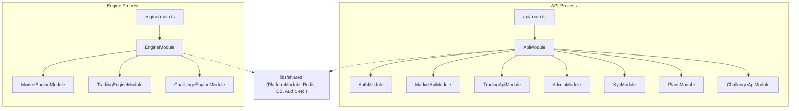
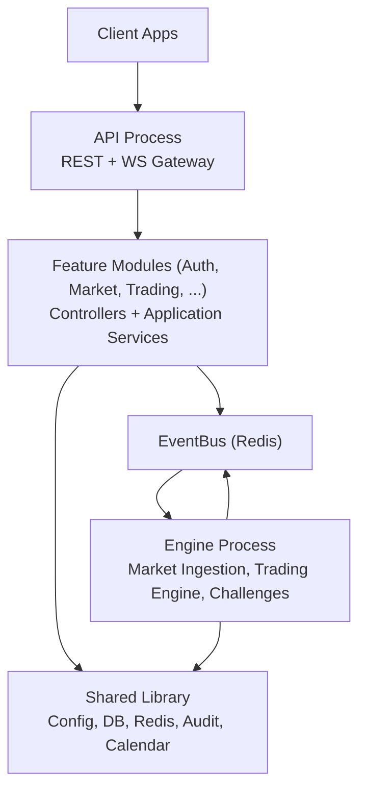
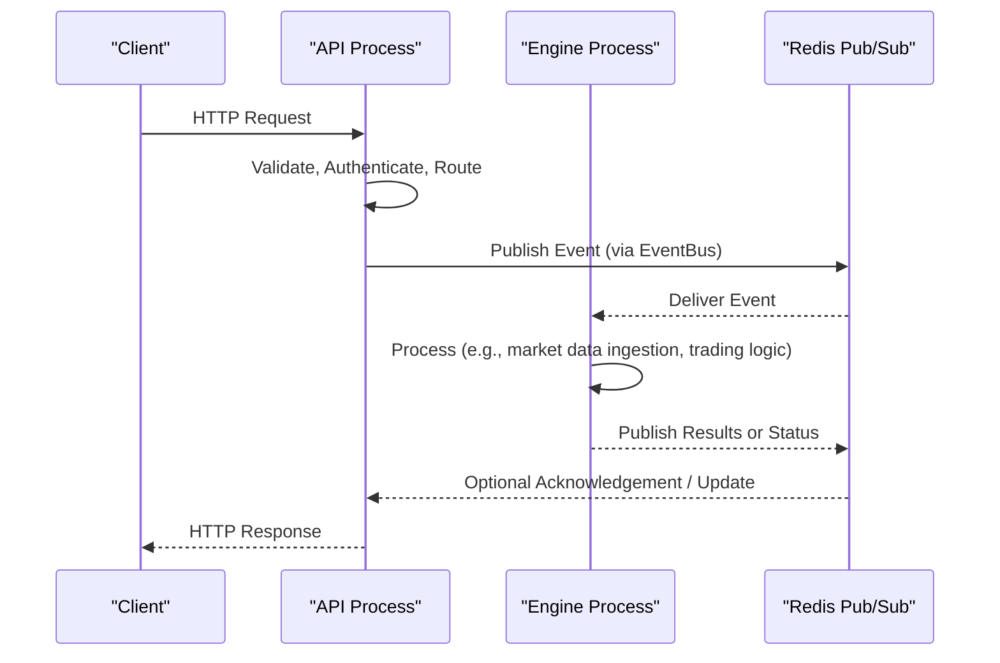
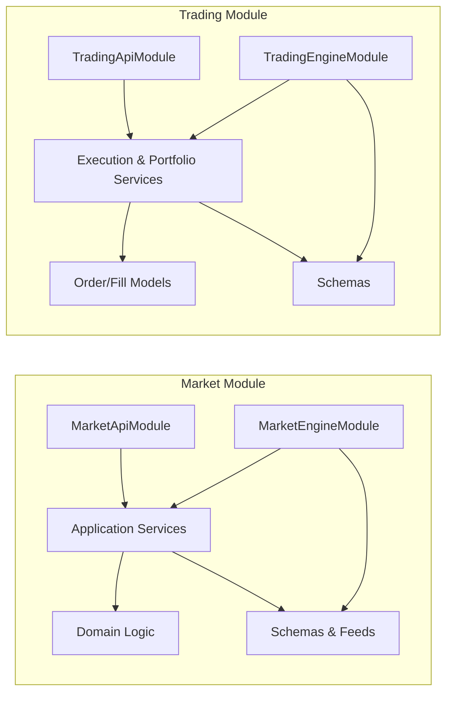
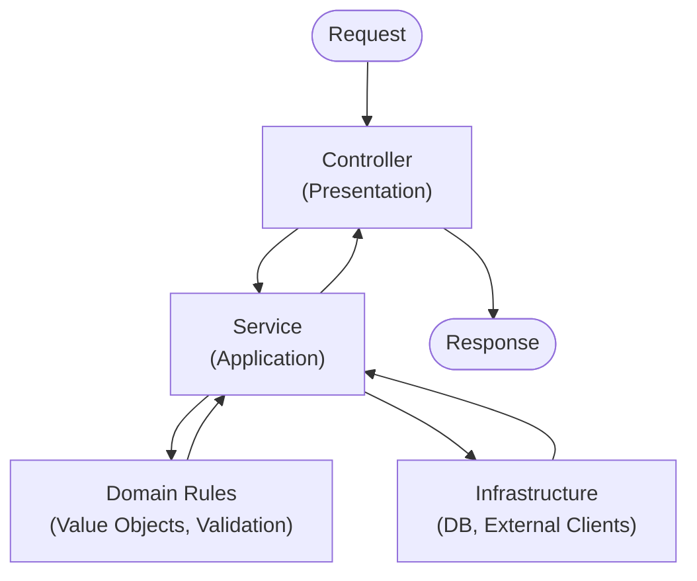
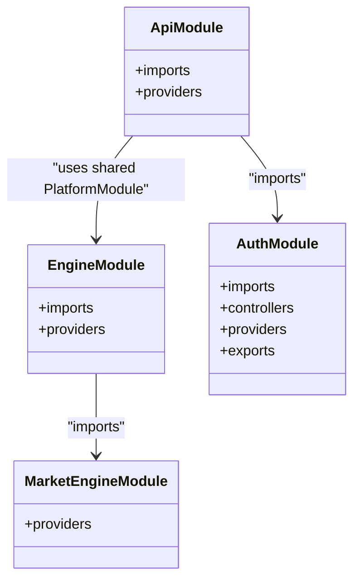
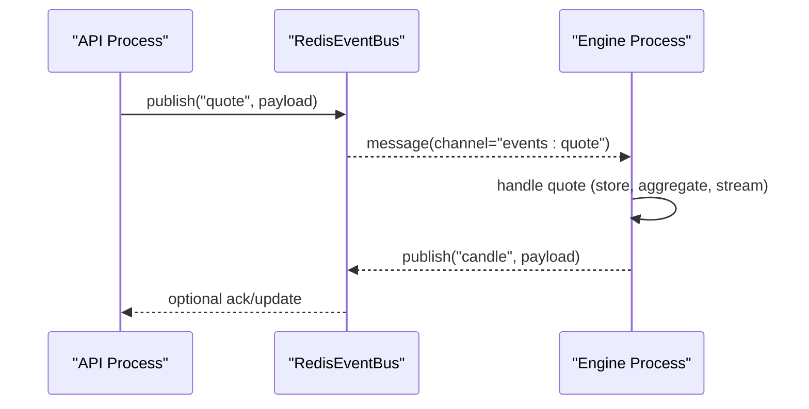
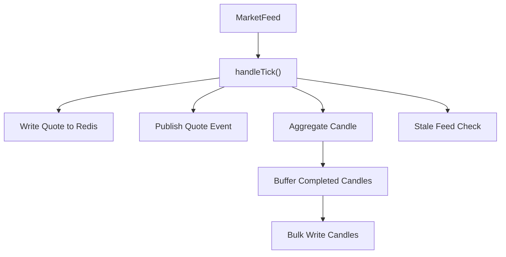
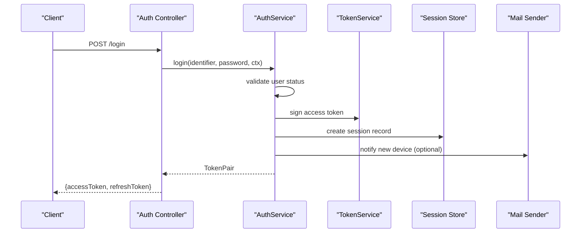
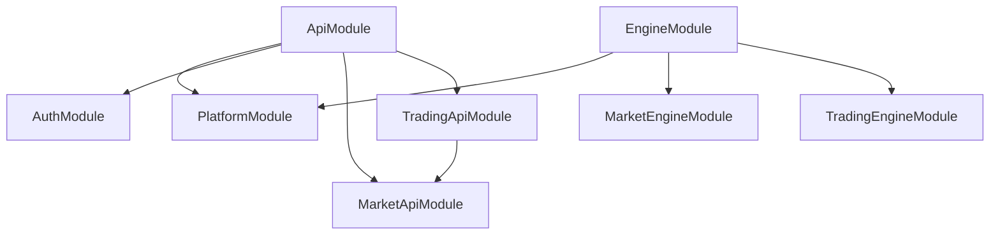

# Core Architecture Patterns

<cite>
**Referenced Files in This Document**
- [main.ts](file://backend/apps/api/src/main.ts)
- [engine main.ts](file://backend/apps/engine/src/main.ts)
- [ApiModule](file://backend/apps/api/src/api.module.ts)
- [EngineModule](file://backend/apps/engine/src/engine.module.ts)
- [PlatformModule](file://backend/libs/shared/src/platform.module.ts)
- [Shared index](file://backend/libs/shared/src/index.ts)
- [RedisEventBus](file://backend/libs/shared/src/redis/redis-event-bus.ts)
- [MarketApiModule](file://backend/apps/api/src/modules/market/market-api.module.ts)
- [TradingApiModule](file://backend/apps/api/src/modules/trading/trading-api.module.ts)
- [AuthModule](file://backend/apps/api/src/modules/auth/auth.module.ts)
- [MarketEngineModule](file://backend/apps/api/src/modules/market/market-engine.module.ts)
- [TradingEngineModule](file://backend/apps/api/src/modules/trading/trading-engine.module.ts)
- [AuthService](file://backend/apps/api/src/modules/auth/application/auth.service.ts)
- [MarketDataService](file://backend/apps/api/src/modules/market/application/market-data.service.ts)
</cite>

## Table of Contents
1. [Introduction](#introduction)
2. [Project Structure](#project-structure)
3. [Core Components](#core-components)
4. [Architecture Overview](#architecture-overview)
5. [Detailed Component Analysis](#detailed-component-analysis)
6. [Dependency Analysis](#dependency-analysis)
7. [Performance Considerations](#performance-considerations)
8. [Troubleshooting Guide](#troubleshooting-guide)
9. [Conclusion](#conclusion)

## Introduction
This document explains the core architectural patterns of the NiveshGuru Trading Platform, focusing on:
- Microservices architecture with separate API and Engine processes communicating via Redis Pub/Sub
- Modular monolith pattern within each process, organized by feature modules with clear boundaries
- Layered architecture (domain, application, infrastructure, presentation) with concrete examples
- Dependency injection using NestJS modules and providers
- Shared library providing cross-cutting functionality across services

The goal is to make these patterns understandable for both technical and non-technical readers while grounding explanations in the codebase.

## Project Structure
At a high level, the backend consists of two NestJS applications:
- API process: REST endpoints, authentication, admin, KYC, plans, market data APIs, trading APIs, challenge APIs
- Engine process: market data ingestion, real-time streaming, trading engine logic, challenge evaluation

Both processes share a common library that provides configuration, database, Redis, audit, logging, health, calendar, rate limiting, and domain primitives.

**Diagram sources**
- [main.ts:7-25](file://backend/apps/api/src/main.ts#L7-L25)
- [engine main.ts:7-19](file://backend/apps/engine/src/main.ts#L7-L19)
- [ApiModule:23-56](file://backend/apps/api/src/api.module.ts#L23-L56)
- [EngineModule:15-22](file://backend/apps/engine/src/engine.module.ts#L15-L22)
- [PlatformModule:21-38](file://backend/libs/shared/src/platform.module.ts#L21-L38)

**Section sources**
- [main.ts:7-25](file://backend/apps/api/src/main.ts#L7-L25)
- [engine main.ts:7-19](file://backend/apps/engine/src/main.ts#L7-L19)
- [ApiModule:23-56](file://backend/apps/api/src/api.module.ts#L23-L56)
- [EngineModule:15-22](file://backend/apps/engine/src/engine.module.ts#L15-L22)
- [PlatformModule:21-38](file://backend/libs/shared/src/platform.module.ts#L21-L38)

## Core Components
Key building blocks:
- PlatformModule: Global module wiring environment validation, logging, MongoDB, Redis, audit, exchange calendar, health endpoint, and shared services
- Feature modules: Auth, Admin, KYC, Plans, Market, Trading, Challenge — each encapsulating controllers, services, schemas, and domain logic
- Event bus: Redis-based pub/sub implementation used for cross-process communication
- Processes: API (REST) and Engine (real-time/event-driven), sharing the same feature code but different runtime responsibilities

**Section sources**
- [PlatformModule:21-38](file://backend/libs/shared/src/platform.module.ts#L21-L38)
- [Shared index:1-13](file://backend/libs/shared/src/index.ts#L1-L13)
- [RedisEventBus:15-64](file://backend/libs/shared/src/redis/redis-event-bus.ts#L15-L64)

## Architecture Overview
The platform uses a microservices-style split between API and Engine processes:
- API process exposes HTTP endpoints and orchestrates business flows
- Engine process runs long-lived tasks like market data ingestion, real-time streaming, and event processing
- Both processes depend on the shared library for cross-cutting concerns
- Cross-process communication happens via Redis Pub/Sub through the EventBus abstraction

**Diagram sources**
- [ApiModule:23-56](file://backend/apps/api/src/api.module.ts#L23-L56)
- [EngineModule:15-22](file://backend/apps/engine/src/engine.module.ts#L15-L22)
- [PlatformModule:21-38](file://backend/libs/shared/src/platform.module.ts#L21-L38)
- [RedisEventBus:26-63](file://backend/libs/shared/src/redis/redis-event-bus.ts#L26-L63)

## Detailed Component Analysis

### Microservices: API vs Engine Processes
- API bootstrap configures global prefix, CORS, helmet, throttling, validation, and listens on a configured port
- Engine bootstrap enables WebSocket adapter and listens on its own port
- Both import PlatformModule to access shared services and infrastructure

**Diagram sources**
- [main.ts:7-25](file://backend/apps/api/src/main.ts#L7-L25)
- [engine main.ts:7-19](file://backend/apps/engine/src/main.ts#L7-L19)
- [RedisEventBus:26-63](file://backend/libs/shared/src/redis/redis-event-bus.ts#L26-L63)

**Section sources**
- [main.ts:7-25](file://backend/apps/api/src/main.ts#L7-L25)
- [engine main.ts:7-19](file://backend/apps/engine/src/main.ts#L7-L19)

### Modular Monolith: Feature Modules with Clear Boundaries
Each feature is a NestJS module containing:
- Presentation layer: Controllers and DTOs
- Application layer: Use-case services
- Domain layer: Value objects, rules, and pure logic
- Infrastructure layer: Schemas, external clients, ports/implementations

Examples:
- Market module: API module wires controllers and services; Engine module wires feed adapters and gateway
- Trading module: API module exposes order/portfolio endpoints; Engine module contains execution and trading engine services
- Auth module: Encapsulates user/session management, tokens, OTP, mail/SMS senders

**Diagram sources**
- [MarketApiModule:27-62](file://backend/apps/api/src/modules/market/market-api.module.ts#L27-L62)
- [MarketEngineModule:21-46](file://backend/apps/api/src/modules/market/market-engine.module.ts#L21-L46)
- [TradingApiModule:10-16](file://backend/apps/api/src/modules/trading/trading-api.module.ts#L10-L16)
- [TradingEngineModule:7-11](file://backend/apps/api/src/modules/trading/trading-engine.module.ts#L7-L11)

**Section sources**
- [MarketApiModule:27-62](file://backend/apps/api/src/modules/market/market-api.module.ts#L27-L62)
- [MarketEngineModule:21-46](file://backend/apps/api/src/modules/market/market-engine.module.ts#L21-L46)
- [TradingApiModule:10-16](file://backend/apps/api/src/modules/trading/trading-api.module.ts#L10-L16)
- [TradingEngineModule:7-11](file://backend/apps/api/src/modules/trading/trading-engine.module.ts#L7-L11)
- [AuthModule:24-57](file://backend/apps/api/src/modules/auth/auth.module.ts#L24-L57)

### Layered Architecture: Domain, Application, Infrastructure, Presentation
Layering is consistent within modules:
- Presentation: Controllers handle HTTP/WebSocket requests and responses
- Application: Services orchestrate use cases, coordinate domain and infrastructure
- Domain: Pure business logic, value objects, and rules
- Infrastructure: Data persistence (MongoDB schemas), external integrations (market feeds, payment providers), and I/O

Example: Auth service demonstrates layered composition:
- Presentation: Auth controllers (in AuthModule)
- Application: AuthService handles registration, login, refresh, password reset
- Domain: Types and rules (e.g., auth types)
- Infrastructure: Schemas, token service, OTP, mail/SMS senders

**Diagram sources**
- [AuthModule:24-57](file://backend/apps/api/src/modules/auth/auth.module.ts#L24-L57)
- [AuthService:28-40](file://backend/apps/api/src/modules/auth/application/auth.service.ts#L28-L40)

**Section sources**
- [AuthModule:24-57](file://backend/apps/api/src/modules/auth/auth.module.ts#L24-L57)
- [AuthService:28-40](file://backend/apps/api/src/modules/auth/application/auth.service.ts#L28-L40)

### Dependency Injection with NestJS Modules and Providers
NestJS DI is used extensively:
- Modules declare imports, controllers, providers, and exports
- Providers are injected via constructor parameters or decorators
- Cross-module dependencies are expressed through module imports and exports
- Conditional providers enable pluggable implementations (e.g., SMS/Mail senders)

Examples:
- ApiModule imports PlatformModule and feature modules, registers global guards, interceptors, filters, and pipes
- EngineModule imports PlatformModule and engine-specific modules
- AuthModule conditionally provides SMS/Mail senders based on configuration
- MarketEngineModule binds a switchable market feed provider

**Diagram sources**
- [ApiModule:23-56](file://backend/apps/api/src/api.module.ts#L23-L56)
- [EngineModule:15-22](file://backend/apps/engine/src/engine.module.ts#L15-L22)
- [AuthModule:24-57](file://backend/apps/api/src/modules/auth/auth.module.ts#L24-L57)
- [MarketEngineModule:21-46](file://backend/apps/api/src/modules/market/market-engine.module.ts#L21-L46)

**Section sources**
- [ApiModule:23-56](file://backend/apps/api/src/api.module.ts#L23-L56)
- [EngineModule:15-22](file://backend/apps/engine/src/engine.module.ts#L15-L22)
- [AuthModule:24-57](file://backend/apps/api/src/modules/auth/auth.module.ts#L24-L57)
- [MarketEngineModule:21-46](file://backend/apps/api/src/modules/market/market-engine.module.ts#L21-L46)

### Cross-Process Communication via Redis Pub/Sub
The EventBus abstraction decouples producers from consumers:
- RedisEventBus publishes events to channels prefixed consistently
- Subscribers register handlers per event name
- The Engine process consumes events for market data and trading workflows
- The API process can publish events to trigger Engine-side work

**Diagram sources**
- [RedisEventBus:26-63](file://backend/libs/shared/src/redis/redis-event-bus.ts#L26-L63)

**Section sources**
- [RedisEventBus:26-63](file://backend/libs/shared/src/redis/redis-event-bus.ts#L26-L63)

### Market Data Pipeline Example
Market data flow illustrates layered design and cross-process messaging:
- MarketDataService subscribes to a feed, writes quotes to Redis, publishes events, aggregates candles, and persists them
- On-demand subscription ensures only interested instruments are tracked
- Health checks detect stale feeds and resubscribe when needed

**Diagram sources**
- [MarketDataService:43-137](file://backend/apps/api/src/modules/market/application/market-data.service.ts#L43-L137)

**Section sources**
- [MarketDataService:43-137](file://backend/apps/api/src/modules/market/application/market-data.service.ts#L43-L137)

### Authentication Flow Example
Authentication demonstrates layered composition and secure session handling:
- Controllers receive credentials
- AuthService validates, issues tokens, records sessions, and audits actions
- Infrastructure layers provide hashing, token signing, OTP, and mail/SMS delivery

**Diagram sources**
- [AuthModule:24-57](file://backend/apps/api/src/modules/auth/auth.module.ts#L24-L57)
- [AuthService:145-183](file://backend/apps/api/src/modules/auth/application/auth.service.ts#L145-L183)

**Section sources**
- [AuthService:145-183](file://backend/apps/api/src/modules/auth/application/auth.service.ts#L145-L183)

## Dependency Analysis
High-level dependencies:
- API and Engine both depend on PlatformModule for shared infrastructure
- Feature modules depend on other modules where necessary (e.g., Trading depends on Market)
- Cross-process coupling is minimized via EventBus

**Diagram sources**
- [ApiModule:23-56](file://backend/apps/api/src/api.module.ts#L23-L56)
- [EngineModule:15-22](file://backend/apps/engine/src/engine.module.ts#L15-L22)
- [TradingApiModule:10-16](file://backend/apps/api/src/modules/trading/trading-api.module.ts#L10-L16)
- [MarketEngineModule:21-46](file://backend/apps/api/src/modules/market/market-engine.module.ts#L21-L46)
- [TradingEngineModule:7-11](file://backend/apps/api/src/modules/trading/trading-engine.module.ts#L7-L11)

**Section sources**
- [ApiModule:23-56](file://backend/apps/api/src/api.module.ts#L23-L56)
- [EngineModule:15-22](file://backend/apps/engine/src/engine.module.ts#L15-L22)
- [TradingApiModule:10-16](file://backend/apps/api/src/modules/trading/trading-api.module.ts#L10-L16)
- [MarketEngineModule:21-46](file://backend/apps/api/src/modules/market/market-engine.module.ts#L21-L46)
- [TradingEngineModule:7-11](file://backend/apps/api/src/modules/trading/trading-engine.module.ts#L7-L11)

## Performance Considerations
- On-demand market data subscriptions reduce upstream load and memory usage
- Batched candle persistence minimizes database write overhead
- Redis caching of quotes reduces repeated computations and improves latency
- Stale feed watchdog detects and recovers from degraded market feeds
- Global validation and throttling protect endpoints from abuse and ensure input integrity

[No sources needed since this section provides general guidance]

## Troubleshooting Guide
Common areas to inspect:
- Environment configuration: Ensure required keys are present and valid
- Redis connectivity: Confirm publisher/subscriber connections and channel prefixes
- MongoDB schemas: Verify models are registered in modules that need them
- Event handling: Check logs for malformed events or handler failures
- Health endpoints: Use the shared health controller to verify service readiness

**Section sources**
- [PlatformModule:21-38](file://backend/libs/shared/src/platform.module.ts#L21-L38)
- [RedisEventBus:44-63](file://backend/libs/shared/src/redis/redis-event-bus.ts#L44-L63)

## Conclusion
The NiveshGuru Trading Platform combines a microservices-style split (API and Engine) with a modular monolith approach inside each process. Features are cleanly bounded into modules with layered design, and cross-process communication is abstracted via a Redis-backed EventBus. The shared library centralizes cross-cutting concerns, enabling consistent behavior across processes. This architecture supports scalability, maintainability, and clear separation of responsibilities while keeping operational complexity manageable.

[No sources needed since this section summarizes without analyzing specific files]