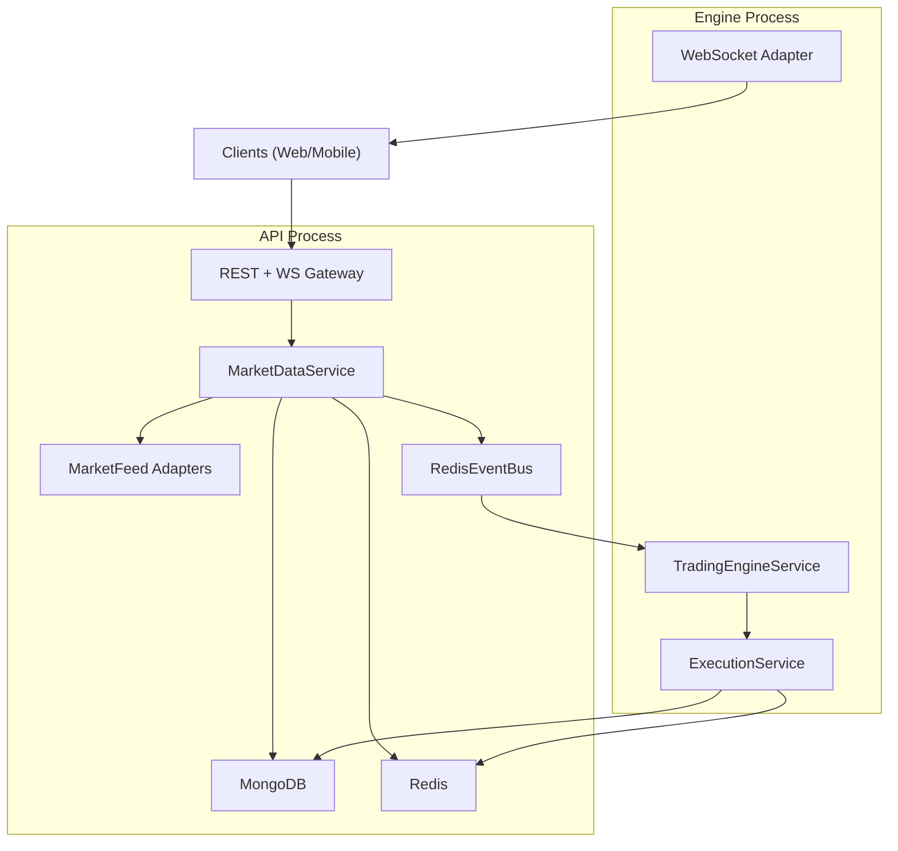
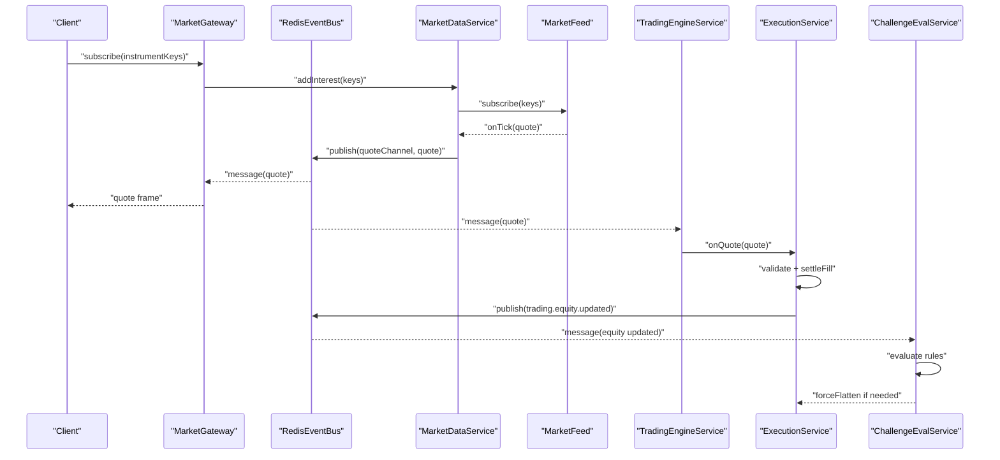
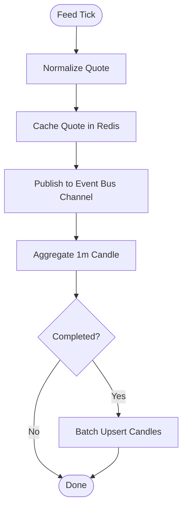
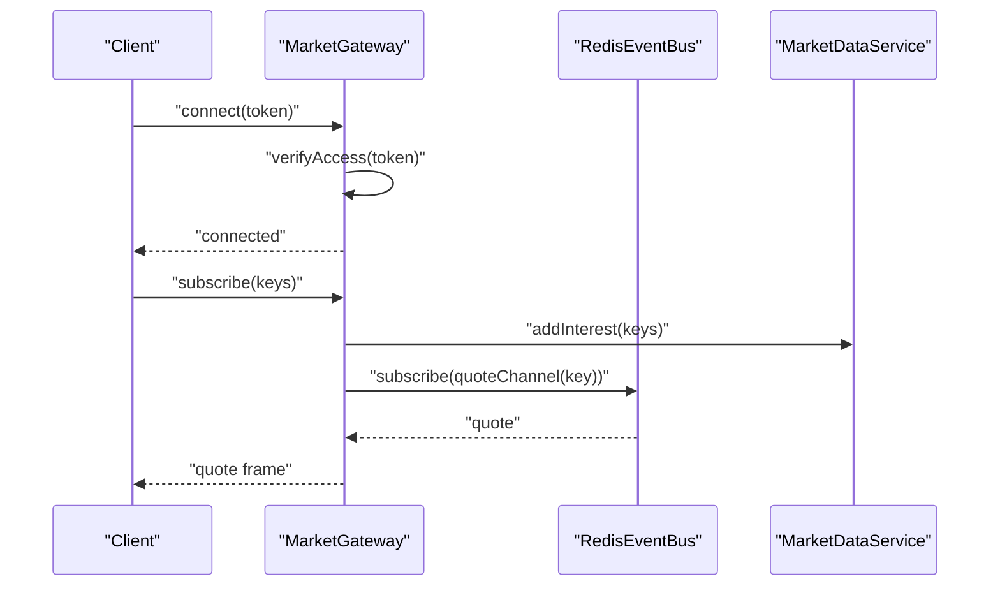
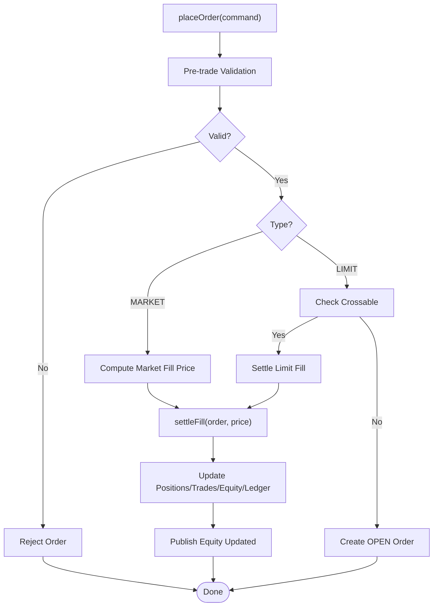
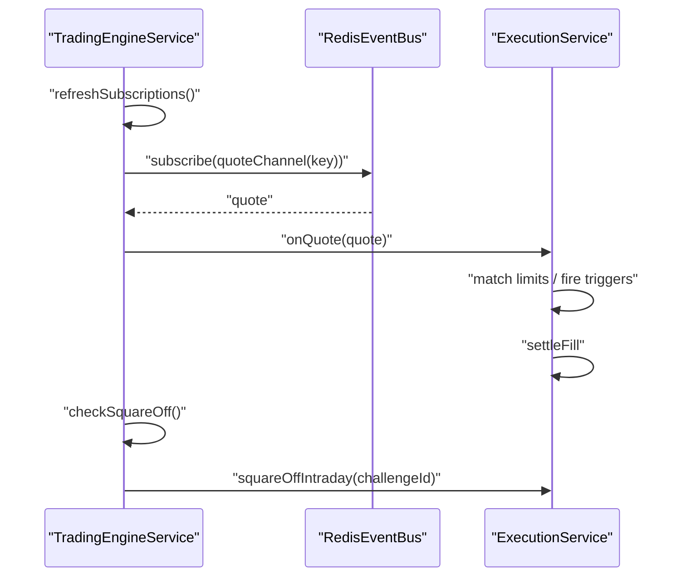
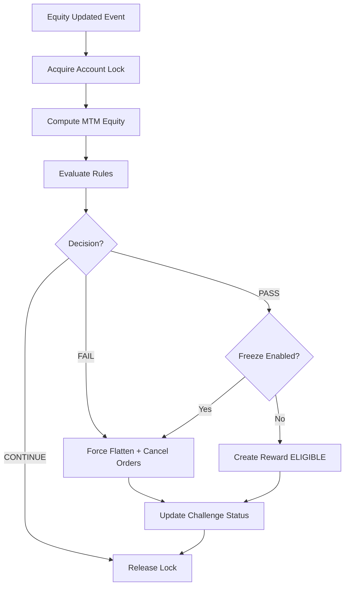
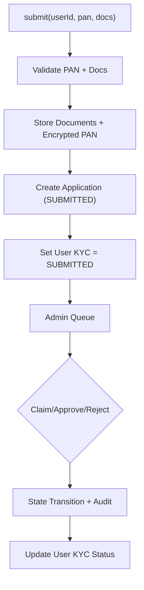
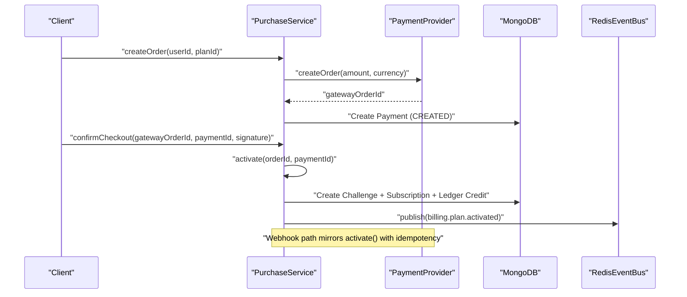
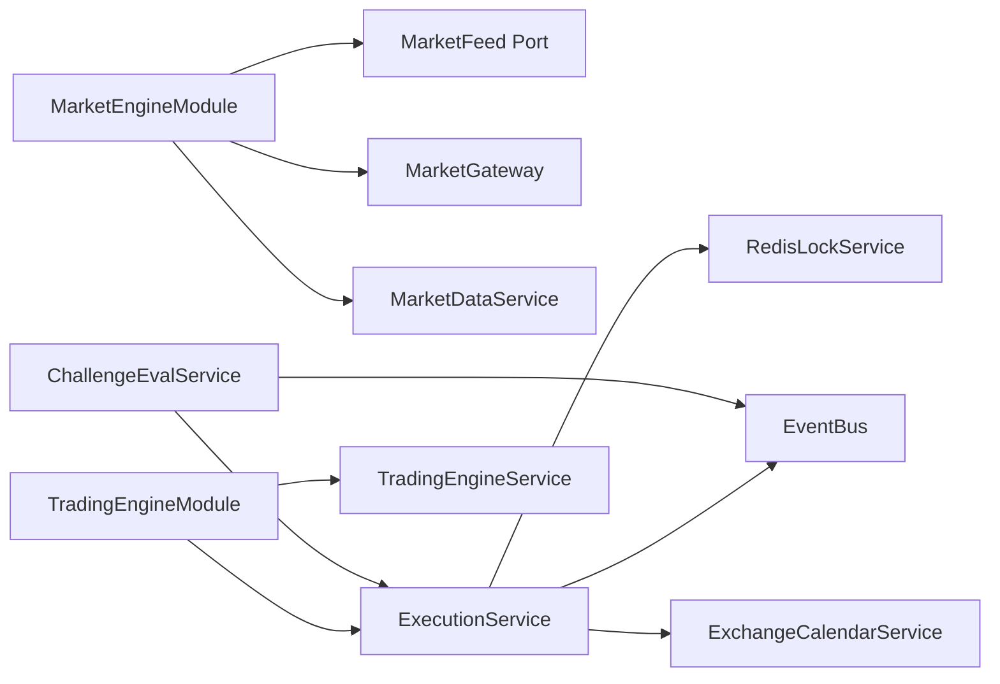

# Data Flow & Processing Architecture

<cite>
**Referenced Files in This Document**
- [main.ts](file://backend/apps/api/src/main.ts)
- [main.ts](file://backend/apps/engine/src/main.ts)
- [redis-event-bus.ts](file://backend/libs/shared/src/redis/redis-event-bus.ts)
- [domain-event.ts](file://backend/libs/shared/src/kernel/domain-event.ts)
- [market-engine.module.ts](file://backend/apps/api/src/modules/market/market-engine.module.ts)
- [trading-engine.module.ts](file://backend/apps/api/src/modules/trading/trading-engine.module.ts)
- [market-data.service.ts](file://backend/apps/api/src/modules/market/application/market-data.service.ts)
- [market-feed.port.ts](file://backend/apps/api/src/modules/market/infrastructure/feed/market-feed.port.ts)
- [simulator-feed.ts](file://backend/apps/api/src/modules/market/infrastructure/feed/simulator-feed.ts)
- [market.gateway.ts](file://backend/apps/api/src/modules/market/presentation/market.gateway.ts)
- [execution.service.ts](file://backend/apps/api/src/modules/trading/application/execution.service.ts)
- [trading-engine.service.ts](file://backend/apps/api/src/modules/trading/application/trading-engine.service.ts)
- [challenge-eval.service.ts](file://backend/apps/api/src/modules/challenge/application/challenge-eval.service.ts)
- [kyc.service.ts](file://backend/apps/api/src/modules/kyc/application/kyc.service.ts)
- [purchase.service.ts](file://backend/apps/api/src/modules/plans/application/purchase.service.ts)
</cite>

## Table of Contents
1. Introduction
2. Project Structure
3. Core Components
4. Architecture Overview
5. Detailed Component Analysis
6. Dependency Analysis
7. Performance Considerations
8. Troubleshooting Guide
9. Conclusion

## Introduction
This document explains the end-to-end data flow and processing architecture of the trading platform, focusing on:
- Market data ingestion from external brokers via feed adapters into a normalized pipeline
- Real-time WebSocket broadcasting to clients
- Event-driven inter-process communication using Redis Pub/Sub between API and Engine services
- Order placement, validation, execution simulation (Virtual Execution Engine), and settlement
- Challenge evaluation engine that scores trading events and distributes rewards
- KYC workflow and payment processing pipelines
- Error handling strategies, retry mechanisms, performance considerations, and scalability patterns for high-frequency data processing

## Project Structure
The system is organized as a NestJS monorepo with two primary processes:
- API process: REST endpoints, WebSocket gateway, market data ingestion, and orchestration
- Engine process: WebSocket adapter enabled for real-time streaming and background tick processing

**Diagram sources**
- [main.ts:7-23](file://backend/apps/api/src/main.ts#L7-L23)
- [main.ts:7-17](file://backend/apps/engine/src/main.ts#L7-L17)
- [market-data.service.ts:24-52](file://backend/apps/api/src/modules/market/application/market-data.service.ts#L24-L52)
- [redis-event-bus.ts:15-64](file://backend/libs/shared/src/redis/redis-event-bus.ts#L15-L64)
- [trading-engine.service.ts:16-37](file://backend/apps/api/src/modules/trading/application/trading-engine.service.ts#L16-L37)
- [execution.service.ts:24-49](file://backend/apps/api/src/modules/trading/application/execution.service.ts#L24-L49)

**Section sources**
- [main.ts:7-23](file://backend/apps/api/src/main.ts#L7-L23)
- [main.ts:7-17](file://backend/apps/engine/src/main.ts#L7-L17)

## Core Components
- Market data pipeline: Ingests quotes from broker feeds or simulator, normalizes them, writes to Redis cache, publishes to event bus, aggregates 1-minute candles, and persists to MongoDB.
- WebSocket gateway: Authenticates clients, manages per-instrument rooms, subscribes to event bus channels, relays live quotes, and triggers upstream subscriptions based on client interest.
- Trading engine: Subscribes to quote channels for instruments with open orders, drives limit fills and stop-loss/target triggers, and enforces intraday square-off at market close.
- Execution service: Per-account locked virtual execution engine that validates orders, simulates fills, updates positions/equity, records trades, and emits equity update events.
- Challenge evaluation: Evaluates challenge rules against MTM equity, transitions states, flattens positions on pass/fail, and creates reward records pending review.
- KYC service: Manages application lifecycle, document storage, state transitions, and user KYC status updates with audit logging.
- Payment processing: Creates gateway orders, verifies signatures/webhooks, idempotently activates plans, credits virtual capital, and supports refunds.

**Section sources**
- [market-data.service.ts:24-139](file://backend/apps/api/src/modules/market/application/market-data.service.ts#L24-L139)
- [market.gateway.ts:19-134](file://backend/apps/api/src/modules/market/presentation/market.gateway.ts#L19-L134)
- [trading-engine.service.ts:10-67](file://backend/apps/api/src/modules/trading/application/trading-engine.service.ts#L10-L67)
- [execution.service.ts:24-309](file://backend/apps/api/src/modules/trading/application/execution.service.ts#L24-L309)
- [challenge-eval.service.ts:17-133](file://backend/apps/api/src/modules/challenge/application/challenge-eval.service.ts#L17-L133)
- [kyc.service.ts:29-190](file://backend/apps/api/src/modules/kyc/application/kyc.service.ts#L29-L190)
- [purchase.service.ts:18-248](file://backend/apps/api/src/modules/plans/application/purchase.service.ts#L18-L248)

## Architecture Overview
The platform uses an event-driven architecture centered around Redis Pub/Sub for decoupling components across API and Engine processes. Market data flows through a single feed abstraction, enabling pluggable adapters (e.g., Upstox, Angel One, Dhan, Simulator). The WebSocket gateway fans out quotes to clients while coordinating upstream subscriptions based on room membership. Orders are validated and executed within per-account locks to ensure consistency, and challenge evaluation reacts to equity changes to enforce rules and manage rewards.

**Diagram sources**
- [market.gateway.ts:71-134](file://backend/apps/api/src/modules/market/presentation/market.gateway.ts#L71-L134)
- [market-data.service.ts:43-108](file://backend/apps/api/src/modules/market/application/market-data.service.ts#L43-L108)
- [redis-event-bus.ts:26-64](file://backend/libs/shared/src/redis/redis-event-bus.ts#L26-L64)
- [trading-engine.service.ts:39-47](file://backend/apps/api/src/modules/trading/application/trading-engine.service.ts#L39-L47)
- [execution.service.ts:148-262](file://backend/apps/api/src/modules/trading/application/execution.service.ts#L148-L262)
- [challenge-eval.service.ts:56-133](file://backend/apps/api/src/modules/challenge/application/challenge-eval.service.ts#L56-L133)

## Detailed Component Analysis

### Market Data Pipeline
- Feed abstraction: A single interface abstracts upstream sources, enabling production WSS feeds and a deterministic simulator for dev/test/replay.
- On-demand subscription: Interest tracking ensures upstream subscriptions only occur when at least one client watches an instrument; last client leaving unsubscribes.
- Quote normalization and caching: Each tick is cached in Redis with TTL and published to a per-instrument channel.
- Candle aggregation: Completed 1-minute candles are batched and upserted to MongoDB periodically.
- Stale feed watchdog: During market hours, if no ticks arrive beyond threshold, re-subscription is triggered.

**Diagram sources**
- [market-data.service.ts:103-139](file://backend/apps/api/src/modules/market/application/market-data.service.ts#L103-L139)
- [market-feed.port.ts:7-22](file://backend/apps/api/src/modules/market/infrastructure/feed/market-feed.port.ts#L7-L22)
- [simulator-feed.ts:40-98](file://backend/apps/api/src/modules/market/infrastructure/feed/simulator-feed.ts#L40-L98)

**Section sources**
- [market-data.service.ts:24-139](file://backend/apps/api/src/modules/market/application/market-data.service.ts#L24-L139)
- [market-feed.port.ts:7-22](file://backend/apps/api/src/modules/market/infrastructure/feed/market-feed.port.ts#L7-L22)
- [simulator-feed.ts:15-145](file://backend/apps/api/src/modules/market/infrastructure/feed/simulator-feed.ts#L15-L145)

### WebSocket Broadcasting
- Authentication: JWT token verified on connection; authenticated sessions tracked per socket.
- Room management: Per-instrument rooms track sockets; first join triggers upstream subscription via MarketDataService; last leave drops subscription.
- Relay: Subscriptions to event bus channels relay quotes to all sockets in the room; initial cached quote sent immediately upon join.

**Diagram sources**
- [market.gateway.ts:48-134](file://backend/apps/api/src/modules/market/presentation/market.gateway.ts#L48-L134)
- [market-data.service.ts:61-96](file://backend/apps/api/src/modules/market/application/market-data.service.ts#L61-L96)
- [redis-event-bus.ts:36-64](file://backend/libs/shared/src/redis/redis-event-bus.ts#L36-L64)

**Section sources**
- [market.gateway.ts:19-134](file://backend/apps/api/src/modules/market/presentation/market.gateway.ts#L19-L134)

### Order Processing Flow
- Placement: Validates command against instrument constraints, challenge rules, and market availability; computes reference price; rejects if no market data for market orders.
- Immediate fill: For market orders or crossable limits, executes settlement under per-account lock.
- Resting orders: Limits remain OPEN until tick loop matches them.
- Settlement: Updates positions, holdings (for carry-forward), trades, order status, challenge equity, ledger entries, and emits equity update event.

**Diagram sources**
- [execution.service.ts:68-130](file://backend/apps/api/src/modules/trading/application/execution.service.ts#L68-L130)
- [execution.service.ts:148-262](file://backend/apps/api/src/modules/trading/application/execution.service.ts#L148-L262)

**Section sources**
- [execution.service.ts:68-309](file://backend/apps/api/src/modules/trading/application/execution.service.ts#L68-L309)

### Trading Engine Tick Loop
- Subscription refresh: Periodically discovers instruments with OPEN orders and subscribes to their quote channels.
- Quote routing: Each incoming quote triggers matching logic for limits and trigger-based exits (stop-loss/target).
- Square-off: At market cutoff, automatically squares off intraday positions for active challenges.

**Diagram sources**
- [trading-engine.service.ts:30-67](file://backend/apps/api/src/modules/trading/application/trading-engine.service.ts#L30-L67)
- [execution.service.ts:148-309](file://backend/apps/api/src/modules/trading/application/execution.service.ts#L148-L309)

**Section sources**
- [trading-engine.service.ts:10-67](file://backend/apps/api/src/modules/trading/application/trading-engine.service.ts#L10-L67)
- [execution.service.ts:148-309](file://backend/apps/api/src/modules/trading/application/execution.service.ts#L148-L309)

### Challenge Evaluation Engine
- MTM equity calculation: Combines realized equity with unrealized P&L from open positions using latest quotes.
- Rule evaluation: Applies challenge rules to determine CONTINUE, FAIL, or PASS outcomes.
- Side effects: On FAIL, flattens positions and cancels open orders; on PASS, optionally freezes positions and creates reward record pending review.
- Locking: Uses per-account Redis lock to prevent interleaving with execution operations.

**Diagram sources**
- [challenge-eval.service.ts:43-133](file://backend/apps/api/src/modules/challenge/application/challenge-eval.service.ts#L43-L133)
- [execution.service.ts:264-309](file://backend/apps/api/src/modules/trading/application/execution.service.ts#L264-L309)

**Section sources**
- [challenge-eval.service.ts:17-133](file://backend/apps/api/src/modules/challenge/application/challenge-eval.service.ts#L17-L133)

### KYC Workflow
- Submission: Validates PAN format, required documents, MIME types, and file size; stores encrypted PAN and documents; sets application to SUBMITTED and user KYC status to SUBMITTED.
- Review queue: Admin can list applications by status and view details/documents.
- Actions: Claim, approve, or reject with state transitions and audit logging; updates user KYC status accordingly.

**Diagram sources**
- [kyc.service.ts:55-109](file://backend/apps/api/src/modules/kyc/application/kyc.service.ts#L55-L109)
- [kyc.service.ts:113-190](file://backend/apps/api/src/modules/kyc/application/kyc.service.ts#L113-L190)

**Section sources**
- [kyc.service.ts:29-190](file://backend/apps/api/src/modules/kyc/application/kyc.service.ts#L29-L190)

### Payment Processing Pipeline
- Create order: Verifies KYC approval and plan availability; creates gateway order and payment intent with idempotency key.
- Activation: Idempotent activation guarded by per-order lock; creates challenge and subscription, credits virtual capital via ledger, and emits billing event.
- Refund: Validates refund eligibility, calls gateway refund, cancels subscription and challenge, and audits action.

**Diagram sources**
- [purchase.service.ts:36-183](file://backend/apps/api/src/modules/plans/application/purchase.service.ts#L36-L183)
- [purchase.service.ts:212-248](file://backend/apps/api/src/modules/plans/application/purchase.service.ts#L212-L248)

**Section sources**
- [purchase.service.ts:18-248](file://backend/apps/api/src/modules/plans/application/purchase.service.ts#L18-L248)

## Dependency Analysis
- Module wiring: Market engine module wires feed providers and gateway; trading engine module wires execution and trading engine services.
- Shared abstractions: EventBus and Redis implementation provide decoupled pub/sub; RedisLockService ensures atomicity for critical sections.
- External integrations: Payment provider port abstracts gateway interactions; exchange calendar provides market hours and cutoffs.

**Diagram sources**
- [market-engine.module.ts:21-46](file://backend/apps/api/src/modules/market/market-engine.module.ts#L21-L46)
- [trading-engine.module.ts:7-11](file://backend/apps/api/src/modules/trading/trading-engine.module.ts#L7-L11)
- [execution.service.ts:24-49](file://backend/apps/api/src/modules/trading/application/execution.service.ts#L24-L49)
- [challenge-eval.service.ts:27-37](file://backend/apps/api/src/modules/challenge/application/challenge-eval.service.ts#L27-L37)

**Section sources**
- [market-engine.module.ts:21-46](file://backend/apps/api/src/modules/market/market-engine.module.ts#L21-L46)
- [trading-engine.module.ts:7-11](file://backend/apps/api/src/modules/trading/trading-engine.module.ts#L7-L11)

## Performance Considerations
- On-demand upstream subscriptions: Reduces bandwidth and load by subscribing only to instruments with active client interest.
- Batch persistence: Candle aggregation batches MongoDB writes to minimize overhead.
- Redis caching: Quotes cached with TTL for low-latency access and fallback on bus misses.
- Per-account locking: Ensures race-free equity and position updates without global locks, improving concurrency.
- Stale feed detection: Re-subscribes during market hours when ticks stall, maintaining data freshness.
- Deterministic simulator: Enables reproducible tests and replay scenarios without network dependencies.

[No sources needed since this section provides general guidance]

## Troubleshooting Guide
- Missing market data: Market orders may be rejected if no live quote is available; verify feed connectivity and instrument coverage.
- Stale feed alerts: Watchdog logs stale feed warnings and triggers re-subscription; check upstream feed health and thresholds.
- Order cancellation failures: Only OPEN orders can be cancelled; ensure order state before attempting cancellation.
- Square-off issues: If square-off fails for a challenge, review logs for missing quotes or errors during flattening.
- KYC submission errors: Validate PAN format, document MIME types, and file sizes; ensure user is active and not already approved.
- Payment activation conflicts: Webhook and checkout paths converge on idempotent activation; duplicate activations are handled safely.

**Section sources**
- [execution.service.ts:107-129](file://backend/apps/api/src/modules/trading/application/execution.service.ts#L107-L129)
- [market-data.service.ts:128-139](file://backend/apps/api/src/modules/market/application/market-data.service.ts#L128-L139)
- [execution.service.ts:132-144](file://backend/apps/api/src/modules/trading/application/execution.service.ts#L132-L144)
- [execution.service.ts:289-309](file://backend/apps/api/src/modules/trading/application/execution.service.ts#L289-L309)
- [kyc.service.ts:55-109](file://backend/apps/api/src/modules/kyc/application/kyc.service.ts#L55-L109)
- [purchase.service.ts:84-183](file://backend/apps/api/src/modules/plans/application/purchase.service.ts#L84-L183)

## Conclusion
The platform implements a robust, scalable architecture for high-frequency market data processing and virtual trading simulation. By combining feed abstraction, Redis-backed eventing, per-account locking, and modular services, it achieves low-latency quote delivery, consistent order execution, and reliable challenge evaluation. KYC and payment pipelines integrate securely with audit trails and idempotent activation. The design supports horizontal scaling through process separation (API/Engine), efficient caching, and asynchronous event propagation.

[No sources needed since this section summarizes without analyzing specific files]