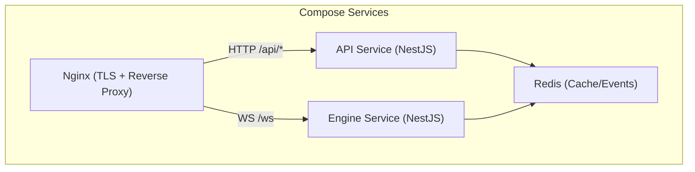
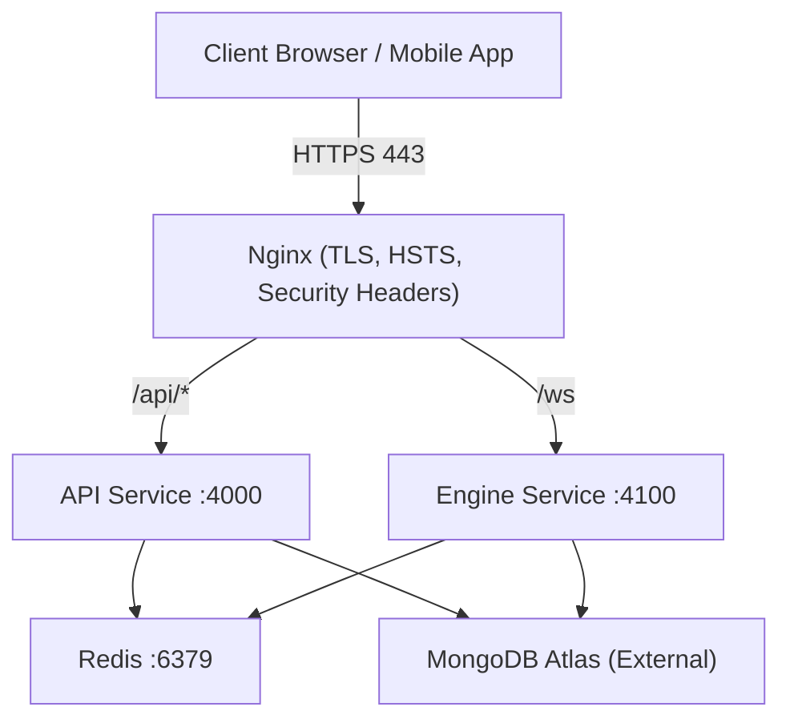
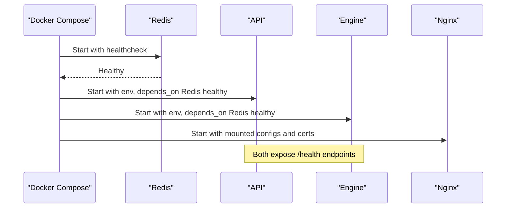
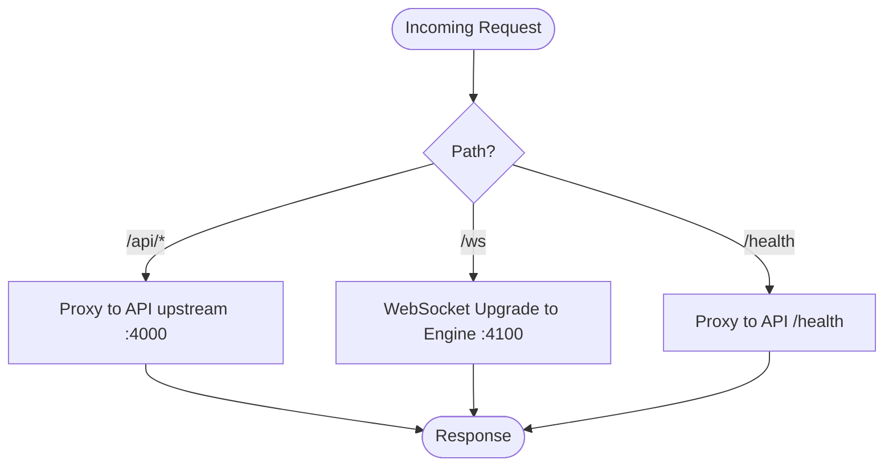
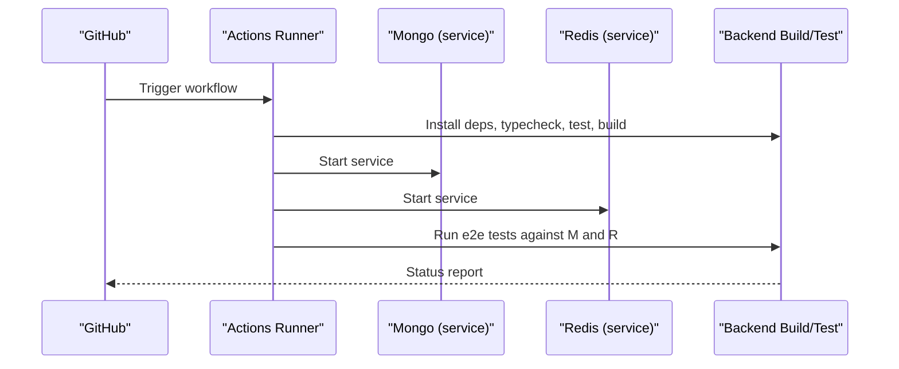
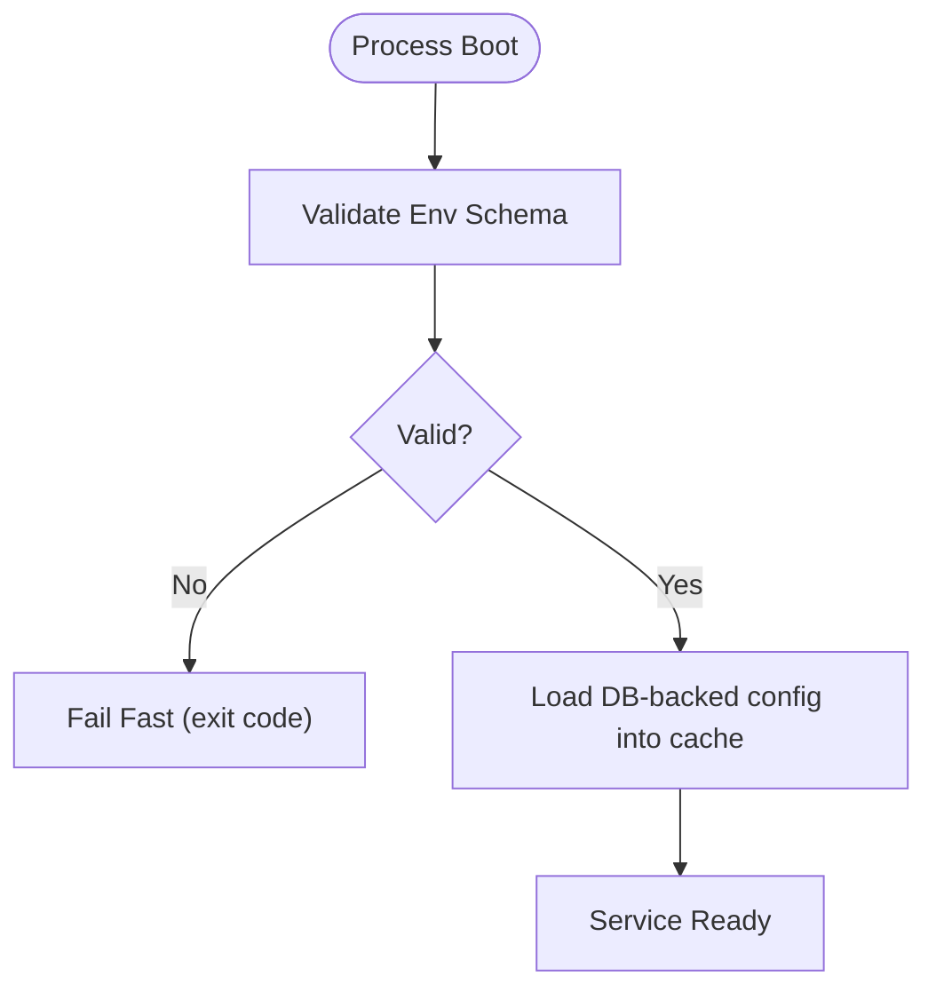
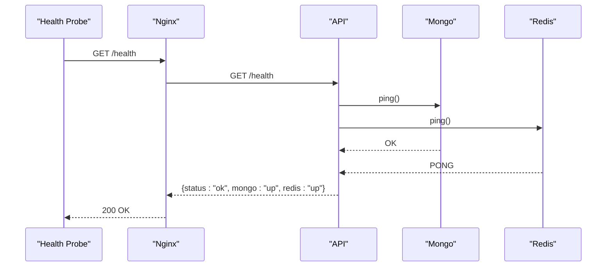
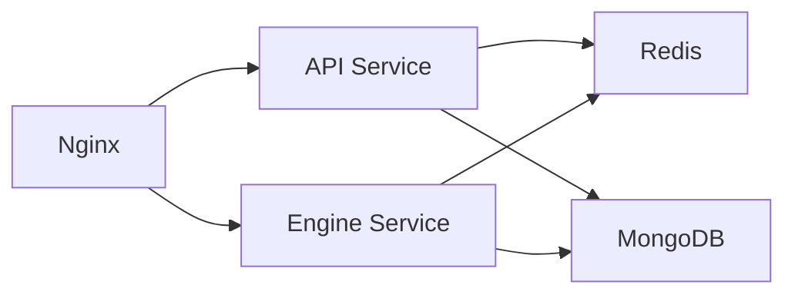

# Deployment & Infrastructure Architecture

<cite>
**Referenced Files in This Document**
- [docker-compose.yml](file://deploy/docker-compose.yml)
- [nginx.conf](file://deploy/nginx/nginx.conf)
- [site.conf](file://deploy/nginx/site.conf)
- [ci.yml](file://.github/workflows/ci.yml)
- [Dockerfile](file://backend/Dockerfile)
- [health.controller.ts](file://backend/libs/shared/src/health/health.controller.ts)
- [env.schema.ts](file://backend/libs/shared/src/config/env.schema.ts)
- [redis.module.ts](file://backend/libs/shared/src/redis/redis.module.ts)
- [database.module.ts](file://backend/libs/shared/src/database/database.module.ts)
- [logging.module.ts](file://backend/libs/shared/src/logging/logging.module.ts)
</cite>

## Table of Contents
1. Introduction
2. Project Structure
3. Core Components
4. Architecture Overview
5. Detailed Component Analysis
6. Dependency Analysis
7. Performance Considerations
8. Troubleshooting Guide
9. Conclusion

## Introduction
This document describes the deployment and infrastructure architecture for the trading platform. It covers containerized deployment with Docker Compose, Nginx reverse proxy configuration for load balancing and SSL termination, CI/CD via GitHub Actions, environment configuration and secrets handling, monitoring through health checks and logging, database connection pooling, Redis usage patterns, backup strategies, scaling considerations, and troubleshooting guidance.

## Project Structure
The deployment is defined under deploy/, with Docker Compose orchestrating four services: API, Engine, Redis, and Nginx. The backend builds a single image that can run either the API or Engine process based on an environment variable. Nginx terminates TLS, proxies /api to the API service, and proxies WebSocket traffic (/ws) to the Engine service. Health endpoints are exposed by both API and Engine containers and are used by Docker Compose healthchecks and Nginx routing.

**Diagram sources**
- [docker-compose.yml:20-122](file://deploy/docker-compose.yml#L20-L122)
- [site.conf:4-56](file://deploy/nginx/site.conf#L4-L56)

**Section sources**
- [docker-compose.yml:1-130](file://deploy/docker-compose.yml#L1-L130)
- [nginx.conf:1-28](file://deploy/nginx/nginx.conf#L1-L28)
- [site.conf:1-58](file://deploy/nginx/site.conf#L1-L58)
- [Dockerfile:1-27](file://backend/Dockerfile#L1-L27)

## Core Components
- Containerized services: API, Engine, Redis, Nginx orchestrated via Docker Compose.
- Reverse proxy: Nginx handles HTTP/HTTPS, WebSocket upgrades, security headers, and request timeouts.
- CI/CD: GitHub Actions validates dependencies, runs type checks, unit tests, e2e tests with Mongo and Redis, and builds the Docker image.
- Environment and secrets: Strict validation at boot; sensitive values provided via environment variables.
- Monitoring: Health endpoint verifies MongoDB and Redis connectivity; structured JSON logs via Pino with redaction.
- Data layer: MongoDB connection pool configured; Redis clients created with retry strategy and graceful shutdown.

**Section sources**
- [docker-compose.yml:20-122](file://deploy/docker-compose.yml#L20-L122)
- [nginx.conf:1-28](file://deploy/nginx/nginx.conf#L1-L28)
- [site.conf:1-58](file://deploy/nginx/site.conf#L1-L58)
- [ci.yml:1-56](file://.github/workflows/ci.yml#L1-L56)
- [health.controller.ts:1-55](file://backend/libs/shared/src/health/health.controller.ts#L1-L55)
- [logging.module.ts:1-35](file://backend/libs/shared/src/logging/logging.module.ts#L1-L35)
- [database.module.ts:1-19](file://backend/libs/shared/src/database/database.module.ts#L1-L19)
- [redis.module.ts:1-38](file://backend/libs/shared/src/redis/redis.module.ts#L1-L38)
- [env.schema.ts:1-84](file://backend/libs/shared/src/config/env.schema.ts#L1-L84)

## Architecture Overview
The runtime topology consists of two NestJS applications sharing a Redis instance and connecting to an external MongoDB cluster. Nginx sits in front, terminating TLS and routing requests to the appropriate backend.

**Diagram sources**
- [docker-compose.yml:20-122](file://deploy/docker-compose.yml#L20-L122)
- [site.conf:4-56](file://deploy/nginx/site.conf#L4-L56)
- [database.module.ts:6-15](file://backend/libs/shared/src/database/database.module.ts#L6-L15)
- [redis.module.ts:10-16](file://backend/libs/shared/src/redis/redis.module.ts#L10-L16)

## Detailed Component Analysis

### Docker Compose Orchestration
- Services:
  - redis: Alpine-based Redis with append-only persistence, memory limits, and healthcheck.
  - api: Builds from backend, exposes port 4000 internally, depends on healthy Redis, healthcheck probes /health.
  - engine: Builds from backend, exposes port 4100 internally, depends on healthy Redis, healthcheck probes /health.
  - nginx: Exposes ports 80 and 443, mounts nginx configs and certbot volume, depends on api and engine.
- Volumes:
  - redis-data: Persistent Redis data.
  - kyc-storage: Encrypted KYC documents storage directory.
  - certbot-certs: External volume for TLS certificates managed outside compose.

**Diagram sources**
- [docker-compose.yml:4-122](file://deploy/docker-compose.yml#L4-L122)

**Section sources**
- [docker-compose.yml:1-130](file://deploy/docker-compose.yml#L1-L130)

### Nginx Reverse Proxy and SSL Termination
- Listens on 80 and 443, redirects HTTP to HTTPS.
- Configures WebSocket upgrade mapping and long-lived timeouts for /ws.
- Proxies /api to API upstream and /ws to Engine upstream.
- Sets security headers (HSTS, X-Content-Type-Options, X-Frame-Options, Referrer-Policy).
- Exposes /health proxied to API for readiness checks.
- Certificates expected under /etc/letsencrypt/live/YOUR_DOMAIN/ via the certbot-certs volume.

**Diagram sources**
- [site.conf:4-56](file://deploy/nginx/site.conf#L4-L56)
- [nginx.conf:15-24](file://deploy/nginx/nginx.conf#L15-L24)

**Section sources**
- [nginx.conf:1-28](file://deploy/nginx/nginx.conf#L1-L28)
- [site.conf:1-58](file://deploy/nginx/site.conf#L1-L58)

### CI/CD Pipeline (GitHub Actions)
- Triggers on push to main and pull requests.
- Backend job: installs dependencies, runs type checking, unit tests, build, and Docker image build for validation.
- E2E job: spins up Mongo and Redis services, sets environment for e2e, runs integration tests.

**Diagram sources**
- [ci.yml:1-56](file://.github/workflows/ci.yml#L1-L56)

**Section sources**
- [ci.yml:1-56](file://.github/workflows/ci.yml#L1-L56)

### Environment Configuration and Secrets Handling
- Boot-time validation ensures required keys exist and have correct types before starting.
- Sensitive values (JWT keys, encryption secret, OTP pepper, provider credentials) are passed via environment variables and never committed.
- Business configuration is stored in MongoDB and cached in-memory with Redis pub/sub invalidation across instances.

Key environment categories:
- Runtime: NODE_ENV, TZ, API_PORT, ENGINE_PORT, LOG_LEVEL, CORS_ORIGINS, APP_BASE_URL.
- Data stores: MONGO_URI, REDIS_URL.
- Security: JWT_PRIVATE_KEY_B64, JWT_PUBLIC_KEY_B64, DATA_ENC_SECRET, OTP_PEPPER.
- Providers: SMS_PROVIDER, MSG91_*; MAIL_PROVIDER, SMTP_URL, MAIL_FROM; PAYMENT_PROVIDER, RAZORPAY_*; MARKET_FEED and broker tokens.

**Diagram sources**
- [env.schema.ts:1-84](file://backend/libs/shared/src/config/env.schema.ts#L1-L84)

**Section sources**
- [env.schema.ts:1-84](file://backend/libs/shared/src/config/env.schema.ts#L1-L84)
- [docker-compose.yml:23-98](file://deploy/docker-compose.yml#L23-L98)

### Monitoring: Health Checks and Logging
- Health endpoint:
  - Returns ok only when both MongoDB and Redis respond successfully.
  - Used by Docker Compose healthchecks for api and engine services.
  - Exposed via Nginx at /health for external probes.
- Logging:
  - Structured JSON logs via Pino with request ID generation and redaction of sensitive fields.
  - Health endpoint excluded from auto-logging to reduce noise.

**Diagram sources**
- [health.controller.ts:19-55](file://backend/libs/shared/src/health/health.controller.ts#L19-L55)
- [site.conf:53-56](file://deploy/nginx/site.conf#L53-L56)
- [docker-compose.yml:58-64](file://deploy/docker-compose.yml#L58-L64)

**Section sources**
- [health.controller.ts:1-55](file://backend/libs/shared/src/health/health.controller.ts#L1-L55)
- [logging.module.ts:1-35](file://backend/libs/shared/src/logging/logging.module.ts#L1-L35)
- [site.conf:53-56](file://deploy/nginx/site.conf#L53-L56)
- [docker-compose.yml:58-64](file://deploy/docker-compose.yml#L58-L64)

### Database Connection Pooling
- MongoDB connection uses Mongoose with:
  - serverSelectionTimeoutMS set to 10 seconds.
  - maxPoolSize set to 20 connections.
- These settings help manage concurrency and resilience under load.

**Section sources**
- [database.module.ts:6-15](file://backend/libs/shared/src/database/database.module.ts#L6-L15)

### Redis Usage and Clustering Options
- Two Redis clients are created: one for general operations and one subscriber for config invalidation events.
- Retry strategy and ready check enabled; graceful shutdown disconnects clients.
- Current compose setup runs a single Redis instance with append-only file persistence.
- For clustering:
  - Use Redis Cluster mode with multiple nodes and configure client-side cluster support.
  - Ensure event bus and locks operate within cluster constraints (e.g., pub/sub channels per node).
  - Persist data using Redis Cluster snapshots or AOF across nodes.

**Section sources**
- [redis.module.ts:10-16](file://backend/libs/shared/src/redis/redis.module.ts#L10-L16)
- [redis.module.ts:28-36](file://backend/libs/shared/src/redis/redis.module.ts#L28-L36)
- [docker-compose.yml:4-18](file://deploy/docker-compose.yml#L4-L18)

### Backup Strategies
- MongoDB:
  - Use the hosted provider’s backup solution (e.g., Atlas backups) with scheduled snapshots and point-in-time recovery.
  - Maintain separate restore procedures for DR scenarios.
- Redis:
  - Append-only file enabled; ensure the redis-data volume is persisted and backed up regularly.
  - For clusters, back up each node’s AOF and snapshot files.
- KYC Storage:
  - Persisted under kyc-storage volume; back up the directory containing encrypted documents.

**Section sources**
- [docker-compose.yml:4-18](file://deploy/docker-compose.yml#L4-L18)
- [docker-compose.yml:124-130](file://deploy/docker-compose.yml#L124-L130)

### Scaling Considerations
- Horizontal scaling:
  - Scale API and Engine replicas behind Nginx; add more upstream entries or use DNS-based discovery if moving beyond Docker Compose.
  - Ensure stateless services; store session/state in Redis and MongoDB.
  - Increase keepalive and worker_processes in Nginx for higher concurrency.
- Vertical scaling:
  - Increase CPU/memory for containers and tune Redis maxmemory and MongoDB pool size as needed.
  - Adjust Nginx worker_connections and timeouts based on workload characteristics.
- Network and TLS:
  - Offload TLS at Nginx; consider terminating at a cloud load balancer for multi-node deployments.

[No sources needed since this section provides general guidance]

## Dependency Analysis
The runtime dependency graph shows how services interact and depend on shared infrastructure.

**Diagram sources**
- [docker-compose.yml:20-122](file://deploy/docker-compose.yml#L20-L122)
- [site.conf:4-56](file://deploy/nginx/site.conf#L4-L56)
- [database.module.ts:6-15](file://backend/libs/shared/src/database/database.module.ts#L6-L15)
- [redis.module.ts:10-16](file://backend/libs/shared/src/redis/redis.module.ts#L10-L16)

**Section sources**
- [docker-compose.yml:20-122](file://deploy/docker-compose.yml#L20-L122)
- [site.conf:4-56](file://deploy/nginx/site.conf#L4-L56)

## Performance Considerations
- Nginx:
  - Keepalive connections to upstreams; tune worker_processes and worker_connections.
  - Set appropriate proxy_read_timeout and proxy_send_timeout for long-running WebSocket sessions.
- API/Engine:
  - Use connection pooling for MongoDB; adjust maxPoolSize based on throughput needs.
  - Configure Redis retry strategy and enable ready checks to avoid cascading failures.
- Logging:
  - Redact sensitive fields; exclude health endpoints from auto-logging to reduce overhead.
- Caching:
  - Leverage Redis for rate limiting, distributed locks, and event bus to reduce database load.

[No sources needed since this section provides general guidance]

## Troubleshooting Guide
Common issues and resolutions:
- Health endpoint returns 503:
  - Verify MongoDB and Redis connectivity from the API/Engine containers.
  - Check network policies and firewall rules between services.
- Nginx cannot reach upstreams:
  - Confirm service names and ports match compose definitions.
  - Review Nginx error logs for upstream errors.
- TLS certificate errors:
  - Ensure certbot-certs volume is mounted and contains valid fullchain.pem and privkey.pem for the configured domain.
- Redis connectivity issues:
  - Inspect Redis logs; verify memory limits and eviction policy.
  - Confirm REDIS_URL matches the compose service name and port.
- MongoDB connection timeouts:
  - Increase serverSelectionTimeoutMS if necessary; validate MONGO_URI and network access.
- High memory usage:
  - Tune Redis maxmemory and MongoDB pool size; monitor container resource limits.

**Section sources**
- [health.controller.ts:19-55](file://backend/libs/shared/src/health/health.controller.ts#L19-L55)
- [site.conf:14-56](file://deploy/nginx/site.conf#L14-L56)
- [docker-compose.yml:4-18](file://deploy/docker-compose.yml#L4-L18)
- [database.module.ts:6-15](file://backend/libs/shared/src/database/database.module.ts#L6-L15)
- [redis.module.ts:10-16](file://backend/libs/shared/src/redis/redis.module.ts#L10-L16)

## Conclusion
The platform deploys a clean separation of concerns with containerized API and Engine services, a robust Nginx reverse proxy for TLS and routing, and a CI/CD pipeline that validates code quality and integration behavior. Environment configuration is strictly validated at boot, and monitoring is implemented via health checks and structured logging. Database and Redis are configured for reliability and performance, with clear paths for scaling horizontally or vertically. Backups and troubleshooting guidance complete the operational picture.

[No sources needed since this section summarizes without analyzing specific files]