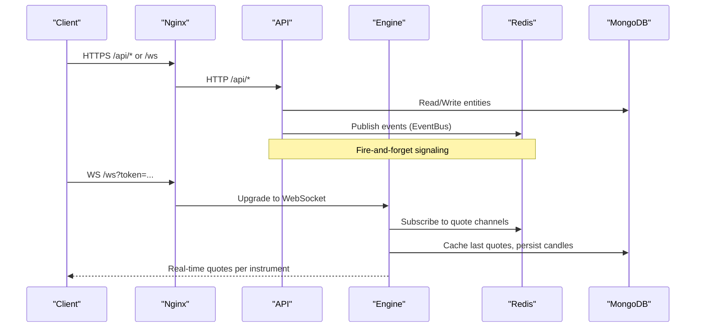
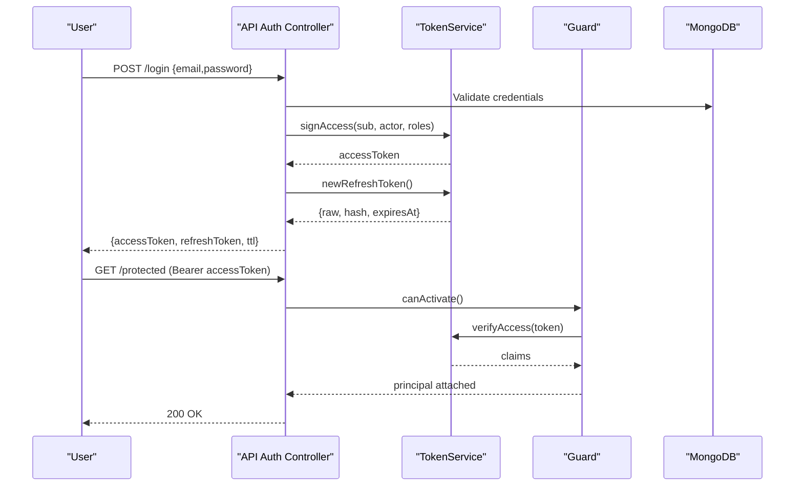
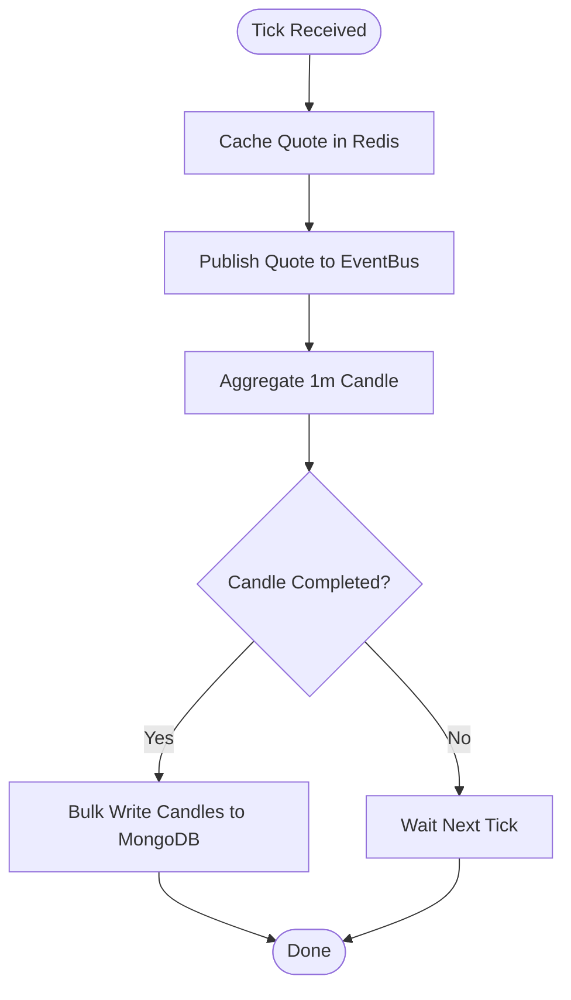
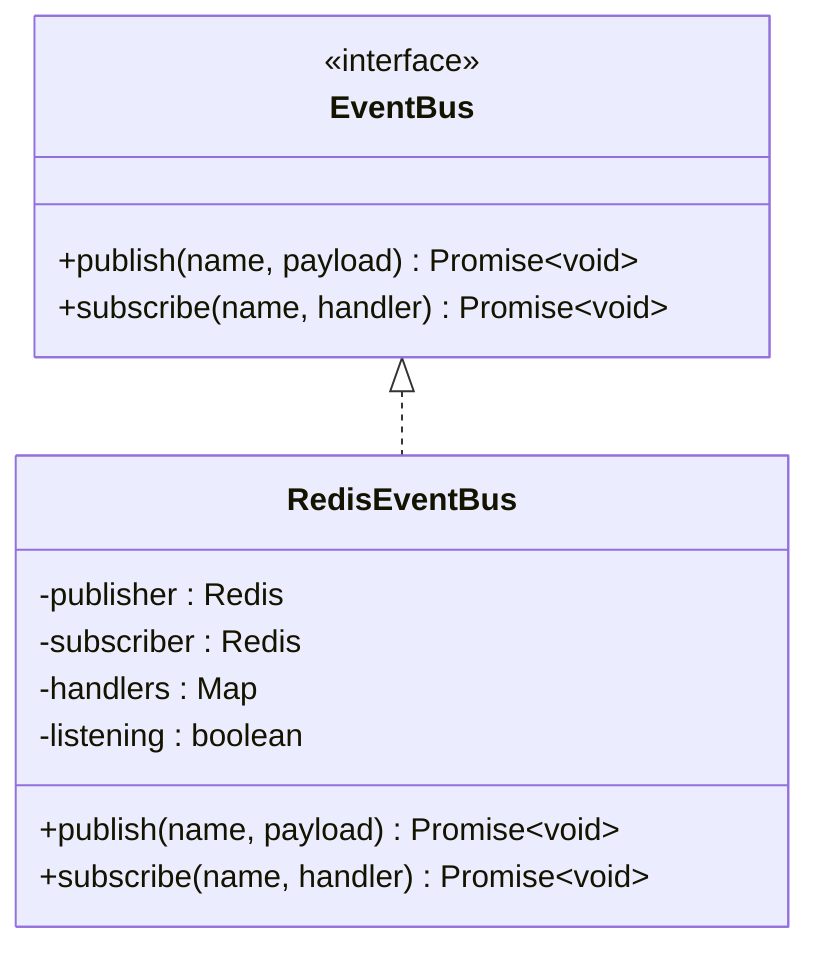
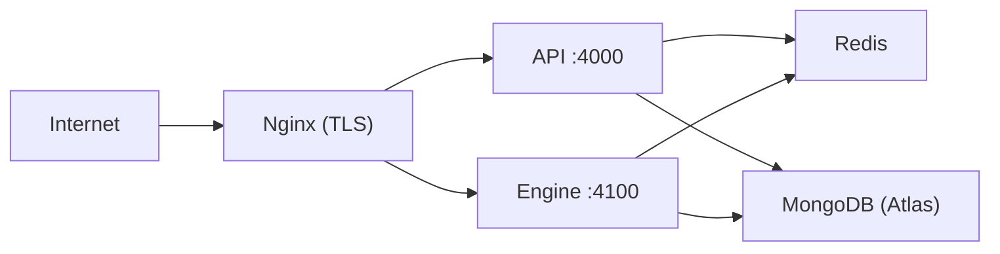
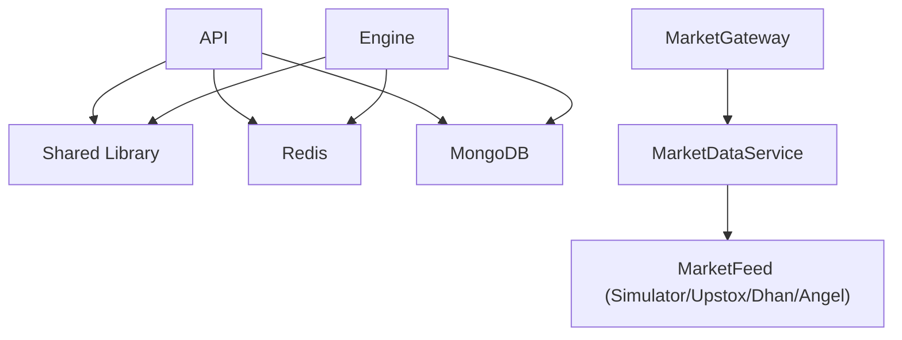

# System Architecture

<cite>
**Referenced Files in This Document**
- [main.ts](file://backend/apps/api/src/main.ts)
- [main.ts](file://backend/apps/engine/src/main.ts)
- [docker-compose.yml](file://deploy/docker-compose.yml)
- [site.conf](file://deploy/nginx/site.conf)
- [Dockerfile](file://backend/Dockerfile)
- [redis-event-bus.ts](file://backend/libs/shared/src/redis/redis-event-bus.ts)
- [jwt-auth.guard.ts](file://backend/apps/api/src/modules/auth/presentation/jwt-auth.guard.ts)
- [token.service.ts](file://backend/apps/api/src/modules/auth/infrastructure/token.service.ts)
- [auth.types.ts](file://backend/apps/api/src/modules/auth/domain/auth.types.ts)
- [market.gateway.ts](file://backend/apps/api/src/modules/market/presentation/market.gateway.ts)
- [market-data.service.ts](file://backend/apps/api/src/modules/market/application/market-data.service.ts)
- [market-feed.port.ts](file://backend/apps/api/src/modules/market/infrastructure/feed/market-feed.port.ts)
- [simulator-feed.ts](file://backend/apps/api/src/modules/market/infrastructure/feed/simulator-feed.ts)
- [domain-event.ts](file://backend/libs/shared/src/kernel/domain-event.ts)
- [app-config.service.ts](file://backend/libs/shared/src/config/app-config.service.ts)
</cite>

## Table of Contents
1. Introduction
2. Project Structure
3. Core Components
4. Architecture Overview
5. Detailed Component Analysis
6. Dependency Analysis
7. Performance Considerations
8. Troubleshooting Guide
9. Conclusion

## Introduction
This document describes the NiveshGuru Trading Platform system architecture. It covers:
- Two-process microservices: API and Engine, each a modular monolith with layered design (domain, application, infrastructure, presentation).
- Redis Pub/Sub event bus for inter-process communication.
- Authentication flow using RS256 JWT tokens, session management via refresh tokens, and role-based access control.
- Market data flow from external brokers through feed adapters to real-time WebSocket broadcasting.
- Deployment topology with Docker containers, Nginx reverse proxy, and database connections.
- Scalability, security boundaries, and monitoring strategies.

## Project Structure
The backend is organized as a NestJS monorepo with two processes:
- API process: HTTP endpoints, authentication, admin, KYC, plans/payments, trading APIs.
- Engine process: Real-time market data ingestion, aggregation, and WebSocket fan-out.

Both processes share a common library with cross-cutting concerns (Redis event bus, configuration, domain primitives).

```mermaid
graph TB
subgraph "API Process"
A_API["NestJS API<br/>HTTP + Guards"]
A_Modules["Feature Modules<br/>(Auth, Admin, KYC, Plans, Trading)"]
end
subgraph "Engine Process"
E_Engine["NestJS Engine<br/>WS Gateway + Feed Pipeline"]
E_Feed["Market Feed Adapters<br/>(Simulator / Upstox / Dhan / Angel)"]
end
subgraph "Shared"
S_Events["Redis Event Bus"]
S_Config["App Config Service"]
end
subgraph "Infra"
R["Redis"]
DB["MongoDB (Atlas)"]
NGINX["Nginx Reverse Proxy"]
end
Client["Browser / Mobile"] --> NGINX
NGINX --> A_API
NGINX --> E_Engine
A_API < --> S_Events
E_Engine < --> S_Events
A_API --> DB
E_Engine --> DB
A_API --> R
E_Engine --> R
E_Feed --> E_Engine
```

**Diagram sources**
- [main.ts:7-25](file://backend/apps/api/src/main.ts#L7-L25)
- [main.ts:7-19](file://backend/apps/engine/src/main.ts#L7-L19)
- [redis-event-bus.ts:15-64](file://backend/libs/shared/src/redis/redis-event-bus.ts#L15-L64)
- [docker-compose.yml:20-108](file://deploy/docker-compose.yml#L20-L108)
- [site.conf:31-51](file://deploy/nginx/site.conf#L31-L51)

**Section sources**
- [main.ts:7-25](file://backend/apps/api/src/main.ts#L7-L25)
- [main.ts:7-19](file://backend/apps/engine/src/main.ts#L7-L19)
- [docker-compose.yml:20-108](file://deploy/docker-compose.yml#L20-L108)

## Core Components
- API process bootstrap sets global prefix, CORS, helmet, logging, and listens on a configurable port.
- Engine process bootstrap enables WebSocket adapter and listens on a separate port.
- Shared Redis event bus provides publish/subscribe across processes with fire-and-forget semantics.
- Feature modules follow layered architecture:
  - Domain: business rules and value objects.
  - Application: use cases orchestrating domain and infrastructure.
  - Infrastructure: persistence, external integrations, feeds.
  - Presentation: controllers, guards, DTOs, WebSocket gateway.

**Section sources**
- [main.ts:7-25](file://backend/apps/api/src/main.ts#L7-L25)
- [main.ts:7-19](file://backend/apps/engine/src/main.ts#L7-L19)
- [redis-event-bus.ts:15-64](file://backend/libs/shared/src/redis/redis-event-bus.ts#L15-L64)

## Architecture Overview
Two independent NestJS processes communicate via Redis Pub/Sub. The API exposes REST endpoints; the Engine handles real-time market data and WebSocket streaming. Nginx terminates TLS and routes traffic to API and Engine. Both services connect to MongoDB and Redis.



**Diagram sources**
- [site.conf:31-51](file://deploy/nginx/site.conf#L31-L51)
- [redis-event-bus.ts:26-63](file://backend/libs/shared/src/redis/redis-event-bus.ts#L26-L63)
- [market.gateway.ts:48-113](file://backend/apps/api/src/modules/market/presentation/market.gateway.ts#L48-L113)
- [market-data.service.ts:103-108](file://backend/apps/api/src/modules/market/application/market-data.service.ts#L103-L108)

## Detailed Component Analysis

### Authentication Flow (JWT, Refresh Tokens, RBAC)
- Access tokens are RS256-signed JWTs containing actor type (USER/EMPLOYEE) and optional roles.
- Guards verify Bearer tokens and enforce actor kind; invalid/expired tokens raise unauthorized errors.
- Refresh tokens are opaque random strings hashed before storage; TTLs are configured via app config.
- Purpose tokens (email verification, password reset) are short-lived and validated against expected purpose.



**Diagram sources**
- [jwt-auth.guard.ts:15-27](file://backend/apps/api/src/modules/auth/presentation/jwt-auth.guard.ts#L15-L27)
- [token.service.ts:42-58](file://backend/apps/api/src/modules/auth/infrastructure/token.service.ts#L42-L58)
- [auth.types.ts:24-31](file://backend/apps/api/src/modules/auth/domain/auth.types.ts#L24-L31)

**Section sources**
- [jwt-auth.guard.ts:15-27](file://backend/apps/api/src/modules/auth/presentation/jwt-auth.guard.ts#L15-L27)
- [token.service.ts:42-58](file://backend/apps/api/src/modules/auth/infrastructure/token.service.ts#L42-L58)
- [auth.types.ts:24-31](file://backend/apps/api/src/modules/auth/domain/auth.types.ts#L24-L31)

### Market Data Flow (Feed Adapters to WebSocket Broadcasting)
- MarketDataService owns a single MarketFeed instance and subscribes on demand per instrument key.
- On tick: write latest quote to Redis cache, publish to Redis event bus, aggregate 1-minute candles, flush to MongoDB.
- MarketGateway authenticates WebSocket clients via JWT query parameter, manages rooms per instrument, and relays quotes from the event bus.
- SimulatorFeed provides deterministic synthetic quotes for development and testing; production uses broker-specific adapters.



**Diagram sources**
- [market-data.service.ts:103-126](file://backend/apps/api/src/modules/market/application/market-data.service.ts#L103-L126)
- [market.gateway.ts:91-131](file://backend/apps/api/src/modules/market/presentation/market.gateway.ts#L91-L131)
- [simulator-feed.ts:77-98](file://backend/apps/api/src/modules/market/infrastructure/feed/simulator-feed.ts#L77-L98)

**Section sources**
- [market-data.service.ts:103-126](file://backend/apps/api/src/modules/market/application/market-data.service.ts#L103-L126)
- [market.gateway.ts:91-131](file://backend/apps/api/src/modules/market/presentation/market.gateway.ts#L91-L131)
- [market-feed.port.ts:13-22](file://backend/apps/api/src/modules/market/infrastructure/feed/market-feed.port.ts#L13-L22)
- [simulator-feed.ts:77-98](file://backend/apps/api/src/modules/market/infrastructure/feed/simulator-feed.ts#L77-L98)

### Redis Pub/Sub Event Bus
- Implements EventBus interface with publish/subscribe over Redis channels prefixed by 'events:'.
- Consumers register handlers; messages are parsed and dispatched asynchronously.
- Used for quote channels and other cross-process signals.



**Diagram sources**
- [domain-event.ts:5-22](file://backend/libs/shared/src/kernel/domain-event.ts#L5-L22)
- [redis-event-bus.ts:15-64](file://backend/libs/shared/src/redis/redis-event-bus.ts#L15-L64)

**Section sources**
- [redis-event-bus.ts:26-63](file://backend/libs/shared/src/redis/redis-event-bus.ts#L26-L63)
- [domain-event.ts:5-22](file://backend/libs/shared/src/kernel/domain-event.ts#L5-L22)

### Configuration Management
- AppConfigService loads business configuration from MongoDB into an in-memory cache at startup.
- Updates persist to DB and broadcast invalidation via Redis so all instances reload the changed key.
- Provides synchronous reads on hot paths and schema validation for stored values.

**Section sources**
- [app-config.service.ts:29-60](file://backend/libs/shared/src/config/app-config.service.ts#L29-L60)
- [app-config.service.ts:62-86](file://backend/libs/shared/src/config/app-config.service.ts#L62-L86)

### Deployment Topology
- Docker Compose defines Redis, API, Engine, and Nginx services.
- API and Engine run from the same image; APP_PROCESS selects which entrypoint to execute.
- Nginx terminates TLS, proxies /api to API and /ws to Engine, and exposes health endpoint.



**Diagram sources**
- [docker-compose.yml:20-108](file://deploy/docker-compose.yml#L20-L108)
- [site.conf:31-51](file://deploy/nginx/site.conf#L31-L51)
- [Dockerfile:24-26](file://backend/Dockerfile#L24-L26)

**Section sources**
- [docker-compose.yml:20-108](file://deploy/docker-compose.yml#L20-L108)
- [site.conf:31-51](file://deploy/nginx/site.conf#L31-L51)
- [Dockerfile:24-26](file://backend/Dockerfile#L24-L26)

## Dependency Analysis
- API depends on shared EventBus, TokenService, and feature modules.
- Engine depends on shared EventBus, MarketFeed abstraction, and MarketDataService.
- MarketGateway depends on TokenService, Redis, EventBus, and MarketDataService.
- MarketDataService depends on MarketFeed implementation (SimulatorFeed in dev), Redis, MongoDB, and ExchangeCalendar.



**Diagram sources**
- [market.gateway.ts:37-42](file://backend/apps/api/src/modules/market/presentation/market.gateway.ts#L37-L42)
- [market-data.service.ts:34-41](file://backend/apps/api/src/modules/market/application/market-data.service.ts#L34-L41)
- [market-feed.port.ts:13-22](file://backend/apps/api/src/modules/market/infrastructure/feed/market-feed.port.ts#L13-L22)

**Section sources**
- [market.gateway.ts:37-42](file://backend/apps/api/src/modules/market/presentation/market.gateway.ts#L37-L42)
- [market-data.service.ts:34-41](file://backend/apps/api/src/modules/market/application/market-data.service.ts#L34-L41)

## Performance Considerations
- On-demand upstream subscription: MarketDataService tracks interest per instrument and only subscribes when at least one client room exists, avoiding wholesale master subscriptions.
- Redis caching: Latest quotes cached with TTL for immediate fan-out to first subscriber.
- Batched persistence: 1-minute candle aggregation buffered and bulk-written to MongoDB every few seconds.
- WebSocket scaling: Room-per-instrument model minimizes redundant broadcasts; Nginx keeps long-lived connections with appropriate timeouts.
- Stale feed watchdog: Periodically checks feed freshness during market hours and resubscribes if needed.

[No sources needed since this section provides general guidance]

## Troubleshooting Guide
- Authentication failures:
  - Missing or malformed Bearer token results in unauthorized responses.
  - Wrong actor kind in token triggers authorization failure.
- WebSocket connection issues:
  - Missing token in query string causes connection rejection.
  - Malformed subscribe/unsubscribe messages are ignored safely.
- Market data stalls:
  - Watchdog logs stale feed warnings and attempts resubscription.
  - Check Redis connectivity and event channel subscriptions.
- Health checks:
  - API and Engine expose /health endpoints proxied by Nginx for container health probes.

**Section sources**
- [jwt-auth.guard.ts:15-27](file://backend/apps/api/src/modules/auth/presentation/jwt-auth.guard.ts#L15-L27)
- [market.gateway.ts:48-61](file://backend/apps/api/src/modules/market/presentation/market.gateway.ts#L48-L61)
- [market-data.service.ts:128-137](file://backend/apps/api/src/modules/market/application/market-data.service.ts#L128-L137)
- [docker-compose.yml:58-64](file://deploy/docker-compose.yml#L58-L64)
- [docker-compose.yml:102-108](file://deploy/docker-compose.yml#L102-L108)

## Conclusion
The NiveshGuru Trading Platform separates concerns across API and Engine processes while sharing core capabilities via a common library. Layered architecture within each service ensures clear boundaries between domain logic, application orchestration, infrastructure, and presentation. Redis Pub/Sub decouples processes and scales real-time distribution. The deployment topology leverages Docker and Nginx for secure, routable access. With on-demand subscriptions, caching, and batched persistence, the system balances performance and reliability. Security is enforced via RS256 JWTs, role-aware guards, and TLS termination at the edge. Monitoring and health checks support operational visibility.