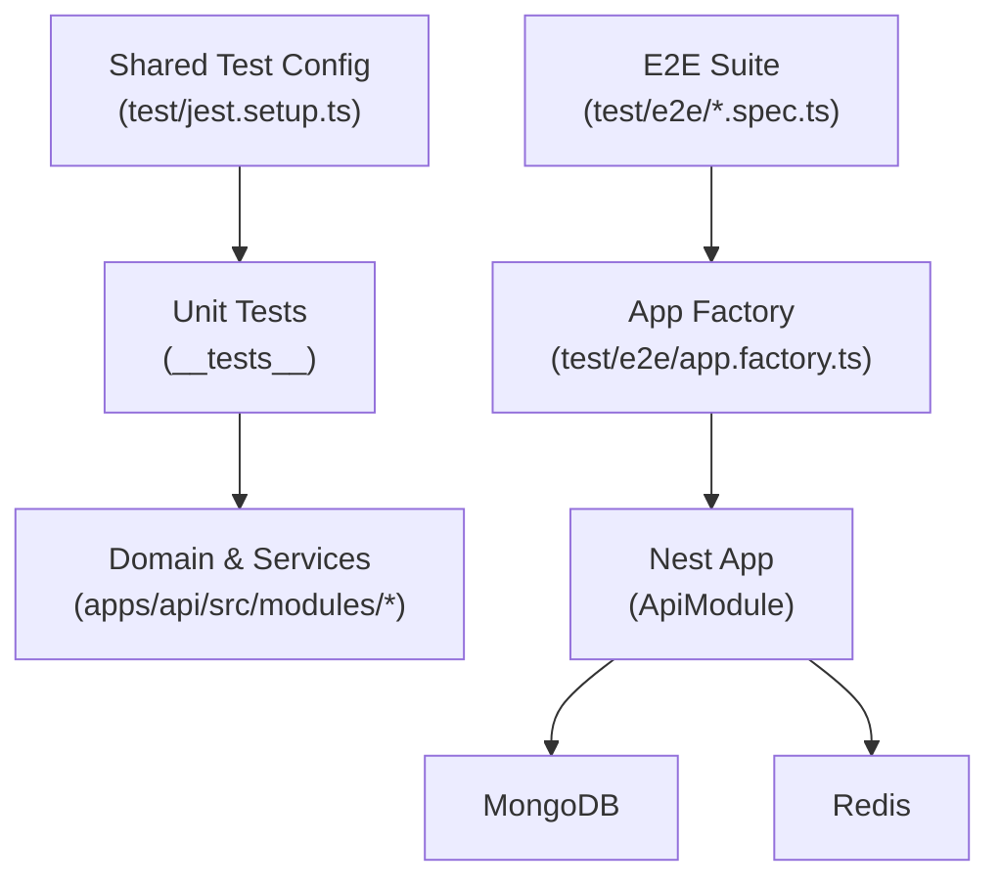
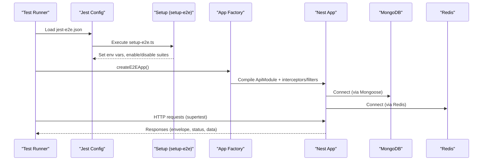
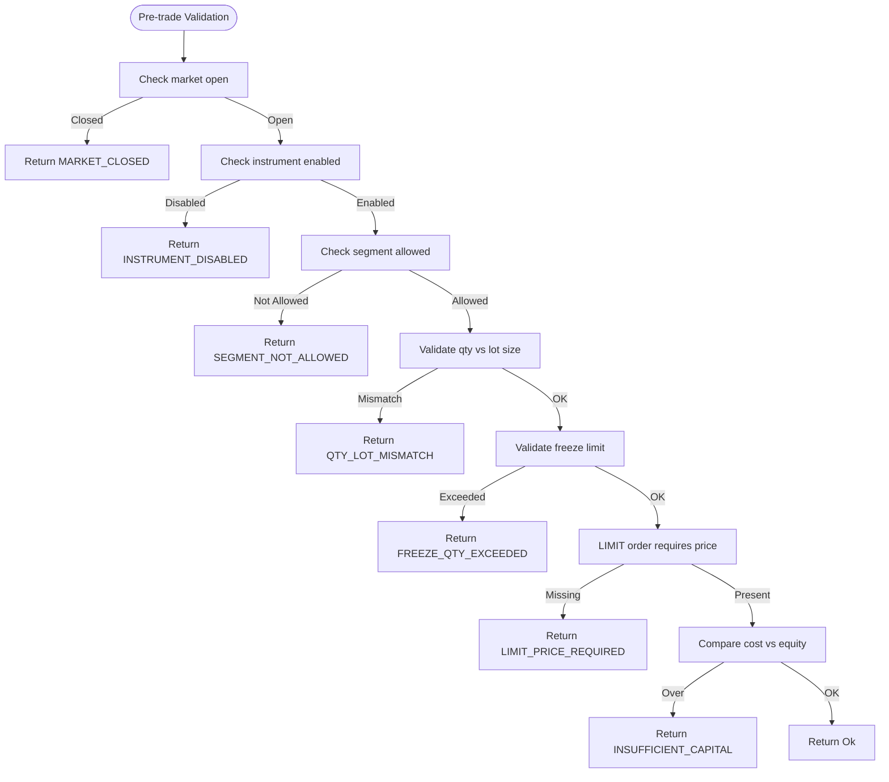
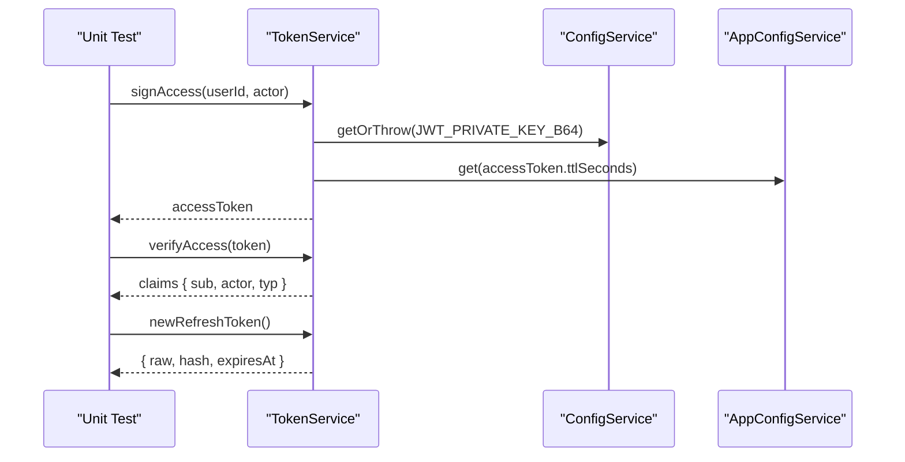
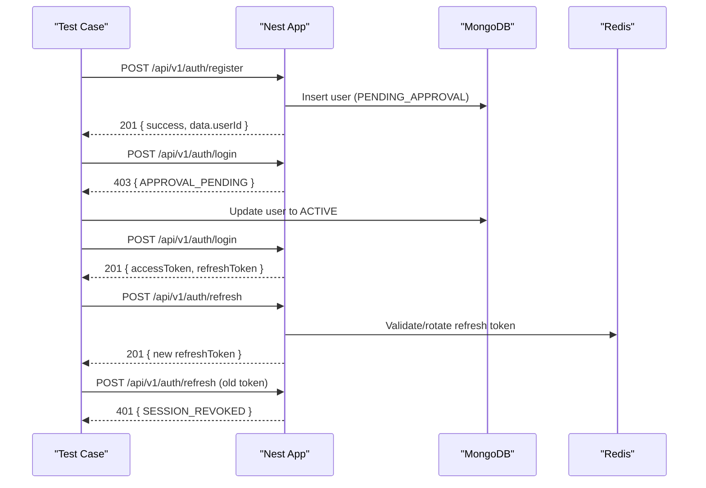
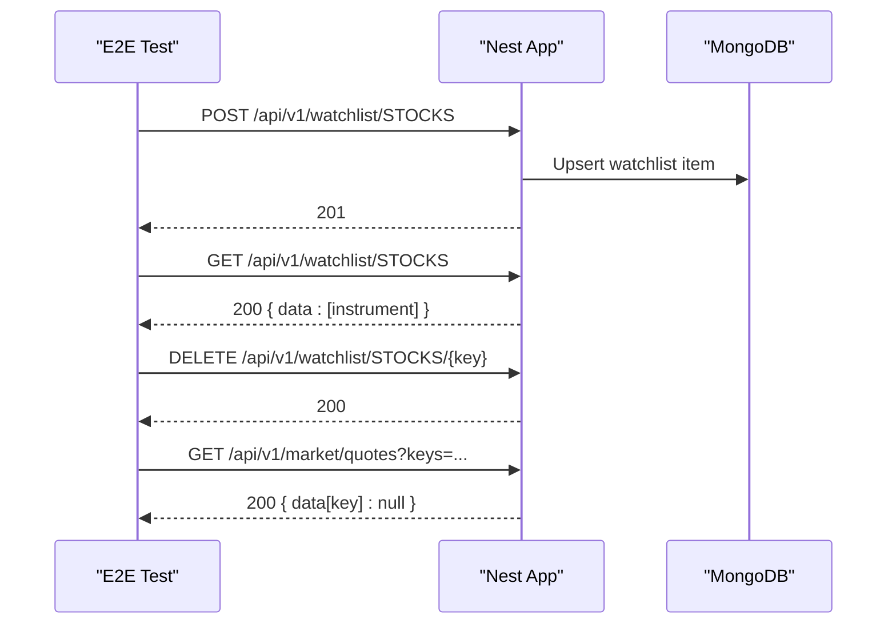
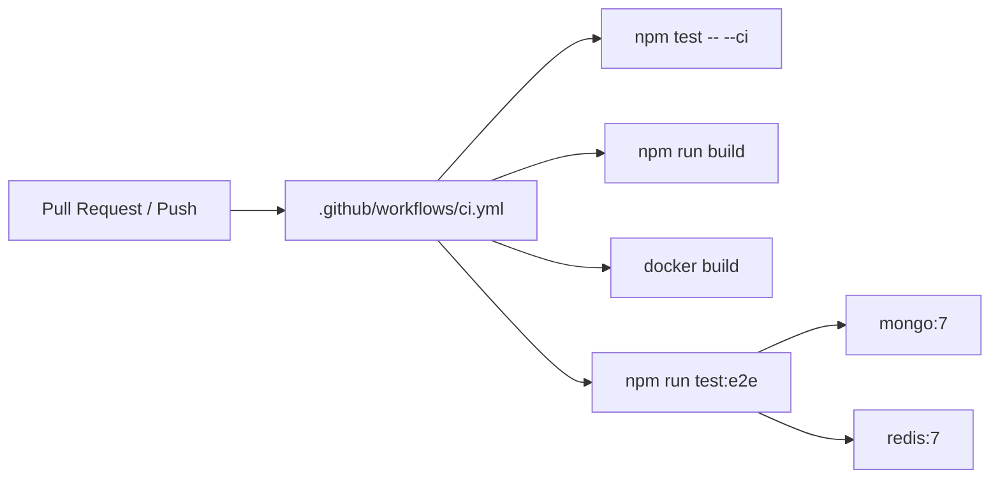

# Testing Strategy

<cite>
**Referenced Files in This Document**
- [ci.yml](file://.github/workflows/ci.yml)
- [jest.setup.ts](file://backend/test/jest.setup.ts)
- [jest-e2e.json](file://backend/test/e2e/jest-e2e.json)
- [setup-e2e.ts](file://backend/test/e2e/setup-e2e.ts)
- [app.factory.ts](file://backend/test/e2e/app.factory.ts)
- [market.e2e-spec.ts](file://backend/test/e2e/market.e2e-spec.ts)
- [onboarding.e2e-spec.ts](file://backend/test/e2e/onboarding.e2e-spec.ts)
- [candle-aggregator.spec.ts](file://backend/apps/api/src/modules/market/__tests__/candle-aggregator.spec.ts)
- [token.service.spec.ts](file://backend/apps/api/src/modules/auth/__tests__/token.service.spec.ts)
- [pre-trade.spec.ts](file://backend/apps/api/src/modules/trading/__tests__/pre-trade.spec.ts)
- [plan-rules.spec.ts](file://backend/apps/api/src/modules/plans/__tests__/plan-rules.spec.ts)
- [money.spec.ts](file://backend/libs/shared/src/kernel/__tests__/money.spec.ts)
</cite>

## Table of Contents
1. Introduction
2. Project Structure
3. Core Components
4. Architecture Overview
5. Detailed Component Analysis
6. Dependency Analysis
7. Performance Considerations
8. Troubleshooting Guide
9. Conclusion
10. Appendices

## Introduction
This document describes the multi-layered testing strategy for the trading platform backend, focusing on unit tests for domain logic and utilities, integration tests for API endpoints with real database interactions, and end-to-end (E2E) scenarios that exercise complete user workflows. It also covers test configuration, fixtures and factories, CI pipelines, and best practices tailored to financial applications where deterministic behavior and time-sensitive operations are critical.

## Project Structure
The testing setup is organized into:
- Unit tests colocated next to source modules under __tests__ directories per feature area (auth, market, plans, trading).
- Shared test configuration and environment bootstrapping under backend/test.
- E2E suites under backend/test/e2e using a separate Jest config and a shared app factory to bootstrap the NestJS application against real services (MongoDB, Redis).

**Diagram sources**
- [jest.setup.ts:1-18](file://backend/test/jest.setup.ts#L1-L18)
- [jest-e2e.json:1-11](file://backend/test/e2e/jest-e2e.json#L1-L11)
- [setup-e2e.ts:1-26](file://backend/test/e2e/setup-e2e.ts#L1-L26)
- [app.factory.ts:1-27](file://backend/test/e2e/app.factory.ts#L1-L27)

**Section sources**
- [jest.setup.ts:1-18](file://backend/test/jest.setup.ts#L1-L18)
- [jest-e2e.json:1-11](file://backend/test/e2e/jest-e2e.json#L1-L11)
- [setup-e2e.ts:1-26](file://backend/test/e2e/setup-e2e.ts#L1-L26)
- [app.factory.ts:1-27](file://backend/test/e2e/app.factory.ts#L1-L27)

## Core Components
- Unit testing framework: Jest with ts-jest transformer and module mapping for @app/shared.
- Environment setup: Global setup generates RSA keys and seeds required env variables for crypto, JWT, OTP, encryption, and storage paths.
- E2E harness: A dedicated Jest config runs only e2e specs; a shared setup toggles execution based on environment flags; an app factory boots ApiModule with production-like pipes and filters.

Key responsibilities:
- jest.setup.ts: Provides deterministic crypto keys and safe defaults so imports do not crash during unit tests.
- setup-e2e.ts: Enables or disables E2E suites via E2E_MONGO_URI and sets up Mongo/Redis URLs and secure secrets for E2E runs.
- app.factory.ts: Creates a Nest application instance with global validation, envelope handling, and exception filtering, matching production behavior.

**Section sources**
- [jest.setup.ts:1-18](file://backend/test/jest.setup.ts#L1-L18)
- [setup-e2e.ts:1-26](file://backend/test/e2e/setup-e2e.ts#L1-L26)
- [app.factory.ts:1-27](file://backend/test/e2e/app.factory.ts#L1-L27)

## Architecture Overview
The testing architecture spans three layers:

- Unit layer: Pure functions and service methods are tested in isolation. Domain logic (e.g., candle aggregation, pre-trade checks, plan rules, money math) is validated with deterministic inputs and expected outputs.
- Integration layer: API controllers are exercised through HTTP requests against a running Nest app backed by real MongoDB and Redis. Tests assert status codes, response envelopes, and persisted state changes.
- E2E layer: Full user journeys (registration, approval gating, login, refresh rotation, watchlist operations) run against live services to validate cross-cutting concerns like auth, persistence, and external integrations.

**Diagram sources**
- [jest-e2e.json:1-11](file://backend/test/e2e/jest-e2e.json#L1-L11)
- [setup-e2e.ts:1-26](file://backend/test/e2e/setup-e2e.ts#L1-L26)
- [app.factory.ts:1-27](file://backend/test/e2e/app.factory.ts#L1-L27)

## Detailed Component Analysis

### Unit Testing: Domain Logic and Utilities
Focus areas:
- Market data processing: Candle aggregation validates timestamp alignment, OHLCV computation, per-instrument tracking, and flush behavior.
- Trading guardrails: Pre-trade validation enforces business rules such as market open/close, instrument enablement, segment permissions, lot sizing, freeze limits, limit price requirements, and capital constraints.
- Plans and rules: Challenge rule validation ensures ranges, consistency between drawdowns, integer day counts, and allowed segments.
- Financial primitives: Money arithmetic uses integer paise semantics to avoid floating-point errors, supports formatting, and JSON serialization.

Testing patterns:
- Deterministic inputs with explicit timestamps and quantities.
- Assertions on both success and failure paths, including error codes.
- Isolation from I/O: No network or DB calls; pure function verification.

**Diagram sources**
- [pre-trade.spec.ts:1-64](file://backend/apps/api/src/modules/trading/__tests__/pre-trade.spec.ts#L1-L64)

**Section sources**
- [candle-aggregator.spec.ts:1-56](file://backend/apps/api/src/modules/market/__tests__/candle-aggregator.spec.ts#L1-L56)
- [pre-trade.spec.ts:1-64](file://backend/apps/api/src/modules/trading/__tests__/pre-trade.spec.ts#L1-L64)
- [plan-rules.spec.ts:1-42](file://backend/apps/api/src/modules/plans/__tests__/plan-rules.spec.ts#L1-L42)
- [money.spec.ts:1-43](file://backend/libs/shared/src/kernel/__tests__/money.spec.ts#L1-L43)

### Unit Testing: Authentication and Tokens
TokenService tests verify:
- RS256 access token signing and verification with actor typing.
- Purpose tokens are rejected when presented as access tokens and vice versa.
- Opaque refresh tokens with SHA-256 hashes and expiration guarantees.
- Password fingerprinting changes across different password hashes.

Pattern highlights:
- In-memory key generation for deterministic RSA keys in tests.
- Mocked ConfigService and AppConfigService to control TTLs and keys.
- Assertions on claim fields and token types to ensure strict separation of purposes.

**Diagram sources**
- [token.service.spec.ts:1-58](file://backend/apps/api/src/modules/auth/__tests__/token.service.spec.ts#L1-L58)

**Section sources**
- [token.service.spec.ts:1-58](file://backend/apps/api/src/modules/auth/__tests__/token.service.spec.ts#L1-L58)

### Integration Testing: API Endpoints and Persistence
Integration tests use supertest to send HTTP requests to a running Nest app built from ApiModule. They assert:
- Status codes and envelope structure.
- Persistence outcomes in MongoDB (users, instruments, watchlists).
- Idempotency and error conditions (e.g., duplicate registration).
- Security flows (approval gating, refresh token rotation, session revocation).

**Diagram sources**
- [onboarding.e2e-spec.ts:1-114](file://backend/test/e2e/onboarding.e2e-spec.ts#L1-L114)
- [app.factory.ts:1-27](file://backend/test/e2e/app.factory.ts#L1-L27)

**Section sources**
- [onboarding.e2e-spec.ts:1-114](file://backend/test/e2e/onboarding.e2e-spec.ts#L1-L114)
- [market.e2e-spec.ts:1-78](file://backend/test/e2e/market.e2e-spec.ts#L1-L78)
- [app.factory.ts:1-27](file://backend/test/e2e/app.factory.ts#L1-L27)

### E2E Testing: Market Data and Watchlist
The market E2E suite:
- Bootstraps the app and connects to MongoDB.
- Seeds a user and instrument.
- Logs in to obtain an access token.
- Exercises watchlist CRUD operations and asserts idempotency.
- Queries quotes and verifies null responses for instruments without cached ticks.

**Diagram sources**
- [market.e2e-spec.ts:1-78](file://backend/test/e2e/market.e2e-spec.ts#L1-L78)

**Section sources**
- [market.e2e-spec.ts:1-78](file://backend/test/e2e/market.e2e-spec.ts#L1-L78)

### Testing Utilities, Factories, and Fixtures
- Global setup: Generates RSA keys and sets secure defaults for JWT, OTP pepper, encryption secret, and storage directory to ensure deterministic behavior across unit tests.
- E2E setup: Conditionally enables E2E suites based on E2E_MONGO_URI; provides Mongo and Redis URLs and CORS/base URL settings.
- App factory: Builds a Nest application with production-like validation, envelope interceptor, and global exception filter; centralizes common configuration for all E2E tests.

Best practices:
- Keep unit tests free of I/O; mock or stub external dependencies.
- Use unique identifiers (timestamps or random suffixes) in E2E to avoid collisions.
- Centralize environment setup to reduce duplication and improve reliability.

**Section sources**
- [jest.setup.ts:1-18](file://backend/test/jest.setup.ts#L1-L18)
- [setup-e2e.ts:1-26](file://backend/test/e2e/setup-e2e.ts#L1-L26)
- [app.factory.ts:1-27](file://backend/test/e2e/app.factory.ts#L1-L27)

## Dependency Analysis
The testing pipeline integrates with CI to enforce type checking, unit tests, build, Docker validation, and E2E runs with real services.

**Diagram sources**
- [ci.yml:1-56](file://.github/workflows/ci.yml#L1-L56)

**Section sources**
- [ci.yml:1-56](file://.github/workflows/ci.yml#L1-L56)

## Performance Considerations
- Unit tests should remain fast and deterministic; avoid sleeping or network calls.
- For market data processing, consider stress tests that simulate high-frequency tick streams to validate aggregator throughput and memory usage.
- For real-time market feeds, add load tests that replay historical data through the feed pipeline to measure latency and backpressure handling.
- Use isolated databases per test run to prevent contention; leverage connection pooling and short-lived sessions in E2E.
- Profile critical paths (e.g., candle aggregation, pre-trade validation) under load to identify bottlenecks.

[No sources needed since this section provides general guidance]

## Troubleshooting Guide
Common issues and resolutions:
- Missing environment variables: Ensure jest.setup.ts or setup-e2e.ts sets required keys (JWT keys, OTP pepper, encryption secret, storage dir).
- E2E suites skipped: Verify E2E_MONGO_URI is set; otherwise suites are intentionally skipped to keep unit runs hermetic.
- Rate limiting in tests: The app factory replaces throttler bindings to avoid rate-limit interference during tests.
- Database connectivity: Confirm MongoDB and Redis containers are healthy before running E2E; CI services provide health checks.

**Section sources**
- [jest.setup.ts:1-18](file://backend/test/jest.setup.ts#L1-L18)
- [setup-e2e.ts:1-26](file://backend/test/e2e/setup-e2e.ts#L1-L26)
- [app.factory.ts:1-27](file://backend/test/e2e/app.factory.ts#L1-L27)

## Conclusion
The testing strategy combines precise unit tests for domain logic, robust integration tests for API and persistence, and comprehensive E2E suites for full user workflows. Shared setup and factories ensure deterministic environments, while CI pipelines enforce quality gates and validate builds and containerization. For financial applications, emphasis on deterministic simulations, strict validation, and security-related flows (token rotation, approval gating) ensures reliability and correctness.

[No sources needed since this section summarizes without analyzing specific files]

## Appendices

### Continuous Integration Testing Pipeline
- Type checking, unit tests, build, and Docker build are executed on push/PR.
- E2E job provisions MongoDB and Redis services and runs E2E suites with environment variables pointing to those services.

**Section sources**
- [ci.yml:1-56](file://.github/workflows/ci.yml#L1-L56)

### Financial-Specific Testing Challenges
- Deterministic simulations: Use fixed timestamps and synthetic tick data to validate candle aggregation and market logic.
- Time-sensitive operations: Mock or control time for token expiry, daily anchors, and market open/close checks to ensure reproducible results.
- Idempotency and safety: Assert idempotent operations (e.g., watchlist adds) and guardrails (e.g., freeze limits, capital checks) to prevent overexposure.

[No sources needed since this section provides general guidance]