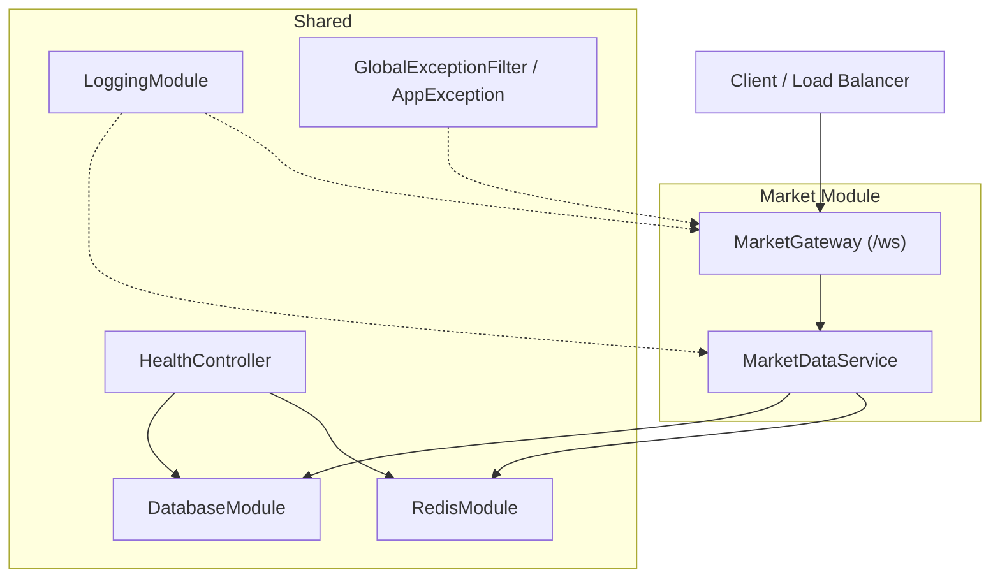
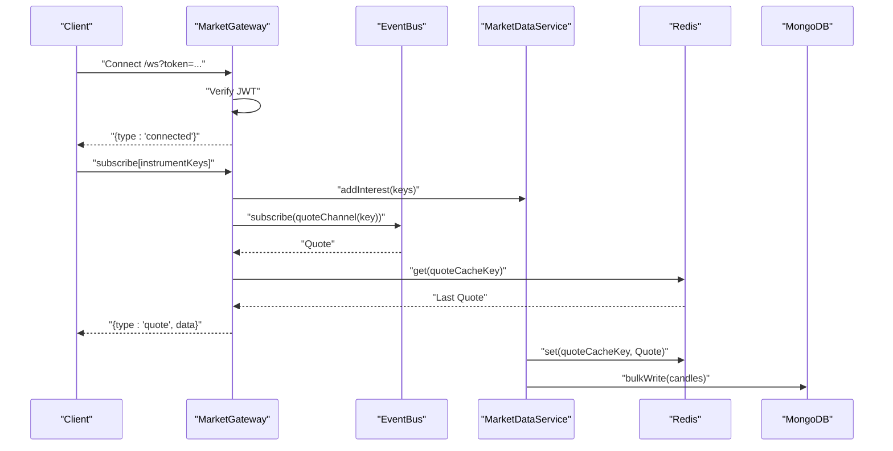
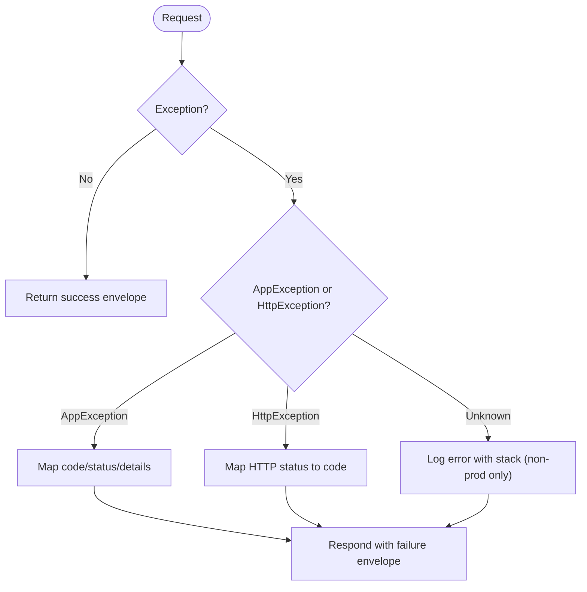
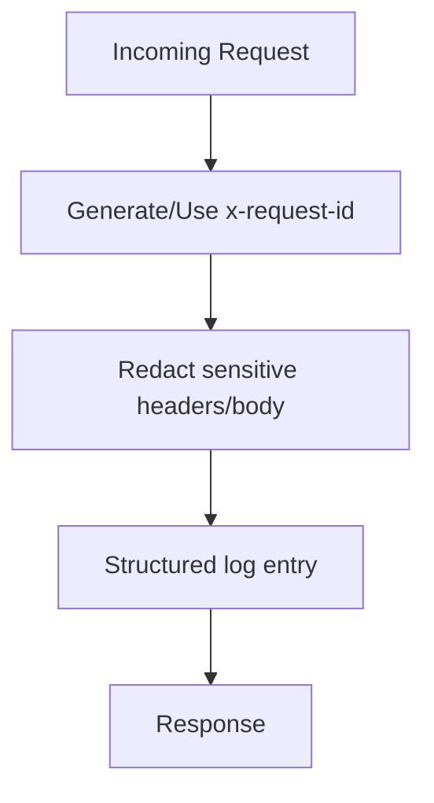
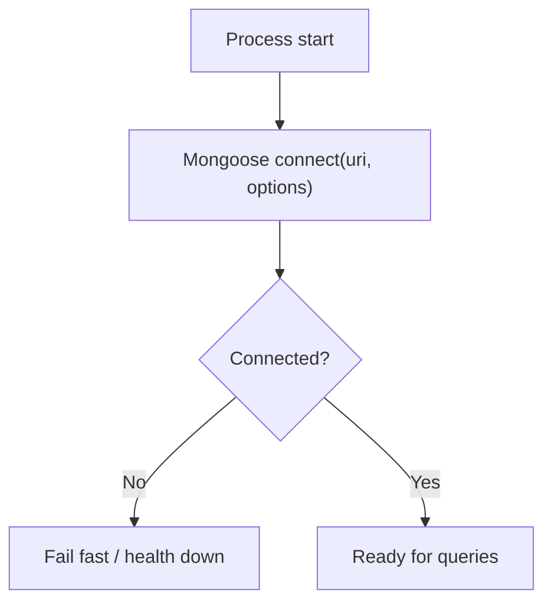
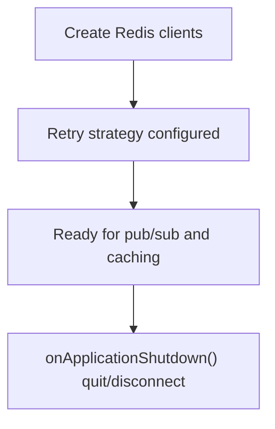
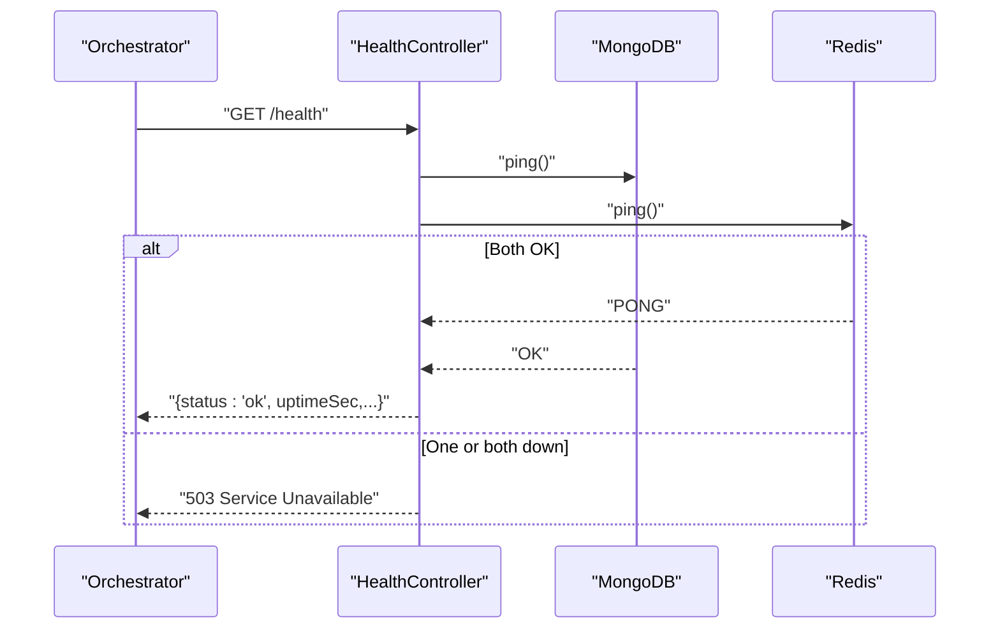
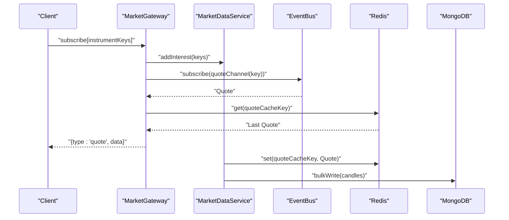
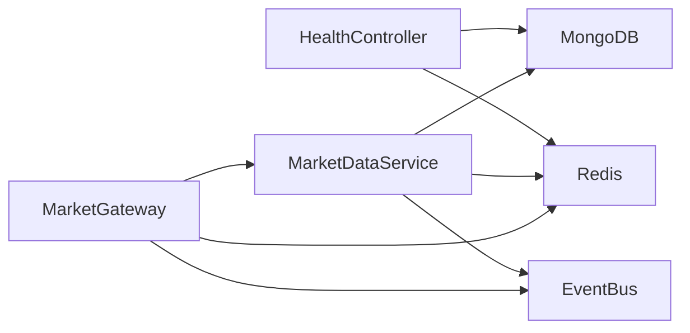

# Troubleshooting Guide

<cite>
**Referenced Files in This Document**
- [global-exception.filter.ts](file://backend/libs/shared/src/http/global-exception.filter.ts)
- [app-exception.ts](file://backend/libs/shared/src/http/app-exception.ts)
- [logging.module.ts](file://backend/libs/shared/src/logging/logging.module.ts)
- [database.module.ts](file://backend/libs/shared/src/database/database.module.ts)
- [redis.module.ts](file://backend/libs/shared/src/redis/redis.module.ts)
- [health.controller.ts](file://backend/libs/shared/src/health/health.controller.ts)
- [market.gateway.ts](file://backend/apps/api/src/modules/market/presentation/market.gateway.ts)
- [market-data.service.ts](file://backend/apps/api/src/modules/market/application/market-data.service.ts)
</cite>

## Table of Contents
1. Introduction
2. Project Structure
3. Core Components
4. Architecture Overview
5. Detailed Component Analysis
6. Dependency Analysis
7. Performance Considerations
8. Troubleshooting Guide
9. Conclusion

## Introduction
This guide provides actionable troubleshooting procedures for development and production environments. It focuses on log analysis, error tracking, performance profiling, configuration issues, environment setup problems, dependency conflicts, database connectivity, Redis connection problems, external service integration failures, real-time market data issues, WebSocket connection problems, message processing errors, and resource exhaustion scenarios. It also documents diagnostic tools and utilities available in the system and outlines known issues with workarounds.

## Project Structure
The backend is a NestJS application composed of shared libraries (logging, database, Redis, health checks, HTTP error handling) and feature modules (market data, authentication, trading, plans). The market module exposes both REST endpoints and a WebSocket gateway for real-time quotes. Health checks validate critical dependencies (MongoDB and Redis).

**Diagram sources**
- [logging.module.ts:1-35](file://backend/libs/shared/src/logging/logging.module.ts#L1-L35)
- [database.module.ts:1-19](file://backend/libs/shared/src/database/database.module.ts#L1-L19)
- [redis.module.ts:1-38](file://backend/libs/shared/src/redis/redis.module.ts#L1-L38)
- [health.controller.ts:1-55](file://backend/libs/shared/src/health/health.controller.ts#L1-L55)
- [market.gateway.ts:1-134](file://backend/apps/api/src/modules/market/presentation/market.gateway.ts#L1-L134)
- [market-data.service.ts:1-139](file://backend/apps/api/src/modules/market/application/market-data.service.ts#L1-L139)

**Section sources**
- [logging.module.ts:1-35](file://backend/libs/shared/src/logging/logging.module.ts#L1-L35)
- [database.module.ts:1-19](file://backend/libs/shared/src/database/database.module.ts#L1-L19)
- [redis.module.ts:1-38](file://backend/libs/shared/src/redis/redis.module.ts#L1-L38)
- [health.controller.ts:1-55](file://backend/libs/shared/src/health/health.controller.ts#L1-L55)
- [market.gateway.ts:1-134](file://backend/apps/api/src/modules/market/presentation/market.gateway.ts#L1-L134)
- [market-data.service.ts:1-139](file://backend/apps/api/src/modules/market/application/market-data.service.ts#L1-L139)

## Core Components
- Global exception filter normalizes all errors into a consistent API failure envelope and logs unknown exceptions. In non-production, it may include stack traces; in production, it hides internals to protect security.
- Logging module configures structured logging with request IDs, redaction of sensitive headers/body fields, and auto-logging that ignores health checks.
- Database module sets up MongoDB with timeouts and pool sizing suitable for production.
- Redis module creates client and subscriber connections with retry strategies and graceful shutdown.
- Health controller pings MongoDB and Redis and returns a clear status for orchestrators.
- Market gateway authenticates WebSocket clients via JWT, manages per-instrument rooms, subscribes to event bus channels, caches last quote in Redis, and fans out live quotes.
- Market data service ingests ticks from upstream feeds, writes to Redis cache, publishes events, aggregates candles, flushes to MongoDB, and monitors feed freshness.

**Section sources**
- [global-exception.filter.ts:1-91](file://backend/libs/shared/src/http/global-exception.filter.ts#L1-L91)
- [app-exception.ts:1-19](file://backend/libs/shared/src/http/app-exception.ts#L1-L19)
- [logging.module.ts:1-35](file://backend/libs/shared/src/logging/logging.module.ts#L1-L35)
- [database.module.ts:1-19](file://backend/libs/shared/src/database/database.module.ts#L1-L19)
- [redis.module.ts:1-38](file://backend/libs/shared/src/redis/redis.module.ts#L1-L38)
- [health.controller.ts:1-55](file://backend/libs/shared/src/health/health.controller.ts#L1-L55)
- [market.gateway.ts:1-134](file://backend/apps/api/src/modules/market/presentation/market.gateway.ts#L1-L134)
- [market-data.service.ts:1-139](file://backend/apps/api/src/modules/market/application/market-data.service.ts#L1-L139)

## Architecture Overview
Real-time market data flows through a pipeline: upstream feed -> MarketDataService -> Redis cache + Event Bus -> MarketGateway -> Clients. Health checks continuously verify dependencies. All requests are logged with correlation IDs and sanitized payloads.

**Diagram sources**
- [market.gateway.ts:48-133](file://backend/apps/api/src/modules/market/presentation/market.gateway.ts#L48-L133)
- [market-data.service.ts:43-139](file://backend/apps/api/src/modules/market/application/market-data.service.ts#L43-L139)
- [redis.module.ts:10-16](file://backend/libs/shared/src/redis/redis.module.ts#L10-L16)
- [database.module.ts:7-15](file://backend/libs/shared/src/database/database.module.ts#L7-L15)

## Detailed Component Analysis

### HTTP Error Handling and Envelope
- All unhandled exceptions are caught by the global filter and converted to a standardized failure envelope with stable error codes.
- Known domain exceptions carry machine-readable codes and optional details.
- Unknown errors are logged with stack traces in non-production; production responses hide internals.

**Diagram sources**
- [global-exception.filter.ts:18-68](file://backend/libs/shared/src/http/global-exception.filter.ts#L18-L68)
- [app-exception.ts:5-17](file://backend/libs/shared/src/http/app-exception.ts#L5-L17)

**Section sources**
- [global-exception.filter.ts:18-91](file://backend/libs/shared/src/http/global-exception.filter.ts#L18-L91)
- [app-exception.ts:1-19](file://backend/libs/shared/src/http/app-exception.ts#L1-L19)

### Logging and Request Correlation
- Each request gets a unique ID from header or generated UUID.
- Sensitive fields (authorization, cookies, passwords, OTPs, tokens) are redacted in logs.
- Health endpoint is excluded from auto-logging to reduce noise.

**Diagram sources**
- [logging.module.ts:9-31](file://backend/libs/shared/src/logging/logging.module.ts#L9-L31)

**Section sources**
- [logging.module.ts:1-35](file://backend/libs/shared/src/logging/logging.module.ts#L1-L35)

### Database Connectivity
- MongoDB connection uses explicit timeout and pool size settings.
- Auto-indexing disabled in production to avoid overhead.

**Diagram sources**
- [database.module.ts:7-15](file://backend/libs/shared/src/database/database.module.ts#L7-L15)

**Section sources**
- [database.module.ts:1-19](file://backend/libs/shared/src/database/database.module.ts#L1-L19)

### Redis Connectivity and Shutdown
- Two Redis clients: one for commands, one for subscriptions, created with retry strategy and ready check.
- Graceful shutdown ensures connections are closed.

**Diagram sources**
- [redis.module.ts:10-16](file://backend/libs/shared/src/redis/redis.module.ts#L10-L16)
- [redis.module.ts:28-36](file://backend/libs/shared/src/redis/redis.module.ts#L28-L36)

**Section sources**
- [redis.module.ts:1-38](file://backend/libs/shared/src/redis/redis.module.ts#L1-L38)

### Health Checks
- Returns 503 if either MongoDB or Redis cannot be pinged.
- Useful for liveness/readiness probes in orchestration platforms.

**Diagram sources**
- [health.controller.ts:19-55](file://backend/libs/shared/src/health/health.controller.ts#L19-L55)

**Section sources**
- [health.controller.ts:1-55](file://backend/libs/shared/src/health/health.controller.ts#L1-L55)

### Real-Time Market Data Pipeline
- On first client subscription to an instrument, interest is added upstream; on last client leaving, interest is removed.
- Quotes are cached in Redis with TTL and published via event bus to subscribers.
- Candle aggregation runs in-memory and flushes to MongoDB periodically.
- Stale feed watchdog resubscribes during market hours if no ticks received within threshold.

**Diagram sources**
- [market.gateway.ts:71-133](file://backend/apps/api/src/modules/market/presentation/market.gateway.ts#L71-L133)
- [market-data.service.ts:43-139](file://backend/apps/api/src/modules/market/application/market-data.service.ts#L43-L139)

**Section sources**
- [market.gateway.ts:1-134](file://backend/apps/api/src/modules/market/presentation/market.gateway.ts#L1-L134)
- [market-data.service.ts:1-139](file://backend/apps/api/src/modules/market/application/market-data.service.ts#L1-L139)

## Dependency Analysis
- MarketGateway depends on TokenService, Redis, EventBus, and MarketDataService.
- MarketDataService depends on MongoDB (candles), MarketFeed, Redis, EventBus, ExchangeCalendarService, and AppConfigService.
- HealthController depends on MongoDB and Redis.
- Logging and HTTP error handling are cross-cutting concerns applied globally.

**Diagram sources**
- [market.gateway.ts:37-42](file://backend/apps/api/src/modules/market/presentation/market.gateway.ts#L37-L42)
- [market-data.service.ts:34-41](file://backend/apps/api/src/modules/market/application/market-data.service.ts#L34-L41)
- [health.controller.ts:21-24](file://backend/libs/shared/src/health/health.controller.ts#L21-L24)

**Section sources**
- [market.gateway.ts:1-134](file://backend/apps/api/src/modules/market/presentation/market.gateway.ts#L1-L134)
- [market-data.service.ts:1-139](file://backend/apps/api/src/modules/market/application/market-data.service.ts#L1-L139)
- [health.controller.ts:1-55](file://backend/libs/shared/src/health/health.controller.ts#L1-L55)

## Performance Considerations
- Use structured logs with correlation IDs to trace requests across components.
- Avoid subscribing to entire instrument catalogs; rely on on-demand interest management to minimize upstream load.
- Batch candle writes to reduce database pressure.
- Tune Redis retry strategy and connection pooling based on observed latency and error rates.
- Monitor stale feed thresholds and adjust based on exchange behavior and network conditions.

[No sources needed since this section provides general guidance]

## Troubleshooting Guide

### Environment Setup and Configuration Issues
- Verify required environment variables for database URI, Redis URL, and log level are set before starting services.
- Ensure NODE_ENV is correctly set so that auto-indexing and error verbosity behave as expected.
- If configuration values change at runtime, confirm that invalidation messages propagate and instances reload keys.

**Section sources**
- [database.module.ts:7-15](file://backend/libs/shared/src/database/database.module.ts#L7-L15)
- [redis.module.ts:10-16](file://backend/libs/shared/src/redis/redis.module.ts#L10-L16)
- [logging.module.ts:9-31](file://backend/libs/shared/src/logging/logging.module.ts#L9-L31)
- [app-config.service.ts:29-38](file://backend/libs/shared/src/config/app-config.service.ts#L29-L38)

### Database Connectivity Problems
Symptoms:
- Health endpoint returns 503 with dependencies down including mongo.
- Application fails to start or process queries.

Investigation steps:
- Check MongoDB URI and network reachability.
- Inspect connection timeout and pool size settings.
- Review logs for connection errors around startup.

Resolution:
- Correct URI and credentials.
- Adjust timeouts or pool size if under heavy load.
- Validate firewall rules and DNS resolution.

**Section sources**
- [health.controller.ts:26-55](file://backend/libs/shared/src/health/health.controller.ts#L26-L55)
- [database.module.ts:7-15](file://backend/libs/shared/src/database/database.module.ts#L7-L15)

### Redis Connection Problems
Symptoms:
- Health endpoint reports redis down.
- WebSocket clients do not receive quotes or get disconnected.
- Rate limiting or distributed locks fail.

Investigation steps:
- Confirm REDIS_URL and network access.
- Check ioredis retry strategy and ready check behavior.
- Validate that both command and subscriber clients are created and connected.

Resolution:
- Fix Redis URL, credentials, or TLS settings.
- Increase retries or adjust network timeouts if transient failures occur.
- Ensure graceful shutdown does not interrupt active operations prematurely.

**Section sources**
- [health.controller.ts:47-55](file://backend/libs/shared/src/health/health.controller.ts#L47-L55)
- [redis.module.ts:10-16](file://backend/libs/shared/src/redis/redis.module.ts#L10-L16)
- [redis.module.ts:28-36](file://backend/libs/shared/src/redis/redis.module.ts#L28-L36)

### External Service Integration Failures
Symptoms:
- No market data despite healthy dependencies.
- Frequent reconnections or rate limit errors.

Investigation steps:
- Inspect MarketDataService logs for feed start/stop and subscribe/unsubscribe events.
- Check stale feed watchdog warnings indicating no ticks during market hours.
- Validate upstream credentials and quotas.

Resolution:
- Re-authenticate or refresh tokens for the feed provider.
- Adjust subscription scope to instruments with active interest.
- Implement backoff and circuit-breaking if upstream is unstable.

**Section sources**
- [market-data.service.ts:43-52](file://backend/apps/api/src/modules/market/application/market-data.service.ts#L43-L52)
- [market-data.service.ts:128-139](file://backend/apps/api/src/modules/market/application/market-data.service.ts#L128-L139)

### Real-Time Market Data Issues
Symptoms:
- Clients not receiving quotes or delayed updates.
- Last quote missing on initial subscribe.

Investigation steps:
- Confirm WebSocket connection authenticated successfully.
- Verify rooms are created and subscriptions active.
- Check Redis cache presence for the instrument key.
- Validate event bus channel subscriptions.

Resolution:
- Ensure addInterest is called when first client joins a room.
- Confirm busSubscribed prevents duplicate subscriptions.
- Validate quote TTL and cache population.

**Section sources**
- [market.gateway.ts:48-61](file://backend/apps/api/src/modules/market/presentation/market.gateway.ts#L48-L61)
- [market.gateway.ts:91-113](file://backend/apps/api/src/modules/market/presentation/market.gateway.ts#L91-L113)
- [market-data.service.ts:103-108](file://backend/apps/api/src/modules/market/application/market-data.service.ts#L103-L108)

### WebSocket Connection Problems
Symptoms:
- Connection rejected or immediately closed.
- Authentication failed messages.

Investigation steps:
- Verify token is present in query string and valid.
- Check server logs for connection and message parsing errors.
- Ensure Nginx routes /ws to the correct backend service.

Resolution:
- Provide a valid JWT token.
- Fix routing or CORS policies if applicable.
- Inspect client-side reconnection logic and backoff.

**Section sources**
- [market.gateway.ts:48-61](file://backend/apps/api/src/modules/market/presentation/market.gateway.ts#L48-L61)
- [market.gateway.ts:71-89](file://backend/apps/api/src/modules/market/presentation/market.gateway.ts#L71-L89)

### Message Processing Errors
Symptoms:
- Quotes not forwarded to clients.
- Duplicate or missing messages.

Investigation steps:
- Check event bus channel mapping and subscription lifecycle.
- Validate room membership and socket readiness before sending.
- Inspect logs for publish/subscribe errors.

Resolution:
- Ensure bus.subscribe is invoked once per instrument key.
- Guard sends against closed sockets.
- Add idempotency or deduplication if upstream emits duplicates.

**Section sources**
- [market.gateway.ts:106-113](file://backend/apps/api/src/modules/market/presentation/market.gateway.ts#L106-L113)
- [market.gateway.ts:125-133](file://backend/apps/api/src/modules/market/presentation/market.gateway.ts#L125-L133)

### Log Analysis and Error Tracking
- Use the request ID from logs to correlate events across services.
- Search for error envelopes with stable codes to identify recurring issues.
- Filter logs by component names (e.g., MarketGateway, MarketDataService, HealthController).

Best practices:
- Keep LOG_LEVEL appropriate for environment (info/debug).
- Ensure sensitive fields are redacted in logs.
- Export logs to a centralized system for querying and alerting.

**Section sources**
- [logging.module.ts:9-31](file://backend/libs/shared/src/logging/logging.module.ts#L9-L31)
- [global-exception.filter.ts:22-68](file://backend/libs/shared/src/http/global-exception.filter.ts#L22-L68)

### Performance Profiling and Resource Exhaustion
- Monitor memory usage and CPU spikes during high tick volumes.
- Watch for large candle buffers or excessive Redis writes.
- Tune batch sizes and intervals for flushing candles.
- Validate Redis and MongoDB connection pools and timeouts under load.

Indicators:
- Increased latency in WebSocket responses.
- Health endpoint flapping due to slow dependencies.
- Elevated GC pauses or OOM events.

Mitigations:
- Reduce subscription scope to active instruments.
- Adjust flush intervals and batch sizes.
- Scale horizontally behind load balancer and ensure stateless design where possible.

[No sources needed since this section provides general guidance]

### Known Issues and Workarounds
- Missing token on WebSocket connection results in immediate close with an error message.
  - Workaround: Ensure clients send a valid JWT token in the query parameter.
- Health endpoint returns 503 if any dependency is down.
  - Workaround: Investigate dependency health and restore connectivity before expecting ok status.
- Stale feed during market hours triggers warning and resubscription.
  - Workaround: Validate upstream feed availability and credentials; consider increasing threshold if transient delays are expected.

**Section sources**
- [market.gateway.ts:48-61](file://backend/apps/api/src/modules/market/presentation/market.gateway.ts#L48-L61)
- [health.controller.ts:26-35](file://backend/libs/shared/src/health/health.controller.ts#L26-L35)
- [market-data.service.ts:128-139](file://backend/apps/api/src/modules/market/application/market-data.service.ts#L128-L139)

## Conclusion
This guide consolidates diagnostics and resolutions for common operational issues across logging, error handling, database and Redis connectivity, real-time market data, and WebSocket communication. Use the health endpoint, structured logs with correlation IDs, and the built-in watchdog mechanisms to quickly detect and recover from failures. For complex issues, follow the step-by-step investigation procedures and adjust configurations or scaling parameters as needed.