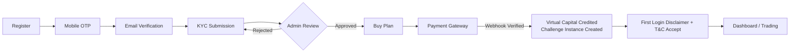
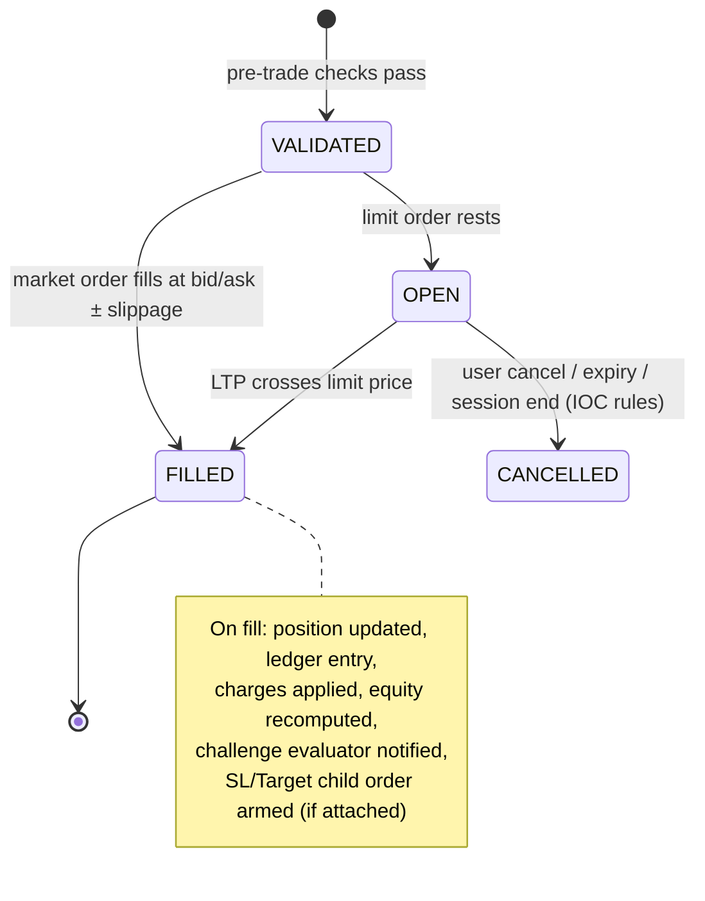
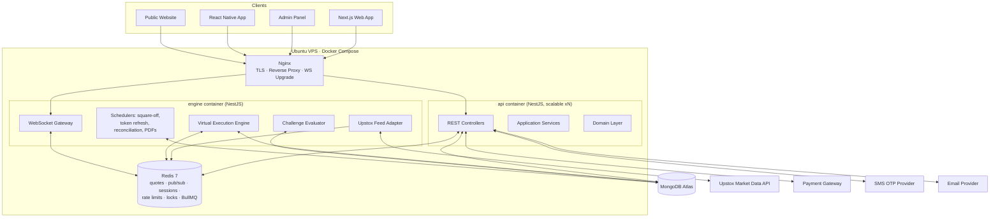

# Software Requirement Specification (SRS)
## Indian Paper Trading Simulator Platform

| Field | Value |
|---|---|
| Document Version | 1.0 (Draft for Approval) |
| Date | 31 July 2026 |
| Status | Pending stakeholder approval |
| Classification | Internal — Product & Engineering |

---

## 1. Introduction

### 1.1 Purpose
This SRS defines the complete functional, non-functional, architectural, and data requirements for an **Indian Stock Market Paper Trading Simulator** — a challenge-based skill-evaluation platform. It is the single source of truth for all downstream design, implementation, and testing work. No application code is written until this document is approved.

### 1.2 Product Positioning (Critical)
The platform is:
- A **paper trading simulator** for practice and trader skill evaluation.
- A **challenge/evaluation engine** where users purchase simulator plans that grant **virtual capital**.

The platform is **NOT**:
- A stock broker, sub-broker, or authorized person.
- An exchange or trading venue.
- A platform that routes any order to NSE, BSE, or any exchange.
- A platform that holds, invests, or manages real client funds for trading.

All trades are **virtual**. Live market data is used **only to simulate execution realistically**. Reward eligibility is determined by **admin-defined challenge rules**. All user-facing copy must use neutral, accurate language and avoid legal claims about licensing status (see FR-DISC).

### 1.3 Definitions & Abbreviations

| Term | Meaning |
|---|---|
| Plan | A purchasable simulator package (price, virtual capital, challenge rules) |
| Challenge | The rule-set attached to a plan (profit target, drawdown limits, trading days, expiry) |
| Virtual Capital | Simulated funds credited on plan purchase; never withdrawable |
| VEE | Virtual Execution Engine — matches virtual orders against live market data |
| LTP | Last Traded Price (from market data feed) |
| MTM | Mark-to-Market valuation of open positions |
| Drawdown | Decline in account equity from a reference point (initial or peak, configurable) |
| Reward | Admin-approved payout eligibility outcome for users who pass a challenge |
| KYC | Know Your Customer identity verification |
| RBAC | Role-Based Access Control |
| CF | Carry Forward (overnight) product type |
| MIS | Intraday product type (auto-square-off at cutoff) |

### 1.4 References
- Upstox Market Data API v2 (WebSocket + REST) documentation
- TradingView Lightweight Charts library documentation
- OWASP ASVS 4.0 (security baseline)
- NSE/BSE market timings & holiday calendars (data source: exchange published calendars)

### 1.5 Intended Audience
Product owner (Kapil), backend/frontend/mobile engineers, DevOps, QA, and admin operations staff.

---

## 2. Overall Description

### 2.1 Product Perspective
A greenfield, multi-tenant-ready (single-tenant at launch) SaaS system composed of:

1. **Public Website** — marketing, legal, blog, pricing (Next.js, SSR/SSG).
2. **User Web App** — dashboard + trading terminal (Next.js, authenticated).
3. **Mobile App** — React Native, bottom-navigation-only (Watchlist, Orders, Portfolio, Profile).
4. **Admin Panel** — Next.js app with RBAC + custom permissions.
5. **Backend Platform** — NestJS modular monolith (Clean Architecture), MongoDB Atlas, Redis, WebSocket gateway.
6. **Market Data Service** — Upstox feed ingestion, normalization, fan-out.
7. **Virtual Execution Engine** — order matching, position management, MTM, challenge rule evaluation.

### 2.2 Architecture Style Decision
**Modular monolith (NestJS) with strict module boundaries**, deployed as 2 processes:
- `api` — REST + Auth + Admin + everything request/response.
- `engine` — market data ingestion, VEE, challenge evaluator, WebSocket fan-out.

Rationale: single VPS deployment target, small team, low operational overhead; module boundaries (DDD bounded contexts) allow later extraction into microservices without rewrites. Redis Pub/Sub is the inter-process bus from day one, so the split already exists at the messaging layer.

### 2.3 User Classes

| Class | Description | Access |
|---|---|---|
| Visitor | Unauthenticated website visitor | Public website only |
| Registered User | Signed up, pre-KYC | Profile, KYC submission, plan browsing |
| Verified Trader | KYC approved + active plan | Full trading, portfolio, challenge tracking |
| Expired Trader | Plan expired/failed | Read-only history, buy new plan |
| Super Admin | Full system control | Everything incl. role/permission management |
| Admin | General administration | Per assigned permissions |
| Finance | Payments, refunds, reward payouts | Finance module scope |
| KYC Officer | KYC review queue | KYC module scope |
| Support | Tickets, user assistance (read-mostly) | Support module scope |
| Operations | Plans, challenges, symbols, market config | Ops module scope |

### 2.4 Operating Environment
- **Server:** Ubuntu 22.04 LTS VPS, Docker Compose, Nginx (TLS termination, reverse proxy, WebSocket upgrade).
- **Data:** MongoDB Atlas (M10+ recommended at launch), Redis 7 (same VPS, persistence enabled for critical keys).
- **Clients:** Modern evergreen browsers; Android 8+/iOS 14+ for mobile.
- **Market hours:** NSE/BSE equity 09:15–15:30 IST; currency 09:00–17:00 IST; pre-open 09:00–09:08. Holiday calendar admin-managed.

### 2.5 Constraints
- C-1: Single Upstox market data connection budget — feed must be shared (fan-out), never per-user upstream connections.
- C-2: No real order routing of any kind; no broker order APIs are ever integrated in this product.
- C-3: Everything in the Plan/Challenge/Reward engines is configurable — **zero hardcoded business numbers**.
- C-4: Statements are limited to a **maximum 6-month** window per request.
- C-5: During order placement, **only one of Stop Loss or Target** may be attached (mutually exclusive UI + API validation).
- C-6: Mobile app uses **bottom navigation only** — no drawer/sidebar.
- C-7: First login must show a mandatory disclaimer + T&C/Privacy acceptance gate (neutral language, no licensing claims).

### 2.6 Assumptions & Dependencies
- A-1: Upstox Market Data API credentials are procured by the business; daily token refresh is automated (Upstox tokens expire daily ~3:30 AM IST).
- A-2: A payment gateway supporting INR (Razorpay assumed; abstracted behind a PaymentProvider port so it is swappable) is available.
- A-3: SMS OTP provider (MSG91 assumed, abstracted) and transactional email provider (SMTP/SES, abstracted) are available.
- A-4: KYC is **manual review** at launch (documents uploaded, admin approves). Automated KYC APIs can be added later behind the same port.
- A-5: Rewards are processed **manually off-platform** by Finance after approval; the system tracks eligibility, approval, and status — it does not move real money at launch.

---

## 3. User Stories

Format: `US-<Module>-<n>` — As a *<role>*, I want *<goal>* so that *<benefit>*. Acceptance criteria (AC) listed where non-obvious.

### 3.1 Registration & Authentication (AUTH)
- **US-AUTH-1** — As a visitor, I want to register with name, email, mobile, username, and password so that I can create an account.
  - AC: Username unique (case-insensitive); password ≥ 8 chars with complexity; Argon2id hashing; account state = `PENDING_MOBILE`.
- **US-AUTH-2** — As a registered user, I want to verify my mobile via OTP so that my number is confirmed.
  - AC: 6-digit OTP, 5-min TTL, max 3 attempts per OTP, max 5 OTPs/hour/number, resend cooldown 60s.
- **US-AUTH-3** — As a registered user, I want to verify my email via a signed link so that my email is confirmed.
- **US-AUTH-4** — As a user, I want to log in with username/email + password and receive access + refresh tokens.
  - AC: Access JWT 15 min; refresh token 30 days, rotating, revocable, bound to device fingerprint; reuse detection revokes the family.
- **US-AUTH-5** — As a user, I want to reset my password via email so I can recover my account.
- **US-AUTH-6** — As a user, I want to see my login history (device, IP, time, location estimate) so I can detect misuse.
- **US-AUTH-7** — As an admin, I must complete TOTP 2FA at login so admin access is hardened.
- **US-AUTH-8** — As the system, I must record device + IP on every session and flag new-device logins via email notification.

### 3.2 KYC (KYC)
- **US-KYC-1** — As a registered user, I want to submit KYC (PAN, ID proof, address proof, selfie) so I can be verified.
  - AC: File types jpg/png/pdf, ≤ 5 MB each; documents stored encrypted at rest; state machine `NOT_SUBMITTED → SUBMITTED → UNDER_REVIEW → APPROVED | REJECTED (with reason, resubmission allowed)`.
- **US-KYC-2** — As a KYC officer, I want a review queue with document viewer, approve/reject + reason so I can process applications.
- **US-KYC-3** — As a user, I want a green KYC badge on my profile once approved.
- **US-KYC-4** — As the system, I must block plan purchase until KYC = APPROVED.

### 3.3 Plans & Purchase (PLAN)
- **US-PLAN-1** — As an operations admin, I want to create/edit/archive plans with price, virtual capital, profit target %, max drawdown %, daily drawdown %, min/max trading days, expiry days, reward %, and product permissions (segments allowed) — all configurable.
- **US-PLAN-2** — As a verified user, I want to browse active plans and purchase one via payment gateway.
  - AC: Order → gateway checkout → webhook verification (signature) → idempotent activation → virtual capital credited → challenge instance created.
- **US-PLAN-3** — As a user, I want to see my current subscription, its rules, and time remaining.
- **US-PLAN-4** — As a finance admin, I want to view payments, reconcile gateway settlements, and process refunds per refund policy.
- **US-PLAN-5** — As a user, I may hold only one ACTIVE challenge per plan type at a time (configurable flag per plan).

### 3.4 Market Data & Watchlist (MKT)
- **US-MKT-1** — As a trader, I want live Nifty & BankNifty tickers pinned at top of the watchlist.
- **US-MKT-2** — As a trader, I want tabs for Stocks / Indices / Options / Currency, each row showing LTP, day change, % change, bid, ask, updating in real time.
- **US-MKT-3** — As a trader, I want to search and add/remove/reorder symbols (max N per watchlist, configurable; multiple watchlists later — v1: one per tab).
- **US-MKT-4** — As a trader, I want to tap a symbol to open actions: Buy, Sell, View Chart, Option Chain (where applicable).
- **US-MKT-5** — As a trader, I want an option chain view (strikes around ATM, CE/PE LTP, change, OI if available) for indices/eligible stocks.
- **US-MKT-6** — As the system, I must subscribe to Upstox once per instrument and fan out ticks to all subscribed clients via WebSocket, with Redis as the tick cache (last quote survives reconnects).

### 3.5 Trading Terminal & Orders (TRD)
- **US-TRD-1** — As a trader, I want a TradingView Lightweight chart with multiple timeframes (1m/5m/15m/1h/1D), drawing tools, and indicators (EMA, SMA, RSI, MACD, VWAP, Bollinger at minimum).
- **US-TRD-2** — As a trader, I want to place Market and Limit orders with quantity, product (Intraday / Carry Forward), for Buy or Sell.
- **US-TRD-3** — As a mobile trader, I want swipe-to-buy / swipe-to-sell confirmation gestures.
- **US-TRD-4** — As a trader, I want an optional Stop Loss **or** Target (never both) attached at placement.
  - AC: UI enforces mutual exclusivity; API rejects requests containing both (422).
- **US-TRD-5** — As a trader, I want realistic virtual execution: market orders fill at counter-side quote (buy@ask, sell@bid) with configurable slippage model; limit orders rest until LTP crosses.
- **US-TRD-6** — As a trader, I want to modify/cancel open (unfilled) orders.
- **US-TRD-7** — As the system, I must validate margin/capital sufficiency, market hours, instrument permissions (per plan), quantity freeze limits, and challenge state before accepting orders.
- **US-TRD-8** — As the system, I must auto-square-off Intraday positions at the configured cutoff (default 15:15 IST equity, configurable per segment).
- **US-TRD-9** — As a trader, I want to see Open, Executed, and Past orders in separate tabs with full detail (timestamps, fill price, status trail).
- **US-TRD-10** — As the system, I must apply simulated charges (brokerage-like fee model, admin-configurable, can be zero) so P&L is realistic.

### 3.6 Portfolio (PF)
- **US-PF-1** — As a trader, I want Positions (intraday + carry-forward) with live MTM and realized/unrealized P&L.
- **US-PF-2** — As a trader, I want Holdings (CF equity carried overnight) with avg price, invested value, current value, day P&L, overall P&L.
- **US-PF-3** — As a trader, I want account equity = virtual capital ± realized P&L ± unrealized MTM, updated live, because drawdown rules track equity.

### 3.7 Challenge & Reward (CHG / RWD)
- **US-CHG-1** — As a trader, I want a challenge dashboard: profit progress vs target, current drawdown vs max, daily drawdown consumption, trading days completed, days to expiry.
- **US-CHG-2** — As the system, I must evaluate rules in real time: breach of max drawdown or daily drawdown ⇒ challenge FAILED (open positions squared off, trading locked); profit target reached + min trading days met ⇒ PASSED (pending review).
- **US-CHG-3** — As the system, daily drawdown resets at start of each trading day from the configured anchor (previous day close equity or initial capital — admin-configurable).
- **US-RWD-1** — As an admin, I want to review PASSED challenges, verify trade authenticity, and approve/reject/override reward eligibility with reason + audit trail.
- **US-RWD-2** — As an admin, I want to configure reward % per plan and see computed reward amounts; payouts tracked with status (ELIGIBLE → APPROVED → PAID/REJECTED), processed off-platform by Finance.
- **US-RWD-3** — As a user, I want to see my challenge history and reward status transparently.

### 3.8 Statements (STMT)
- **US-STMT-1** — As a trader, I want Ledger, Trade Report, and P&L Statement for any range up to 6 months, viewable, downloadable as PDF, and emailable to my registered email.
- **US-STMT-2** — As the system, PDF generation runs as a background job with a download-ready notification.

### 3.9 Profile & Settings (PRF)
- **US-PRF-1** — As a user, I want to manage profile picture, name, and view username + KYC badge + current subscription with upgrade/buy actions.
- **US-PRF-2** — As a user, I want to change password (re-auth required), change mobile (OTP on new number), change email (verification on new email).
- **US-PRF-3** — As a user, I want a referral code + tracking of referred signups (reward logic admin-configurable, may be dormant at launch).
- **US-PRF-4** — As a user, I want support access: contact form/tickets and a user manual.
- **US-PRF-5** — As a user, logout revokes the current refresh token; "logout all devices" revokes the family.

### 3.10 Admin Panel (ADM)
- **US-ADM-1** — As a super admin, I want to create employees, assign roles (Admin, Finance, KYC, Support, Operations) and grant/revoke **custom permissions** beyond role defaults.
  - AC: Permission model = role grants (defaults) + per-user allow/deny overrides; deny wins.
- **US-ADM-2** — As an admin, I want a dashboard: users, active challenges, revenue, pass/fail rates, live system health.
- **US-ADM-3** — As an admin, I want user management: search, view 360° profile (KYC, plans, trades, ledger, sessions), suspend/unsuspend with reason.
- **US-ADM-4** — As an admin, I want Reports & Analytics: revenue, plan performance, challenge outcomes, user funnels — exportable CSV.
- **US-ADM-5** — As the system, every admin mutation writes an immutable audit log (who, what, before/after, when, IP).
- **US-ADM-6** — As an operations admin, I want to manage instruments (enable/disable symbols per segment), market holidays, square-off times, slippage & charge models.

### 3.11 Website & Compliance (WEB / DISC)
- **US-WEB-1** — As a visitor, I can browse: Landing, About, Features, Pricing, Plans, How It Works, Challenge Rules, FAQ, Contact, Support, Blog, Terms, Privacy, Risk Disclosure, KYC Policy, Refund Policy.
  - AC: SSG/ISR for SEO; blog content managed via admin (simple markdown CMS collection).
- **US-DISC-1** — As a first-time-logged-in user, I must see a blocking disclaimer modal stating: this is a paper trading simulator; all trades are virtual; the platform is for practice and skill evaluation; and I must accept Terms & Privacy to continue.
  - AC: Acceptance recorded (version, timestamp, IP); re-shown whenever T&C version changes; neutral language, no licensing claims.

---

## 4. Workflows (Key Sequences)

### 4.1 Onboarding Flow


### 4.2 Order Lifecycle (Virtual Execution Engine)


Pre-trade validation order (fail-fast): session/auth → challenge ACTIVE → market open for segment → instrument enabled + permitted by plan → qty within freeze/lot rules → capital/margin sufficient → SL/Target mutual-exclusivity → rate limit.

### 4.3 Challenge Evaluation Loop
1. Every fill and every MTM tick (throttled to 1s per account) recomputes: `equity = virtualCapital + realizedPnL + unrealizedPnL − charges`.
2. Evaluator checks, in order: **daily drawdown breach → max drawdown breach → expiry reached → profit target + min trading days**.
3. On FAIL: square off all positions at market, cancel open orders, lock trading, notify user, write challenge event.
4. On PASS: mark `PASSED_PENDING_REVIEW`, freeze further trading (configurable), enqueue for admin reward review.
5. Trading-day counter increments on the first fill of each distinct exchange trading date.

### 4.4 Payment & Activation (Idempotent)
`Create purchase intent → gateway order → user pays → webhook (signature-verified) → idempotency key check → mark payment CAPTURED → activate plan → credit virtual capital → create challenge → email receipt`. Reconciliation job re-verifies pending payments every 10 min against gateway API.

### 4.5 Market Data Pipeline
```mermaid
flowchart LR
  U[Upstox WS Feed] --> N[Normalizer\n(engine process)]
  N --> R[(Redis)\nlast-quote cache + Pub/Sub]
  R --> G[WS Gateway]
  G --> C1[Web Clients]
  G --> C2[Mobile Clients]
  N --> V[Virtual Execution Engine]
  V --> E[Challenge Evaluator]
  N --> K[Candle Aggregator\n1m bars → Mongo]
```
- Daily 08:45 IST job: refresh Upstox token, load instrument master, warm caches.
- Reconnect with exponential backoff; stale-feed watchdog (no tick 10s in market hours ⇒ alert + resubscribe).
- Historical candles: Upstox REST for backfill; own 1m aggregation for continuity; chart API serves merged series.

---

## 5. Functional Requirements Summary (Module Breakdown)

| # | Module (Bounded Context) | Key Responsibilities | Depends On |
|---|---|---|---|
| M1 | Identity & Access (AUTH) | Register, OTP, email verify, JWT/refresh, sessions, device/IP tracking, admin 2FA | — |
| M2 | KYC | Submission, encrypted doc storage, review queue, state machine, badge | M1 |
| M3 | Catalog & Billing (PLAN) | Plan CRUD (admin), purchase, payment webhooks, refunds, subscription state | M1, M2 |
| M4 | Market Data (MKT) | Upstox ingestion, instrument master, tick fan-out, candles, option chain | — |
| M5 | Trading (TRD) | Orders, VEE, positions, holdings, MTM, square-off, charges | M3, M4 |
| M6 | Challenge (CHG) | Rule engine, equity tracking, pass/fail, trading-day counting | M5 |
| M7 | Reward (RWD) | Eligibility, admin approval, override, payout status tracking | M6 |
| M8 | Ledger & Statements (STMT) | Ledger entries, trade/P&L reports, PDF, email, 6-month cap | M5 |
| M9 | Notifications (NOTIF) | Email, SMS, in-app + push (FCM) — provider-abstracted | M1 |
| M10 | Admin & RBAC (ADM) | Employees, roles, custom permissions, dashboards, reports, audit logs | M1 |
| M11 | Support (SUP) | Tickets, contact, user manual content | M1 |
| M12 | Website/CMS (WEB) | Public pages, blog, legal docs versioning, disclaimer gate | — |
| M13 | Platform (CORE) | Config service, feature flags, holiday calendar, rate limiting, audit infra | — |

Cross-cutting: audit logging (all mutations), validation (class-validator + zod at edges), observability (structured logs, health checks, metrics).

---

## 6. Non-Functional Requirements

| ID | Category | Requirement |
|---|---|---|
| NFR-1 | Latency | Tick → client push ≤ 300 ms p95 within India; order accept → fill event ≤ 500 ms p95 |
| NFR-2 | Throughput | 2,000 concurrent WS clients, 100 orders/sec sustained on launch VPS (8 vCPU/16 GB); horizontal path documented |
| NFR-3 | Availability | 99.5% during market hours; graceful degradation (cached quotes) if feed drops |
| NFR-4 | Data Integrity | Order/ledger/challenge writes use Mongo transactions where multi-document; ledger is append-only |
| NFR-5 | Security | OWASP ASVS L2: Argon2id, JWT RS256, refresh rotation + reuse detection, admin TOTP 2FA, rate limiting (Redis), Helmet/CSP, XSS/CSRF protections, NoSQL-injection sanitization, field-level encryption for KYC docs & PII (AES-256-GCM, key via env/KMS) |
| NFR-6 | Privacy | PII minimization; statements/exports watermarked with user identity; data retention policy configurable |
| NFR-7 | Auditability | Immutable audit log for every admin action & every order/challenge state change; 2-year retention |
| NFR-8 | Configurability | All business numbers (plan rules, slippage, charges, cutoffs, limits) in DB config — zero hardcoding |
| NFR-9 | Scalability | Stateless api containers behind Nginx; engine is single-writer per account (Redis lock) enabling later sharding by userId |
| NFR-10 | Testability | ≥ 80% unit coverage on VEE + Challenge engine; deterministic replay tests from recorded tick fixtures |
| NFR-11 | Observability | Health endpoints, pino structured logs, error tracking (Sentry-compatible), feed-staleness alerts |
| NFR-12 | Compliance posture | Neutral disclaimer copy, versioned legal docs with acceptance records; no claims about regulatory status |

---

## 7. System Architecture

### 7.1 High-Level Diagram


### 7.2 Clean Architecture Layers (per module)
```
src/modules/<context>/
  domain/          entities, value objects, domain events, domain services, repository interfaces (ports)
  application/     use-cases (command/query handlers), DTOs, application services
  infrastructure/  mongo repositories, redis adapters, external API adapters (Upstox, Razorpay, MSG91)
  presentation/    REST controllers, WS gateways, guards, request validators
```
Dependency rule: presentation → application → domain; infrastructure implements domain ports (dependency inversion). Shared kernel: `src/shared` (Result type, DomainEvent bus, Money/Quantity value objects, exchange calendar, config service).

### 7.3 Key Design Decisions (ADR summary)
| ADR | Decision | Rationale |
|---|---|---|
| ADR-1 | Modular monolith, 2 processes (api/engine) | Ops simplicity on VPS; clean extraction path |
| ADR-2 | Redis Pub/Sub as internal event bus | Already required for ticks/sessions; avoids Kafka overhead |
| ADR-3 | Single-writer-per-account in VEE (Redis lock, FIFO queue per account) | Eliminates race conditions on equity/margin without heavy transactions |
| ADR-4 | Money stored as integer paise; quantities as integers | No floating-point P&L errors |
| ADR-5 | JWT RS256 with JWKS-style key rotation support | Multi-service verification without shared secrets |
| ADR-6 | BullMQ for jobs (PDF, emails, reconciliation, EOD) | Redis already present; retries + observability |
| ADR-7 | Tick fan-out via room-per-instrument in WS gateway | O(instruments) upstream, O(subscribers) downstream |
| ADR-8 | Legal documents versioned in DB; acceptance rows immutable | Disclaimer/T&C re-consent on change |

---

## 8. Database Planning (MongoDB Atlas)

> Full field-level schemas, validators, and index DDL are delivered in the Database phase of each module. This section fixes the collection map, ownership, key fields, and primary indexes so all modules share one model.

| Collection | Owner | Key Fields (indicative) | Primary Indexes |
|---|---|---|---|
| `users` | AUTH | email, mobile, usernameLower, passwordHash, status, kycStatus, roles[], referralCode | uniq(usernameLower), uniq(email), uniq(mobile), referralCode |
| `sessions` | AUTH | userId, refreshHash, familyId, deviceFp, ip, ua, expiresAt, revokedAt | userId+createdAt, uniq(refreshHash), TTL(expiresAt) |
| `otp_requests` | AUTH | target, channel, codeHash, attempts, expiresAt | target+createdAt, TTL(expiresAt) |
| `login_history` | AUTH | userId, ip, device, geo, success, at | userId+at(desc) |
| `kyc_applications` | KYC | userId, status, documents[{type, fileKeyEnc}], reviewerId, reason, timeline[] | uniq(userId,status:ACTIVE-partial), status+submittedAt |
| `plans` | PLAN | name, price, virtualCapital, rules{profitTargetPct, maxDDPct, dailyDDPct, ddAnchor, minTradingDays, expiryDays, rewardPct, segments[], maxActivePerUser}, status, version | status, slug uniq |
| `payments` | PLAN | userId, planId, gatewayOrderId, amount, status, webhookPayloadHash, idempotencyKey | uniq(gatewayOrderId), uniq(idempotencyKey), userId+createdAt |
| `subscriptions` | PLAN | userId, planId, challengeId, status, activatedAt, expiresAt | userId+status, expiresAt |
| `instruments` | MKT | upstoxKey, symbol, exchange, segment, lotSize, tickSize, freezeQty, expiry?, strike?, optType?, enabled | uniq(upstoxKey), symbol+segment, segment+enabled |
| `candles_1m` | MKT | instrumentKey, ts, o,h,l,c,v | uniq(instrumentKey+ts); monthly TTL/archival policy |
| `watchlists` | MKT | userId, tab, items[{instrumentKey, sort}] | uniq(userId+tab) |
| `orders` | TRD | userId, challengeId, instrumentKey, side, type, product, qty, limitPrice?, trigger{kind: SL|TARGET, price}?, status, fills[], reason?, placedAt | userId+status+placedAt, challengeId+placedAt, status+instrumentKey (open-order matching, partial on status=OPEN) |
| `positions` | TRD | challengeId, instrumentKey, product, netQty, avgPrice, realizedPnl, dayBuyQty/Val, daySellQty/Val | uniq(challengeId+instrumentKey+product) |
| `holdings` | TRD | challengeId, instrumentKey, qty, avgPrice | uniq(challengeId+instrumentKey) |
| `trades` | TRD | orderId, challengeId, userId, instrumentKey, side, qty, price, charges, at | challengeId+at, userId+at, orderId |
| `challenges` | CHG | userId, planSnapshot{...rules}, virtualCapital, equity, peakEquity, dayStartEquity, realizedPnl, tradingDays[], status, events[], startedAt, endsAt | userId+status, status+endsAt, uniq active per plan-type via partial |
| `rewards` | RWD | challengeId, userId, computedAmount, pct, status, reviewerId, overrideReason?, timeline[] | uniq(challengeId), status+createdAt |
| `ledger_entries` | STMT | userId, challengeId, type(CREDIT/DEBIT/CHARGE/PNL/ADJUST), amount, balanceAfter, refType, refId, at | userId+at, challengeId+at (append-only; no updates) |
| `statements_jobs` | STMT | userId, kind, range, status, fileKey?, emailedTo? | userId+createdAt, TTL on completed(30d) |
| `employees` | ADM | email, passwordHash, totpSecretEnc, roles[], permAllow[], permDeny[], status | uniq(email) |
| `roles` | ADM | key, name, permissions[] | uniq(key) |
| `audit_logs` | ADM | actorType, actorId, action, entity, entityId, before, after, ip, at | entity+entityId+at, actorId+at, at(desc); write-once |
| `tickets` | SUP | userId, subject, status, messages[] | userId+updatedAt, status+updatedAt |
| `cms_pages` / `blog_posts` | WEB | slug, title, md, status, publishedAt, version | uniq(slug), status+publishedAt |
| `legal_docs` / `acceptances` | WEB | docType, version, md / userId, docType, version, ip, at | uniq(docType+version) / uniq(userId+docType+version) |
| `app_config` | CORE | key, value, updatedBy | uniq(key) |
| `market_holidays` | CORE | date, exchanges[] | uniq(date) |
| `notifications` | NOTIF | userId, channel, template, payload, status | userId+createdAt, status |

Relationship strategy: reference by ObjectId + denormalized snapshots where history must be immutable (`planSnapshot` inside challenges, price/qty inside trades). Multi-document invariants (order fill → trade → position → ledger → challenge equity) execute inside the VEE's per-account serialized pipeline with a Mongo transaction wrapping the write batch.

---

## 9. External Interfaces

| Interface | Direction | Protocol | Notes |
|---|---|---|---|
| Upstox Market Data | In | WSS (protobuf) + REST | Daily token refresh job; instrument master sync 08:45 IST; historical candles REST |
| Payment Gateway (Razorpay, abstracted) | Both | REST + Webhook | Signature verification mandatory; idempotent webhook handling |
| SMS OTP (MSG91, abstracted) | Out | REST | DLT-registered templates required for India |
| Email (SMTP/SES, abstracted) | Out | SMTP/REST | Verification, notifications, statements |
| Push (FCM) | Out | REST | Mobile notifications (order fills, challenge events) |
| Client WebSocket | Both | WSS (JSON) | Auth via JWT on connect; channels: quotes.<key>, orders.<userId>, positions.<userId>, challenge.<userId> |

API design standard (fixed now, detailed per module later): REST under `/api/v1`, envelope `{success, data, error{code,message,details}}`, cursor pagination, Idempotency-Key header on all money/order mutations, OpenAPI (Swagger) auto-generated per module, rate limits per route class (auth: strict; quotes: generous).

---

## 10. Phased Implementation Roadmap

Each phase follows the fixed sequence: Requirements → Architecture → Database → APIs → UI → Backend → Frontend → Testing → Documentation, and ends with your confirmation before the next begins.

| Phase | Scope | Modules | Exit Criteria |
|---|---|---|---|
| **P0** | Foundation | CORE, repo scaffolding, Docker, Nginx, CI, shared kernel, config service, error/audit/logging infra | `docker compose up` runs api+engine+redis; health checks green |
| **P1** | Identity | M1 AUTH (register, OTP, email verify, JWT/refresh rotation, sessions, login history, admin 2FA) | Full auth flows pass e2e tests |
| **P2** | KYC + Admin base | M2 KYC, M10 RBAC core (employees, roles, custom permissions, audit logs, KYC review UI) | KYC approve/reject round-trip works with badge |
| **P3** | Plans & Payments | M3 PLAN (plan CRUD, checkout, webhooks, activation, subscriptions, refund flow) | Paid plan credits virtual capital idempotently |
| **P4** | Market Data | M4 MKT (feed adapter, instrument master, tick fan-out, candles, watchlist, option chain) | Live watchlist with Nifty/BankNifty tickers on web |
| **P5** | Trading Core | M5 TRD (VEE, orders, positions, holdings, MTM, square-off, charges) + terminal UI (charts, order panel, SL/Target exclusivity) | Deterministic replay tests pass; live paper trades execute |
| **P6** | Challenge + Reward | M6 CHG, M7 RWD (rule engine, real-time evaluation, admin review/override) | Simulated pass & fail scenarios verified end-to-end |
| **P7** | Statements & Notifications | M8 STMT (ledger UI, PDF, email, 6-month cap), M9 NOTIF | Statements downloadable + emailed |
| **P8** | Mobile App | React Native: Watchlist, Orders, Portfolio, Profile; swipe-to-trade; push | Feature parity with web trading essentials |
| **P9** | Website & Compliance | M12 WEB (all public pages, blog CMS, legal docs, first-login disclaimer gate), M11 SUP | All 16 public pages live; disclaimer acceptance recorded |
| **P10** | Hardening & Launch | Security audit vs ASVS checklist, load tests (NFR-1/2), backup/restore drill, runbooks, deployment docs | Go-live checklist signed off |

Dependency-driven ordering; P8 and P9 can run in parallel after P7 if desired.

---

## 11. Testing Strategy (Overview)

- **Unit:** domain logic first — VEE matching, drawdown math, trading-day counting, permission resolution (deny-wins). Target ≥80% on M5/M6.
- **Integration:** Mongo (testcontainers), Redis, webhook signature verification, OTP flows.
- **Replay tests:** recorded Upstox tick fixtures drive the VEE; assert deterministic fills, equity curves, and challenge outcomes.
- **E2E:** Playwright (web/admin), Detox (mobile) on the critical paths: onboarding, purchase, trade, challenge fail/pass, statement.
- **Security:** dependency audit, ZAP baseline scan, auth-bypass test suite, rate-limit tests.
- **Load:** k6 — 2k WS clients + 100 orders/sec sustained (NFR-2).

---

## 12. Open Questions for Approval

1. **Payment gateway** — confirm Razorpay, or specify another (Cashfree/PayU)?
2. **Slippage & charges defaults** — I will ship a configurable model (fixed bps slippage + flat/percent charges); confirm defaults or start at zero charges?
3. **Daily drawdown anchor** — previous day's closing equity (industry standard) or initial capital? I recommend previous-day close, admin-switchable.
4. **After PASS** — freeze trading immediately, or allow continued trading until expiry? I recommend freeze (protects the passed result).
5. **Options scope v1** — index options (NIFTY/BANKNIFTY/FINNIFTY) only at launch, stock options in v1.1? Recommended for data-volume control.
6. **KYC documents** — PAN + Aadhaar/any address proof + selfie acceptable as the required set?

---

## 13. Approval

Once you approve this SRS (with answers to §12), we proceed to **Phase P0 — Foundation**, starting with its Architecture step per the fixed sequence.

*— End of SRS v1.0 —*
